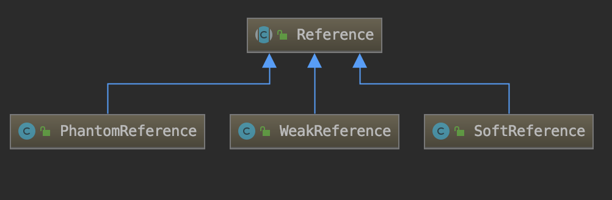

# 软引用、弱引起、虚引用

在JDK1.2以前的版本中，当一个对象不被任何变量引用，那么程序就无法再使用这个对象。也就是说，只有对象处于可触及状态，程序才能使用它。

但有时候情况并不这么简单，可能会遇到可有可无的"鸡肋"对象。这种对象现在已经无用了，保留它会占空间，但是立刻扔掉它也不划算，因为也许将来还会派用场。对于这样的可有可无的对象：如果空间足够，就先把它保留，如果空间不够，即使把空间所有的垃圾清除，还是无法容纳那些必不可少的对象，那么再扔掉这些可有可无的对象。

在Java中，虽然不需要程序员手动去管理对象的生命周期，但是如果希望某些对象具备一定的生命周期的话（比如内存不足时JVM就会自动回收某些对象从而避免OutOfMemory的错误）就需要用到软引用和弱引用了。

从Java SE2开始，就提供了四种类型的引用：强引用、软引用、弱引用和虚引用。Java中提供这四种引用类型主要有两个目的：第一是可以让程序员通过代码的方式决定某些对象的生命周期；第二是有利于JVM进行垃圾回收。

对于强引用，一般像new对出的对象都属于强引用。如下：

```java
Object object = new Object();
String str = "StrongReference";
```

## UML类图与解释



- `public abstract class Reference<T>`
  引用对象的抽象基类。 此类定义所有引用对象共有的操作。 由于引用对象是与垃圾回收器紧密协作实现的，因此此类不能直接子类化。
  引用实例处于四种可能的内部状态之一：
  1. **活动状态**;
   受到垃圾收集器的特殊处理。 收集器检测到引用对象的可到达性已更改为适当的状态后，会根据实例在创建时是否向队列注册了实例，将实例的状态更改为“待处理”或“非活动”。 在前一种情况下，它还将实例添加到“未决引用”列表中。 新创建的实例处于活动状态。
  2. **待处理状态**;
   待处理引用列表中的一个元素，等待被引用处理线程入队。 未注册的实例永远不会处于此状态。
  3. **入队状态**;
   创建实例时向其注册队列的元素。 将实例从其ReferenceQueue中删除后，该实例将变为非活动状态。 未注册的实例永远不会处于此状态。
  4. **非活动状态**;
   不需要做任何事。 一旦实例变为非活动状态，其状态将不再改变。

  入队状态的`next`字段如下：
  1. **活动状态**;
   `queue = ReferenceQueue` with which instance is registered, or `ReferenceQueue.NULL` if it was not registered with a queue; `next = null`.
  2. **待处理状态**;
   `queue = ReferenceQueue` with which instance is registered;`next = this`.
  3. **入队状态**;
   `queue = ReferenceQueue.ENQUEUED`; `next = Following` instance in queue, or this if at end of list.
  4. **非活动状态**;
    `queue = ReferenceQueue.NULL; next = this`.
- `public class SoftReference<T> extends Reference<T>`
  软引用对象，垃圾回收器会根据内存需求酌情清除这些对象。 软引用最常用于实现对内存敏感的缓存。

  假设垃圾收集器在某个时间点确定可以轻柔地访问对象。那时，它可以选择原子地清除对该对象的所有软引用，以及对所有其他软可达的对象的所有软引用，这些对象都可以通过一系列强引用从该对象到达。同时或在以后的某个时间，它将排队那些已在参考队列中注册的新清除的软参考。

  在虚拟机引发OutOfMemoryError之前，确保已清除所有对可软访问对象的软引用。否则，清除软引用的时间或清除对不同对象的一组此类引用的时间将不受任何限制。但是，鼓励虚拟机实现偏向于清除最近创建或最近使用的软引用。

  此类的直接实例可用于实现简单的缓存；此类或派生的子类也可以在较大的数据结构中使用，以实现更复杂的缓存。只要软引用的引用可以很强地到达（即实际上正在使用），就不会清除该软引用。因此，复杂的高速缓存可以例如通过保持对那些条目的强引用来防止其最近使用的条目被丢弃，而其余条目则由垃圾收集器来决定丢弃。
- `public class WeakReference<T> extends Reference<T>`
  弱引用对象，这些对象不会阻止对其引用对象进行可终结的，终结过和回收。 弱引用最常用于实现规范化映射。

  假设垃圾收集器在某个时间点确定对象是弱可访问的。 到那时，它将自动清除对该对象的所有弱引用，以及对所有其他弱可达对象的弱引用，这些对象都可以通过一系列强引用和软引用从该对象到达。 同时，它将声明所有以前弱可及的对象都是可终结的。 同时或稍后，它将把那些新近清除的弱引用加入队列，这些弱引用已在引用队列中注册。
- `public class PhantomReference<T> extends Reference<T>`
  虚引用对象，在收集器确定其引用对象可以通过其他方式回收之后，将其排队。 与Java终结机制相比，虚引用最常用于以更灵活的方式调度事前清理操作。

  如果垃圾收集器在某个时间点确定虚引用的参照对象是虚可到达的，则在那个时候或以后的某个时间，它将使该引用入队。

  为了确保保留可回收对象，可能不会检索虚引用的引用对象：虚引用的get方法始终返回null。

  与软引用和弱引用不同，虚引用在排队时不会被垃圾收集器自动清除。 通过虚引用可访问的对象将保持不变，直到清除所有此类引用或它们自身无法访问为止。

## 软引用案例

软引用是用来描述一些有用但并不是必需的对象。对于软引用关联着的对象，只有在内存不足的时候JVM才会回收该对象。因此，这一点可以很好地用来解决`OOM`的问题，并且这个特性很适合用来实现缓存：比如网页缓存、图片缓存等。

软引用可以和一个引用队列（ReferenceQueue）联合使用，如果软引用所引用的对象被JVM回收，这个软引用就会被加入到与之关联的引用队列中。下面是一个使用示例：

运行参数设置`-Xms40m -Xmx40m -verbose:gc -XX:+PrintGCDetails`，即初始堆与最大堆的大小都是`40m`，并打印GC信息

```java
package com.xie.jvm.reference;

import java.lang.ref.SoftReference;
import java.util.HashMap;
import java.util.Map;

public class MyTest1 {
    private static Map<String, SoftReference<byte[]>> cache = new HashMap<>();

    public static void main(String[] args) {

        addToCache1();

        addToCache2();
    }

    static void addToCache1() {
        byte[] bytes1 = new byte[1024 * 1024 * 10];
        SoftReference<byte[]> softReference1 = new SoftReference<>(bytes1);
        cache.put("b1", softReference1);
        System.out.println("第一次分配内存,b1：" + (cache.get("b1").get() == null ? "null" : cache.get("b1").get().length));


        byte[] bytes2 = new byte[1024 * 1024 * 10];
        SoftReference<byte[]> softReference2 = new SoftReference<>(bytes2);
        cache.put("b2", softReference2);
        System.out.println("第二次分配内存,b1：" + (cache.get("b1").get() == null ? "null" : cache.get("b1").get().length));
        System.out.println("第二次分配内存,b2：" + (cache.get("b2").get() == null ? "null" : cache.get("b2").get().length));


        byte[] bytes3 = new byte[1024 * 1024 * 7];
        SoftReference<byte[]> softReference3 = new SoftReference<>(bytes3);
        cache.put("b3", softReference3);
        System.out.println("第三次分配内存,b1：" + (cache.get("b1").get() == null ? "null" : cache.get("b1").get().length));
        System.out.println("第三次分配内存,b2：" + (cache.get("b2").get() == null ? "null" : cache.get("b2").get().length));
        System.out.println("第三次分配内存,b3：" + (cache.get("b3").get() == null ? "null" : cache.get("b3").get().length));
    }

    static void addToCache2() {
        byte[] bytes4 = new byte[1024 * 1024 * 10];
        SoftReference<byte[]> softReference4 = new SoftReference<>(bytes4);
        cache.put("b4", softReference4);

        System.out.println("第四次分配内存,b1：" + (cache.get("b1").get() == null ? "null" : cache.get("b1").get().length));
        System.out.println("第四次分配内存,b2：" + (cache.get("b2").get() == null ? "null" : cache.get("b2").get().length));
        System.out.println("第四次分配内存,b3：" + (cache.get("b3").get() == null ? "null" : cache.get("b3").get().length));
        System.out.println("第四次分配内存,b4：" + (cache.get("b4").get() == null ? "null" : cache.get("b4").get().length));
    }
}
```

输入结果

```no
第一次分配内存,b1：10485760
第二次分配内存,b1：10485760
第二次分配内存,b2：10485760
第三次分配内存,b1：10485760
第三次分配内存,b2：10485760
第三次分配内存,b3：7340032
[GC (Allocation Failure) --[PSYoungGen: 8192K->8192K(11776K)] 28672K->28680K(39424K), 0.0027193 secs] [Times: user=0.01 sys=0.00, real=0.00 secs]
[Full GC (Ergonomics) [PSYoungGen: 8192K->7513K(11776K)] [ParOldGen: 20488K->20481K(27648K)] 28680K->27994K(39424K), [Metaspace: 2681K->2681K(1056768K)], 0.0109097 secs] [Times: user=0.04 sys=0.00, real=0.01 secs]
[GC (Allocation Failure) --[PSYoungGen: 7513K->7513K(11776K)] 27994K->27994K(39424K), 0.0026622 secs] [Times: user=0.01 sys=0.00, real=0.00 secs]
[Full GC (Allocation Failure) [PSYoungGen: 7513K->0K(11776K)] [ParOldGen: 20481K->334K(27648K)] 27994K->334K(39424K), [Metaspace: 2681K->2681K(1056768K)], 0.0041587 secs] [Times: user=0.01 sys=0.00, real=0.01 secs]
第四次分配内存,b1：null
第四次分配内存,b2：null
第四次分配内存,b3：null
第四次分配内存,b4：10485760
Heap
 PSYoungGen      total 11776K, used 307K [0x00000007bf300000, 0x00000007c0000000, 0x00000007c0000000)
  eden space 10240K, 3% used [0x00000007bf300000,0x00000007bf34ce80,0x00000007bfd00000)
  from space 1536K, 0% used [0x00000007bfe80000,0x00000007bfe80000,0x00000007c0000000)
  to   space 1536K, 0% used [0x00000007bfd00000,0x00000007bfd00000,0x00000007bfe80000)
 ParOldGen       total 27648K, used 10574K [0x00000007bd800000, 0x00000007bf300000, 0x00000007bf300000)
  object space 27648K, 38% used [0x00000007bd800000,0x00000007be253ab8,0x00000007bf300000)
 Metaspace       used 2690K, capacity 4490K, committed 4864K, reserved 1056768K
  class space    used 288K, capacity 386K, committed 512K, reserved 1048576K
```

可以看到在第四次分配内存的时候，总分配量已经达到37M,再系统自带的内存肯定超过设置的40M，所以在第四次分配之前，JVM进行了一次GC，而这次GC就是缓存中的b1,b2,b3所占用的空间给释放了，避免了`OOM`问题

## 弱引用案例

弱引用也是用来描述非必需对象的，当JVM进行垃圾回收时，无论内存是否充足，都会回收被弱引用关联的对象。下面是使用示例：

```java
package com.xie.jvm.reference;

import java.lang.ref.WeakReference;
import java.util.HashMap;
import java.util.Map;

public class MyTest2 {
    private static Map<String, WeakReference<byte[]>> cache = new HashMap<>();

    public static void main(String[] args) {
        addCache();
        System.out.println(cache.get("b1").get() == null ? " null" : cache.get("b1").get().length);
        System.gc();
        System.out.println(cache.get("b1").get() == null ? " null" : cache.get("b1").get().length);
    }

    static void addCache() {
        byte[] bytes = new byte[1024 * 1024];
        WeakReference<byte[]> weakReference = new WeakReference<>(bytes);
        cache.put("b1", weakReference);
    }
}
```

输出结果

```no
1048576
[GC (System.gc()) [PSYoungGen: 3645K->464K(76288K)] 3645K->472K(251392K), 0.0019622 secs] [Times: user=0.01 sys=0.00, real=0.01 secs]
[Full GC (System.gc()) [PSYoungGen: 464K->0K(76288K)] [ParOldGen: 8K->345K(175104K)] 472K->345K(251392K), [Metaspace: 2679K->2679K(1056768K)], 0.0048642 secs] [Times: user=0.02 sys=0.00, real=0.00 secs]
 null
Heap
 PSYoungGen      total 76288K, used 1966K [0x000000076ab00000, 0x0000000770000000, 0x00000007c0000000)
  eden space 65536K, 3% used [0x000000076ab00000,0x000000076aceb9e0,0x000000076eb00000)
  from space 10752K, 0% used [0x000000076eb00000,0x000000076eb00000,0x000000076f580000)
  to   space 10752K, 0% used [0x000000076f580000,0x000000076f580000,0x0000000770000000)
 ParOldGen       total 175104K, used 345K [0x00000006c0000000, 0x00000006cab00000, 0x000000076ab00000)
  object space 175104K, 0% used [0x00000006c0000000,0x00000006c00566a0,0x00000006cab00000)
 Metaspace       used 2686K, capacity 4486K, committed 4864K, reserved 1056768K
  class space    used 288K, capacity 386K, committed 512K, reserved 1048576K
```

可以看到在显示的调用一次GC后，此时堆的空间肯定还是足够的，但是也释放了弱引用对象的空间。

## 虚引用案例

虚引用并不会影响对象的生命周期。虚引用的作用为：跟踪垃圾回收器收集对象这一活动的情况。
当GC一旦发现了虚引用对象，则会将PhantomReference对象插入ReferenceQueue队列，而此时PhantomReference对象并没有被垃圾回收器回收，而是要等到ReferenceQueue被你真正的处理后才会被回收。
**注意：**PhantomReference必须要和ReferenceQueue联合使用，SoftReference和WeakReference可以选择和ReferenceQueue联合使用也可以不选择，这使他们的区别之一。

```java
package com.xie.jvm.reference;

import java.lang.ref.PhantomReference;
import java.lang.ref.Reference;
import java.lang.ref.ReferenceQueue;

public class MyTest3 {
    public static void main(String[] args) throws InterruptedException {
        MyTest4 myTest4 = new MyTest4();
        ReferenceQueue<MyTest4> refQueue = new ReferenceQueue<>();
        PhantomReference<MyTest4> phanRef = new PhantomReference<>(myTest4, refQueue);

        MyTest4 myTest4FromPhantomReference = (MyTest4) phanRef.get();
        //这里拿到的是null
        System.out.println("myTest4FromPhantomReference :" + myTest4FromPhantomReference);
        //让myTest4变成垃圾
        myTest4 = null;

        //启动一个线程去监控对象何时已被收集
        Thread thread = new Thread(() -> {
            Reference<? extends Object> phanRefP = null;
            while (true) {
                try {
                    if (((phanRefP = refQueue.remove()) != null)) {
                        System.out.println("对象已被收集");
                        break;
                    }
                } catch (InterruptedException e) {
                    e.printStackTrace();
                }

            }
        }, "myThread");
        thread.start();
        Thread.sleep(3000);

        System.out.println("第一次GC后");
        System.gc();
        Thread.sleep(3000);

        System.out.println("第二次GC后");
        System.gc();
    }
}
```

输出结果：

```no
myTest4FromPhantomReference :null
第一次GC后
[GC (System.gc()) [PSYoungGen: 6554K->1056K(76288K)] 6554K->1064K(251392K), 0.0018189 secs] [Times: user=0.01 sys=0.00, real=0.00 secs]
[Full GC (System.gc()) [PSYoungGen: 1056K->0K(76288K)] [ParOldGen: 8K->886K(175104K)] 1064K->886K(251392K), [Metaspace: 4087K->4087K(1056768K)], 0.0079624 secs] [Times: user=0.04 sys=0.00, real=0.01 secs]
MyTest4 finalize
第二次GC后
[GC (System.gc()) [PSYoungGen: 2621K->32K(76288K)] 3507K->918K(251392K), 0.0008198 secs] [Times: user=0.00 sys=0.00, real=0.00 secs]
[Full GC (System.gc()) [PSYoungGen: 32K->0K(76288K)] [ParOldGen: 886K->874K(175104K)] 918K->874K(251392K), [Metaspace: 4087K->4087K(1056768K)], 0.0102503 secs] [Times: user=0.06 sys=0.00, real=0.01 secs]
对象已被收集
Heap
 PSYoungGen      total 76288K, used 3277K [0x000000076ab00000, 0x0000000770000000, 0x00000007c0000000)
  eden space 65536K, 5% used [0x000000076ab00000,0x000000076ae334d8,0x000000076eb00000)
  from space 10752K, 0% used [0x000000076f580000,0x000000076f580000,0x0000000770000000)
  to   space 10752K, 0% used [0x000000076eb00000,0x000000076eb00000,0x000000076f580000)
 ParOldGen       total 175104K, used 874K [0x00000006c0000000, 0x00000006cab00000, 0x000000076ab00000)
  object space 175104K, 0% used [0x00000006c0000000,0x00000006c00da990,0x00000006cab00000)
 Metaspace       used 4093K, capacity 4672K, committed 4864K, reserved 1056768K
  class space    used 459K, capacity 497K, committed 512K, reserved 1048576K
```

**注意：**：`MyTest4`实现了重写了`finalize`方法，该方法会影响对象的生命周期，GC在第一次收集该对象时，会先执行该方法，并没有真正被释放掉，只有等到第二次GC才被释放。从监控日志可以看出。
在 finalize() 方法中，如果有其它的强引用再次持有该对象，则会导致对象的状态由 “收集阶段” 又重新变为 “应用阶段”。这个已经破坏了 Java 对象的生命周期进程，且 “复活” 的对象不利用后续的代码管理。
**没事儿不要重载finalize方法**
