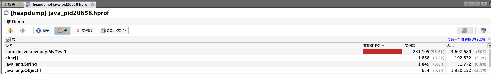

# JVM内存调试之内存溢出

- ## 代码示例
  
    ```java
    public class MyTest1 {
        public static void main(String[] args) {
            //-Xms5m -Xmx5m -XX:+HeapDumpOnOutOfMemoryError
            List<MyTest1> list = new ArrayList<>();
            while (true){
                list.add(new MyTest1());
            }
        }
    }
    ```

- ## 涉及的JVM参数
  
    1. `-Xms5m`:设置初始内存5M;
    2. `-Xmx5m`:设置最大内存5M;
    3. `-XX:+HeapDumpOnOutOfMemoryError`:将堆栈溢出的转储到文件

- ## 运行结果
  
    ```no
    java.lang.OutOfMemoryError: GC overhead limit exceeded
    Dumping heap to java_pid20658.hprof ...
    Heap dump file created [8958201 bytes in 0.046 secs]
    Exception in thread "main" java.lang.OutOfMemoryError: GC overhead limit exceeded
    at com.xie.jvm.memory.MyTest1.main(MyTest1.java:44)
    ```

- ## 使用jvisualvm工具分析转储文件
  
    1. 导入生成的.hprof文件
        
    2. 选中类标签
        
        可以看到com.xie.jvm.memory.MyTest1这个类对象占用的内存非常高。
