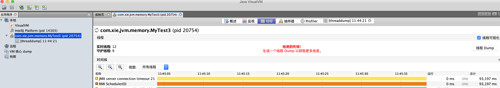
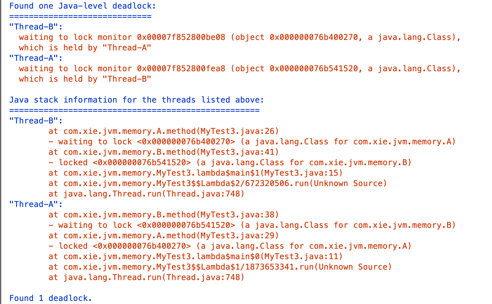

# JVM调试之线程死锁

- ## 死锁案例
  
    ```java
    package com.xie.jvm.memory;

    import java.util.concurrent.CountDownLatch;

    public class MyTest3 {

        public static void main(String[] args) {
            CountDownLatch cd = new CountDownLatch(2);
            Thread t1 = new Thread(()->{
                A.method();
                cd.countDown();
            },"Thread-A");
            Thread t2 = new Thread(()->{
                B.method();
                cd.countDown();
            },"Thread-B");

            t1.start();
            t2.start();
        }
    }

    class A{
        public static synchronized void method()  {
            System.out.println("method from A");
            try {
                Thread.sleep(5000);
                B.method();
            } catch (InterruptedException e) {
                e.printStackTrace();
            }
        }
    }

    class B{
        public static synchronized void method() {
            System.out.println("method form B");
            try {
                Thread.sleep(5000);
                A.method();
            } catch (InterruptedException e) {
                e.printStackTrace();
            }
        }
    }
    ```

- ## 使用jvisualvm 查看线程
  
    可以看到已经检测到一个死锁。
    

- ## 查看线程 dump文件
  
    点击右侧`线程dump`
    

    1. 可以看到`Thread-B`准备去锁class A，地址为`0x000000076b400270`，并且已经锁定了class B，地址为`0x000000076b541520`。
    2. 可以看到`Thread-A`准备去锁class B, 地址为`0x000000076b541520`，并且已经锁定了class A, 地址为`0x000000076b400270`。
    3. 从上可以看出两个线程产生了死锁。
