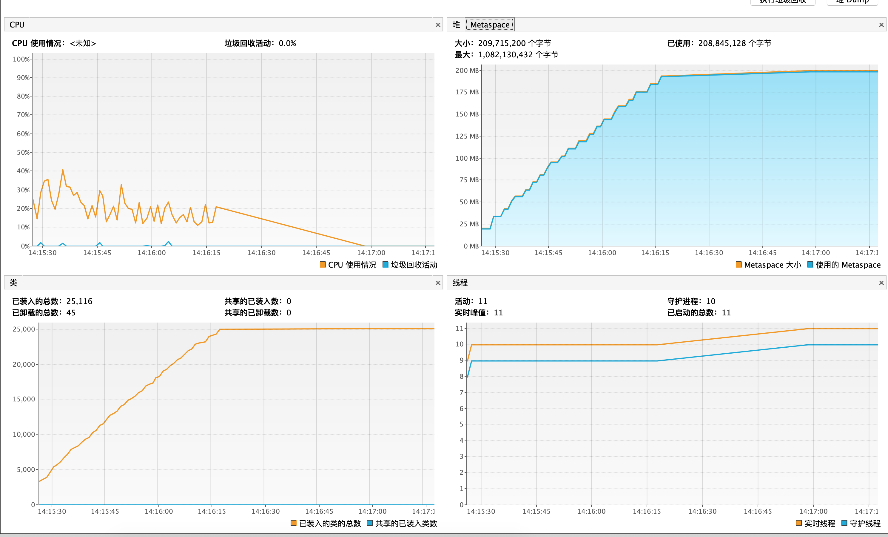

# JVM调试之元空间(方法区)

在 Java 虚拟机（以下简称 JVM）中，类包含其对应的元数据，比如类的层级信息，方法数据和方法信息（如字节码，栈和变量大小），运行时常量池，已确定的符号引用和虚方法表。

在过去（当自定义类加载器使用不普遍的时候），类几乎是“静态的”并且很少被卸载和回收，因此类也可以被看成“永久的”。另外由于类作为 JVM 实现的一部分，它们不由程序来创建，因为它们也被认为是“非堆”的内存。

在 JDK8 之前的 HotSpot 虚拟机中，类的这些“永久的”数据存放在一个叫做永久代的区域。永久代一段连续的内存空间，我们在 JVM 启动之前可以通过设置 -XX:MaxPermSize 的值来控制永久代的大小，32 位机器默认的永久代的大小为 64M，64 位的机器则为 85M。永久代的垃圾回收和老年代的垃圾回收是绑定的，一旦其中一个区域被占满，这两个区都要进行垃圾回收。但是有一个明显的问题，由于我们可以通过‑XX:MaxPermSize 设置永久代的大小，一旦类的元数据超过了设定的大小，程序就会耗尽内存，并出现内存溢出错误 (OOM)。

**备注：**在 JDK7 之前的 HotSpot 虚拟机中，纳入字符串常量池的字符串被存储在永久代中，因此导致了一系列的性能问题和内存溢出错误。

默认情况下元空间的大小是21m，并且会随着空间的使用增加自动调高。所以需要JVM参数进行调试

- ## 代码案例
  
    使用cglib字节码技术生成新的class对象

    ```java
    public class MyTest4 {
        public static void main(String[] args) {
            while (true) {
                Enhancer enhancer = new Enhancer();
                enhancer.setSuperclass(MyTest4.class);
                enhancer.setUseCache(false);
                enhancer.setCallback((MethodInterceptor) (obj, method, args1, proxy) ->
                        proxy.invokeSuper(obj, args1));

                System.out.println("hello world");

                enhancer.create();
            }
        }
    }
    ```

- ## JVM参数
  
    -XX:MaxMetaspaceSize=10m,表示元空间的大小设置为10m。

- ## 输出结果

    ```no
    Exception in thread "main" net.sf.cglib.core.CodeGenerationException: java.lang.reflect.InvocationTargetException-->null
    at net.sf.cglib.core.AbstractClassGenerator.create(AbstractClassGenerator.java:237)
    at net.sf.cglib.proxy.Enhancer.createHelper(Enhancer.java:377)
    at net.sf.cglib.proxy.Enhancer.create(Enhancer.java:285)
    at com.xie.jvm.memory.MyTest4.main(MyTest4.java:21)
    Caused by: java.lang.reflect.InvocationTargetException
    at sun.reflect.GeneratedMethodAccessor1.invoke(Unknown Source)
    at sun.reflect.DelegatingMethodAccessorImpl.invoke(DelegatingMethodAccessorImpl.java:43)
    at java.lang.reflect.Method.invoke(Method.java:498)
    at net.sf.cglib.core.ReflectUtils.defineClass(ReflectUtils.java:384)
    at net.sf.cglib.core.AbstractClassGenerator.create(AbstractClassGenerator.java:219)
    ... 3 more
    Caused by: java.lang.OutOfMemoryError: Metaspace
    at java.lang.ClassLoader.defineClass1(Native Method)
    at java.lang.ClassLoader.defineClass(ClassLoader.java:763)
    ... 8 more
    ```

    可以看到元空间内存溢出

- ## 增加元空间内存大小
  
    -XX:MaxMetaspaceSize=200m,可以在jvisualvm中查看元空间一直在增加,直到增加到200m结束
    

- ## 元空间调优与工具
  
    正如上面提到的，元空间虚拟机控制元空间的增长。但是有些时候我们想限制其增长，比如通过显式在命令行中设置 -XX:MaxMetaspaceSize。默认情况下，-XX:MaxMetaspaceSize 的值没有限制，因此元空间甚至可以延伸到交换区，但是这时候当我们进行本地内存分配时将会失败。

    对于一个 64 位的服务器端 JVM 来说，其默认的–XX:MetaspaceSize 值为 21MB。这就是初始的高水位线。一旦触及到这个水位线，Full GC 将会被触发并卸载没有用的类（即这些类对应的类加载器不再存活），然后这个高水位线将会重置。新的高水位线的值取决于 GC 后释放了多少元空间。如果释放的空间不足，这个高水位线则上升。如果释放空间过多，则高水位线下降。如果初始化的高水位线设置过低，上述高水位线调整情况会发生很多次。通过垃圾回收器的日志我们可以观察到 Full GC 多次调用。为了避免频繁的 GC，建议将–XX:MetaspaceSize 设置为一个相对较高的值。

    经过多次 GC 之后，元空间虚拟机自动调节高水位线，以此来推迟下一次垃圾回收到来。

    有这样两个选项 ‑XX:MinMetaspaceFreeRatio 和‑XX:MaxMetaspaceFreeRatio，他们类似于 GC 的 FreeRatio 选项，用来设置元空间空闲比例的最大值和最小值。我们可以通过命令行对这两个选项设置对应的值。
