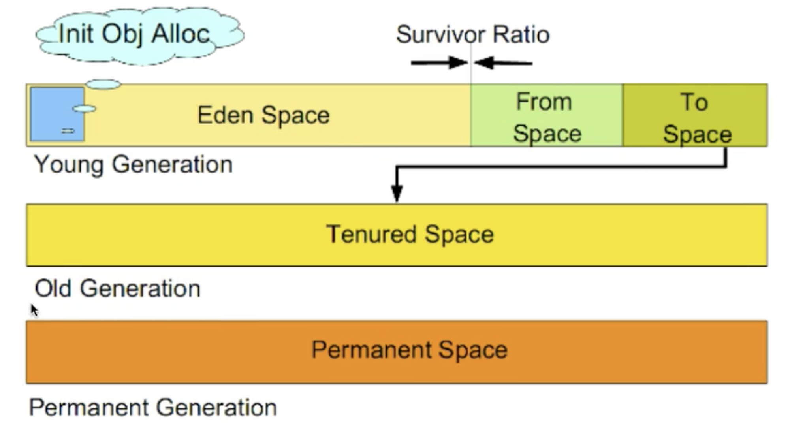

# JVM 垃圾收回理论

- ## JVM运行时内存数据区域
  
    
    1. 程序计数器
        程序计数器是一块较小的内存空间，可看做是当前线程所执行的字节码的行号指示器。在虚拟机的概念模型里，字节码解释器工作时就是通过改变这个计数器的值来选择下一条需要执行的字节码指令。分支、循环、跳转、异常处理、线程恢复等基础功能都需要依赖这个计数器来完成。</br>
        因为Java里面是支持多线程的，所以要求每一个线程都有一个自己的程序计数器，以便线程切换后能恢复到正确的执行位置。各线程之间互不影响，独立存储，我们称这类内存区域为“线程私有”的内存。  
        此内存区域没有规定任何OutOfMemoryError情况的区域。  

    2. 虚拟机栈
        虚拟机栈也是线程私有的，它的生命周期与线程相同。虚拟机栈描述的是Java方法执行的内存模型：每个方法在执行的同时会创建一个栈帧用于存储局部变量表、操作数栈、动态链接、方法出口等信息。我们只需要知道每个线程都会有一个虚拟机栈，然后线程里的多个方法就对应栈里面的栈帧（栈存储元素的基本单位），每个方法从调用到执行完成对应一个栈帧在虚拟机栈中入栈到出栈的过程。</br>

        通常有人把Java内存分为堆内存和栈内存，其实这两块内存只是与一些对象的内存分配有关，比较粗糙。比如通常Java程序中的所有对象均是在堆中分配的，它是一个线程共享的区域，如上图所示；而栈则是我们所说的虚拟机栈，通常用来供方法内的局部变量进行分配，也就是上面提到的栈帧中的局部变量表。</br>

        局部变量表存放了编译器可知的各种基本数据类型（boolean、byte、char、short、int、float、long、double）、对象引用（reference类型，它不等同于对象本身，可能是一个指向对象起始地址的引用指针，也可能是指向一个代表对象的句柄或其他与此对象相关的位置）和returnAddress类型（指向了一条字节码指令的地址）。</br>

        Slot（局部变量空间）是局部变量表的基本单位（通常为32位），64位的long和double类型数据会占用2个局部变量空间，其余的数据类型只占用1个。**局部变量表所需的内存空间在编译期间完成分配，当进入一个方法时，这个方法需要在栈帧中分配多大的局部变量空间是完全确定的，在方法运行期间不会改变局部变量表的大小**。</br>

        此内存区域规定了两种异常状况：若线程请求的栈深度大于虚拟机所允许的深度，将抛出StackOverflowError异常（一个方法可能递归请求了大量的方法且还未返回，使得请求的方法个数大于栈的深度，导致栈内放不了那么多的栈帧）；如虚拟机可以动态扩展，且扩展时无法申请到足够内存，则会抛出OutOfMemoryError异常。</br>

    3. 本地方法栈
        与虚拟机栈其实是类似的，只是虚拟机栈为虚拟机执行Java方法（也就是字节码）服务，而本地方法栈则为虚拟机使用到的Native方法服务。与虚拟机栈一样，本地方法栈区域也会抛出StackOverflowError和OutOfMemoryError异常。

    4. Java堆
        Java 堆算是Java虚拟机所管理的内存中最大的一块。Java堆是被所有线程共享的一块内存区域，在虚拟机启动时创建，此内存区域的唯一目的就是存放对象实例，几乎所有的对象实例都在这里分配内存。Java虚拟机规范中描述的是：所有的对象实例以及数组都要在堆上分配，当然随着技术发展，这个也就不是那么绝对了。</br>

        Java堆是垃圾收集器管理的主要区域，因此很多时候也被称为“GC堆”。因为很多对象都是在这里存储的，也就需要在这里进行回收。从内存回收的角度看，由于现在收集器基本都采用分代收集算法，所以Java堆中还可以细分为：新生代和老年代，这个在后面文章中会讲到，再详细一些还有Eden空间、From Survivor空间、To Survivor空间等。从内存分配的角度看，线程共享的Java堆中可能划分出多个线程私有的分配缓冲区（TLAB）。不过无论如何划分，都与存放内容无关，无论哪个区域，存储的都仍然是对象实例，进一步划分的目的是为了更好地回收内存，或者更快地分配内存。</br>

        Java虚拟机规范规定，Java堆可以处于物理上不连续的内存空间中，只要逻辑上是连续的即可。

    5. 方法区
        方法区也是线程共享的，它用于存储已被虚拟机加载的类信息、常量、静态变量、即时编译器编译后的代码等数据。要注意“方法区”和“永久代”并不是一个东西，仅仅是因为HotSpot虚拟机的设计团队选择把GC分代收集扩展至方法区，或者说使用永久代来实现方法区而已，这样HotSpot的垃圾收集器就可以像管理Java堆一样管理这部分内存。</br>

        其实垃圾收集行为在这个区域是比较少出现的，这区域的内存回收目标主要是针对常量池的回收和对类型的卸载。而且回收成绩难以让人满意，尤其是类型的卸载条件相当苛刻，但这部分区域的回收确实有必要。此区域有可能会抛出OutOfMemoryError异常。java对象的“死活”中描述了一些关于方法区回收的细节。

    6. 运行时常量池
        运行时常量池是方法区的一部分。Class文件中会有一项信息是常量池，用于存放编译期生成的各种字面量和符号引用，这部分内容将在类加载后进入方法区的运行时常量池中存放。</br>

        Java虚拟机规范没有对运行时常量池做任何细节的要求，但一般来说，除了保存Class文件中描述的符号引用外，还会把翻译出来的直接引用也存储在运行时常量池中。</br>

        运行时常量池相对于Class文件常量池的另外一个重要特征就是具备动态性，Java语言并不要求常量一定只有编译器才能产生，也就是并非预置入Class文件中常量池的内容才能进入方法区运行时常量池，运行期间也可将新的常量池放入池中，这种特性被开发人员利用的比较多的是String类的intern()方法。

    7. 直接内存
       直接内存并不是虚拟机运行时数据区的一部分，也不是Java虚拟机规范中定义的内存区域。但是这部分内存也会被频繁的使用。在JDK1.4中新加入了NIO(New Input/Output)类，引入了一种基于通道与缓冲区的I/O方式，它可以使用Native函数库直接分配堆外内存，然后通过一个存储在Java堆中的DirectByteBuffer对象作为这块内存的引用进行操作，这样避免了在Java堆和Native堆中来回复制数 据。

- ## JVM 运行时数据区域-案例

    ```java
    public void method(){
        Object obj = new Object();
    }
    ```

  - 生成了2部分的内存区域  
      1. obj这个引用变量，因为是在方法内的变量，放到JVM Stack里面；
      2. 真正的object class的实例对象，放到堆Heap里面；
  - 上述的new 语句一共消耗12个字节，JVM 规定引用占用4个bytes（在JVM Stack），而空对象是8个bytes（在Heap)
  - 方法结束后，对应的Stack 中变量马上回收，但是Heap中的对象要等到GC来回收

- ## JVM 垃圾回收(GC)模型
  
  - **垃圾判断算法**  
    1. 引用计数算法(Reference Counting)  
        给对象添加一个引用计数器，当有一个地方引用它，计算器加1，当引用失效，计算器减1，任何时刻计数器为0的对象就是不可能再被使用的。</br>
        引用计数算法无法解决对象循环引用问题。
    2. 根搜索算法(Root Tracing)  
        在实际的生产语言中(Java,C#等)，都是使用根搜索算法判定对象是否存活。</br>
        算法基本思路就是通过一系列的称为`GC Roots`的点作为起始进行向下搜索，当一个对象到`GC Roots`没有任何引用链`Reference Chain`相连，则证明此对象是不可用的。</br>
        在Java语言中，`GC Roots`包括：在JVM栈(帧中本地变量)中引用、方法区的静态引用、JNI(即一般说的Native方法)中引用。  

  - **GC 算法**  
    JVM中常见的垃圾回收算法
    1. 标记-清除算法(Mark-Sweep)
        算法分为**标记**和**清除**两个阶段，首先标记出所有需要回收的对象，然后回收所有需要回收的对象。</br>
        **缺点:**
        效率问题，标记和清除两个过程效率都不高;
        空间问题，标记清除之后会产生大量不连续的内存碎片，空间碎片太多可能会导致后续使用中无法找到足够的连续内存而提前出发另一次的垃圾搜集动作；
    2. 标记-整理算法(Mark-Compact)
        标记过程仍然一样，但后续步骤不是进行直接清理，而是令所有存活的对象一端移动，然后直接清理掉这边边界以外的内存。  
    3. 复制收集算法(Copying)  
        将可用的内存划分成两块，每次只使用其中的一块，当半区内存使用完了，仅将还存活的对象复制到另一块上面，然后就把原来整块的内存空间一次性清理掉。</br>
        这样使得每次内存回收都是对整个半区的回收，内存分配时也就不用考虑内存碎片等复杂情况，只要移动堆顶指针，按顺序分配内存就可以了，实现简单，运行高效。</br>
        **只是这种算法的代价是将内存缩小为原来的一半，代价高昂**。</br>
        现在的商业虚拟机中都是使用了这种收集算法来回收`新生代`，将内存分为一块较大的`eden`空间和2块较少的`survivor`空间，每次使用`eden`和其中一块`survivor`，当回收时将`eden`和`survivor`还存活的对象一次性拷贝到另一块`survivor`空间上，然后清理掉`eden`和用过的`survivor`。</br>
        Oracle Hotspot 虚拟机默认的`eden`和`survivor`的大小比例是8:1，也就是每次只有10%的内存是浪费的。复制收集算法在对象存活率高的时候，效率有所下降。如果不想浪费50%的空间，就需要有额外的空间进行分配担保用于应付半区内存中所有对象都100%存活的极端情况，所以在老年代一般不能直接选用这种算法。</br>
        总结:  
        - 只需要扫描存活的对象，效率更高；
        - 不会产生碎片；
        - 需要浪费额外的内存作为复制区
        - 复制算法非常适合生命周期比较短的对象，因为每次GC总能回收大部分的对象，复制的开销比较小；
        - 根据IBM的专门研究，98%的对象只会存活1个GC周期，对这些对象很适合使用复制算法。而且不用1:1的划分工作区和复制区的空间。  
    4. 分代算法(Generational)  
        当前商业虚拟机的垃圾收集都是采用`分代收集(Generational Collection)`算法，根据对象不同的存活周期将内存划分为几块。</br>
        一般是把java堆分作`新生代和老年代`,这样就可以根据各个年代的特点采用最适当的收集算法，譬如新生代每次GC都有大批对象死去，只有少量存活，那就选用复制收集算法只需付出少量存活对象的复制成本就可以完成收集。</br>
        综合前面几种GC 算法的优缺点，针对不同生命周期的对象采用不同的GC 算法。
        
        对于新生代可以使用复制收集算法，而老年代可以使用标记清除或者标记整理算法。</br>
        Hotspot JVM 6 中共划分成三个代：年轻代(Young Generation)、老边代(Old Generation)、和永久代(Permanent Generation)【JDK 8 之后为元空间(metaspace)】。
        
        - 年轻代  
            新生成的对象都放在新生代。年轻代用复制算法进行GC（理论上，年轻代对象的生命周期非常短，所以适合复制算法）。</br>
            年轻代分三个区。一个`Eden`区，两个`Survivor`区（可通过参数设置`Survivor`个数)。对象在`Eden`区中生成。当`Eden`区满时，还存活的对象将被复制到一个`Survivor`区，当这个`Survivor`区满时，此区存活对象将被复制到另一个`Survivor`区，当第二个`Survivor`区也满的时候，从第一个`Survivor`区复制过来的并且此时还存活的对象，将被复制到老年代。2个`Survivor`区是完全对称的，轮流替换。</br>
            `Eden`和2个`Survivor`的缺省比例是8:1:1，也就是10%的空间会被浪费。可以根据GC log的信息调整大小的比例。  
        - 老年代  
            存放了经过一次或多次GC 还存活的对象。一般采用`Mark-Sweep`或者`Mark-Compact`算法进行GC。有多种垃圾收集器可以选择，每种垃圾收集器可以看做一个GC 算法的具体实现。可以根据具体应用的需求选用合适的垃圾收集器（追求吞吐量？追求最短的响应时间？）。</br>
            JDK8之后永久代并不属于堆(Heap)。但是GC也会涉及到这个区域。永久代存放了每个Class的结构信息，包括常量池、字段描述、方法描述。与垃圾收集要收集的Java对象关系不大。
    - **垃圾回收器的实现和选择**
  
- ## 内存分配

    1. 堆上分配  
        大多数情况在`eden`上分配，偶尔会直接在`old`上分配，细节取决于GC的实现。
    2. 栈上分配  
        原子类型的局部变量

- ## 内存回收

    GC要做的是将那些dead的对象所占用的内存回收掉。Hotspot认为没有引用的对象是dead的。  

    Hotspot将引用对象分为四种：`Strong`，`Soft`，`Weak`，`Phantom`。  
    `Strong`即默认通过`Object o = new Object();`这种方式赋值的引用。`Soft`，`Weak`，`Phantom`这三种都是集成`Reference`。  

    在Full GC 时会对Reference类型的引用进行特殊处理：  
        1. Soft：内存不够时一定会被GC、长期不用也会被GC。  
        2. Weak：一定会被GC，当被Mark为Dead，会在ReferenceQueue中通知。  
        3. Phantom：本来就没引用，当从JVM Heap 中释放时会通知。  

- ## GC 触发时机

    在分代模型的基础上，GC从时机上分为两种：`Scavenge GC`和`Full GC`。  

    `ScavengeGC(Minor GC)`触发时机在新对象生成，`Eden`空间满了。理论上`Eden`区大多数对象会在`Scavenge GC`回收，复制算法的执行效率会很高，`Scavenge GC`时间比较短。  

    `Full GC` 对整个JVM进行整理，包括`Young`、`Old`和`Permanet`。主要触发时机：`Old`满了、`Perm`满了、`System.gc()`。效率很低，尽量减少Full GC。

- ## 垃圾收集器的并行与并发

    并行(Parallel)：指多个收集器的线程同时工作，但是用户线程处于等待状态。  
    并发(Concurrent)：指收集器在工作的同时，可以允许用户线程工作。并发不代表解决了GC停顿的问题，在关键的步骤还是要停顿。比如在收集器标记垃圾的时候。但是在清除垃圾的时候，用户线程可以和GC线程并发执行。  

    1. Serial收集器  
        单线程收集器，收集时会暂停所有工作线程(Stop The World，简称STW)，在新生代使用复制收集算法，在老年代使用Mark-Compact算法，虚拟机运行在Client 时默认的收集器。  
    2. ParNew 收集器  
        Parnew收集器就是Serial的多线程版本，除了使用多个收集线程外，其余行为包括算法、STW、对象分配规则、回收策略等都与Serial收集器一模一样。  
        对应的这种收集器是虚拟机运行在Server模式中的默认新生代收集器，在单CPU的环境中，Parnew收集器并不会比Serial收集器有更好的效果。  
        可以通过`-XX:ParallelGCThreads`来控制GC线程数的多少。  
    3. Parallel Scavenge 收集器  
        Parallel Scavenge 收集器也是一种多线程收集器，也是使用复制算法，但它的对象分配规则与回收策略都与ParNew收集器有所不同，它是以吞吐量最大化（即GC时间占总运行时间最小）为目标的收集器实现，它允许较长时间的STW换取总吞吐量最大化。  
    4. Serial Old 收集器  
        Serial Old 是单线程收集器，使用Mark-Compact算法，是老年代收集器。  
    5. Paralle Old 收集器  
        老年代版本吞吐量优先收集器，使用多线程和Mark-Compact算法，JVM 1.6 提供，在此之前，新生代使用了PS收集器的话，老年代除 Serial Old 处别无选择，因为PS无法与CMS收集器配合工作。  
        `Parallel Scavenge + Paralle Old = 高吞吐量`，但GC停顿可能不理想。  
    6. CMS（Concurrent Mark Sweep） 收集器  
        CMS 是一种以最短停顿时间为目标的收集器，使用CMS并不能达到GC效率最高（总体GC时间最下），但它尽可能降低GC时服务停顿的时间，CMS收集器使用的是标记-清除算法。使用`-XX:UseConcMarkSweepGC`打开。  
        缺点：  
        - CMS以牺牲CPU资源的代价来减少用户线程停顿时间。当CPU个数少于4时，有可能对吞吐量影响非常大；
        - CMS在并发清理过程中，用户线程还在跑。这时候需要预留一部分空间给用户线程；
        - CMS用Mark-Sweep，会带来碎片问题。碎片过多的时候容易频繁触发Full GC；

    **GC 垃圾收集器的JVM参数定义**
    
