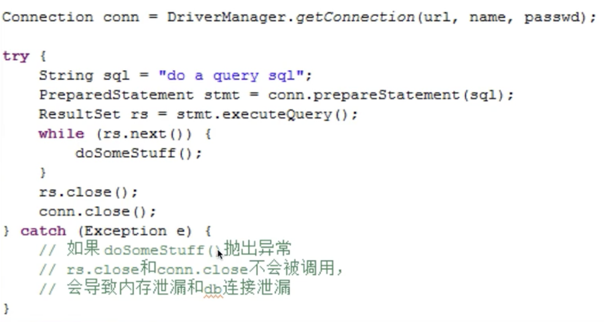
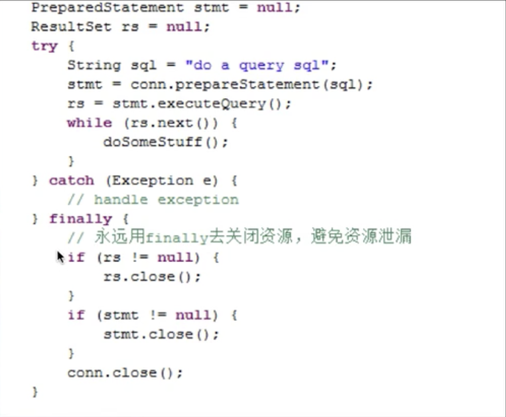

# Java 内存泄漏的经典原因

- ## 对象定义在错误的范围内(Wrong Scope)

    如果Foo实例对象的生命较长，会导致临时性内存泄漏。（这里的names变量其实只有临时作用）

    ```java
    class Foo {
        private String[] names;
        public void doIt(int length){
            if(names == null || names.length < length){
                names = new String[length];
            }
            populate(names);
            print(names);
        }
    }
    ```

    JVM 喜欢生命周期短的对象，这样做已经足够高效

    ```java
    class Foo {
        public void doIt(int length){
            String[] names = new String[length];
            populate(names);
            print(names);
        }
    }
    ```

- ## 异常(Exception)不当
  
    错误的做法：
    

    正确的做法：
    

- ## 集合数据管理不当
  
    1. 当使用Array-based的数据结构（ArrayList，HashMap等）时，要尽量减少resize。比如new ArrayList时，尽量估算size，在创建的时候把size确定。减少resize可以避免没有必要的array coping，GC碎片等问题。
    2. 如果一个List只需要顺序访问，不需要随机访问(Random Access)，用LinkedList代替ArrayList，LinkedList本质是链表，不需要resize，但只适用于顺序访问。
