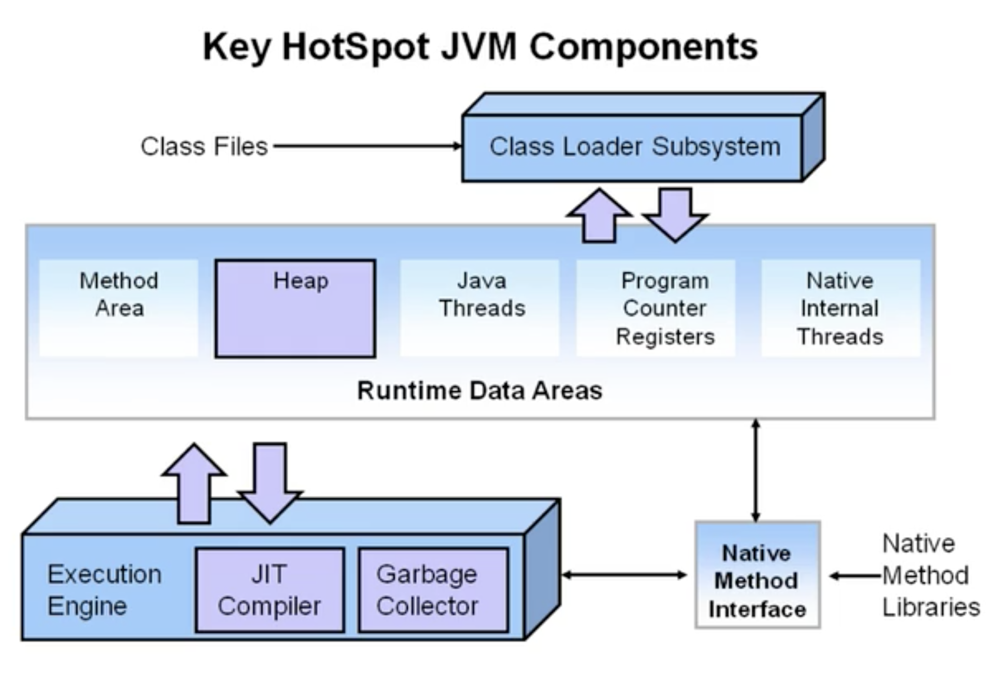
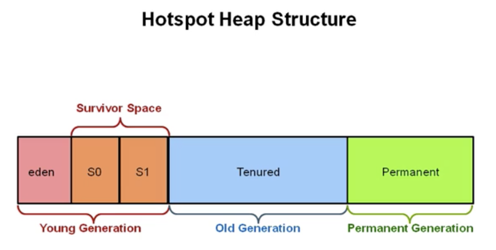
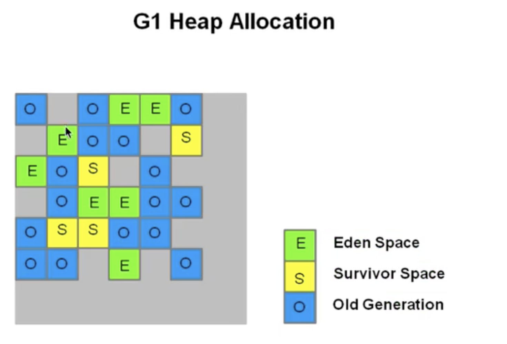
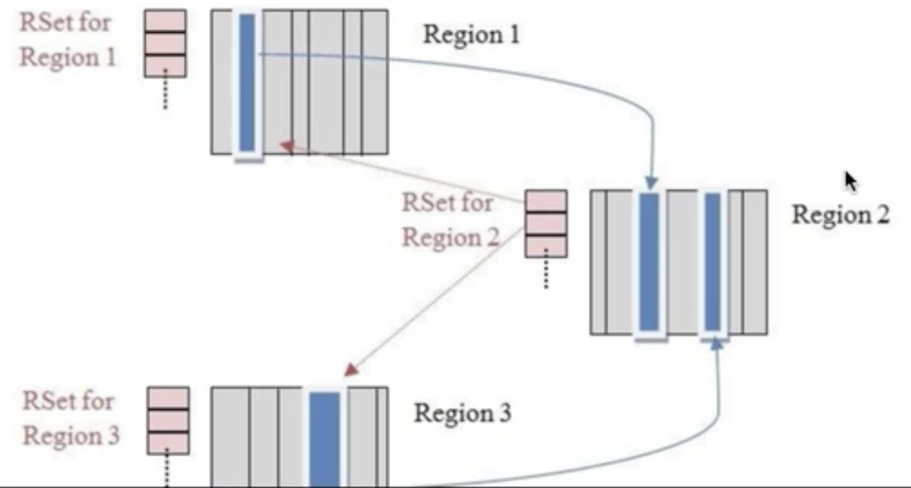
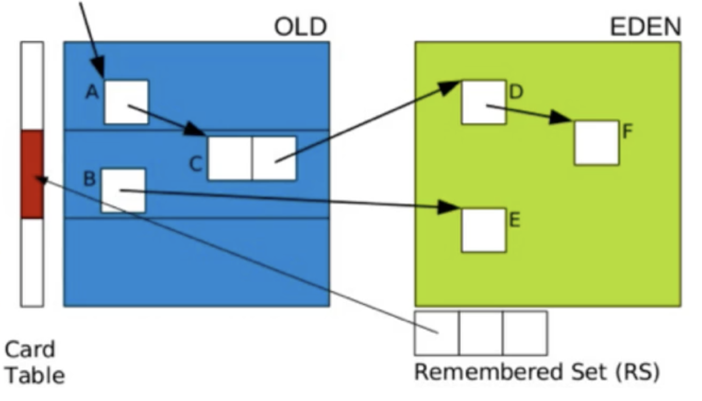
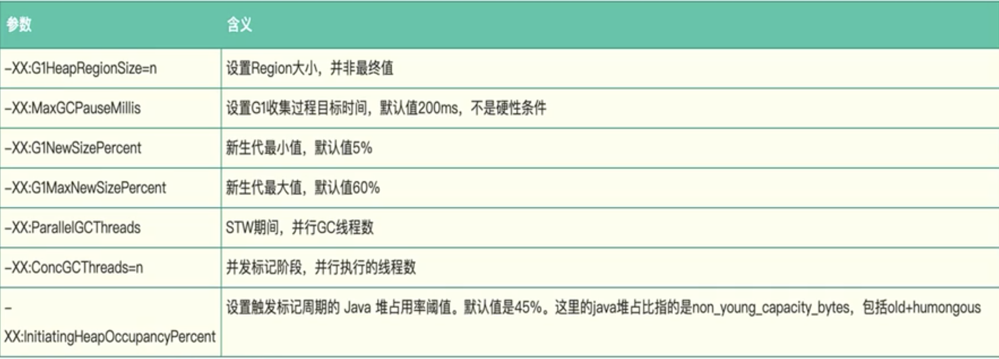

# G1 垃圾收集器理论

Garbage First Collector，g1收集器是一个面向服务端的垃圾收集器，适用于多核处理器、大内存容量的服务端系统，它能满足短时间gc停顿的同时达到一个较高的吞吐量，JDK7以上版本适用。

G1 算法将堆划分为若干个区域（Region），它仍然属于分代收集器。不过，这些区域的一部分包含新生代，**新生代的垃圾收集依然采用暂停所有应用线程的方式，将存活对象拷贝到老年代或者Survivor空间**。老年代也分成很多区域，**G1收集器通过将对象从一个区域复制到另外一个区域，完成清理工作**。这就意味着，在正常的处理过程中，G1完成了堆的压缩（至少是部分堆的压缩），这样也就不会有CMS内存碎片问题的存在了。

## 吞吐量

吞吐量关注的是，在一个指定的时间内，最大化一个应用的工作量。如下方式来衡量一个系统的吞吐量的好坏：

1. 在一个小时内同一个事物（或者任务、请求）完成的次数(tps);
2. 数据库一个小时可以完成多少次查询；

对于关注吞吐量的系统，卡顿是可以接受的，因为这个系统关注长时间的大量任务的执行能力，单次快速的响应并不值得考虑。

## 响应能力

响应能力指一个程序或者系统对请求是否能够及时响应，比如：

1. 一个桌面UI能多块地响应一个事件
2. 一个网站能多块返回一个请求
3. 数据库能多块返回查询的数据

对于这类对响应能力敏感的场景，长时间停顿是无法接受的。

## G1垃圾收集器设计目标

- 与应用线程工作同时，几乎不需要stop-the-world(与CMS类似)；
- 整理剩余空间，不产生内存碎片（CMS只能在Full GC时，用stop-the-world整理内存碎片）;
- GC停顿更加可控；
- 不牺牲系统的吞吐量；
- GC不要额外的内存空间（CMS需要预留空间存储**浮动垃圾**）；

## G1 的设计规划是要替换掉CMS

G1 在某些方面弥补了CMS的不足，比如，CMS是使用的是`mark-sweep`算法，自然会产生内存碎片；然后G1基于`copying`算法，高效的整理剩余内存，而不需要管理内存碎片。另外，G1提供了更多手段，以达到对GC停顿时间的可控。

## HotSpot虚拟机主要构成

## 传统垃圾收集器堆结构

## G1 收集器堆结构

- heap被划分为一个个相等的不连续的内存空间(regions)，每个region都有一个分代的角色：Eden，Survivor，Old；
- 对每个角色的数量并没有强制的限定，也就是说对每种分代的内存的大小，可以动态变化；
- G1 最大的特点就是高效执行回收，优先去执行那些大量对象可回收的区域(region)；
- G1 使用了gc停顿可预测的模型，来满足用户设定的gc停顿时间，根据用户设定的目标时间，G1会自动地选择哪些region要清除，一次清除多少个region
- G1 从多个region中复制存活的对象，然后集中放入一个region，同时整理、清除内存（copying收集算法）

## G1重要概念

- **分区（Region）**：
  G1采取了不同的策略来解决并行、串行和CMS收集器的碎片、暂停时间不可控等问题，G1 将**整个堆**分成相同大小的分区（Region）；
  每个分区都可能是年轻代也可能是老年代，但是在同一刻只能属于某个代。年轻代、幸存区、老年代这些概念还存在，**称为逻辑上的概念**，这样方便复用之前分代框架的逻辑。
  在物理上不需要连续，则带来了额外的好处。有的分区内垃圾对象特别多，有的分区内垃圾对象很少，**G1优先回收垃圾对象特别多的分区**，这样可以花费较少的时间来回收这些分区的垃圾，这也就是G1名字的由来，即首先收集垃圾最多的分区。
  依然是在新生代满了的时候，对整个新生代进行回收。整个新生代中的对象，要么被回收、要么晋升，至于新生代也采取分区机制的原因，**则是因为这样跟老年代的策略统一，方便调整代的大小**。
  G1还是一种带压缩的收集器，在回收老年代的分区时，是将存活的对象从一个分区拷贝到另一个可用分区，这个拷贝过程就实现了局部的压缩。
- **收集集合（CSet)**:
  一组可被回收的分区的集合。在CSet中存活的数据会在GC过程中被移动到另一个可用分区，CSet中的分区可以来自Eden空间、Survivor空间、或者老年代。
- **已记忆集合（RSet）**：
  RSet记录了其他Region中对象引用本Region中对象的关系，属于points-into（谁引用了我的对象）。RSet的价值在于使得垃圾收集器不需要扫描整个堆找到谁引用了当前分区的对象，只需要扫描RSet即可。
  Region1和Region3中的对象都引用了Region2中的对象，因此在Region2的RSet中记录了这两个引用。
  
  G1 GC是在points-out的card table之上再加了一层结构来构成points-into RSet：每个region会记录下到底哪些别的region有指向自己的指针，而这些指针分别在哪些card的范围内。
  这个RSet其实是一个`hash table`,key是别的region的起始地址，value是一个集合，里面的元素是card table的index。举例来说，如果regionA的RSet里有一项的key是regionB,value里面有index为1234的card，它的意思就是regionB的一个card里有引用指向regionA。所以对regionA来说，该RSet记录的是points-info的关系，而card table仍然记录的了points-out的关系。
- **Snapshot-At-The-Beginning（SATB)**：
  SATB是G1 GC在并发标记阶段使用的增量式的标记算法。并发标记是并发多线程的，但并发线程在同一时刻只扫描一个区。
- **一个特殊的区域《Humongous区域》**：
  在G1中，还有一种特殊的区域，叫**Humongous**区域。如果一个对象占用的空间达到或者超过了分区容量的50%以上，G1收集器就认为这是一个巨型对象。这些巨型对象，**默认直接会被分配到老年代**，但是如果它是一个短期存在的巨型对象，就会对垃圾收集器造成负面影响。为了解决这个问题，G1划分了一个Humongous区，它用来专门存放巨型对象。如果一个H区装不下一个巨型对象，那么G1会寻找连续的H分区来存储。**为了能找到连续的H分区，有时候不得不确定Full GC**。

## G1 GC 模式

G1提供两种GC模式，Young GC和Mixed GC，两种都是完全的STW（stop-the-world)

- **Young GC**：
  选定所有年轻代里的Region，通过控制年轻代的Region个数，即年轻代内存大小，来控制Young GC的时间开销；
  Young GC主要是对Eden区进行GC，**它在Eden区空间耗尽时会触发**。在这种情况下，Eden空间的数据移动到Survivor空间中，如果Survivor空间不够，Eden空间的部分数据会直接晋升到老年代空间。**Survivor区的数据移动到新的Survivor区中，也有部分数据直接晋升到老年代空间中，最终Eden空间的数据为空**，GC完成工作，应用线程继续执行。
  如果仅仅GC新生代对象，我们如果找到所有的根对象呢？老年代的所有对象都是跟对象么？那这样扫描下来会耗费大量时间。于是,G1引进了`RSet`的概念。它的全称是`Remembered Set`，作用是跟踪指向某个heap区内的对象引用。
  
  在CMS中，也有RSet概念，在老年代中有一块区域用来记录指向新生代的引用。这是一种point-out，在进行Young GC扫描根时，仅仅需要扫描这一块区域，而不需要扫描整个老年代。
  在G1中，并没有使用point-out，这是由于一个分区太小，分区数量太多，如果是用point-out的话，会造成大量的扫描浪费，有些根本不需要GC的分区引用也扫描了。于是G1中使用了point-in来解决。point-in的意思是哪些分区引用了当前分区中的对象。这样仅仅将这些对象当做根来扫描就避免了无效的扫描。由于新生代有多个，那么我们需要在新生代之间记录引用吗？这是不必要的，原因在于每次GC时，所有新生代都会被扫描，**所以只需要记录老年代到新生代之间的引用即可**。
  **需要注意的是**，如果引用的对象很多，赋值器需要对每个引用做处理，赋值器开销会很大，为了解决赋值器开销这个问题，在G1中又引入了另外一个概念，卡表(Card Table)。一个Card Table将一个分区在逻辑上划分为固定大小的连续区域，每个区域称之为卡。卡通常较小，介于128到512字节之间。Card Table通常为字节数组，有Card的索引（即数组下标）来标识每个分区的空间地址。默认情况下，每个卡都未被引用。当一个地址空间被引用时，这个地址空间对应的数组索引的值被标记为'0'，即标记为脏被引用，此外RSet也将这个下标记录下来。一般情况下，这个RSet其实是一个hash table，Key是别的Region的起始地址，Value是一个集合，里面的元素是Card Tabele的index。
  Young GC 处理阶段：
  1. **阶段1：根扫描**，静态和本地对象被扫描；
  2. **阶段2：更新RS**，处理dirty card队列更新RS；
  3. **阶段3：处理RS**，检测从年轻代指向老年代的对象;
  4. **阶段4：对象拷贝**，拷贝存活的对象到Survivor区域；
  5. **阶段5：处理引用队列**，软引用，弱引用，虚引用处理；
- **Mixed GC（混合模式）**：
  选定所有年轻代里的Region，外加根据`gloable concurrent marking`统计得出收集效益高的若干老年代Region。在用户指定的开销目标范围内尽可能选择收益高的老年代Region。
  Mixed GC不是Full GC ,**它只能回收部分老年代的Region**，如果Mixed GC 实在无法跟上程序分配内存的速度，导致老年代填满无法继续进行Mixed GC ，就是使用Serial Old GC（Full GC）来收集整个GC heap。**所以本质上，G1 是不提供Full GC的**。
  它的GC步骤分为两步：
  1. 全局并发标记(gloable concurrent marking);
  2. 拷贝存活对象(evacuation)

## Gloable Concuurent Marking

gloable concurrent marking 的执行过程类似于CMS，但是不同的是，在G1 GC中，**它主要是为Mixed GC提供标记服务的**，并不是一次GC过程的一个必须环节。
gloable concurrent marking 的执行过程分为四个步骤：

- **初始标记(inital mark,STW)**：
  它标记了从GC Root开始直接科大的对象;
- **并发标记(Concurrent Marking)**：
  这个阶段从GC Root开始对heap中的对象进行标记，标记线程与应用线程并发执行，并且收集各个Region的存活对象信息
- **重新标记（Remark，STW）**：
  标记那些在并发阶段发生变化的对象，将被回收；
- **清理（CleanUp**）：
  清空Region（没有存活对象的），加入到freelist；

第一阶段inital mark 是共用了Young GC的暂停，这是因为它们可以复用root scan操作，所以可以说gloable concurrent marking是伴随Young GC而发生的。
第四阶段CleanUp只是回收了没有存活对象的Region，所以它们并不需要STW。

## G1 在运行过程中的主要模式

1. YGC（不同于CMS）
   G1 YGC在Eden区充满后触发，在回收之后所有之前属于Eden的区块全部变成空白 ，即不属于任何一个分区（Eden，Survivor，Old）；
2. 并发阶段（Gloable Concuurent Marking）
3. 混合模式（Mixed GC）
   什么时候触发Mixed GC？
   Mixed GC由一些参数控制，另外也控制着哪些老年代Region会被选入CSet（收集集合）：
   - **G1HeapWastePercent**：G1堆浪费百分比。在gloable concurrent marking结束之后，我们可以知道old gen regions中有多少空间要被回收，在每次YGC之后和再次发生Mixed GC之前，会检查垃圾占比是否达到此参数，只有达到了，下次才会发生Mixed GC；
   - **G1MixedGCLiveThresholdPercent**：old generation region中的存活对象的占比，只有在此参数之下，才会被选入CSet；
   - **G1MixedGCCountTarget**：一次gloable concurrent marking之后，最多执行Mixed GC的次数；
   - **G1OldCSetRegionThresholdPercent**：一次Mixed GC中能被选入CSet的最多old generation region数量；
   - **G1 GC 其他参数**
    
4. Full GC（一般是G1 出现问题时发生）

## G1 对比 CMS

- 对比使用mark-sweep的CMS，G1使用的copying算法不会造成内存碎片；
- 对比Parallel Scavenge（基于copying）、Parallel Old收集器（基于mark-compact-sweep），Parallel会对整个区域导致GC停顿会比较长，而G1只是特定地整理几个region；
- G1并非一个实时的收集器，与Parallel Scavenge一样，对GC停顿时间的设置并不绝对生效，只是G1有较高的几率保证不超过设定的GC停顿时间。与之前的GC收集器对比，G1 会根据用户设定的GC停顿时间，智能评估哪几个region需要被回收可以满足用户的设定；
- G1 在回收内存后会马上同时做合并空闲内存工作，而CMS默认是在STW的时候做；
- G1 会在YonungGC 中使用，而CMS只能Old 区使用

## G1的适合场景

- 服务端多核CPU、JVM内存占用较大的应用；
- 应用在运行过程中会产生大量内存碎片、需要经常压缩空间；
- 想要更可控，可预期的GC停顿周期，防止高并发下应用的雪崩场景；
