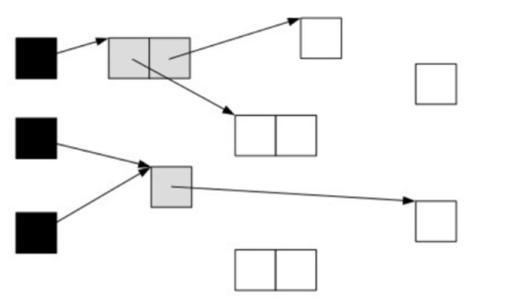

# G1 垃圾收集之三色标记算法

提到标记算法，我们不得不了解并发标记的三色标记算法。它是描述追踪式回收器的一种有效方法，利用它可以推演回收器的正确性。

我们将对象分成三种类型：

1. **黑色：**
   根对象，或者该对象与它的子对象都被扫描过(对象被标记了，且它的所有field也被标记了);
2. **灰色：**
   对象本身被扫描，但还没扫描完该对象中的子对象（它的field还没被标记或者标记完）；
3. **白色：**
   未被扫描对象，扫描完所有对象之后，最终白色的为不可达对象，即垃圾对象（对象没有被标记）；

## 三色标记算法图示

1. 根对象被置为黑色，子对象被置为灰色。
   
2. 继续由灰色遍历，将已扫描了子对象的对象置为黑色
   
3. 遍历了所有可达对象后，所有可达的对象都变成了黑色。不可达的对象即为白色，需要被清理
   

如果在标记的过程中，应用程序也在运行，那么对象的指针就可能发生改变，这样的话，我们就遇到一个问题，对象丢失问题。

当垃圾收集器扫描到下面情况时

如果这时候应用程序执行了`A.c=C;B.c=null`操作，那么对象的状态图编程如下情形：

这时候垃圾收集器再标记扫描的时候就会变成下图这样：

很显然，此时C是白色，被认为是垃圾需要清理掉，显然这是不合理的。使用SATB解决这种问题。

## SATB简介

在G1中，使用的是SATB（Snapshot-At-The-Beginning）的方式，删除的时候记录所有的对象。
它有三个步骤：

1. 在开始标记的时候生成一个快照图，标记存活对象；
2. 在并发标记的时候所有被改变的对象入队（在 write barrier里把所有旧的引用所指向的对象都变成非白的）；
3. 可能存在浮动垃圾，将在下次被收集；

## G1的混合式回收与分代算法

G1到现在可以知道哪些老的分区可以回收垃圾最多。当全局并发标记完成后，在某个时刻，就开始了Mixed GC。这些垃圾回收被称作”混合式“是因为它们不仅仅进行正常的新生代垃圾收集，同时也回收部分后台扫描线程标记的分区，混合式GC也是采用的**复制清理策略**，当GC完成后，会重新释放空间。

为老年设置分区的目的是老年代里有的分区垃圾多，有的分区垃圾少，这样在回收的时候可以专注于收集垃圾多的分区，这也是G1名称的由来。不过这个算法并不适合新生代垃圾收集，因为新生代的垃圾收集算法是复制算法，但是新生代也使用了分区机制主要原因是便于调整代的大小。

## SATB详解

SATB是维持并发GC的一种手段。G1并发的基础就是SATB。SATB可以理解成在GC开始之前对堆内存里的对象做一次快照，此时活的对象就认为是活的，从而形成一个对象图。在GC收集的时候，新生代的对象也认为是活的对象，除此之外其他不可达的对象都认为是垃圾对象。

如何找到在GC过程中分配的对象呢？每个region记录了两个`top-at-mark-start`（TAMS）指针，分别为`preTAMS`和`nextTAMS`。在TAMS以上的对象就是新分配的，因而被视为**隐式marked**。通过这种方式我们就找到了在GC过程中新分配的对象，并把这些对象认为是活的对象。

解决了对象在GC过程中分配的问题，那么在GC过程中引用发生变化的问题怎么解决呢？G1给出的解决办法是通过`Write Barrier`。**Write Barrier就是对引用字段进行赋值做了额外处理**。通过`Write Barrier`就可以了解到哪些引用发生了什么样的变化。

mark的过程就是遍历heap标记live object的过程，采用的是三色标记算法，这三种颜色为white(表示还未访问到)、gray（访问到但是它用到的引用还没有完全扫描）、black（访问到而且其用到的引用以完全扫描完）。整个三色标记算法就是从`GC Roots`出发遍历heap，针对可达对象先标记为withe为gray,然后再标记gray为black，遍历完成之后所有可达对象都是black的，所有white都是可以回收的

SATB仅仅对于在marking开始阶段进行"snapshot"(marked all reachable at mark start)，但是concurrent的时候并发修改可能造成对象漏标记。对black新引用了一个white对象，然后又从gray对象中删除了对该white对象的引用，这样就会造成该white对象漏标记。对black新引用了一个white对象，然后从gray对象删除了一个引用该white对象的white对象，这样也会造成该white对象漏标记。对black新引用了一个刚new出来的white对象，没有其他gray对象引用该white对象，这样也会造成该white对象漏标记。

对于三色算法在concurrent的时候可能产生的漏标记问题，SATB在marking阶段中，**对于从gray对象移除的目标引用对象标记为gray，对于black对象新产生的对象标记为black**。由于是在开始的时候进行Snapshot，因而可能存在Floating Garbage。

**漏标与误标：**

- 误标没什么关系，顶多造成浮动垃圾，在下次gc还是可以回收的，但是漏标的后果是致命的，把本该存活的对象给回收了，从而影响程序的正确性；
- 漏标的情况只会发生在白色情况中，且满足以下任意一个条件：
  1. 并发标记时，应用线程给一个黑色对象的引用类型字段赋值了一个该白色对象；
      对于这种情况，利用post-write barrier，记录所有新增的引用关系，然后根据这些引用关系为根重新扫描一遍。
  2. 并发标记时，应用线程删除了所有灰色对象到该白色对象的引用；
      对于这种情况，利用pre-write barrier，将所有即将被删除的引用关系的旧引用记录下来，最后以这些旧引用为根重新扫描一遍。

## 停顿预测模型

G1收集器突出表现出来的一点是通过一个停顿预测模型根据用户配置的停顿时间来选择`CSet`的大小，从而达到用户期待的应用程序暂停时间。通过`-XX:MaxGCPauseMillis`参数来设置。这一点优点类似于`Parallel Scavenge`收集器。关于停顿时间的设置并不是越短越好。设置的时间越短意味着每次收集的CSet越小，导致垃圾逐步积累变多，`最终不得不退化成Serial GC`。停顿时间设置的过长，那么会导致每次都产生长时间的停顿，影响了程序对外的响应时间。一般情况下这个值设置到100ms或者200ms都是可以的。

## G1最佳实践

- 不要设置新生代和老年代的大小
  G1收集器在运行的时候会调整新生代和老年代的大小。通过改变代的大小来调整对象晋升速度以及晋升年龄，从而达到我们为收集器设置的目标暂停时间。设置了新生代大小相当于放弃了G1为我们做的自动调优。我们需要做的只是设置整个堆内存的大小，剩下的交给G1自己去分配各个代的大小即可。
- 关注Evacuation Failure
  Evacuation Failure类似于CMS里面的晋升失败，堆空间的垃圾太多导致无法完成Region之间的拷贝，于是不得不退化成Full GC来做一次全局范围内的垃圾收集。
