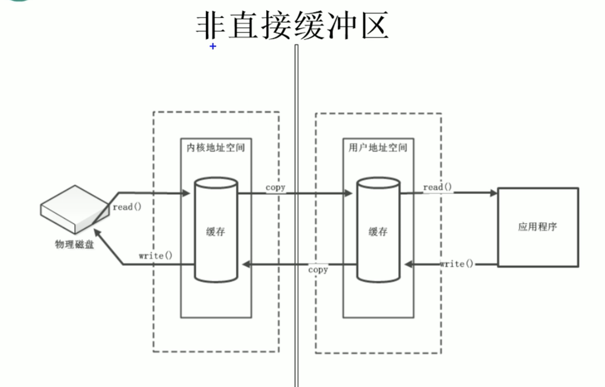
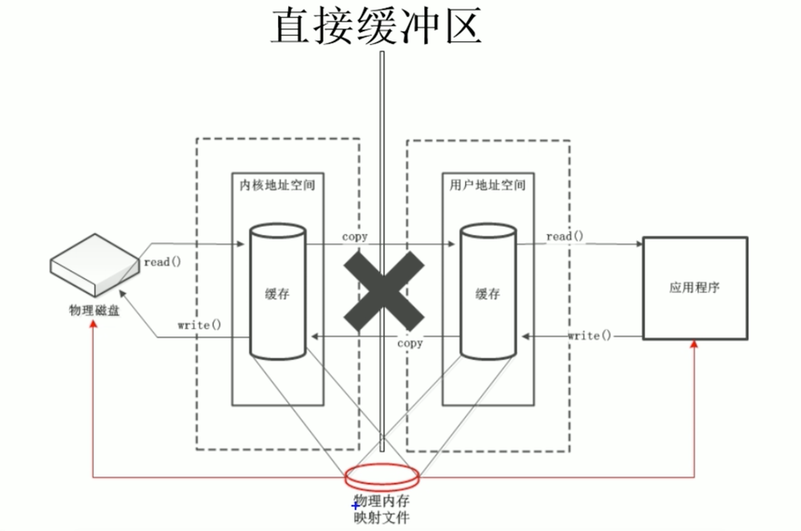

# 直接与非直接缓冲区

- 字节缓冲区要么是直接的，要么是非直接的。如果为直接字节缓冲区，则java虚拟机会尽最大努力直接在此缓冲区上执行为本机I/O操作。也就是说，在每次调用基础操作系统的一个本机I/O操作之前（或之后），虚拟机都会尽量避免将缓冲区的内容复制到中间缓冲区(或从中间缓冲区中复制内容)。
- 直接字节缓冲区可以通过调用此类的`allocateDirect()工厂方法`来创建。此方法返回的缓冲区进行分配和取消分配所需成本通常高于非直接缓冲区。直接缓冲区的内容可以驻留在常规的垃圾回收堆之外，因此，它们对应用程序的内存需求量造成的影响可能并不明显。所以，建议将直接缓冲区主要分配给那些易受基础系统的本机I/O操作影响的大型、持久的缓冲区。一般情况下，最好仅在直接缓冲区能在程序性能方面带来明显好处是分配它们。
- 直接字节缓冲区还可以通过`FileChannel的map()方法`将文件区域直接映射到内存中来创建。该方法返回`MappedByteBuffer`。Java平台的实现有助于通过JNI从本机代码来创建直接字节缓冲区。如果以上这些缓冲区的某个缓冲区实例值的是不可访问的内存区域，则试图访问该区域不会更改该缓冲区的内容，并且将会在访问期间或稍后的某个时间导致抛出不确定的异常。
- 字节缓冲区是直接缓冲区还是非直接缓冲区可通过调用其`isDirect()`方法来确定。提供此方法是为了能够在性能关键型代码中执行显式缓冲区管理。

