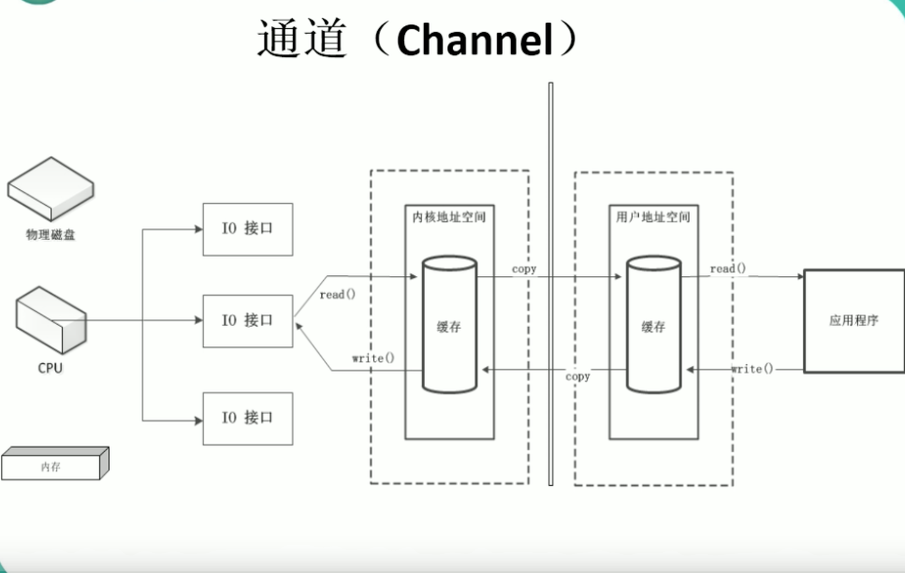
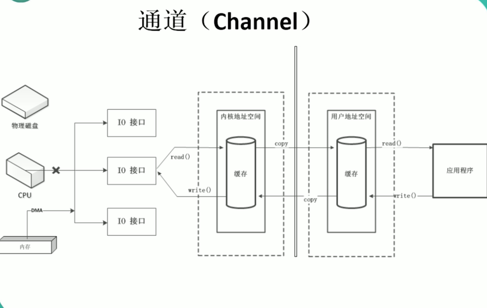
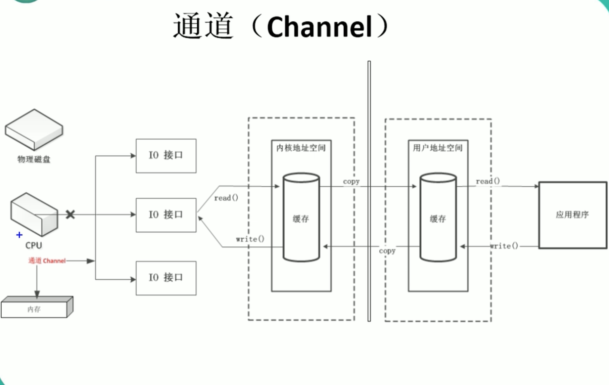

# 通道

## 通道(channel)

由`java.nio.channels包定义的。channel表示IO源与目标打开的连接。channel类似于传统的”流“。只不过Channel本身不能直接访问数据,Channel只能与Buffer进行交互。
下图显示传统的IO接口使用都是由CPU进行控制的

经过改进后，内存有DMA(直接内存申请)进行控制，从而释放CPU资源，提高效率。

但是DMA有一定的限制，在IO使用高时，还是会占用CPU资源，从而使用通道技术，通道是完全独立的处理器


## 代码示例

```java
package nio.test.day01;

import org.junit.Test;

import java.io.FileInputStream;
import java.io.FileOutputStream;
import java.io.RandomAccessFile;
import java.nio.ByteBuffer;
import java.nio.CharBuffer;
import java.nio.MappedByteBuffer;
import java.nio.channels.FileChannel;
import java.nio.charset.Charset;
import java.nio.charset.CharsetDecoder;
import java.nio.charset.CharsetEncoder;
import java.nio.charset.StandardCharsets;
import java.nio.file.Paths;
import java.nio.file.StandardOpenOption;

/**
 * 一、通道(channel)：用于源节点与目标节点的连接。在Java NIO中负责缓冲区中的数据传输。Channel本身不存储数据，因此需要配合缓冲区进行传输。
 *
 * 二、通道的主要实现类
 * java.nio.channels.Channel 接口：
 *          |-- FileChannel
 *          |-- SocketChannel
 *          |-- ServerSocketChannel
 *          |-- DatagramChannel
 *
 *  三、获取通道
 *  1. Java 针对支持通道的类提供getChannel的方法
 *          本地IO：
 *          FileInputStream/FileOutputStream
 *          RandomAccessFile
 *
 *          网络IO：
 *          Socket
 *          ServerSocket
 *          DatagramSocket
 *  2. 在JDK 1.7 中的 NIO.2 针对各个通道提供了静态方法open()
 *  3. 在JDK 1.7 中的 NIO.2 的Files 工具类个的newByteChannel()
 *
 *  四、通道之间的数据传输
 *  transferFrom()
 *  transferTo()
 *
 *  五、分散(Scatter)与聚集(Gather)
 *  分散读取(Scattering Reads)：将通道中的数据分散到多个缓冲区中
 *  聚集写入(Gathering Writes)：将多个缓冲区中的数据聚集到通道中
 *
 *  六、字符集 Charset
 *  编码：字符串 -> 字节数组
 *  解码：字节数组 -> 字符串
 *
 */
public class TestChannel {
    //1. 利用通道完成文件的复制（非直接缓冲区）
    @Test
    public void test1(){
        try (FileInputStream fis = new FileInputStream("1.jpg");
             FileOutputStream fos = new FileOutputStream("2.jpg");
             //1.获取通道
             FileChannel inChannel = fis.getChannel();
             FileChannel outChannel = fos.getChannel()){

            //2.分配指定大小的缓冲区域
            ByteBuffer buffer = ByteBuffer.allocate(1024);

            //3.将通道中的数据存入缓冲区
            while (inChannel.read(buffer) != -1){
                buffer.flip();//切换成读取数据模式
                //4.将缓冲区中的数据写入通道
                outChannel.write(buffer);
                //清空缓冲区
                buffer.clear();
            }
            outChannel.close();
            inChannel.close();
            fos.close();
            fis.close();
        } catch (Exception e) {
            e.printStackTrace();
        }
    }

    //2. 使用直接缓冲区完成完成文件的复制(内存映射文件)
    @Test
    public void test2() throws Exception{
        FileChannel inChannel = FileChannel.open(Paths.get("1.jpg"), StandardOpenOption.READ);
        FileChannel outChannel = FileChannel.open(Paths.get("2.jpg"), StandardOpenOption.WRITE,StandardOpenOption.READ, StandardOpenOption.CREATE_NEW);
        //内存映射文件
        MappedByteBuffer inMapBuffer = inChannel.map(FileChannel.MapMode.READ_ONLY, 0, inChannel.size());
        MappedByteBuffer outMapBuffer = outChannel.map(FileChannel.MapMode.READ_WRITE, 0, inChannel.size());
        //直接对缓冲区进行数据的读写操作
        byte[] dst = new byte[inMapBuffer.limit()];
        inMapBuffer.get(dst);
        outMapBuffer.put(dst);

        inChannel.close();
        outChannel.close();
    }

    //3. 通道之间的数据传输(直接缓冲区)
    @Test
    public void test3() throws Exception{
        FileChannel inChannel = FileChannel.open(Paths.get("1.jpg"), StandardOpenOption.READ);
        FileChannel outChannel = FileChannel.open(Paths.get("2.jpg"), StandardOpenOption.WRITE,StandardOpenOption.READ, StandardOpenOption.CREATE_NEW);

//        inChannel.transferTo(0,inChannel.size(),outChannel);
        outChannel.transferFrom(inChannel,0,inChannel.size());

        inChannel.close();
        outChannel.close();
    }

    //4. 分散和聚集
    public void test4() throws Exception{
        RandomAccessFile raf1 = new RandomAccessFile("1.txt","rw");
        //1.获取通道
        FileChannel channel1 = raf1.getChannel();

        //2.分配指定大小的缓冲区
        ByteBuffer buffer1 = ByteBuffer.allocate(100);
        ByteBuffer buffer2 = ByteBuffer.allocate(1024);

        //3.分散读取
        ByteBuffer[] bufs = {buffer1,buffer2};
        channel1.read(bufs);

        for (ByteBuffer buf : bufs) {
            buf.flip();
        }

        System.out.println(new String(bufs[0].array(),0,bufs[0].limit()));
        System.out.println("--------");
        System.out.println(new String(bufs[1].array(),0,bufs[1].limit()));

        //4.聚集写入
        RandomAccessFile raf2 = new RandomAccessFile("2.txt","rw");
        FileChannel channel2 = raf2.getChannel();
        channel2.write(bufs);
    }

    //字符集
    @Test
    public void test5() throws Exception{
        Charset cs1 = Charset.forName("GBK");

        //获取编码器
        CharsetEncoder ce = cs1.newEncoder();

        //获取解码器
        CharsetDecoder cd = cs1.newDecoder();

        CharBuffer cBuf = CharBuffer.allocate(1024);
        cBuf.append("测试字符集！");
        cBuf.flip();

        //编码
        ByteBuffer bBuf = ce.encode(cBuf);
        for (int i = 0; i < 12; i++) {
            System.out.println(bBuf.get());
        }
        //解码
        bBuf.flip();
        CharBuffer cBuf2 = cd.decode(bBuf);
        System.out.println(cBuf2.toString());
        System.out.println("------------------");
        bBuf.flip();
        Charset cs2 = StandardCharsets.UTF_8;
        CharBuffer cBuf3 = cs2.decode(bBuf);
        System.out.println(cBuf3.toString());
        /*
        -78
        -30
        -54
        -44
        -41
        -42
        -73
        -5
        -68
        -81
        -93
        -95
        测试字符集！
        ------------------
        �����ַ�����*/
    }

}

```
