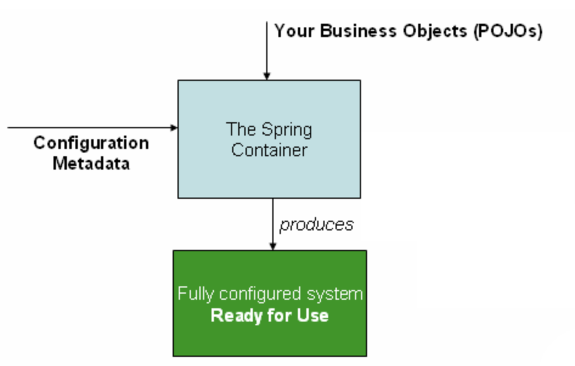

# 二、容器概述

`org.springframework.context.ApplicationContext`接口表示`Spring IoC`容器，并负责实例化，配置和组装`Bean`。 容器通过读取配置元数据来获取有关要实例化，配置和组装哪些对象的指令。 配置元数据以XML，Java注解或Java代码表示。 它使您能够表达组成应用程序的对象以及这些对象之间的丰富相互依赖关系。

`Spring`提供了`ApplicationContext`接口的几种实现。 在独立应用程序中，通常创建`ClassPathXmlApplicationContext`或`FileSystemXmlApplicationContext`的实例。 尽管XML是定义配置元数据的传统格式，但是您可以通过提供少量XML配置来声明性地启用对这些其他元数据格式的支持，从而指示容器将Java注释或代码用作元数据格式。

在大多数应用场景中，不需要显式的用户代码来实例化一个`Spring IoC`容器的一个或多个实例。 例如，在Web应用程序场景中，应用程序的`web.xml`文件中简单的八行（约）样板Web描述符XML通常就足够了（请参阅[Web应用程序的便捷ApplicationContext实例化](https://docs.spring.io/spring/docs/5.2.4.RELEASE/spring-framework-reference/core.html#context-create)）。 如果使用[Spring Tool Suite](https://spring.io/tools/sts)（基于Eclipse的开发环境），则只需单击几次鼠标或击键即可轻松创建此样板配置。

下图显示了Spring的工作原理的高级视图。 您的应用程序类与配置元数据结合在一起，以便在创建和初始化ApplicationContext之后，您将拥有一个完全配置且可执行的系统或应用程序。


## 2.1配置元数据

如上图所示，Spring IoC容器使用一种形式的配置元数据。 此配置元数据表示您作为应用程序开发人员如何告诉Spring容器实例化，配置和组装应用程序中的对象。

传统上，配置元数据以简单直观的XML格式提供，这是本章大部分内容用来传达Spring IoC容器的关键概念和功能的内容。

基于XML的元数据不是配置元数据的唯一允许形式。 Spring IoC容器本身与实际写入此配置元数据的格式完全脱钩。 如今，许多开发人员为他们的Spring应程序选择基于Java的配置。

有关在Spring容器中使用其他形式的元数据的信息，请参见：

- 基于注解配置：Spring 2.5引入了对基于注解的配置元数据的支持。
- 基于Java配置：从Spring 3.0开始，Spring JavaConfig项目提供的许多功能已成为核心Spring Framework的一部分。 因此，您可以使用Java而不XML文件来定义应用程序类外部的bean。 要使用这些新功能，请参见`@Configuration`，`@Bean`，`@Import`和`@DependsOn`注解。

Spring配置由容器必须管理的至少一个（通常是一个以上）bean定义组成。 基于XML的配置元数据将这些bean配置为顶级`<beans/>`元素内的`<bean/>`素。 Java配置通常在`@Configuration`类中使用`@Bean`注释的方法。

这些bean定义对应于组成应用程序的实际对象。 通常，您定义服务层对象，数据访问对象（DAO），表示对象（例如Struts Action实例），基础结构对象（如Hibernate SessionFactories，JMS队列）等等。 通常，不会在容器中配置细粒度的域对象，因为创建和加载域对象通常是DAO和业务逻辑的职责。 是，您可以使用Spring与AspectJ的集成来配置在IoC容器控制之外创建的对象。 请参阅使用AspectJ与Spring依赖注入域对象。

以下示例显示了基于XML的配置元数据的基本结构：

```xml
<?xml version="1.0" encoding="UTF-8"?>
<beans xmlns="http://www.springframework.org/schema/beans"
xmlns:xsi="http://www.w3.org/2001/XMLSchema-instance"
xsi:schemaLocation="http://www.springframework.org/schema/beans
    https://www.springframework.org/schema/beans/spring-beans.xsd">
<bean id="..." class="...">  
    <!-- collaborators and configuration for this bean go here -->
</bean>
<bean id="..." class="...">
    <!-- collaborators and configuration for this bean go here -->
</bean>
<!-- more bean definitions go here -->
</beans>
```

`id`属性是一个标识单个bean定义的字符串。
`class`属性定义bean的类型并使用完全限定的类名。
`id`属性的值是指协作对象。 在此示例中未显示用于引用协作对象的XML。 有关更多信息，请参见依赖项。

## 2.2实例化容器

提供给`ApplicationContext`构造函数的一个或多个位置路径是资源字符串，这些资源字符串使容器可以从各种外部资源（例如本地文件系统，JavaCLASSPATH等）加载配置元数据。

```java
ApplicationContext context = new ClassPathXmlApplicationContext("services.xml", "daos.xml");
```

以下示例显示了服务层对象（services.xml）配置文件：

```xml
<?xml version="1.0" encoding="UTF-8"?>
 <beans xmlns="http://www.springframework.org/schema/beans"
 xmlns:xsi="http://www.w3.org/2001/XMLSchema-instance"
 xsi:schemaLocation="http://www.springframework.org/schema/beans
     https://www.springframework.org/schema/beans/spring-beans.xsd">
 <!-- services -->
 <bean id="petStore" class="org.springframework.samples.jpetstore.services.PetStoreServiceImpl">
        <property name="accountDao" ref="accountDao"/>
        <property name="itemDao" ref="itemDao"/>
        <!-- additional collaborators and configuration for this bean go here -->
    </bean>

    <!-- more bean definitions for services go here -->

    </beans>
```

以下示例显示了数据访问对象daos.xml文件：

```xml
 <?xml version="1.0" encoding="UTF-8"?>
 <beans xmlns="http://www.springframework.org/schema/beans"
 xmlns:xsi="http://www.w3.org/2001/XMLSchema-instance"
 xsi:schemaLocation="http://www.springframework.org/schema/beans
     https://www.springframework.org/schema/beans/spring-beans.xsd">

 <bean id="accountDao"
     class="org.springframework.samples.jpetstore.dao.jpa.JpaAccountDao">
     <!-- additional collaborators and configuration for this bean go here -->
 </bean>

 <bean id="itemDao" class="org.springframework.samples.jpetstore.dao.jpa.JpaItemDao">
     <!-- additional collaborators and configuration for this bean go here -->
 </bean>

 <!-- more bean definitions for data access objects go here -->

 </beans>
```

在前面的示例中，服务层由PetStoreServiceImpl类和两个JpaAccountDao和JpaItemDao类型的数据访问对象组成（基于JPA对象关系映射标准）。 属性名元素引用JavaBean属性的名称，而ref元素引用另一个bean定义的名称。 id和ref元素之间的这种联系表达了协作对象之间的依赖性。 有关配置对象的依存关的详细信息，请参阅依存关系。

**组成基于XML的配置元数据**
使bean定义跨越多个XML文件可能很有用。 通常，每个单独的XML配置文件都代表体系结构中的逻辑层或模块。</br>
您可以使用应用程序上下文构造函数从所有这些XML片段中加载bean定义。 如上一节中所示，此构造函数具有多个Resource位置。 或者，使用一个或多`<import/>`元素从另一个文件中加载bean定义。 以下示例显示了如何执行此操作：

```xml
<beans>
 <import resource="services.xml"/>
 <import resource="resources/messageSource.xml"/>
 <import resource="/resources/themeSource.xml"/>
 <bean id="bean1" class="..."/>
 <bean id="bean2" class="..."/>
 </beans>
```

在前面的示例中，外部bean定义是从三个文件加载的：`services.xml`，`messageSource.xml`和`themeSource.xml`。 所有位置路径都相对于进行导的定义文件，因此`services.xml`必须与进行导入的文件位于同一目录或类路径位置，而`messageSource.xml`和`themeSource.xml`必须位于该位置下的资源位置 导入文件。 如您所见，斜杠被忽略。 但是，鉴于这些路径是相对的，最好不要使用任何斜线。 根据Spring Schema，导入的文件的内容（包括顶`<beans/>`元素）必须是有效的XML bean定义。

可以但不建议使用相对的“ ../”路径引用父目录中的文件。 这样做会创建对当前应用程序外部文件的依赖。 特别是，不建议对`classpath：URL（例如classpath：../ services.xml）`使用此引用，在URL中，运行时解析过程会选择“最近的”类路径根目录，然后查看其父目录。 类路径配置的更改可能导致择其他错误的目录。

您始终可以使用标准资源位置来代替相对路径：例如，`file：C：/config/services.xml`或`classpath：/config/services.xml`。 但是请注意，您在将应用程序的配置耦合到特定的绝对位置。 通常最好对这样的绝对位置保留一个间接寻址，例如通过在运行时针对JVM系统属性解析的“ $ {…}”占位符。

命名空间本身提供了导入指令功能。 Spring所提供的一系列XML名称空间（例如，上下文和util名称空间）中提供了超出普通bean定义的其他配置功能。

## 2.3使用容器

`ApplicationContext`是高级工厂的接口，该工厂能够维护不同bean及其依赖关系的注册表。 通过使用方法`T getBean（String name，Class <T>requiredType）`，可以检索bean的实例。

通过`ApplicationContext`，您可以读取和定义Bean定义，如以下示例所示：

```java
// create and configure beans
 ApplicationContext context = new ClassPathXmlApplicationContext("services.xml", "daos.xml");
 // retrieve configured instance
 PetStoreService service = context.getBean("petStore", PetStoreService.class);
 // use configured instance
 List<String> userList = service.getUsernameList();
```

最灵活的变体是`GenericApplicationContext`与读取器委托结合使用，例如，与XML文件的`XmlBeanDefinitionReader`结合使用，如以下示例所示：

```java
 GenericApplicationContext context = new GenericApplicationContext();
 new XmlBeanDefinitionReader(context).loadBeanDefinitions("services.xml", "daos.xml");
 context.refresh();
```

您可以在同一`ApplicationContext`上混合和匹配此类阅读器委托，从不同的配置源读取Bean定义。

然后，您可以使用getBean检索bean的实例。 `ApplicationContext`接口还有其他几种检索bean的方法，但是理想情况下，您的应用程序代码永远不要使用它们。 实际上，您的应用程序代码应该根本不调用`getBean（）`方法，因此完全不依赖于`Spring API`。 例如，Spring与Web框架的集成为各种Web框架组件（例如控制器和JSF托管的bean）提供了依赖注入，从而使您可以通过元数据（例如自动装配注释）声明对特定bean的依赖。
