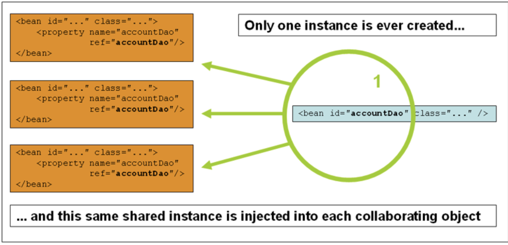
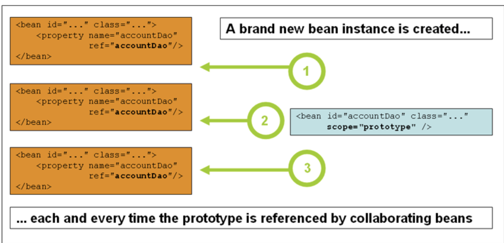

# 五、Bean作用域

创建bean定义时，将创建一个配方来创建该bean定义所定义的类的实际实例。bean定义是配方的想法很重要，因为它意味着与类一样，您可以从一个配方中创建许多对象实例。
您不仅可以控制要插入到从特定be an定义创建的对象中的各种依赖项和配置值，还可以控制从特定bean定义创建的对象的范围。这种方法功能强大且灵活，因为您可以选择通过配置创建的对象的范围，而不必在Java类级别烘焙对象的范围。bean可以定义为部署在多个作用域中的一个。Spring框架支持六个作用域，其中四个作用域只有在使用支持web的ApplicationContext时才可用。您还可以创建自定义范围。
下表描述了支持的作用域：
|作用域|描述|
|---|---|
|singleton|（默认）为每个Spring IoC容器将单个bean定义限定为单个对象实例。|
|prototype|将单个bean定义的作用域限定为任意数量的对象实例。|
|request|将单个bean定义限定为单个HTTP请求的生命周期。也就是说，每个HTTP请求都有自己的bean实例，该实例是在单个bean定义的后面创建的。仅在支持web的Spring`ApplicationContext`中有效。|
|session|将单个bean定义限定为HTTP会话的生命周期。仅在支持web的Spring`ApplicationContext`中有效。|
|application|将单个bean定义限定为ServletContext的生命周期。仅在支持web的Spring`ApplicationContext`中有效。|
|websocket|将单个bean定义限定为WebSocket的生命周期。仅在支持web的Spring`ApplicationContext`中有效。|

从Spring3.0开始，线程作用域可用，但默认情况下不注册。有关更多信息，请参阅SimpleThreadScope的文档。有关如何注册此自定义范围或任何其他自定义范围的说明，请参阅使用自定义范围。

## 5.1(Singleton)单例作用域

只管理一个单例bean的共享实例，所有对ID或ID与该bean定义匹配的bean的请求都会导致Spring容器返回一个特定的bean实例。
换句话说，当您定义一个bean定义，并且它的作用域是一个singleton时，Spring IoC容器正好创建了该bean定义所定义对象的一个实例。这个单实例存储在这样的单例bean的缓存中，该命名bean的所有后续请求和引用都返回缓存的对象。下图显示了单例作用域的工作方式：

Spring的singleton bean概念不同于Gang of Four（GoF）模式书中定义的singleton模式。GoF singleton硬编码对象的范围，以便每个类加载器只创建一个特定类的实例。Spring singleton的范围最好描述为每个容器和每个bean。这意味着，如果为单个Spring容器中的特定类定义一个bean，那么Spring容器将创建该bean定义的类的一个且仅创建一个实例。singleton作用域是Spring中的默认作用域。要在XML中将bean定义为单例，可以定义bean，如下例所示：

```xml
<bean id="accountService" class="com.something.DefaultAccountService"/>

<!-- the following is equivalent, though redundant (singleton scope is the default) -->
<bean id="accountService" class="com.something.DefaultAccountService" scope="singleton"/>
```

## 5.2(Prototype)原型作用域

每次对特定bean提出请求时，bean部署的非单一原型范围都会导致创建一个新bean实例。 也就是说，该Bean被注入到另一个Bean中，或者您可以通过容器上的getBean（）方法调用来请求它。 通常，应将原型作用域用于所有有状态Bean，将单例作用域用于无状态Bean。
下图说明了Spring原型范围：

（数据访问对象（DAO）通常不配置为原型，因为典型的DAO不包含任何会话状态。我们更容易重用单例的核心。）

以下示例将bean定义为XML原型：

```xml
<bean id="accountService" class="com.something.DefaultAccountService" scope="prototype"/>
```

与其他范围不同，Spring不管理原型bean的完整生命周期。容器实例化、配置和以其他方式组装原型对象并将其交给客户机，而不再记录该原型实例。因此，尽管初始化生命周期回调方法在所有对象上都被调用，不管其作用域如何，但对于原型，配置的销毁生命周期回调不会被调用。客户机代码必须清理原型作用域对象并释放原型bean所拥有的昂贵资源。要让Spring容器释放原型作用域bean所拥有的资源，请尝试使用自定义bean后处理器，该处理器保存对需要清理的bean的引用。

在某些方面，Spring容器在原型作用域bean中的角色是Java new操作符的替代品。超过该点的所有生命周期管理都必须由客户机处理。（有关Spring容器中bean生命周期的详细信息，请参阅生命周期回调。）

## 5.3单例Bean与原型Bean依赖关系

当您在原型bean上使用具有依赖关系的单例作用域bean时，请注意依赖关系是在实例化时解析的。因此，如果依赖项将原型作用域bean注入单例作用域bean，则会实例化一个新的原型bean，然后将依赖项注入单例作用域bean。原型实例是唯一提供给单例作用域bean的实例。
但是，假设您希望单例作用域bean在运行时重复获取原型作用域bean的新实例。依赖项不能将原型作用域bean注入到单例bean中，因为该注入仅在Spring容器实例化单例bean并解析和注入其依赖项时发生一次。如果在运行时多次需要原型bean的新实例，请参见方法注入

## 5.4Request,Session,Application和WebSocket 作用域

`request`, `session`, `application`和`websocket`作用域只有在使用支持web的Spring ApplicationContext实现（例如XmlWebApplicationContext）时才可用。如果将这些作用域与常规Spring IoC容器（如ClassPathXmlApplicationContext）一起使用，则会引发一个IllegalStateException，该异常抛出一个未知的bean作用域。

**初始Web配置**
`request`, `session`, `application`和`websocket`级别（web范围的bean）支持bean的作用域，在定义bean之前需要一些小的初始配置。（对于标准作用域：`singleton`和`prototype`，此初始设置不是必需的。）

如何完成初始设置取决于特定的Servlet环境。

如果在`Spring Web MVC`中访问作用域bean，实际上，在`Spring DispatcherServlet`处理的请求中，不需要特殊设置。`DispatcherServlet`已公开所有相关状态。

如果使用`Servlet2.5Web`容器，请求在Spring的DispatcherServlet之外处理（例如，当使用JSF或Struts时），则需要注册`org.springframework.web.context.request.RequestContextListener` `ServletRequestListener`。对于Servlet3.0+，这可以通过使用`WebApplicationInitializer`接口以编程方式完成。或者，对于较旧的容器，将以下声明添加到web应用程序的web.xml文件中：

```xml
<web-app>
    ...
    <listener>
        <listener-class>
            org.springframework.web.context.request.RequestContextListener
        </listener-class>
    </listener>
    ...
</web-app>
```

或者，如果侦听器设置有问题，请考虑使用Spring的RequestContextFilter。过滤器映射取决于周围的web应用程序配置，因此必须根据需要对其进行更改。下面的列表显示了web应用程序的筛选部分：

```xml
<web-app>
    ...
    <filter>
        <filter-name>requestContextFilter</filter-name>
        <filter-class>org.springframework.web.filter.RequestContextFilter</filter-class>
    </filter>
    <filter-mapping>
        <filter-name>requestContextFilter</filter-name>
        <url-pattern>/*</url-pattern>
    </filter-mapping>
    ...
</web-app>
```

`DispatcherServlet`、`RequestContextListener`和`RequestContextFilter`都执行完全相同的操作，即将HTTP请求对象绑定到为该请求提供服务的线程。这使得请求和会话作用域的bean可以在调用链的更下游使用。

**Request作用域**
考虑以下bean定义的XML配置：

```xml
<bean id="loginAction" class="com.something.LoginAction" scope="request"/>
```

Spring容器通过为每个HTTP请求使用LoginAction bean定义来创建LoginAction bean的新实例。也就是说，loginAction bean的作用域是HTTP请求级别。您可以随心所欲地更改创建的实例的内部状态，因为从同一个loginAction bean定义创建的其他实例看不到这些状态更改。它们是特定于个人请求的。当请求完成处理时，将丢弃作用域为请求的bean。

当使用注解驱动组件或Java配置时，`@RequestScope`注释可用于将组件分配给请求作用域。下面的示例演示了如何执行此操作：

```java
@RequestScope
@Component
public class LoginAction {
    // ...
}
```

**Session作用域**
考虑以下bean定义的XML配置：

```xml
<bean id="userPreferences" class="com.something.UserPreferences" scope="session"/>
```

Spring容器通过在单个HTTP会话的生命周期中使用`UserPreferences bean`定义来创建`userpreferencesbean`的新实例。换句话说，`userPreferences bean`的作用域实际上是在HTTP会话级别。与请求作用域bean一样，您可以根据需要更改所创建实例的内部状态，因为您知道其他也在使用从相同的`userPreferences bean`定义创建的实例的HTTP会话实例不会看到这些状态更改，因为它们是特定于单个HTTP会话的。当HTTP会话最终被丢弃时，作用域为该特定HTTP会话的bean也将被丢弃。

使用注解驱动组件或Java配置时，可以使用`@SessionScope`注释将组件分配给会话作用域。

```java
@SessionScope
@Component
public class UserPreferences {
    // ...
}
```

**Application作用域**
考虑以下bean定义的XML配置：

```xml
<bean id="appPreferences" class="com.something.AppPreferences" scope="application"/>
```

Spring容器为整个web应用程序使用`AppPreferences bean`定义一次，从而创建`apppreferencesbean`的新实例。也就是说，`appPreferences bean`的作用域是在`ServletContext`级别，并存储为常规`ServletContext`属性。这有点类似于`Spring singleton bean`，但在两个重要方面有所不同：它是每个`ServletContext`的`singleton`，而不是每个`Spring“ApplicationContext”（在任何给定的web应用程序中可能有多个）的singleton`，它实际上是公开的，因此是作为`ServletContext`属性可见的。

使用注解驱动组件或Java配置时，可以使用`@ApplicationScope`注解将组件分配给应用程序范围。下面的示例演示了如何执行此操作：

```java
@ApplicationScope
@Component
public class AppPreferences {
    // ...
}
```

**作用域Beas最为依赖项**
Spring IoC容器不仅管理对象（bean）的实例化，还管理协作者（或依赖项）的连接。如果您想（例如）将一个HTTP请求作用域bean注入到另一个更长寿作用域的bean中，您可以选择插入一个AOP代理来代替作用域bean。也就是说，您需要插入一个代理对象，该对象公开与作用域对象相同的公共接口，但也可以从相关作用域（如HTTP请求）检索真正的目标对象，并将方法调用委托给真正的对象。

您还可以在作用域为singleton的bean之间使用`<aop:scoped-proxy/>`，然后通过一个可序列化的中间代理，从而能够在反序列化时重新获取目标singleton bean。
当针对作用域bean原型声明`<aop:scoped-proxy/>`时，共享代理上的每个方法调用都会导致创建一个新的目标实例，然后将调用转发到该实例。
此外，作用域代理并不是以生命周期安全的方式从较短作用域访问bean的唯一方法。您还可以将注入点（即构造函数或setter参数或autowired字段）声明为`ObjectFactory<MyTargetBean>`，允许`getObject（）`调用在每次需要时按需检索当前实例，而无需保留实例或单独存储实例。
作为扩展变量，您可以声明`ObjectProvider<MyTargetBean>`，它提供了几个额外的访问变量，包括`getIfAvailable`和`getIfUnique`。
它的JSR-330变体称为`Provider`，用于`Provider<MyTargetBean>`声明和每次检索尝试的相应`get（）`调用。有关JSR-330的更多详细信息，请参见此处。

以下示例中的配置仅为一行，但了解其背后的“为什么”和“如何”很重要：

```xml
<?xml version="1.0" encoding="UTF-8"?>
<beans xmlns="http://www.springframework.org/schema/beans"
    xmlns:xsi="http://www.w3.org/2001/XMLSchema-instance"
    xmlns:aop="http://www.springframework.org/schema/aop"
    xsi:schemaLocation="http://www.springframework.org/schema/beans
        https://www.springframework.org/schema/beans/spring-beans.xsd
        http://www.springframework.org/schema/aop
        https://www.springframework.org/schema/aop/spring-aop.xsd">

    <!-- an HTTP Session-scoped bean exposed as a proxy -->
    <bean id="userPreferences" class="com.something.UserPreferences" scope="session">
        <!-- instructs the container to proxy the surrounding bean -->
        <aop:scoped-proxy/> ①
    </bean>

    <!-- a singleton-scoped bean injected with a proxy to the above bean -->
    <bean id="userService" class="com.something.SimpleUserService">
        <!-- a reference to the proxied userPreferences bean -->
        <property name="userPreferences" ref="userPreferences"/>
    </bean>
</beans>
```

① 定义代理的行。
要创建这样的代理，您可以将子`<aop:scoped-proxy/>`元素插入到`scoped bean`定义中（请参见选择要创建的代理类型和基于XML模式的配置）。为什么在request、session和自定义作用域级别定义作用域的bean需要`<aop:scoped-proxy/>`元素？考虑下面的`singleton bean`定义，并将其与您需要为上述作用域定义的内容进行对比（注意下面的`userPreferences bean`定义是不完整的）：

```xml
<bean id="userPreferences" class="com.something.UserPreferences" scope="session"/>

<bean id="userManager" class="com.something.UserManager">
    <property name="userPreferences" ref="userPreferences"/>
</bean>
```

在前面的例子中，单例`bean（userManager）`被注入了对HTTP会话范围`bean（userPreferences）`的引用。这里的要点是，`userManager bean`是一个单例：每个容器只实例化一次，并且它的依赖项（在本例中只有一个，`userpreferencesbean`）也只注入一次。这意味着`userManager bean`只对完全相同的`userPreferences`对象（即最初注入它的对象）操作。

当将一个生存期较短的作用域bean注入到一个生存期较长的作用域bean中时（例如，将一个HTTP会话作用域协作bean作为依赖项注入到`singleton bean`中），这不是您想要的行为。相反，您需要一个单独的userManager对象，并且在HTTP会话的生命周期中，您需要一个特定于HTTP会话的userPreferences对象。因此，容器创建一个对象，该对象公开与`UserPreferences`类完全相同的公共接口（理想情况下是一个`UserPreferences`实例的对象），该对象可以从作用域机制（HTTP请求、会话等）获取真正的UserPreferences对象。容器将此代理对象注入到`userManager bean`中，而`userManager bean`不知道此`UserPreferences`引用是代理。在本例中，当一个`UserManager`实例调用依赖注入的`UserPreferences`对象上的方法时，它实际上是在代理上调用一个方法。然后，代理从（在本例中）HTTP会话获取真实的`UserPreferences`对象，并将方法调用委托给检索到的真实`UserPreferences`对象。

因此，在将请求和会话范围的bean注入协作对象时，需要以下配置（正确且完整），如下例所示：

```xml
<bean id="userPreferences" class="com.something.UserPreferences" scope="session">
    <aop:scoped-proxy/>
</bean>

<bean id="userManager" class="com.something.UserManager">
    <property name="userPreferences" ref="userPreferences"/>
</bean>
```

**选择要创建的代理类型**
默认情况下，当Spring容器为用`<aop:scoped-proxy/>`元素标记的bean创建代理时，将创建一个基于CGLIB的类代理。

CGLIB代理只拦截公共方法调用！不要对这样的代理调用非公共方法。它们不会委托给实际作用域的目标对象。

或者，您可以配置Spring容器，通过为`<aop:scoped-proxy/>`元素的`proxy-target-class`属性的值指定false，为此类作用域bean创建基于JDK接口的标准代理。使用基于JDK接口的代理意味着您不需要应用程序类路径中的其他库来影响这种代理。然而，这也意味着作用域bean的类必须实现至少一个接口，并且作用域bean被注入的所有协作者必须通过其接口之一引用bean。以下示例显示基于接口的代理：

```xml
<!-- DefaultUserPreferences implements the UserPreferences interface -->
<bean id="userPreferences" class="com.stuff.DefaultUserPreferences" scope="session">
    <aop:scoped-proxy proxy-target-class="false"/>
</bean>

<bean id="userManager" class="com.stuff.UserManager">
    <property name="userPreferences" ref="userPreferences"/>
</bean>
```

有关选择基于类或基于接口的代理的详细信息，请参见代理机制。

## 5.5自定义作用域

bean作用域机制是可扩展的。您可以定义自己的作用域，甚至可以重新定义现有的作用域，尽管后者被认为是不好的做法，并且您不能重写内置的单例作用域和原型作用域。

**创建自定义作用域**
要将自定义作用域集成到Spring容器中，需要实现`org.springframework.beans.factory.config.Scope`接口，本节将对此进行描述。有关如何实现自己的作用域的想法，请参阅随Spring框架本身和`Scope javadoc`一起提供的作用域实现，其中详细解释了需要实现的方法。

Scope接口有四个方法从作用域中获取对象，从作用域中移除它们，并让它们被销毁。

例如，会话作用域实现返回会话作用域bean（如果它不存在，则该方法在将bean绑定到会话以供将来引用后返回该bean的新实例）。以下方法从基础作用域返回对象：

```java
Object get(String name, ObjectFactory<?> objectFactory)
```

例如，会话作用域实现从底层会话中移除会话作用域bean。应该返回对象，但如果找不到具有指定名称的对象，则可以返回null。以下方法将对象从基础作用域中移除：

```java
Object remove(String name)
```

以下方法注册在作用域被销毁或作用域中的指定对象被销毁时应执行的回调：

```java
void registerDestructionCallback(String name, Runnable destructionCallback)
```

有关销毁回调的更多信息，请参阅javadoc或Spring范围实现。
以下方法获取基础作用域的会话标识符：

```java
String getConversationId()
```

每个作用域的标识符都不同。对于会话范围的实现，此标识符可以是会话标识符。

**使用自定义作用域**
在编写和测试一个或多个自定义作用域实现之后，您需要让Spring容器知道您的新作用域。以下方法是向Spring容器注册新作用域的中心方法：

```java
void registerScope(String scopeName, Scope scope);
```

此方法在`ConfigurableBeanFactory`接口上声明，该接口可通过Spring附带的大多数具体`ApplicationContext`实现上的`BeanFactory`属性获得。
`registerScope（..）`方法的第一个参数是与作用域关联的唯一名称。Spring容器本身中的这些名称的例子是`singleton`和`prototype`。`registerScope（..）`方法的第二个参数是要注册和使用的自定义作用域实现的实际实例。

假设您编写了自定义范围实现，然后按照下一个示例所示注册它。
下一个例子使用SimpleThreadScope，它包含在Spring中，但默认情况下没有注册。对于您自己的自定义作用域实现，这些说明将是相同的。

```java
Scope threadScope = new SimpleThreadScope();
beanFactory.registerScope("thread", threadScope);
```

然后，您可以创建符合自定义范围的作用域规则的bean定义，如下所示：

```xml
<bean id="..." class="..." scope="thread">
```

对于自定义作用域实现，您不限于作用域的编程注册。您还可以使用`CustomScopeConfigurer`类以声明方式进行作用域注册，如下例所示：

```xml
<?xml version="1.0" encoding="UTF-8"?>
<beans xmlns="http://www.springframework.org/schema/beans"
    xmlns:xsi="http://www.w3.org/2001/XMLSchema-instance"
    xmlns:aop="http://www.springframework.org/schema/aop"
    xsi:schemaLocation="http://www.springframework.org/schema/beans
        https://www.springframework.org/schema/beans/spring-beans.xsd
        http://www.springframework.org/schema/aop
        https://www.springframework.org/schema/aop/spring-aop.xsd">

    <bean class="org.springframework.beans.factory.config.CustomScopeConfigurer">
        <property name="scopes">
            <map>
                <entry key="thread">
                    <bean class="org.springframework.context.support.SimpleThreadScope"/>
                </entry>
            </map>
        </property>
    </bean>

    <bean id="thing2" class="x.y.Thing2" scope="thread">
        <property name="name" value="Rick"/>
        <aop:scoped-proxy/>
    </bean>

    <bean id="thing1" class="x.y.Thing1">
        <property name="thing2" ref="thing2"/>
    </bean>

</beans>
```

在`FactoryBean`实现中放置`<aop:scoped-proxy/>`时，作用域是factory bean本身，而不是从`getObject（）`返回的对象。
