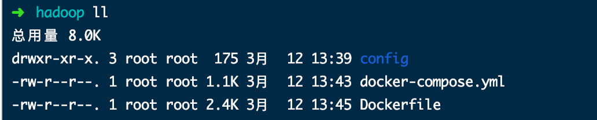
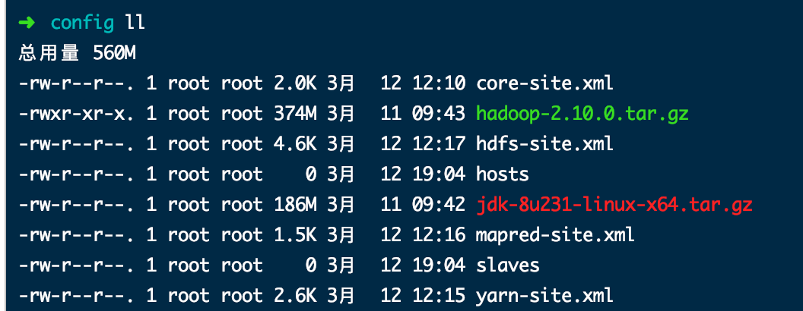

# Docker 搭建Hadoop HA（高可用）

## 架构设计

每个Docker容器运行一个服务，总体分为2个`namenode`，2个`resourcemanager`，3个`datanode`,3个`journalnode`,3个`zookeeper`。
每个容器配置如下：

1. namenode1 172.18.12.1
2. namenode2 172.18.12.2
3. resourcemanager1 172.18.12.3
4. resourcemanager2 172.18.12.4
5. datanode1 172.18.12.5
6. datanode2 172.18.12.6
7. datanode3 172.18.12.7
8. jnnode01 172.18.12.8
9. jnnode01 172.18.12.9
10. jnnode03 172.18.12.10
11. zoo1 172.18.12.11
12. zoo2 172.18.12.12
13. zoo3 172.18.12.13

## 准备所需的安装包与所需资源

1. JDK8 安装包`jdk-8u231-linux-x64.tar.gz`
2. Hadoop 安装包`hadoop-2.10.0.tar.gz`
3. 事先配置好的Hadoop配置文件
   - **core-site.xml**

    ```xml
    <?xml version="1.0" encoding="UTF-8"?>
    <?xml-stylesheet type="text/xsl" href="configuration.xsl"?>
    <configuration>
    <property>
        <name>fs.defaultFS</name>
        <value>hdfs://hadoop-ha</value>
        <description> hdfs 地址，ha中是连接到nameservice </description>
    </property>

    <property>
        <name>hadoop.tmp.dir</name>
        <value>/mnt/hadoop/dfs/data</value>
        <description> 指定hadoop临时目录,默认在/tmp/{$user}目录下，不安全，每次开机都会被清空 </description>
    </property>

    <property>
        <name>ha.zookeeper.quorum</name>
        <value>zoo1:2181,zoo2:2181,zoo3:2181</value>
        <description> 指定zookeeper地址 </description>
    </property>

    <property>
        <name>ha.zookeeper.session-timeout.ms</name>
        <value>30000</value>
        <description>hadoop链接zookeeper的超时时长设置(ms)</description>
    </property>

    <property>
            <name>io.file.buffer.size</name>
            <value>131072</value>
            <description>设置缓存的大小</description>
    </property>
    </configuration>
    ```

   - hdfs-site.xml

    ```xml
    <?xml version="1.0" encoding="UTF-8"?>
    <?xml-stylesheet type="text/xsl" href="configuration.xsl"?>
    <configuration>
    <property>
            <name>dfs.nameservices</name>
            <value>hadoop-ha</value>
            <description>为namenode集群定义一个services name</description>
    </property>

    <property>
            <name>dfs.ha.namenodes.hadoop-ha</name>
            <value>nn1,nn2</value>
            <description>nameservice 包含哪些namenode，为各个namenode起名</description>
    </property>

    <property>
            <name>dfs.namenode.rpc-address.hadoop-ha.nn1</name>
            <value>namenode1:9000</value>
            <description>名为nn1的namenode 的rpc地址和端口号，rpc用来和datanode通讯</description>
    </property>

    <property>
            <name>dfs.namenode.rpc-address.hadoop-ha.nn2</name>
            <value>namenode2:9000</value>
            <description>名为nn2的namenode 的rpc地址和端口号，rpc用来和datanode通讯</description>
    </property>

    <property>
            <name>dfs.namenode.http-address.hadoop-ha.nn1</name>
            <value>namenode1:50070</value>
            <description>名为nn1的namenode 的http地址和端口号，web客户端</description>
    </property>

    <property>
            <name>dfs.namenode.http-address.hadoop-ha.nn2</name>
            <value>namenode2:50070</value>
            <description>名为nn2的namenode 的http地址和端口号，web客户端</description>
    </property>

    <property>
            <name>dfs.namenode.shared.edits.dir</name>
            <value>qjournal://jnnode01:8485;jnnode02:8485;jnnode03:8485/hadoop-ha</value>
            <description>namenode间用于共享编辑日志的journal节点列表，该url的配置格式：qjournal://host1:port1;host2:port2;host3:port3/journalId，journalId推荐使用nameservice，默认端口号是：8485</description>
    </property>

    <property>
            <name>dfs.journalnode.edits.dir</name>
            <value>/mnt/hadoop/journal/data</value>
            <description>journalnode 上用于存放edits日志的目录</description>
    </property>

    <property>
            <name>dfs.client.failover.proxy.provider.hadoop-ha</name>
            <value>org.apache.hadoop.hdfs.server.namenode.ha.ConfiguredFailoverProxyProvider</value>
            <description>客户端连接可用状态的NameNode所用的代理类</description>
    </property>

    <property>
            <name>dfs.ha.fencing.methods</name>
            <value>
                    sshfence
                    shell(/bin/true)
            </value>
            <description>配置隔离机制方法，多个机制用换行分割，即每个机制暂用一行</description>
    </property>

     <property>
        <name>dfs.ha.fencing.ssh.connect-timeout</name>
        <value>30000</value>
        <description>配置sshfence隔离机制超时时间</description>
    </property>

    <property>
            <name>ha.failover-controller.cli-check.rpc-timeout.ms</name>
            <value>60000</value>
            <description>配置sshfence隔离机制超时时间</description>
    </property>

    <property>
        <name>dfs.ha.fencing.ssh.private-key-files</name>
        <value>/.ssh/id_rsa</value>
        <description>使用sshfence隔离机制时需要ssh免登陆</description>
    </property>

    <property>
        <name>dfs.qjournal.start-segment.timeout.ms</name>
        <value>60000</value>
        <description>journalnode集群之间通信的超时时间</description>
    </property>

    <property>
            <name>dfs.replication</name>
            <value>2</value>
            <description>指定副本数 </description>
    </property>

    <property>
            <name>dfs.block.size</name>
            <value>134217728</value>
            <description>设置block大小是128M</description>
    </property>

    <property>
            <name>dfs.ha.automatic-failover.enabled</name>
            <value>true</value>
            <description>开启NameNode失败自动切换</description>
    </property>

    <property>
            <name>dfs.webhdfs.enabled</name>
            <value>true</value>
            <description>启用webhdfs</description>
    </property>
    </configuration>
    ```

   - mapred-site.xml

    ```xml
    <?xml version="1.0"?>
    <?xml-stylesheet type="text/xsl" href="configuration.xsl"?>
    <configuration>
    <property>
        <name>mapreduce.framework.name</name>
        <value>yarn</value>
        <description>指定mr框架为yarn方式 </description>
    </property>

    <!-- 历史日志服务jobhistory相关配置 -->
    <property>
        <name>mapreduce.jobhistory.address</name>
        <value>resourcemanager1:10020</value>
        <description>历史服务器端口号</description>
    </property>

    <property>
        <name>mapreduce.jobhistory.webapp.address</name>
        <value>resourcemanager1:19888</value>
        <description>历史服务器的WEB UI端口号</description>
    </property>

    <property>
        <name>mapreduce.jobhistory.joblist.cache.size</name>
        <value>2000</value>
        <description>内存中缓存的historyfile文件信息(主要是job对应的文件目录)</description>
    </property>
    </configuration>
    ```

   - yarn-site.xml

    ```xml
    <?xml version="1.0"?>
    <configuration>
    <property>
        <name>yarn.nodemanager.aux-services</name>
        <value>mapreduce_shuffle</value>
        <description>NodeManager上运行的附属服务，需配置成mapreduce_shuffle，才可运行MapReduce程序</description>
    </property>

    <property>
            <name>yarn.log-aggregation-enable</name>
            <value>true</value>
            <description>开启日志聚合 </description>
    </property>

    <property>
            <name>yarn.nodemanager.remote-app-log-dir</name>
            <value>hdfs://hadoop-ha/user/hpe/yarn-logs/</value>
            <description>日志聚合HDFS目录</description>
    </property>

    <property>
        <name>yarn.log.server.url</name>
        <value>http://namenode1:19888/jobhistory/logs/</value>
        <description>为日志聚合服务器URL</description>
    </property>

    <property>
            <name>yarn.log-aggregation.retain-seconds</name>
            <value>259200</value>
            <description>日志保存时间3days,单位秒</description>
    </property>

    <property>
        <name>yarn.resourcemanager.ha.enabled</name>
        <value>true</value>
        <description>启用resourcemanager的ha功能</description>
    </property>

    <property>
        <name>yarn.resourcemanager.cluster-id</name>
        <value>yarn-cluster</value>
        <description>为resourcemanage ha 集群起个id</description>
    </property>

    <property>
        <name>yarn.resourcemanager.ha.rm-ids</name>
        <value>rm1,rm2</value>
        <description>指定resourcemanger ha 有哪些节点名</description>
    </property>

    <property>
        <name>yarn.resourcemanager.hostname.rm1</name>
        <value>resourcemanager1</value>
        <description>指定第一个节点的所在机器</description>
    </property>

    <property>
        <name>yarn.resourcemanager.hostname.rm2</name>
        <value>resourcemanager2</value>
        <description>指定第二个节点所在机器</description>
    </property>

    <property>
            <name>yarn.resourcemanager.webapp.address.rm1</name>
            <value>${yarn.resourcemanager.hostname.rm1}:8088</value>
            <description>HTTP访问的端口号</description>
    </property>

    <property>
            <name>yarn.resourcemanager.webapp.address.rm2</name>
            <value>${yarn.resourcemanager.hostname.rm2}:8088</value>
            <description>HTTP访问的端口号</description>
    </property>

    <property>
        <name>yarn.resourcemanager.zk-address</name>
        <value>zoo1:2181,zoo2:2181,zoo3:2181</value>
        <description>指定resourcemanger ha 所用的zookeeper 节点</description>
    </property>

    <property>
        <name>yarn.resourcemanager.recovery.enabled</name>
        <value>true</value>
        <description>配置支持ResourceManager重启过程中，不影响正在运行的作业</description>
    </property>

    <property>
        <name>yarn.resourcemanager.store.class</name>
        <value>org.apache.hadoop.yarn.server.resourcemanager.recovery.ZKRMStateStore</value>
        <description>制定resourcemanager的状态信息存储在zookeeper集群上</description>
    </property>
    </configuration>
    ```

4. 准备slaves文件

   ```no
    datanode1
    datanode2
    datanode3
   ```

5. 准备hosts文件

   ```no
    namenode1   172.18.12.1
    namenode2   172.18.12.2
    resourcemanager1    172.18.12.3
    resourcemanager2    172.18.12.4
    datanode1   172.18.12.5
    datanode2   172.18.12.6
    datanode3   172.18.12.7
    jnnode01    172.18.12.8
    jnnode01    172.18.12.9
    jnnode03    172.18.12.10
    zoo1    172.18.12.11
    zoo2    172.18.12.12
    zoo3    172.18.12.13
   ```

6. 准备容器网络
   `docker network create --driver bridge --subnet=172.18.12.0/16 --gateway=172.18.1.1 hadoopnet`

7. 准备zookeeper docker-compose文件

   ```yml
   version: '3.1'
    services:
    zoo1:
        image: zookeeper
        restart: always
        privileged: true
        hostname: zoo1
        ports:
        - 2181:2181
        environment:
        ZOO_MY_ID: 1
        ZOO_SERVERS: server.1=zoo1:2888:3888;2181 server.2=zoo2:2888:3888;2181 server.3=zoo3:2888:3888;2181
        networks:
        default:
            ipv4_address: 172.18.12.11

    zoo2:
        image: zookeeper
        restart: always
        privileged: true
        hostname: zoo2
        ports:
        - 2182:2181
        environment:
        ZOO_MY_ID: 2
        ZOO_SERVERS: server.1=zoo1:2888:3888;2181 server.2=zoo2:2888:3888;2181 server.3=zoo3:2888:3888;2181
        networks:
        default:
            ipv4_address: 172.18.12.12

    zoo3:
        image: zookeeper
        restart: always
        privileged: true
        hostname: zoo3
        ports:
        - 2183:2181
        environment:
        ZOO_MY_ID: 3
        ZOO_SERVERS: server.1=zoo1:2888:3888;2181 server.2=zoo2:2888:3888;2181 server.3=zoo3:2888:3888;2181
        networks:
        default:
            ipv4_address: 172.18.12.13

    networks: # 自定义网络
    default:
        external:
        name: hadoopnet
   ```

## 编写dockerfile文件构建镜像

```shell
FROM centos:7

#复制解压JDK与Hadoop包
COPY ["config/jdk-8u231-linux-x64.tar.gz","config/hadoop-2.10.0.tar.gz","/usr/local/"]
RUN tar -zxvf /usr/local/jdk-8u231-linux-x64.tar.gz -C /usr/local/ && \
        tar -zxvf/usr/local/hadoop-2.10.0.tar.gz -C /usr/local/ && \
        mv /usr/local/jdk1.8.0_231 /usr/local/jdk1.8 && mv /usr/local/hadoop-2.10.0 /usr/local/hadoop && \
        mkdir -p /mnt/hadoop/dfs/name && mkdir -p /mnt/hadoop/dfs/data && mkdir -p /mnt/hadoop/journal/data && mkdir -p /mnt/hadoop/yarn/logs && mkdir /mnt/hadoop/logs
#复制slaves文件
COPY ["config/slaves","/usr/local/hadoop/etc/hadoop/"]
#添加jdk环境变量
ENV JAVA_HOME /usr/local/jdk1.8
ENV PATH $JAVA_HOME/bin:$PATH
#添加hadoop环境变量
ENV HADOOP_HOME /usr/local/hadoop
ENV HADOOP_CONFIG_HOME /usr/local/hadoop/etc/hadoop
ENV HADOOP_LIBEXEC_DIR /usr/local/hadoop/libexec
ENV HADOOP_COMMON_HOME $HADOOP_HOME
ENV HADOOP_HDFS_HOME $HADOOP_HOME
ENV HADOOP_CONF_DIR  /usr/local/hadoop/etc/hadoop
ENV PATH $HADOOP_HOME/bin:$HADOOP_HOME/sbin:$PATH
#修改Hadoop env配置
RUN sed -i "s/export JAVA_HOME=.*/export JAVA_HOME=\/usr\/local\/jdk1.8/g" /usr/local/hadoop/etc/hadoop/hadoop-env.sh && \
        sed -i "s/# export JAVA_HOME=.*/export JAVA_HOME=\/usr\/local\/jdk1.8/g" /usr/local/hadoop/etc/hadoop/mapred-env.sh && \
        sed -i "s/# export JAVA_HOME=.*/export JAVA_HOME=\/usr\/local\/jdk1.8/g" /usr/local/hadoop/etc/hadoop/yarn-env.sh
#复制配置文件
COPY ["config/core-site.xml","config/hdfs-site.xml","config/mapred-site.xml","config/yarn-site.xml","/usr/local/hadoop/etc/hadoop/"]
RUN yum update -y && yum install -y lsof
RUN yum install -y vim net-tools scp
RUN yum install -y openssh-server openssh-clients iproute
#配置免密登录
RUN ssh-keygen -t rsa -f /etc/ssh/ssh_host_rsa_key -N "" && \
        ssh-keygen -t ecdsa -f /etc/ssh/ssh_host_ecdsa_key -N "" && \
        ssh-keygen -t ed25519 -f /etc/ssh/ssh_host_ed25519_key -N "" && \
        ssh-keygen -t rsa -f ~/.ssh/id_rsa -P '' && cat /root/.ssh/id_rsa.pub >> /root/.ssh/authorized_keys && \
        sed -i 's/PermitEmptyPasswords yes/PermitEmptyPasswords no /' /etc/ssh/sshd_config && \
        sed -i 's/PermitRootLogin without-password/PermitRootLogin yes /' /etc/ssh/sshd_config && \
        echo " StrictHostKeyChecking no" >> /etc/ssh/ssh_config && \
        echo " UserKnownHostsFile /dev/null" >> /etc/ssh/ssh_config && \
        echo "root:123456" | chpasswd

# NameNode                Secondary NameNode  DataNode                     JournalNode  NFS Gateway    HttpFS         ZKFC      SSH
EXPOSE 8020 50070 50470   50090 50495         50010 1004 50075 1006 50020  8485 8480    2049 4242 111  14000 14001    8019      22
## 同步时间
ENV TimeZone=Asia/Shanghai
RUN ln -snf /usr/share/zoneinfo/$TimeZone /etc/localtime && echo $TimeZone > /etc/timezone
VOLUME [ "/mnt/hadoop/" ]
CMD ["/usr/sbin/sshd", "-D"]
```

## 相关文件目录结构


`config`目录如下所示


## 构建镜像

`docker build -t centos7-hadoop:v1 .`

## 启动容器

- `docker run -it -h namenode1 -p 50070:50070 --name namenode1 --privileged --network=hadoopnet --ip 172.18.12.1 --restart=always centos7-hadoop:v1`
- `docker run -it -h namenode2 -p 50071:50070 --name namenode2 --privileged --network=hadoopnet --ip 172.18.12.2 --restart=always centos7-hadoop:v1`
- `docker run -it -h resourcemanager1 -p 8088:8088 -p 19888:19888 --name resourcemanager1 --privileged --network=hadoopnet --ip 172.18.12.3 --restart=always centos7-hadoop:v1`
- `docker run -it -h resourcemanager2 -p 8089:8088 -p 19889:19888 --name resourcemanager2 --privileged --network=hadoopnet --ip 172.18.12.4 --restart=always centos7-hadoop:v1`
- `docker run -it -h datanode1 --name datanode1 --privileged --network=hadoopnet --ip 172.18.12.5 --restart=always centos7-hadoop:v1`
- `docker run -it -h datanode2 --name datanode2 --privileged --network=hadoopnet --ip 172.18.12.6 --restart=always centos7-hadoop:v1`
- `docker run -it -h datanode3 --name datanode3 --privileged --network=hadoopnet --ip 172.18.12.7 --restart=always centos7-hadoop:v1`
- `docker run -it -h jnnode01 --name jnnode01 --privileged --network=hadoopnet --ip 172.18.12.8 --restart=always centos7-hadoop:v1`
- `docker run -it -h jnnode02 --name jnnode02 --privileged --network=hadoopnet --ip 172.18.12.9 --restart=always centos7-hadoop:v1`
- `docker run -it -h jnnode03 --name jnnode03 --privileged --network=hadoopnet --ip 172.18.12.10 --restart=always centos7-hadoop:v1`

## Hadoop HA集群启动步骤

先启动zookeeper集群，使用`docker-compose -f docker-compose.yml up -d`

**HDFS高可用启动顺序主要分为以下几步**：

1. 在`jnnode01`,`jnnode02`,`jnnode03`启动所有journalNode进程，用来存之后namenode的元数据：
   `hadoop-daemon.sh start journalnode`
2. 格式化主namenode1，并启动主namenode进程
   在namenode1输入： `hdfs namenode -format`，`hadoop-daemon.sh start namenode`
3. 将主namenode1上的元数据信息复制到从的namenode2所在节点
   在namenode2输入： `hdfs namenode -bootstrapStandby`
4. 在主namenode1上格式化ZKFC，只需要在主namenode上进行即可
   在namenode1输入：`hdfs zkfc -formatZK`
5. 停掉所有Journalnode进程和主namenode
6. 使用start-dfs.sh脚本一次性启动所有HDFS的进程
   在namenode1输入：`start-dfs.sh`
7. 查看HDFS主备：`hdfs haadmin -getServiceState nn1`

**Yarn高可用启动顺序主要分以下几步**：

1. 直接在主的ResourceManager上利用start-yarn.sh脚本启动yarn集群
   在resourcemanager1输入：`start-yarn.sh`
2. 在从的ResourceManager上手动启动从resourcemanager进程
   在resourcemanager2输入：`yarn-daemon.sh start resourcemanager`
3. 查看YARN主备：`yarn rmadmin -getServiceState rm1`

**启动JobHistoryServer**：
在resourcemanager1启动JobHistoryServer，`mr-jobhistory-daemon.sh start historyserver`

## 注意事项

如遇到HDFS格式化失败，删除缓存再试试，在每个容器执行如下命令：
`rm -rf /mnt/hadoop/* && rm -rf /usr/local/hadoop/logs/* && mkdir -p /mnt/hadoop/dfs/name && mkdir -p /mnt/hadoop/dfs/data && mkdir -p /mnt/hadoop/journal/data && mkdir -p /mnt/hadoop/yarn/logs && mkdir /mnt/hadoop/logs && rm -rf /usr/local/hadoop/logs/* && clear`

## Hadoop常见端口汇总

```no
Hadoop:
50070：HDFS WEB UI端口
8020 ： 高可用的HDFS RPC端口
9000 ： 非高可用的HDFS RPC端口
8088 ： Yarn 的WEB UI 接口
8485 ： JournalNode 的RPC端口
8019 ： ZKFC端口
19888：jobhistory WEB UI端口
```

```no
Zookeeper:
2181 ： 客户端连接zookeeper的端口
2888 ： zookeeper集群内通讯使用，Leader监听此端口
3888 ： zookeeper端口 用于选举leader
```

```no
Hbase:
60010：Hbase的master的WEB UI端口 （旧的） 新的是16010
60030：Hbase的regionServer的WEB UI 管理端口
```

```no
Hive:
9083 : metastore服务默认监听端口
10000：Hive 的JDBC端口
```

```no
Spark：
7077 ： spark 的master与worker进行通讯的端口 standalone集群提交Application的端口
8080 ： master的WEB UI端口 资源调度
8081 ： worker的WEB UI 端口 资源调度
4040 ： Driver的WEB UI 端口 任务调度
18080：Spark History Server的WEB UI 端口
```

```no
Kafka：
9092： Kafka集群节点之间通信的RPC端口
```

```no
Redis：
6379： Redis服务端口
```

```no
CDH：
7180： Cloudera Manager WebUI端口
7182： Cloudera Manager Server 与 Agent 通讯端口
```

```no
HUE：
8888： Hue WebUI 端口
```

```no
kibanna
5601：UI 端口
```
