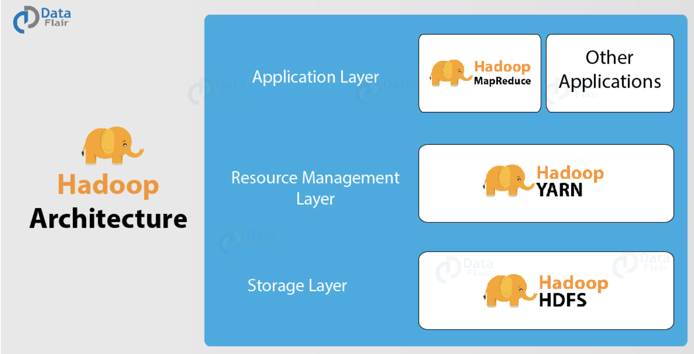
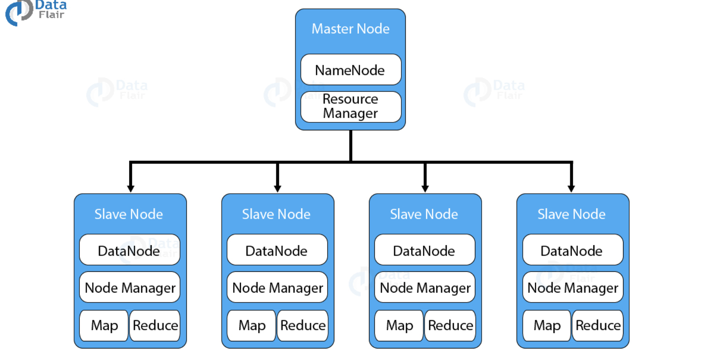
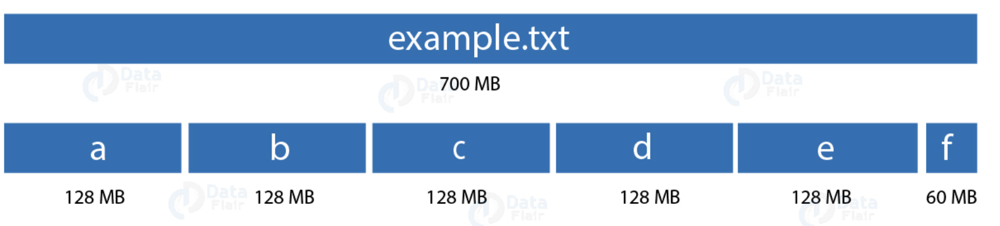
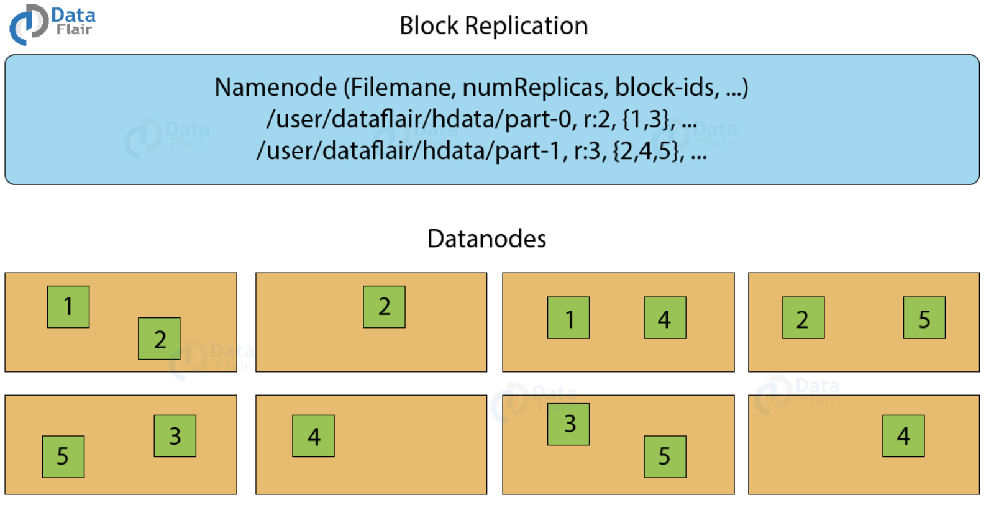
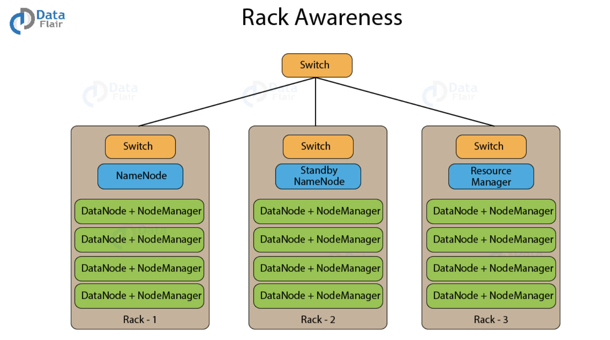
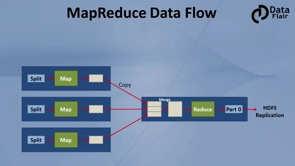
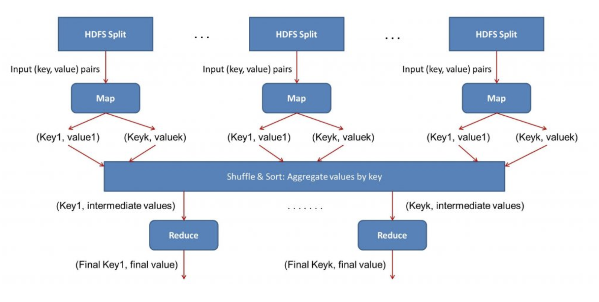
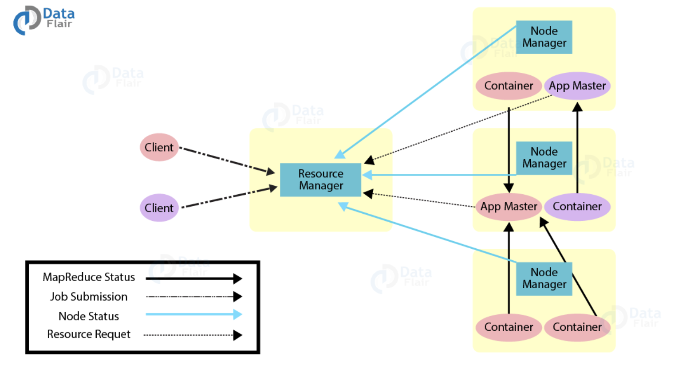

# Hadoop工作原理

在大数据领域，Hadoop已经成为一种流行的解决方案。Hadoop的设计考虑了很多方面，比如故障容错性、海量数据处理、数据本地化、跨异构硬件和软件平台的可移植性等等。下面详细介绍Hadoop的三个组件。

## Hadoop架构

Hadoop有一个主从拓扑网路，在这拓扑里面，有一个Master节点和多个slave节点。Master节点的功能就是把任务分配到多个slave节点和管理资源。这些slave节点是真正运行计算代码和存储数据的机器。而Master节点存储的是元数据。

1. **HDFS**
   HDFS即Hadoop分布式文件系统。它为Hadoop提供数据存储功能。HDFS把大的数据文件划分成一个个小的数据单元叫做块(block)，并以分布式的方式存储这些块。HDFS有两个守护进程，一个运行在Master节点的NameNode，另一个运行在slave节点的DataNode。
   - NameNode和DataNode
        HDFS也是一种Master-slave架构，NameNode是运行Master节点的进程，它负责命名空间管理和文件访问控制。DataNode是运行在slave节点的进程，它负责存储实际的业务数据。在HDFS内部，一个文件会被划分成许多数据块，并存在多个slave节点。NameNode管理文件系统命名空间的修改，比如打开、关闭、重命名文件或目录的操作。NameNode会对数据块与DataNode的映射关系进行维护和跟踪。DataNode接受来自文件系统客户端的读写请求，还会根据NameNode的指令创建、删除和复制数据块。
        
   - HDFS的块概念
        块是计算机系统最小的存储单元。它是分配给文件的最小的连续存储单元。在Hadoop也有块的概念，只是比计算机系统的块要大得多，默认是128MB或256MB。
        
        在指定block大小的时候要非常谨慎。为了解释原因，举个例子，假如一个文件有700MB，如果block大小设置为128MB，那么HDFS会把这个文件划分成6个block。5个128MB，一个60MB。如果block的大小是4KB，这个时候回出现什么情况呢？在HDFS里面，文件的大小一般都是TB到PB级别。每个block是4KB的话，那么文件会被划分成很多小的block。这是，NameNode将会创建大量元数据，这些元数据的量将会塞满NameNode的内存，导致NameNode运行效率低下，甚至崩溃。因此，在选择HDFS块的大小时，应该格外小心。
   - 副本管理
        为了实现数据容错，HDFS使用了一种复制技术，它会把块复制到不同的DataNode节点。副本因子决定了一个数据块可以被复制多少个，默认是3个。
        
        上图展示了HDFS的块复制机制。如果我们有一个1G的文件，复制因子是3，那么存储这个文件就需要3G的容量。
        为了维护复制因子，NameNode会从各个DataNode收集块报告，当块的副本数大于或者小于复制因子时，NameNode会将相应的删除和新增副本。
   - HDFS机架感知
        
        一个机架会有很多个DataNode机器，在生成环境下，一般都会有好几个这样的机架。HDFS根据机架感知算法，以分布式方式放置块副本。机架感知算法具有低延迟和容错特性。假如把复制因子配置为3，那么按照这个算法，HDFS会把第一个block放在本地机架，把另外block放在另外一个机架的不同DataNode节点。HDFS不会在同一机架存放超过2个block。
2. **MapReduce**
   MapReduce是Hadoop生态下的海量数据计算框架。利用它可以快速开发出海量数据的应用程序，并且应用程序是以并行的方式运行在由价格低廉的机器组成的大规模集群之上的。
   MapReduce的任务由Map任务和Reduce任务组成。每个任务负责计算一部分数据，这样将会把工作负载分发到各个机器上面。Map的主要工作是加载、解析、转换和过滤数据，而Reduce任务则是处理来自Map任务输出的数据，它会对这些map输出的中间数据结果进行分组和聚合操作。
   MapReduce处理的输入文件是放在HDFS上的，如何把文件分割成数据分片取决于文件的输入格式(inputformat)，数据分片其实是输入文件数据块的字节形式，Map任务会加载这些数据分片，Map任务会尽量在离数据近的DataNode机器上执行。这样数据就不需要通过网络传输，而是在本地就能对数据进行处理，避免了带宽资源的消耗。
   
   **Map任务分为以下阶段**：
      - **RecordReader**
           RecordReader 会把输入分片转换成记录，它将数据解析为记录，但不解析记录本身。接着把数据以键值对的方式提供给mapper函数，一般键是记录的位移信息，而值是具体的数据记录。一个键值对就是一条记录。
      - **Map**
           在这个阶段，用户定义的mapper函数会处理来自recordreader输出的键值对数据，并输出0个或多个中间键值对结果。
           键值对具体如何被处理取决于你开发的mapper函数，通常情况下，reduce函数会利用键做分组操作，而值会根据键做聚合计算并产生最终的结果。
      - **Combiner**
           Combiner其实也是reduce操作，只是它是在map阶段做数据聚合操作，并且这是一种可选的操作。即你可以不适用Combiner，但是在必要的时候使用它会提高任务执行效率。Combiner从mapper获取中间数据，并对这些数据进行聚合。在很多情况下，使用Combiner可以减少网络传输的数据量。例如，传输3次(helloworld,1)比传输1次(helloworld,3)要消耗更多的带宽资源。
      - **Partitioner**
           partioner从mapper拉去键值对数据结果，它会把这些数据分割成分片，每个reducer一个分片。默认情况下，partioner会对键取哈希值并和reducer的数量取模运算：`key.hascode()%reducer数量`。这样就可以把键均匀的分发到每个reducer，还可以确保具有相同key的数据落在同一个reducer。被分区的数据将会被写入本地文件系统，等待相应的reducer来拉取。

   **Reduce 任务分为以下几个阶段**：
      - **Shuffle和排序**
           shuffle和排序操作是reducer的起始步骤，该阶段会把partioner输出到文件系统的数据拉取到reducer所执行的机器上，并对数据做排序操作形成一个大的数据列表，排序的目的是把相同的键的数据聚集在一起，当然，这些操作是由MapReduce框架自动完成的，我们不能对这些操作做改动。但是我们可以通过comparator对象对键的排序和分区规则进行定制化开发。
      - **Reduce**
           reducer会对每个键对应的分组做reduce操作。MapReduce框架把键和一个包含该键的所有值的迭代对象传递给reduce函数。
           我们可以开发reducer来对数据进行不同方式的过滤、聚合以及连接操作。reduce函数执行完后，它会把生成的0个或者多个键值对传递给outputformat。
      - **OutputFormat**
           这是最后一步，它接收reducer的键值对数据，并通过recordwrite把它们写入文件。默认情况下，它是使用tab分隔符分割键值对，用换行符分割记录。你可以开发其他的outputformat来定制修改这个默认的规则。但最终的数据都会被写入到HDFS。
           
3. **Yarn**
   Yarn是一个资源管理系统，其作用就是把资源管理和任务调度、监控分割成不同的进程。Yarn有一个全局的资源管理器叫ResourceManager，每个application都有一个applicaitonMaster进程。一个application可能是一个单据的job或者是job的DAG（有向无环图）。
   在Yarn内部有两个守护进程，分别是ResourceManager和NodeManager。ResourceManager负责给application分配资源，而NodeManager负责监控容器使用资源情况，并把资源使用情况报告给ResourceManager。这里所说的资源一般是指CPU、内存、磁盘、网络等。
   ApplicationMaster负责从ResourceManager申请资源，并与NodeManager一起对任务做持续监控工作。
   
   ResourceManager有两个比较重要的组件：Scheduler和ApplicationMaster。
4. **Scheduler**
   Scheduler负责给各种application分配资源，它是纯粹的调度器，因为它不会跟踪application的状态。它也不会重新对因软硬件故障而失败的任务进行调度。它只会对application的要求分配资源。
5. **ApplicationManager**
   ApplicationManager的作用如下：

   - 接受任务的提交
   - 为ApplicationMaster申请第一个Container。Container是Yarn中抽象资源，它封装了某个节点上的多维资源，如内存、CPU、磁盘、网络等。
   - 在ApplicationMaster容器失效的时候重启它。

   ApplicationMaster 的作用如下：

   - 从Scheduler申请资源容器
   - 跟踪Container的状态
   - 监控application运行进度

  我们可以通过Yarn的集群联结特性，把节点数量扩展到几千个，这个特性让我们可以把多个Yarn集群联结成一个超大的集群。这样就可以把相互独立的集群联结起来，用于执行超大型的任务。

## Yarn的特性

Yarn 具有下面这些特性：

- 多租户
Yarn允许在同样的 Hadoop 数据集使用多种访问引擎。这些访问引擎可能是批处理，实时处理，迭代处理等。

- 集群利用率
在资源自动分配的情况下，跟早期的 Hadoop 版本相比，Yarn 拥有更高的集群利用率。

- 可扩展性
Yarn 可以根据实际需求扩展到几千个节点，多个独立的集群可以联结成一个更大的集群。

- 兼容性
Hadoop 1.x 的 MapReduce 应用程序可以不做任何改动运行在 Yarn 集群上面。
