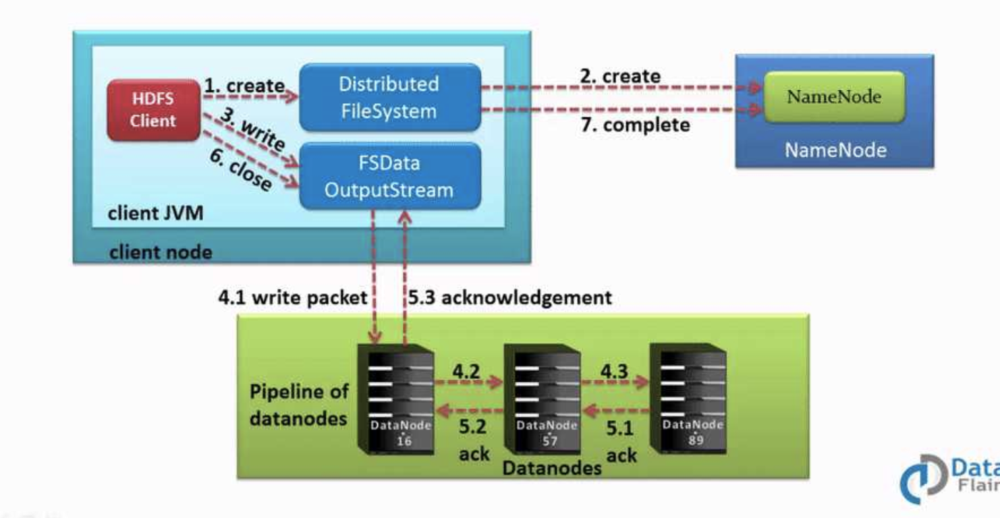
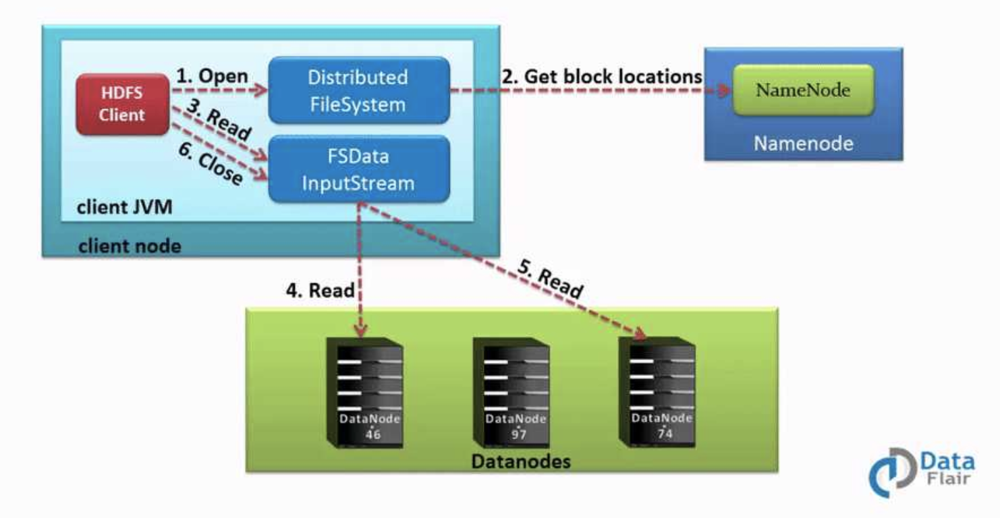

# HDFS读写数据流程

HDFS 是Hadoop生态里面的数据存储层。它是一个容错性的非常可靠的分布式文件系统。HDFS以主从(Master/Slave)架构的方式工作，NameNode是Master节点上的守护线程，DataNode是slave节点上的守护线程。

## HDFS数据写操作

要把文件写入到HDFS，客户端需要先和NameNode(Master)节点交互，NameNode给客户端提供DataNode(slave)节点的具体地址之后，客户端才能把数据写入到DataNode。那客户端怎么把数据写入DataNode呢？其实，客户端是直接跟DataNode通信并写入数据的，DataNode会创建数据写入管道(pipeline)，第一个DataNode把数据块复制到另一个DataNode(第二个DataNode)，之后第二个DataNode再把数据块复制到第三个DataNode。数据块副本创建完成之后，DataNode会给前一个发送确认消息。

**HDFS数据写入工作流程**
前面介绍的数据写入是分布式写入的，客户端把数据并发写到很多DataNode节点。

下面一步一步详细介绍数据的写入流程：

1. 客户端调用`DistributedFileSystem`的`create()`方法，开始创建新文件。`DistributedFileSystem`创建`DFSOutputStream`，产生一个`RPC`调用，让`NameNode`在文件系统的命名空间中创建这一新文件。
2. `NameNode`接收到用户的写文件的`RPC`请求后，首先要执行各种检查，如客户是否有相关的创建权限和该文件是否已存在等，检查通过后才会创建一个新文件，并将操作记录写到编辑日志，然后`DistributedFileSystem`会将`DFSOutputStream`对象包装在`FSDataOutStream`实例中，返回客户端；否则文件创建失败并且给客户端抛`IOException`。
3. 客户端开始写文件，`DFSOutputStream`会将文件分割成`packets`数据包，HDFS中每个`block`默认情况下是128M，由于每个块比较大，所以在写数据的过程中是把数据块拆分成一个个的数据包`(packet)`以管道的形式发送的。然后将这些`packets`写到其内部的一个叫做`data queue(数据队列)`。`data queue`会向`NameNode`节点请求适合存储数据的副本的`DataNode`节点的列表，然后这些·之前生成一个·数据流管道，我们假设副本因子参数为3，那么这个数据流管道中就有三个`DataNode`节点。
4. 首先`DFSOutputStream` 会将`packets`向`Pipeline`数据流管道中的第一个`DataNode`节点写数据，第一个`DataNode`接收`packets`然后把`packets`写入`Pipeline`中的第二个节点，同理，第二个节点保存接收到的数据然后将数据写入`Pipeline`中的第三个`DataNode`节点。
5. `DFSOutputStream`内部同样维护另外一个内部的写数据确认队列`(ack queue)`。当`Pipeline`中的第三个`DataNode`节点将`packets`成功保存后，该节点会向第二个节点返回一个确认数据写成功的信息，第二个`DataNode`接收到确认信息后再当前节点数据写成功后也会向`Pipeline`中的第一个`DataNode`节点发送一个确认写成功的信息，然后第一个节点在收到该信息后如果该节点的数据也写成功后，会将`packets`从`ack queue`中将数据删除。
   在写数据的过程中，如果`Pipeline`数据流管道中的一个`DataNode`节点写失败了会发生什么问题、需要做哪些内部处理呢？
   如果这种情况发生，那么就会执行一些操作：
   首先，`Pipeline`数据流管道会被关闭，`ack queue`中的`packets`会被添加到`data queue`的前面以确保不会发生`packets`数据包的丢失。
   接着，在正常的`DataNode`节点上的已保存包的`block`的`ID`版本会升级，这样发生故障的`DataNode`节点上的`block`数据会在节点恢复正常后被删除，失效节点也会被从`Pipeline`中删除。
   最后，剩下的数据会被写入到Pipeline数据流管道中的其他两个节点中。
   如果`Pipeline`中的多个节点在写数据时发生失败，那么只要写成功的`block`的数量达到`dfs.replication.min(默认为1)`,那么任务就是成功的，然后NameNode后面通过其他方法将`block`复制到其他节点，直到数据副本达到`dfs.replication`参数配置的个数。
6. 完成写操作后，客户端调用`close()`关闭写操作IO流，刷新数据。
7. 在数据刷新完后NameNode关闭写操作楼。到此，整个写操作完成。

**文件写入JAVA代码示例**
写入HDFS

```java
Configuration conf = new Configuration();
FileSystem fileSystem = FileSystem.get(conf);
// Check if the file already exists
Path path = new Path("/path/to/file.ext");
if (fileSystem.exists(path)) {
    System.out.println("File " + dest + " already exists");
    return;
}
// Create a new file and write data to it.
FSDataOutputStream out = fileSystem.create(path);
InputStream in = new BufferedInputStream(new FileInputStream(new File(source)));
byte[] b = new byte[1024];
int numBytes = 0;
while ((numBytes = in.read(b)) > 0) {
    out.write(b, 0, numBytes);
}
// Close all the file descripters
in.close();
out.close();
fileSystem.close();
```

## HDFS数据读操作

为了从HDFS读取数据，客户端首先得和NameNode(master节点)交互，因为NameNode是Hadoop集群的中心，它保存着集群中的所有元数据。然后NameNode会检查客户端是否有响应的权限，如果客户端有权限读取数据，那么NameNode才会给它返回存储文件的DataNode(slave节点)列表。之后客户端将直接从DataNode读取相应的数据block。

**HDFS 文件读取流程**
下面详细介绍HDFS读取文件的流程：


1. 客户端调用`FileSystem`对象的`open()`函数，打开想要读取的文件。其中`FileSystem`是`DistributedFileSystem`的一个实例。
2. `DistributedFileSystem`使用`RPC`调用`NameNode`来确定文件中的前几个块的位置。对于每个块，`NameNode`会返回存储该数据块副本的`DataNode`节点的地址，并根据`DataNode`与客户端的距离排序。
3. `DistributedFileSystem`会给客户端返回一个输入流对象`FSDataInputStream`，客户端将从该对象读取数据，该对象封装了一个用于管理`DataNode`和`NameNode IO`的对象`(DSFInputStream)`。客户端调用`FSDataInputStream`的`read()`函数。由于`DSFInputStream`已经存储了`DataNode`地址，那么接下来就是连接到距离客户端最近的`DataNode`进行读取数据文件的第一个块。
4. 客户端可以重复在数据流调用`read`函数，当块读取结束后，`DFSInputStream`将关闭和`DataNode`的连接，然后再找下一个离客户端最近的存储数据块的`DataNode`。
5. 如果 `DFSInputStream` 在和 `Datanode` 通信的时候发生故障，它将会从存储该数据块的距离客户端最近的 `Datanode` 读取数据。而且它会把发生故障的`Datanode` 记录下来，在读取下一个数据块的时候，就不会再从这个 `Datanode` 读取了。`DFSInputStream` 会对数据做校验和（ `checksum` ）验证。如果发现损坏的块，在 `DFSInputStream` 从其他 `Datanode` 读取损坏的块的副本之前，把损坏的块告知给 `Namenode`。
6. 客户端读取数据完成后，调用 `close()` 函数关闭数据流。

**文件读取JAVA代码示例**
读取HDFS

```java
Configuration conf = new Configuration();
FileSystem fileSystem = FileSystem.get(conf);
Path path = new Path("/path/to/file.ext");
if (!fileSystem.exists(path)) {
    System.out.println("File does not exists");
    return;
}
FSDataInputStream in = fileSystem.open(path);
int numBytes = 0;
while ((numBytes = in.read(b))> 0) {
    System.out.prinln((char)numBytes));// code to manipulate the data which is read
}
in.close();
out.close();
fileSystem.close();
```
