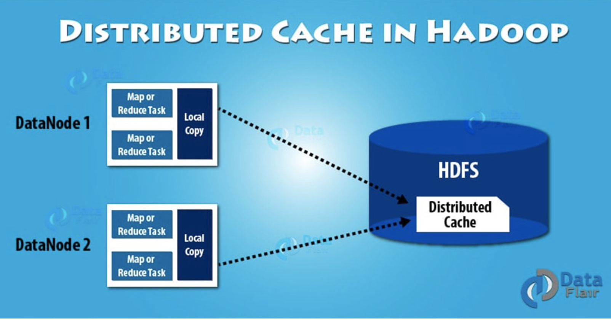

# Hadoop分布式缓存

分布式缓存是Hadoop MapReduce框架提供的一种数据缓存机制。它可以缓存只读文本文件、压缩文件、jar包等文件。
一旦对文件执行缓存操作，那么每个map/reduce任务的节点都可是使用该缓存文件。


## 分布式缓存的优点

- 存储复杂的数据
  它分发了简单、只读的文本文件和复杂类型的文件，如jar包、压缩包。这些压缩包将在各个slave节点解压。
- 数据一致性
  Hadoop分布式缓存追踪了缓存文件的修改时间戳。然后当Job在运行时，它也会通知这些文件不能被修改。使用Hash算法，缓存引擎可以始终确定特定键值对在哪个节点上。所以，缓存cluster只有一个状态，它永远不会是不一致的。
- 单点失败
  分布式缓存作为一个跨越多个节点独立运行的进程。因此单个节点失败，不会导致整个缓存失败。

## 分布式缓存的使用

旧版本的DistributedCache已经被注解为过时，以下为Hadoop-2.2.0以上的新API接口。

```java
Job job = Job.getInstance(conf);
//将hdfs上的文件加入分布式缓存
job.addCacheFile(new URI("hdfs://url:port/filename#symlink"));
```

由于新版API中已经默认创建符号链接，所以不需要再调用`setSysmlink(true)`方法了，可以使用下面代码来查看是否开启了创建符号链接:

```java
System.out.println(context.getSymlink());
```

之后在map/reduce函数中可以通过context来访问缓存文件，一般是重写setup方法来进行初始化

```java
@Override
protected void setup(Context context) throws IOException, InterruptedException {
        super.setup(context);
        if (context.getCacheFiles() != null && context.getCacheFiles().length > 0) {
        String path = context.getLocalCacheFiles()[0].getName();
        File itermOccurrenceMatrix = new File(path);
        FileReader fileReader = new FileReader(itermOccurrenceMatrix);
        BufferedReader bufferedReader = new BufferedReader(fileReader);
        String s;
        while ((s = bufferedReader.readLine()) != null) {
            //TODO:读取每行内容进行相关的操作
        }
        bufferedReader.close();
        fileReader.close();
    }
}
```

得到的path为本地文件系统上的路径。
这里的 `getLocalCacheFiles` 方法也被注解为过时了，只能使用 `context.getCacheFiles` 方法，和 `getLocalCacheFiles` 不同的是，`getCacheFiles` 得到的路径是 `HDFS` 上的文件路径，如果使用这个方法，那么程序中读取的就不再是缓存在各个节点上的数据了，相当于共同访问 `HDFS` 上的同一个文件。可以直接通过符号连接来跳 过`getLocalCacheFiles` 获得本地的文件。

## 分布式缓存的大小

可以在文件 mapred-site.xml 中设置，默认为10GB。

## 注意事项

- 需要分发的文件必须是存储在 HDFS 上了。
- 文件只读。
- 不缓存太大的文件，执行task之前对文件进行分发，影响task的启动速度。
