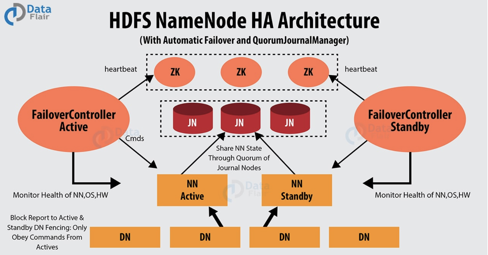

# HDFS NameNode高可用

在Hadoop 2.0.0之前，一个集群只有一个NameNode，这将面临单点故障问题。如果NameNode机器挂掉了，整个集群就用不了了。只有重启NameNode，才能恢复集群。另外正常计划维护集群的时候，还必须先停用整个集群，这样没办法达到`7*24`小时可用状态。Hadoop2.0及之后版本增加了NameNode高可用机制，下面详细介绍。

## Hadoop Namenode 高可用架构

Hadoop 2.0克服了NameNode单点故障问题，即在一个集群中有2个NameNode节点，一个活动的NameNode节点(Active NameNode)，即主节点，一个是备用NameNode(Passive NameNode)，即备用节点，而且支持热备份个故障切换。

**活动NameNode**：负责处理集群中所有客户端请求。
**备用NameNode**：备用节点，拥有和活动的NameNode一样的元数据。在活动NameNode失效后，会接管它的工作。

活动NameNode和备用NameNode之间是如何同步数据的呢？即他们是怎么保持一致性的，主要有下面几点：

- **活动和备用NameNode两者总是同步的**：例如，他们存储着一样的元数据，这可以把集群恢复到系统奔溃时的状态。而且基于此还能实现自动故障切换。
- **同一时间，集群只能有一个活动的NameNode节点**：否则，两个NameNode会导致数据发生错乱并且无法恢复。
  我们把这种情况称为”脑裂“现象，即一个集群被分成两个小集群，并且两边都认为自己是唯一活动的集群。Zookeeper社区对这种问题的解决方叫做fencing,中文翻译为隔离，也就是想办法把旧的活动NameNode隔离起来，是它不能正常对外提供服务，是集群始终只有一个活动的NameNode。

## Namenode 高可用的实现

这里竹园介绍通过**隔离（fencing）** 和**Quorum Journal Manager（QJM）共享存储**实现的HDFS高可用。

**隔离（Fencing）**
**隔离（Fencing）是为了防止脑裂，就是保证在任何时候HDFS只有一个Active NN**，主要包括三个方面：

- 共享存储fencing：确保只有一个NN可以写入edits。QJM中每一个Journal Node中均有一个epochnumber，匹配epochnumber的QJM才有权限更新JN。当NameNode由standby状态切换成active状态时，会重新生成一个epochnumber，并更新JN中的epochnumber，以至于以前的Active NameNode中的QJM中的epochnumber和JN的epochnumber不匹配，故而原Active NameNode上的QJM没法往JN中写入数据，即形成了fencing。
- 客户端fencing：确保只有一个NameNode可以响应客户端的请求。
- DataNode fencing：确保只有一个NameNode可以向DataNode下发命令，譬如删除快、复制快，等等。

QJM的Fencing方法只能让原来的Active NameNode失去对JN的写权限，但是原来的Active NameNode还是可以响应客户端的请求，对DataNode进行读。对客户端和DataNode的fencing是通过配置`dfs.ha.fencing.method`实现的。

Hadoop公共库中有两种Fencing实现：sshfence、shell

- sshfence：ssh到原Active NN上，使用fuser结束进程（通过TCP端口号定位进程pid,该方法比jps命令更准确）。
- shell：即执行一个用户事先定义的Shell命令（脚本）完成隔离。

## QJM共享存储

Qurom Journal Manager(QJM)是一个基于Paxos算法实现的HDFS元数据共享存储的方案。QJM的基本原理就是用 2N+1 台 JournalNode存储Editlog，每次写数据操作有大多数(>=N+1)返回成功时即认为该次写成功，数据不会丢失。这个算法所能容忍的是最多有N台机器挂掉，如果多余N台挂掉，这个算法就失效了。这个原理是基于Paxos算法的。

用QJM的方式来实现HA的主要好处有：

- 不需要配置额外的高共享存储，这样对于基于商用硬件的云计算数据中心来说，降低了复杂度和维护成本。
- 不在需要单独配置fencing实现，因为QJM本身内置了fencing功能
- 不存在单点故障问题
- 系统扩展性的程度是可配置的（ QJM 基于 Paxos 算法，所以如果配置 2N+1 台 JournalNode 组成的集群，能容忍最多 N 台机器挂掉）；
- QJM 中存储日志的 JournalNode 不会因为其中一台的延迟而影响整体的延迟，而且也不会因为 JournalNode 的数量增多而影响性能（因为 Namenode 向 JournalNode 发送日志是并行的）。
  