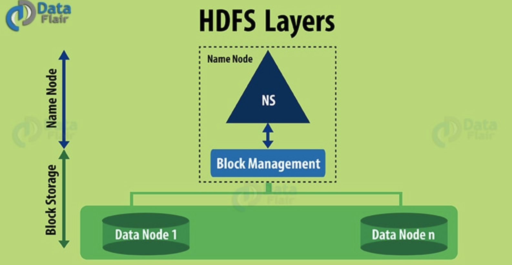
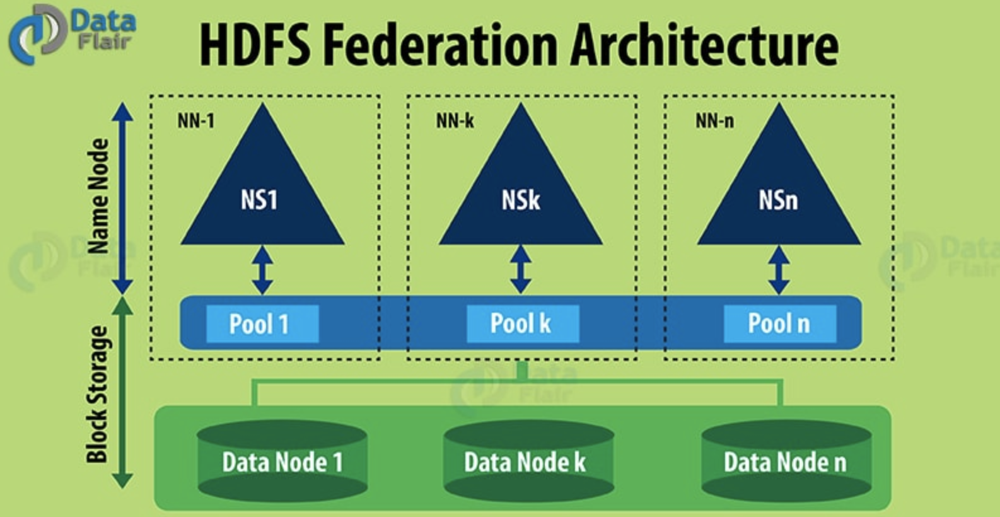
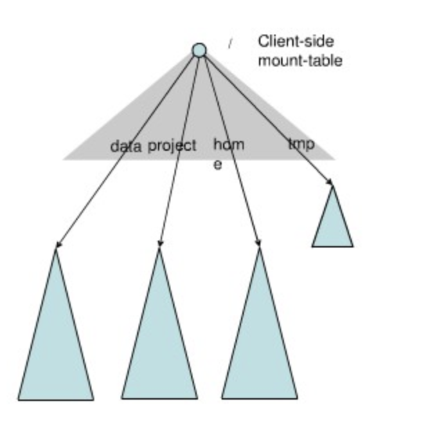

# HDFS Federation（联邦机制）

HDFS Federation中文意思为HDFS联盟或者HDFS联邦。这里并非指多个集群，更准确的应该是一个集群有多个命名空间，即多个NameNode。

## Hadoop 1.0 HDFS 架构

HDFS包含两个层次：**命名空间管理(namespace)**和**块/存储管理(block storage)**


- 命名空间管理(NameSpace)
  HDFS的命名空间包含目录、文件和块。命名空间管理是指命名空间支持对HDFS中的目录、文件和块做类似文件系统的创建、修改、删除、列表文件和目录等基本操作。
- 块/存储管理(block storage)
  在块存储服务中包含两部分工作：块管理和物理存储。这是一个更通用的存储服务。其他的应用可以直接建立在block storage上，如HBase,Foregin NameSpaces等。
  块管理：
    1. 处理DataNode向NameNode注册的请求，处理DataNode的成员关系，接收来自DataNode周期性的心跳。
    2. 处理来自块的报告信息，维护块的位置信息。
    3. 处理与块相关的操作：块的创建、删除、修改以及获取块信息。
    4. 管理副本位置(replica placement)和块的复制以及多余块的删除。
  物理存储：
    所谓物理存储就是：DataNode把块存储到本地文件系统中，对本地文件系统的读写。

## Hadoop 1.0 HDFS 架构的局限性

Hadoop 1.0 HDFS架构只允许整个集群中存在一个NameSpace，而该Namespace被仅有的一个NameNode管理。这个架构使得HDFS非常容易实现，但是，它在具体实现过程耦合度比较高，进而导致了很多局限性。

HDFS的局限性主要为：

- 块存储和 namespace 高耦合
  当前NameNode中的Namespace和block management的结合使得这两层架构耦合在一起，难以让其他可能NameNode实现方案直接使用block storage。
- namenode 扩展性
  HDFS的底层存储，即DataNode节点是可以水平扩展的，但NameSpace不可以。当前的NameSpace只能存放在单个NameNode上，而NameNode在内存中存储了整个分布式文件系统中的元数据信息，这限制了集群中数据块、文件和目录的数目。
- 性能
  文件操作的性能制约于单个NameNode的吞吐量，单个NameNode当前仅支持约 60,000 个并发task，而下一代Apache MapReduce将支持超过 1,00,000 个并发任务，这意味着将需要更多的NameNode。
- 隔离性
  现在大部分公司的集群都是共享的，每天来自不同部门的不同用户提交作业。单个NameNode难以提供隔离性，即：某个用户提交的负载很大的job会减慢其他用户的job，单一的NameNode难以像HBase按照应用类别将不同作业分派到不同NameNode上。

需要注意的，HDFS Federation 并不能解决单点孤战问题，也就是说，每个NameNode都存在单点故障问题，你需要为每个NameNode部署一个备用NameNode以应对NameNode挂掉对业务产生的影响。

## HDFS Federation 架构

为了解决上述第二节提高的问题，Hadoop 2.0引入了基于共享存储的高可用解决方案和HDFS Federation。

为了水平扩展NameNode，Federation使用了多个独立的 NameNode/NameSpaces。这些NameNode之间是联合的，也就是说，它们之间相互独立且不需要互相协调，各自分工，管理自己的区域。分布式的DataNode被用作通用的数据块存储设备。每个DataNode要向及群众所有的NameNode注册，且周期性地向所有NameNode发送心跳和块报告，并执行来自所有NameNode的命令。

一个block pool有属于同一个NameSpace的数据块组成，每个DataNode可能会存储集群中所有block pool的数据块。

每个block pool 内部自治，也就是说各自管理各自的block，不会与其他block pool交互。一个NameNode挂掉了，不会影响其他NameNode。

每个NameNode上的NameSpace和它对应的block pool一起被称为NameSpace volume（命名空间卷）。它是管理的基本单位。当一个NameNode/NameSpace被删除后，其所有的DataNode上对应的block pool也会被删除。当集群升级时，每个NameSpace Volume 作为一个基本单元进行升级。

**命名空间管理**
Federation中存在多个命名空间，如何划分和管理这些命名空间非常关键。在Federation中并没有采用”文件名hash“的方法，因为该方法的本地性非常差，比如：查看某个目录下面的文件，如果采用文件名hash的方法存放文件，则这些文件可能放到不同的NameSpace中，HDFS需要访问所有NameSpace，代价过大。为了方便管理多个命名空间，HDFS Federation采用了经典的Client Side Mount Table。

如上图所示，下面四个深色三角形代表一个独立的命名空间，上方浅色的三角形代表从客户角度去访问的子命名空间。各个深色的命令空间Mount到浅色的表中，客户可以访问不同的挂载点来访问不同的命名空间，这就如同在Linux系统中访问不同挂载点一样。

这就是HDFS Federation中命令空间管理的基本原理：将各个命名空间挂载到全局mount-table中，就可以将数据做到全局共享，同样的命名空间挂载到个人的mount-table中，这就称为应用程序课件的命名空间视图。

**Block Pool（块池）**
所谓的Block Pool（块池）就是属于单个命名空间的一组block(块)。每一个DataNode为所有的block pool存储块。DataNode是一个物理概念，而block pool是一个重新将block划分的逻辑概念。同一个DataNode中可以存着属于多个block pool的多个块。Block pool允许一个命名空间在不通知其他命名空间的情况下为一个新的block创建Block ID。同时一个NameNode失效不会影响其下的DataNode为其他NameNode的服务。

当DataNode与NameNode建立联系并开始会话后自动建立Block pool。每个block都有一个唯一的标识，这个标识我们称之为扩展的块ID(Extended Block Id) = BlockID+BlockID。这个扩展快ID在HDFS集群之间都是唯一的，这为以后集群归并创造了条件。

DataNode中数据结构都通过块池ID(Block pool ID)索引，即DataNode中的BlockMap、storage等都通过BPID索引。

在HDFS中，所有的更新、回滚都是以NameNode和BlockPool为单元发生的。即同一HDFS Federation中不同的NameNode/BlockPoll之间没有任何关系。

## HDFS Federation 配置介绍

本节不会介绍具体的 namenode 和 datanode 的配置方法，而是重点介绍 HDFS 客户端配置方法，并通过对客户端配置的讲解让大家深入理解 HDFS Federation 引入的 “client-side mount table”（viewfs）这一概念，这是通过新的文件系统 viewfs 实现的。

**Hadoop 1.0中的配置**
在 Hadoop 1.0 中，只存在一个 NameNode，所以，客户端设置 NameNode 的方式很简单，只需在 core-site.xml 中进行以下配置：

```xml
<property>
    <name>fs.default.name</name>
    <value>hdfs://host0001:9000</value>
</property>
```

设置该参数后，当用户使用以下命令访问 hdfs 时，目录或者文件路径前面会自动补上“hdfs://host0001:9000”：`bin/hadoop fs –ls /home/dongxicheng/data`

其中 “/home/dongxicheng/data” 将被自动替换为 “hdfs://host0001:9000/home/dongxicheng/data” 。

当然，你也可以不在 core-site.xml 文件中配置 fs.default.name 参数，这样当你读写一个文件或目录时，需要使用全URI地址，即在前面添加 “hdfs://host0001:9000”，比如：`bin/hadoop fs –ls hdfs://host0001:9000/home/dongxicheng/data`

**Hadoop 2.0 中的配置**
在Hadoop 2.0中，由于引入了HDFS Federation，当你启用该功能时，会同时存在多个可用的NameNode，为了便于配置 `fs.default.name`,你可以规划这些NameNode的使用方式，比如图片组使用namenode1，爬虫组使用namenode2等等，这样，爬虫组员工使用的HDFS client端的core-site.xml文件可进行如下配置：

```xml
<property>
    <name>fs.default.name</name>
    <value>hdfs://namenode2:9000</value>
 </property>
```

图片组员工使用的HDFS client端的core-site.xml文件进行如下配置：

```xml
<property>
    <name>fs.default.name</name>
    <value>hdfs://namenode1:9000</value>
 </property>
```

从HDFS和HBase使用者的角度看，当仅仅使用单NameNode上管理的数据时，是没有问题的。但是，当考虑HDFS之上的计算类应用，比如YARN/MapReduce应用程序，则可能出现问题。因为这类应用可能涉及到跨NameNode数据读写，这样必须显示的指定全URI，即输入输出目录中必须显示的提供类似 "hdfs://namenode2:900"的前缀，以注明目录管理者NameNode的访问地址。比如：`distcp hdfs://nnClusterY:port/pathSrc hdfs://nnCLusterZ:port/pathDest`。为了解决这个麻烦，为用户提供统一的全局HDFS访问入口，HDFS Federation借鉴Linux提供了client-side mount table，这是通过一层新的文件系统viewfs实现的，它实际上提供了一种映射关系，将一个全局（逻辑）目录映射到具体的NameNode（物理）目录上，采用这种方式后，core-site.xml配置如下：

```xml
<configuration xmlns:xi="http://www.w3.org/2001/XInclude">
<xi:include href="mountTable.xml"/>
<property>
<name>fs.default.name</name>
<value>viewfs://ClusterName/</value>
</property>
</configuration>
```

其中，“ClusterName”是HDFS整个集群的名称，你可以自定义一个。`mountTable.xml`配置了全局（逻辑）目录与具体NameNode（物理）目录的映射关系，你可以类比Linux挂载点来理解。

假设你的集群中有三个NameNode，分别是namenode1,namenode2,namenode3。其中，namenode1管理/usr和/tmp两个目录，namenode2管理/projects/foo目录，namenode3管理/projects/bar目录，则可以创建一个名为"cmt"的 client-side mount table，并在`mountTable.xml`中进行如下配置：

```xml
<configuration>
<property>
<name>fs.viewfs.mounttable.cmt.link./user</name>
<value> hdfs://namenode1:9000/user </value>
</property>
<property>
<name>fs.viewfs.mounttable.cmt.link./tmp</name>
<value> hdfs:/ namenode1:9000/tmp </value>
</property>
<property>
<name>fs.viewfs.mounttable.cmt.link./projects/foo</name>
<value> hdfs://namenode2:9000/projects/foo </value>
</property>
<property>
<name>fs.viewfs.mounttable.cmt.link./projects/bar</name>
<value> hdfs://namenode3:9000/projects/bar</value>
</property>
</configuration>
```

经过以上配置后，你可以像1.0那样，访问HDFS上的文件，比如：`bin/hadoop fs –ls /usr/dongxicheng/data`中的`/usr/dongxicheng/data`将被映射成"hdfs://namenode1:9000/user/dongxicheng/data"。Client-side mount table的引入为用户使用HDFS带来了极大的方便，尤其是跨NameNode的数据访问。
