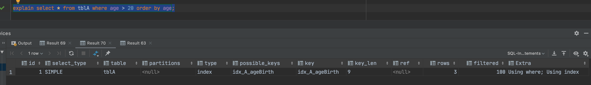
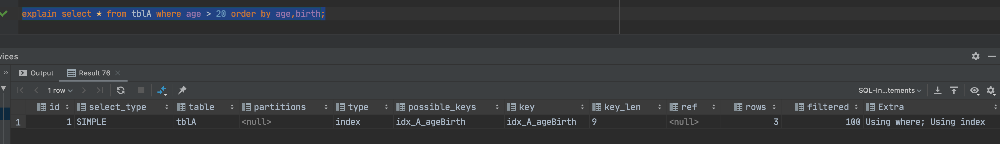
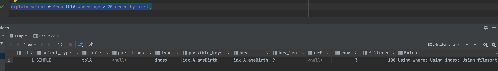
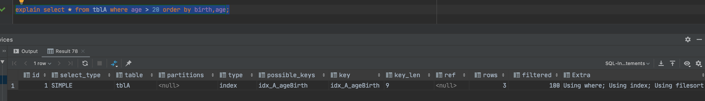
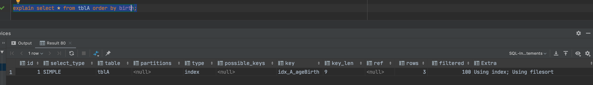
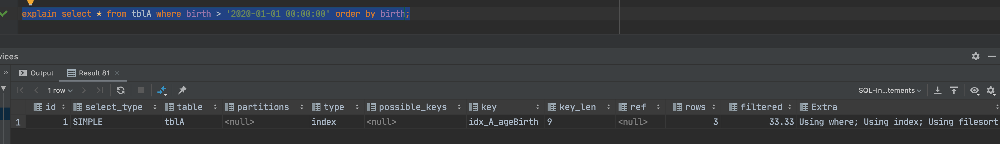
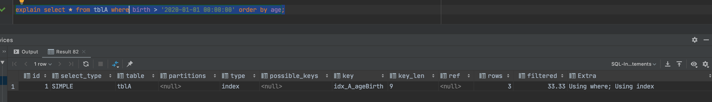
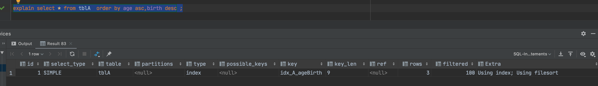

# Order by 关键字优化

## Order by 子句，尽量使用Index方式排序，避免使用FileSort方式排序

- 建表语句

```sql
create table tblA(
    age int,
    birth timestamp not null
);

insert into tblA(age, birth) value (22,now());
insert into tblA(age, birth) value (23,now());
insert into tblA(age, birth) value (24,now());

create index idx_A_ageBirth on tblA(age,birth);

select * from tblA;
```

- 案例








MySQL支持两种方式的排序，`FileSort`和`Index`,`Index`效率高，它指`MySql`扫描索引本身完成的排序。`FileSort`方式效率较低。

**`Order by`满足两种情况，会使用`Index`方式排序：**

1. `Order by`语句使用索引最左前列；
2. 使用`Where`子句与`Order by`子句条件列满足索引最左前列；

## 尽可能在索引列上完成排序操作，遵照索引键的最佳做左前缀

## 如果不在索引列上，Filesort有两种算法：双路排序与单路排序

- 双路排序
  MySQL4.1之前是使用双路排序，字面意思就是两次扫描磁盘，最终得到数据。读取行指针和`order by`列，对它们进行排序，然后扫描已经排序好的列表，按照列表中的值重新从列表中读取对应的数据输出。从磁盘取排序字段，在`buffer`进行排序，再从磁盘取其他字段。
  取一批数据，要对磁盘进行两次扫描，众所周知，I\O是很耗时的，所以在Mysql4.1之后，出现了第二种改进的算法，就是单路排序。
- 单路排序
  从磁盘读取查询需要的所有列，按照`order by`列在`buffer`对它们进行排序，然后扫描排序后的列表进行输出，它的效率更快一些，避免了第二次读取数据，并且把随机IO变成了顺序IO，但是它会使用更多的空间，因为它把每一行都保存在内存中。
- 结论及引申出的问题
  由于单路是后出的，总体而言好过双路，但是单路有问题。

  ```txt
  在sort_buffer中，单路排序比双路排序要多占用更多空间，因为单路排序是把所有字段都取出，所以有可能取出的数据的总大小超过了sort_buffer的容量，导致每次只能取sort_buffer容量大小的数据，进行排序（创建tmp文件，多路合并），排序再取buffer_sort容量大小，再排序。。。从而多次I/O。
  本来想省一次I/O操作，反而导致了大量的I/O操作，反而得不偿失。
  ```

  优化策略：
  1. 增大`sort_buffer_size`参数的设置；
  2. 增大`max_length_for_sort_data`参数的设置；
  3. `order by`时`select *`是一个大忌，**只query需要的字段，这点非常重要**。在这里的影响是，当query的字段大小总和小于`max_length_for_sort_data`而且排序字段不是`TEXT|BLOB`类型时，会用单路排序算法，否则用多路排序算法。两种算法的数据都有可能超过`sort_buffer`的容量，超出之后，会创建tmp文件进行合并排序，导致多次I/O，但是单路排序的算法风险会更大一些，所以要提高`sort_buffer_size`；
  4. 提高`sort_buffer_size`，单路排序和双路排序都会提高效率，当然，要根据系统的能力去提高，因为这个参数是针对每个进程的；
  5. 提高`max_length_for_sort_data`会增加使用单路排序的概率，但是如果设置的太高，数据的总容量超出`sort_buffer_size`的概率就会增大，明显症状是高的磁盘I/O活动和低的处理器使用率；

## Grouyby优化

- `group by`实质是先排序后进行分组，遵照索引建的最佳左前缀；
- 当无法使用索引列，增大`max_length_for_sort_data`,`sort_buffer_size`参数的设置；
- where 高于 having，能写在where限定的条件就不要去having 限定了；
