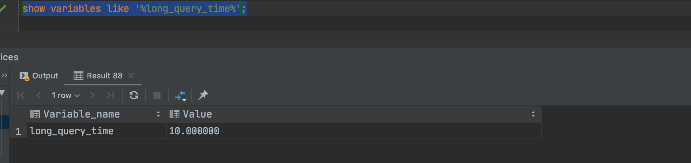
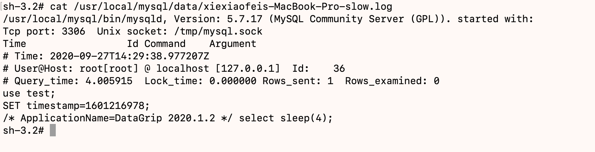
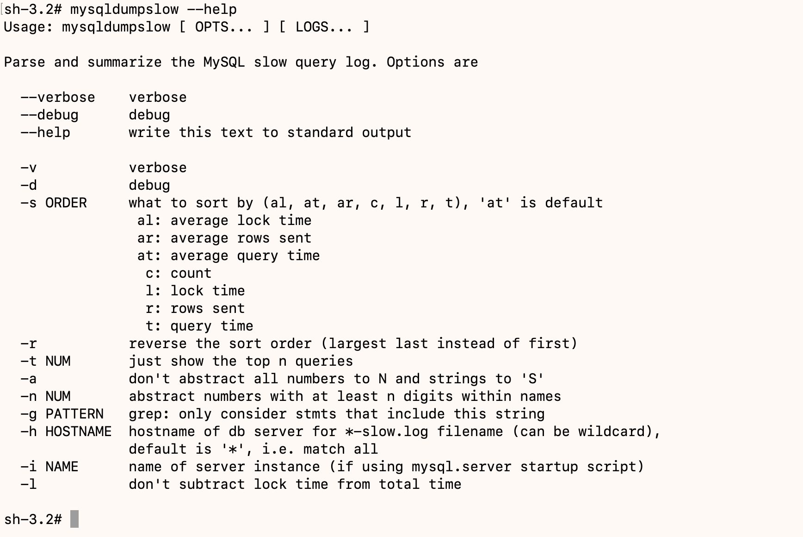

# 慢查询日志

MySQL的慢查询日志是MySQL提供的一种日志记录，它用来记录在MySQL中响应时间超过阀值的语句，具体指运行时间超过`long_query_time`的SQL，则会被记录到慢查询日志中。`long_query_time`的默认值为10，意思是运行10秒以上的语句。由它来查看哪些SQL超出了我们的最大忍耐时间值，比如一条SQL执行超过5秒，就算慢SQL，希望能收集超过5秒的SQL，结合之前explain进行全面分析。

## 如何开启

默认情况下Mysql数据库没有开启慢查询日志，需要我们手动开设置这个参数。当然，如果不是调优需要的话，一般不建议启动盖参数，因为开启慢查询日志或多或少带来一定的性能影响。慢查询日志支持将日志记录写入文件。

- 查看是否开启
  默认`show variables like '%slow_query_log%'`；
- 开启
  `set global show_query_log=1;`,这个命令只对当前的数据库生效，如果Mysql重启后则会失效。

## 什么样的日志会记录到慢查询日志

这个是由参数`long_query_time`控制，默认情况下`long_query_time`的值是10秒。
命令`show variables like '%long_query_time%';`

`set global long_query_time = 3;`设置值为3秒。重新连接后，再查看值已生效。
模拟执行慢查询SQL`select sleep(4);`,查看日志文件`cat /usr/local/mysql/data/xiexiaofeis-MacBook-Pro-slow.log`,如下所示：

使用`show global status like '%slow_queries%';`可查询日志文件中记录多少条超时SQL。

## 日志分析工具

在生产环境中，如果要手工分析日志，查找，分析SQL，显然是个体力活，MYSQL提供了日志分析工具`mysqldumpslow`;

使用示例：

- 得到返回记录集最多的10个SQL；
  `mysqldumpslow -s r -t 10 /usr/local/mysql/data/xiexiaofeis-MacBook-Pro-slow.log` ;
- 得到访问次数最多的10SQL；
  `mysqldumpslow -s c -t 10 /usr/local/mysql/data/xiexiaofeis-MacBook-Pro-slow.log` ;
- 得到按照时间排序的前10条里面含有左连接的查询语句；
  `mysqldumpslow -s t -t 10 -g "left join" /usr/local/mysql/data/xiexiaofeis-MacBook-Pro-slow.log` ;
- 另外建议在使用这些命令时结合`｜`和`more`使用，否则有可能出现爆屏情况；
  `mysqldumpslow -s r -t 10 /usr/local/mysql/data/xiexiaofeis-MacBook-Pro-slow.log | more` ;
