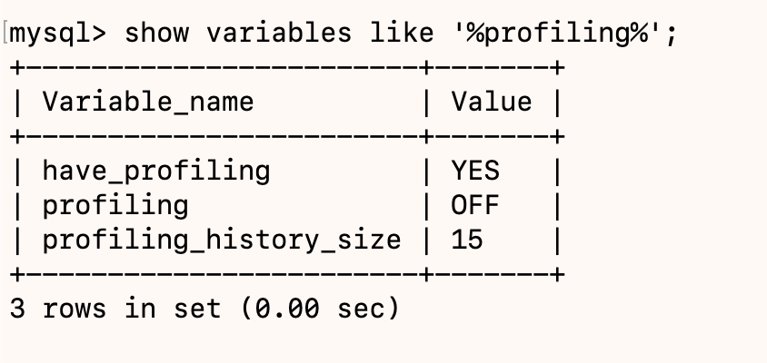
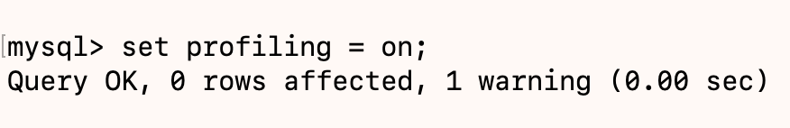
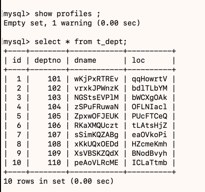
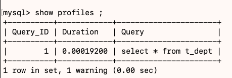
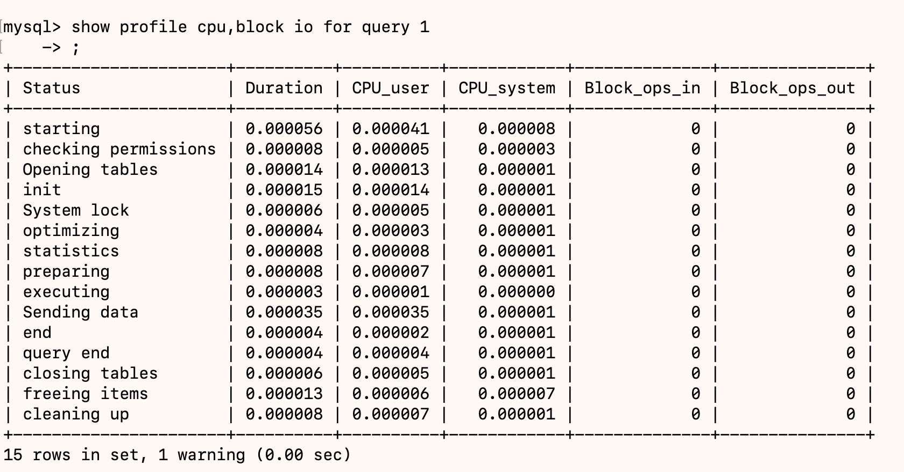

# ShowProfile

是MYSQL提供可以用来分析当前会话中语句执行的资源消耗情况。可以用于SQL的调优的测量。默认情况下处于关闭状态，并保存最近15次的运行结果。

## 分析步骤

1. 是否支持，确定当班的MYSQL版本是否支持；
   `show variables like '%profiling%';`
   
2. 开启功能，默认是关闭的，使用前需要开启；
   `set profiling = on;`
   
3. 运行SQL；
   
4. 查看结果，`show profiles`;
   
5. 诊断SQL，`show profile cpu,block io for query`上一步前面的问题SQL数字号码；
   
6. 日常开发需要注意的结论；
   - `converting HEAP to MyISAM`查询结果太大，内存都不够用了往磁盘搬了。
   - `createing temp table`创建临时表，拷贝数据到临时表，用完再删除。
   - `copying to temp table on disk`把内存中临时表复制到磁盘，危险！！！
   - `locked` 死锁了
