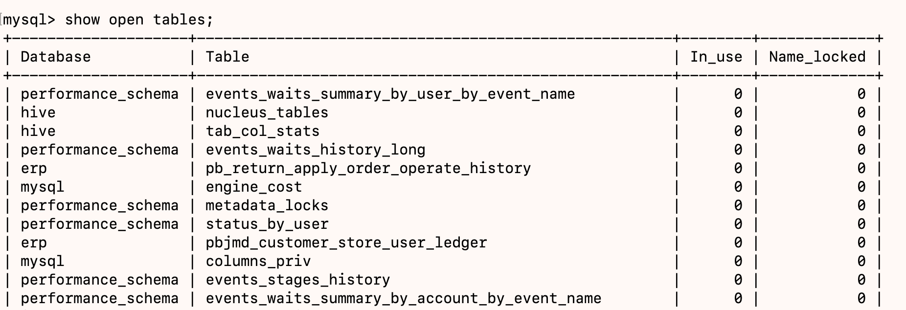
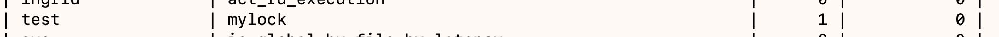
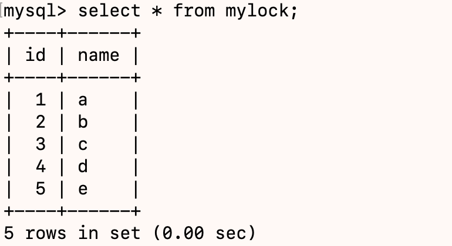
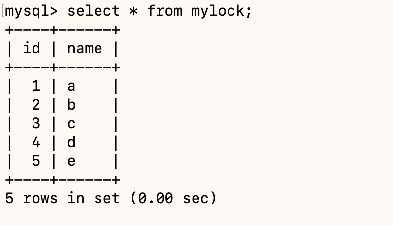
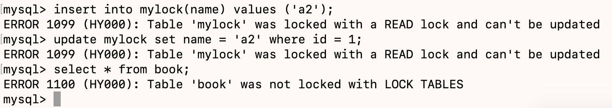
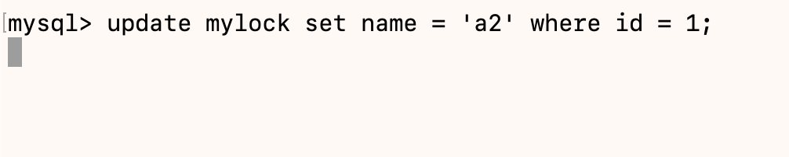
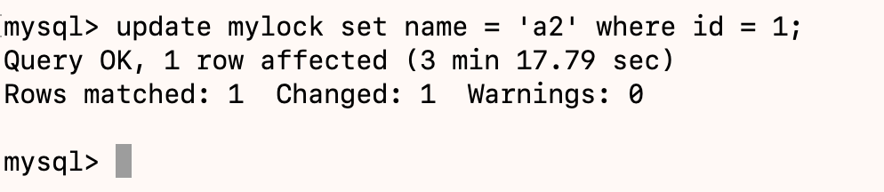
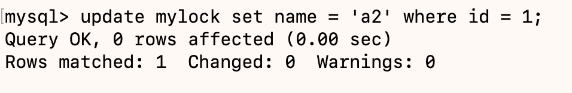
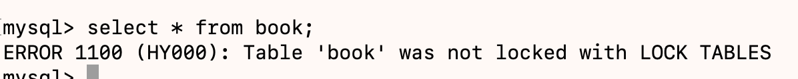

# 数据库锁理论概述

锁是计算机协调多个进程或现成并发访问某一个字段的机制。

在数据库中，除传统的计算资源（如CPU、RAM、I/O等）的争用以外，数据也是一种供许多用户共享的资源。如何保证数据并发访问的一致性、有效性是所有数据库必须解决的一个问题，锁冲突也是影响数据库并发访问性能的一个重要因素。从这个角度来说，锁对数据库而言显得尤其重要，也更加复杂。

## 锁的分类

- 从对数据操作的类型（读、写）分；
  **读锁（共享锁）**：针对同一份数据，多个读操作可以同时进行而不会相互影响；
  **写锁（排他锁）**：当前写操作没有完成前，它会阻断其他写锁和读锁；
- 从对数据操作的粒度分
  **表锁、行锁**

## 三锁

1. 表锁（偏读）

   **特点：** 偏向MyISAM存储引擎，开销小，加锁快；无死锁；锁定粒度大，发生锁冲突的概率最高，并发度最低。

   **案例分析：**
   - 建表SQL

    ```sql
    create table mylock
    (
        id   int not null primary key auto_increment,
        name varchar(20)
    ) engine = myisam;

    insert into mylock(name)
    values ('a');
    insert into mylock(name)
    values ('b');
    insert into mylock(name)
    values ('c');
    insert into mylock(name)
    values ('d');
    insert into mylock(name)
    values ('e');
    ```

   - 加读锁

    **session1,执行`lock table mylock read`**
    
    **session1,执行`show lock tables;`查看是否被锁**
    
    
    **session1,执行查询语句`select * from mylock`**
    
    **session2,执行查询语句**
    
    **session1,对`mylock`执行更新或插入语句或读其他表**
    
    **session2,对`mylock`执行执行更新或插入语句**
    
    可以看到,另外一个会话处于被阻塞状态。
    **session1释放锁`unlock tables`**
    
    **session2，阻塞状态被放开**
    

   - 加写锁

    **session1,执行`lock table mylock write`**
    
    **session1,执行`update mylock set name = 'a2' where id = 1`**
    
    **session1,执行`select * from book`**
    
    **session2,执行`select * from mylock`**
    
    这里可以看到被阻塞了。
    **session1,执行`unlock tables`**
    
    **session2查询到了数据**
    
   **表锁分析：**
   MyISAM在执行查询语句前，会自动给涉及的所有表加读锁，在执行增删改前，会自动给涉及的表加写锁。MySQL的表级锁有两种模式：
   - 表共享锁(Table Read Lock)
   - 表独占写锁(Table Write Lock)

    |锁类型|可否兼容|读锁|写锁|
    |----|----|----|----|
    |读锁|是|是|否|
    |写锁|是|否|否|

    结论：对MyISAM表进行操作，会有以下情况：
    1. 对MyISAM表的读操作（加读锁），不会阻塞其他进程对同一表的读请求，但会阻塞对同一表的写请求。只有当读锁释放后，才会执行其他进程的写操作。
    2. 对MyISAM表的写操作（加写锁），会阻塞其他进程对同一表的读和写操作，只有当写锁释放后，才会执行其他进程的读写操作。

    查看锁表的命令：
    1. 看看那些表被锁了：`show open tables`;
    2. 如何分析表锁定：可以通过检查`table_locks_waited`和`table_like_immediate`状态变量来分析系统上的表锁定，`show status like 'table%'`；

2. 行锁（偏写）

    偏向InnoDB存储引擎，开销大，加锁慢；会出现死锁。锁粒度最小，发生锁冲突的概率最低，并发度也最高。InnoDB与MyISAM的最大不同有两点：一是支持事务(Transaction)；二是采用了行级锁。
    **案例分析：**
    - 建表SQL

    ```sql
    create table test_innodb_lock(a int(11),b varchar(16)) engine=innodb;
    insert into test_innodb_lock values (1,'b2');
    insert into test_innodb_lock values (2,'3');
    insert into test_innodb_lock values (3,'4000');
    insert into test_innodb_lock values (4,'5000');
    insert into test_innodb_lock values (5,'6000');
    insert into test_innodb_lock values (6,'7000');
    insert into test_innodb_lock values (7,'8000');
    insert into test_innodb_lock values (8,'9000');
    insert into test_innodb_lock values (1,'b1');
    create index test_innodb_a_ind on test_innodb_lock(a);
    create index test_innodb_b_ind on test_innodb_lock(b);
    ```

    - 行锁定基本演示
    - 无索引行锁升级为表锁
    - 间隙锁的危害
    - 面试题：常考如何锁定一行

3. 页锁
