# explain

## 是什么

使用`explain`关键字可以模拟优化器执行SQL查询语句，从而知道MySQL是如何处理你的SQL语句的。分析你的查询语句或是表结构的性能瓶颈。

## 能干嘛

- 表的读取顺序
- 数据读取操作的操作类型
- 哪些索引可以使用
- 哪些索引被实际使用
- 表之间的引用
- 每张表有多少行被优化器查询

## 怎么玩

- `explain + SQL语句`
- 执行计划包含的信息
  explain 表头
  1. id
   select查询的序列号，包含一组数据，表示查询中执行select子句或操作表的顺序；有以下三种情况：
      - id相同，执行顺序由上至下；
        
        执行顺序：t1 -> t3 -> t2
      - id不同，如果是子查询，ID的序号会递增，ID值越大优先级越高，越先被执行
        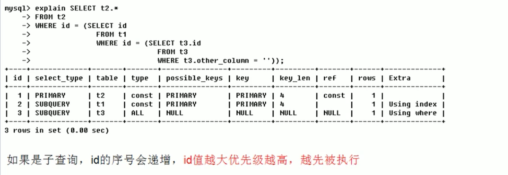
        执行顺序：t3 -> t1 -> t2
      - id相同不同，同时存在
        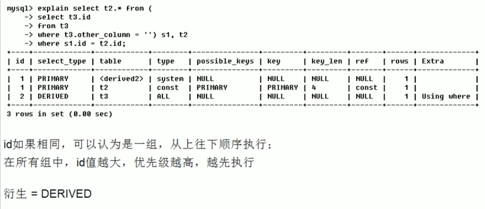
        执行顺序：t3 -> t2 -> t1。`dervied2` 中的`2`代表来自`id=2`衍生加载的
  2. select_type
    `select_type`有如下几种类型：
    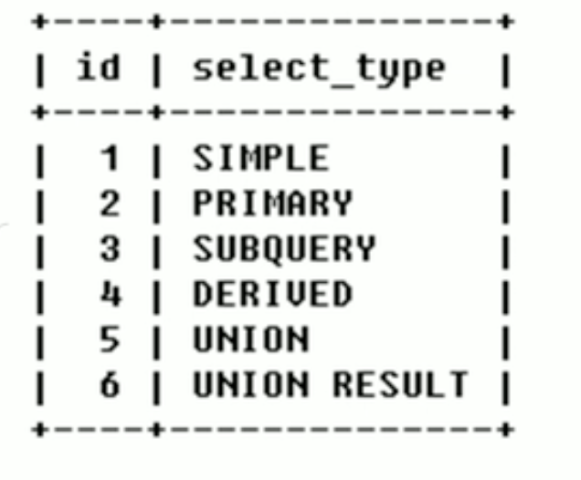
    查询的类型，主要是用于区别普通查询、联合查询、子查询等的复杂查询。
       - SIMPLE：简单的select查询，查询中不包含子查询或者UNION；
       - PRIMARY：查询中若包含任何复杂的子部分，最外层查询则被标记为；
       - SUBQUERY：在SELECT或WHERE列表中包含了子查询；
       - DERIVED：在FROM列表中包含的子查询被标记为DERIVED（衍生），MySQL会递归执行这些子查询，把结果放在临时表里；
       - UNION：若第二个SELECT出现在UNION后，则被标记为UNION；若UNION包含在FROM子句的子查询中，外层SELECT将被标记为：DERIVED；
       - UNION RESULT：从UNION表获取结果的SELECT；
  3. table
    显示这一行的数据是关于哪张表的
  4. partitions
    测试
  5. type
    表示查询使用了何种访问类型，有如下几种：
    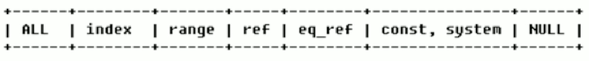
    结果值从最好到最次是：`system > const > eq_ref > ref > fulltext > ref_or_null > index_merge > unique_subquery > range > index > All`；
    **常用的： 从最好到最差一次是：system > const > eq_ref > ref > range > index > All**
       - system：表只有一行记录（等于系统表），这是const类型的特例，平时不会出现，这个也可以忽略不计
       - const：表示通过索引一次就找到了，const用于比较primary key 或者 unique索引。因为只匹配一行数据，所以很快。如将主键置于where 列表中，MySQL就能将该查询转换为一个常量；
       - eq_ref：唯一索引扫描，对于每个索引键，表中只有一条记录与之匹配。常见于主键或唯一索引扫描；
       - ref：非唯一性索引扫描，返回匹配某个单独值的所有行，本质上也是一种索引访问，它返回所有匹配某个单独值的行，然而，它可能会找到多个符合条件的行，所以它应该属于查找和扫描的混合体；
       - range：只检索给定范围的行，使用一个索引来选择行。key 列显示了使用了哪个索引。一般就是在你的where语句中出现了`between 、<、>、in`等的查询。这种范围扫描索引扫描比全表扫描要好，因为它只需要开始于索引的某一点，而结束于另一点，不用扫描全部索引。
       - index：`Full index scan`,index与All区别为index 类型只遍历索引树。这通常比All快，因为索引文件通常比数据文件小。也就是说虽然All和index都是读全表，但是index是从索引中读取的，而All是从硬盘中读取的
       - All：`Full table scan`，将遍历全表以找到匹配的行
        **一般来说，得保证查询至少达到range级别，最好能达到ref**
  6. possible_keys
    显示可能应用在这张表中的索引，一个或多个。查询涉及的字段上若存在索引，则该索引被列出，**但不一定被查询实际使用**
  7. key
    实际使用的索引。如果为NULL，则没有使用索引。查询中若使用了覆盖索引，则该索引仅出现在key列表中。
  8. key_len
    表示索引中使用的字节数，可通过该列计算查询中使用的索引的长度。在不损失精确性的情况下，长度越短越好。`ken_len`显示的值为索引字段的最大可能长度，**并非实际长度**，即ken_len是根据表定义计算而得，不是通过表内检索出的。
    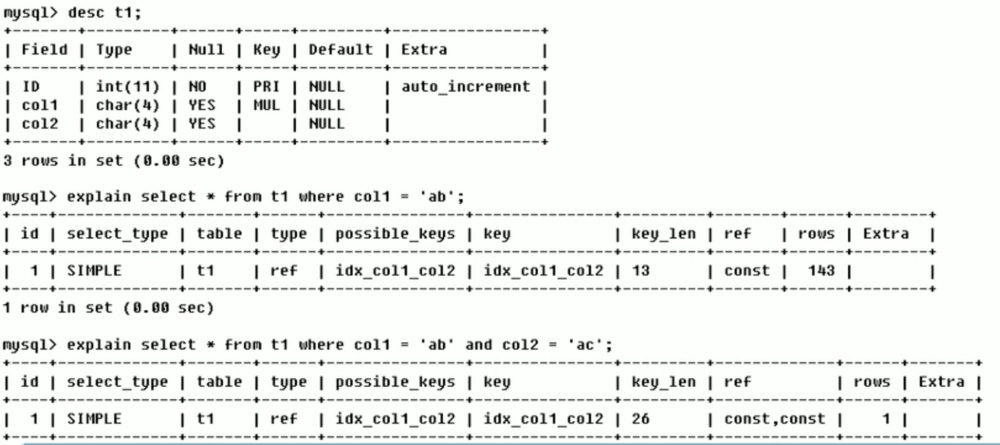
  9. ref
    显示索引的哪一列被使用了，如果可能的话，是一个常数。哪些列或常量被用于查找索引列上的值。
    如下所示：
    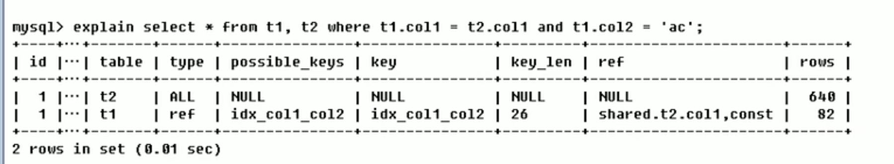
    由`key_len`可知t1表的idx_col1_col2被充分利用，col1匹配t2表的col1，col2匹配了一个常量，即'ac'。
    **查询中与其他表关联的字段，外键关系建立索引**
  10. rows
    根据表统计信息及索引选用情况，大致估算出找到所需的记录所需要读取的行数。
    如下显示，建立索引后查询结果所读取的大致行数：
    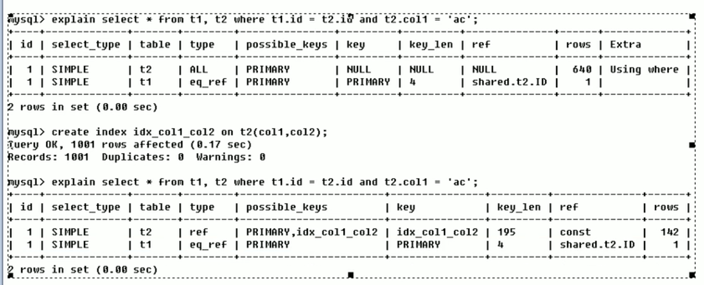
  11. filterd
    
  12. Extra
    包含不合适在其他列中显示但十分重要的额外信息。
        - **Using filesort**：说明MySQL会对数据使用一个外部的索引排序，而不是按照表内的索引顺序进行读取。MySQL中无法利用索引完成的排序操作称为“文件排序”；以下显示，**排序时使用了文件排序：**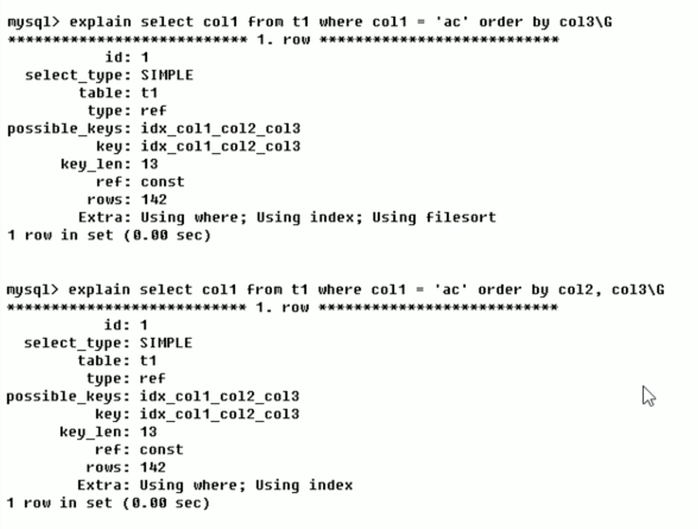这里说明，在排序时需要按照建立索引的顺序去使用才能使索引生效;
        - **Using temporary**：使用了临时表保存中间结果，MySQL在对查询结果排序时使用临时表。常见于排序`order by`和分组查询`group by`;以下显示，使用了临时表后重建索引与`group by`字段顺序一致优化结果。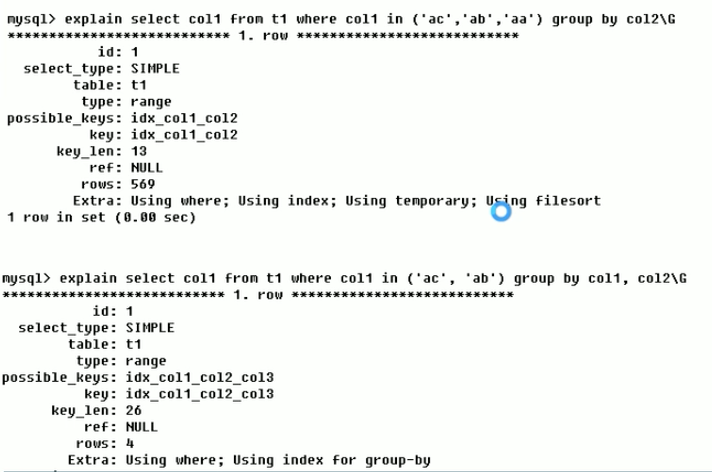
        - **USING index**：表示相应的select操作中使用了覆盖索引(Covering Index)，避免访问了表的数据行，效率不错！如果同时出现`using where`，表明索引被用来执行索引键值的查找。如果没有同时出现`using where`，表明索引用来读取数据而非执行查找动作；如下实例：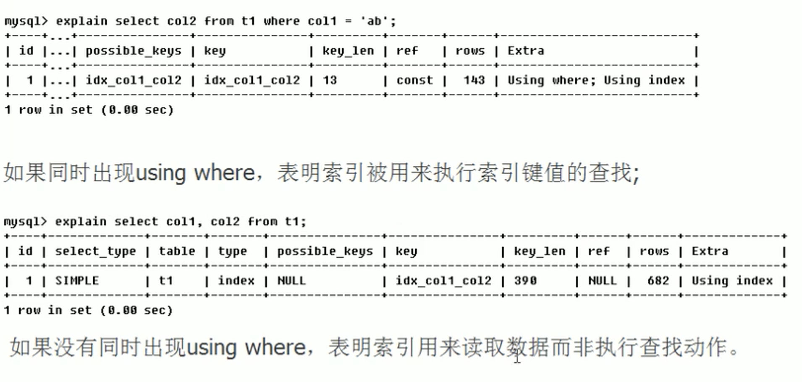
            **覆盖索引(Covering Index)**，一说为索引覆盖。
            理解方式一：就是SELECT的数据列只有从索引中就能够取得，不必读取数据行，MySQL可以利用索引返回SELECT列表中的字段，而不必根据索引再依次读取数据文件，换句话说**查询列要被所建的索引覆盖**。
            理解方式二：索引是高效找到行的一个方法，但是一般数据库也能使用索引找到一个列的数据，因此它不必读取整个行。毕竟索引叶子节点存储了它们索引的数据；当能通过读取索引就可以得到想要的数据，那就不需要读取行了。一个索引包含了（或覆盖了）满足查询结果的数据就叫做覆盖索引。
            注意：如果要使用覆盖索引，一定要注意SELECT列表中只取出需要的列，不可`select *`,因为如果将所有字段一起做索引会导致索引文件过大，查询性能降低。
        - **Using where**：表明使用了where连接；
        - **Using join buffer**：使用了连接缓存；
        - **impossible where**：where子句的值总是false，不能用来获取任何元组，如下：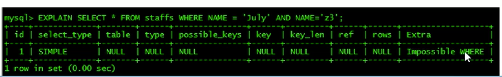
        - **select tables optimized away**：在没有`group by`子句的情况下，基于索引优化`MIN/MAX`操作或者对于MyISAM存储引擎优化COUNT(*)操作，不必等到执行阶段再进行计算，查询执行计划生成的阶段即完成优化。
        - **distinct**：优化distinct操作，在找到第一匹配的元组后即停止找同样值的动作。
