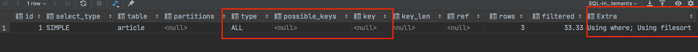
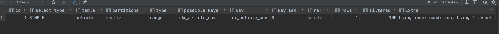

# 索引单表优化

## 建表脚本

```sql
create table if not exists `article`
(
    `id`          int(10) unsigned not null primary key auto_increment,
    `author_id`   int(10) unsigned not null,
    `category_id` int(10) unsigned not null,
    `views`       int(10) unsigned not null,
    `comments`    int(10) unsigned not null,
    `title`       varbinary(255)   not null,
    `content`     text             not null
);

insert into `article`(`author_id`, `category_id`, `views`, `comments`, `title`, `content`)
values (1, 1, 1, 1, '1', '1'),
       (2, 2, 2, 2, '2', '2'),
       (1, 1, 3, 3, '3', '3');
```

## 需求

查询`categroy_id`为1且`comments`大于1的情况下，views最多的`article_id`

## 分析过程

查看执行计划

```sql
    explain select id, author_id from article where category_id = 1 and comments > 1 order by views desc limit 1;
```

**结果：**

**结论：**
很显然，type是All，即最坏的情况.Extra里还出现了`Using filesort`，也是最坏的情况。优化是必须的。

根据where 后的字段条件顺序，建立索引。

```sql
    create index idx_article_ccv on article (category_id, comments, views);
```

再次执行explain语句，查看执行计划
**结果：**

**结论：**
这里使用了创建的索引，但是Extra里面还是显示了使用了文件排序(`using filesort`)，这是由于`comments > 1`产生了范围，而范围以后的索引会失效。因此这样创建的索引并不是有用的；删除该索引；

既然范围只有的索引无效，那么创建索引是就跳过该字段，重新创建索引

```sql
    create index idx_article_cv on article (category_id, views);
```

在此执行explain语句，查看执行计划
**结果：**

**结论：**
这里可以看到即使用了索引，并且`Extra`里面也没有使用到文件排序，达到优化目的；
