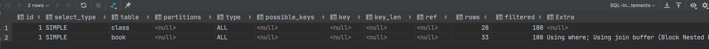
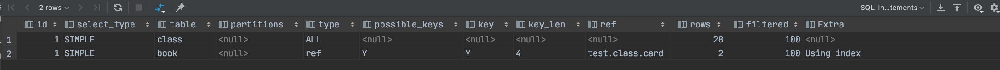
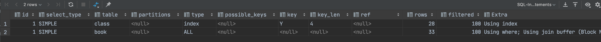

# 索引两表优化

## 建表脚本

```sql
drop table `class`;
create table if not exists `class`(
    `id` int(10) unsigned not null auto_increment,
    `card` int(10) unsigned not null,
    primary key (`id`)
);
drop table `book`;
create table if not exists `book`(
    `bookid` int(10) unsigned not null auto_increment,
    `card` int(10) unsigned not null ,
    primary key (`bookid`)
);

insert into class(card) values (floor(1+rand()*20));
insert into class(card) values (floor(1+rand()*20));
insert into class(card) values (floor(1+rand()*20));
insert into class(card) values (floor(1+rand()*20));
insert into class(card) values (floor(1+rand()*20));
insert into class(card) values (floor(1+rand()*20));
insert into class(card) values (floor(1+rand()*20));
insert into class(card) values (floor(1+rand()*20));
insert into class(card) values (floor(1+rand()*20));
insert into class(card) values (floor(1+rand()*20));
insert into class(card) values (floor(1+rand()*20));
insert into class(card) values (floor(1+rand()*20));
insert into class(card) values (floor(1+rand()*20));
insert into class(card) values (floor(1+rand()*20));
insert into class(card) values (floor(1+rand()*20));
insert into class(card) values (floor(1+rand()*20));
insert into class(card) values (floor(1+rand()*20));
insert into class(card) values (floor(1+rand()*20));
insert into class(card) values (floor(1+rand()*20));
insert into class(card) values (floor(1+rand()*20));
insert into class(card) values (floor(1+rand()*20));
insert into class(card) values (floor(1+rand()*20));
insert into class(card) values (floor(1+rand()*20));
insert into class(card) values (floor(1+rand()*20));
insert into class(card) values (floor(1+rand()*20));
insert into class(card) values (floor(1+rand()*20));
insert into class(card) values (floor(1+rand()*20));
insert into class(card) values (floor(1+rand()*20));

insert into book(card) values (floor(1+rand()*20));
insert into book(card) values (floor(1+rand()*20));
insert into book(card) values (floor(1+rand()*20));
insert into book(card) values (floor(1+rand()*20));
insert into book(card) values (floor(1+rand()*20));
insert into book(card) values (floor(1+rand()*20));
insert into book(card) values (floor(1+rand()*20));
insert into book(card) values (floor(1+rand()*20));
insert into book(card) values (floor(1+rand()*20));
insert into book(card) values (floor(1+rand()*20));
insert into book(card) values (floor(1+rand()*20));
insert into book(card) values (floor(1+rand()*20));
insert into book(card) values (floor(1+rand()*20));
insert into book(card) values (floor(1+rand()*20));
insert into book(card) values (floor(1+rand()*20));
insert into book(card) values (floor(1+rand()*20));
insert into book(card) values (floor(1+rand()*20));
insert into book(card) values (floor(1+rand()*20));
insert into book(card) values (floor(1+rand()*20));
insert into book(card) values (floor(1+rand()*20));
insert into book(card) values (floor(1+rand()*20));
insert into book(card) values (floor(1+rand()*20));
insert into book(card) values (floor(1+rand()*20));
insert into book(card) values (floor(1+rand()*20));
insert into book(card) values (floor(1+rand()*20));
insert into book(card) values (floor(1+rand()*20));
insert into book(card) values (floor(1+rand()*20));
insert into book(card) values (floor(1+rand()*20));
insert into book(card) values (floor(1+rand()*20));
insert into book(card) values (floor(1+rand()*20));
insert into book(card) values (floor(1+rand()*20));
insert into book(card) values (floor(1+rand()*20));
insert into book(card) values (floor(1+rand()*20));
```

## 需求

分析`explain select * from class left join book  on class.card = book.card`，如下：

可以看到`type=All`为全表扫描，且没有使用索引。

## 分析过程

1. 给`book`表添加索引优化

   ```sql
    alter table `book` add index Y(`card`);
   ```

   执行上述的explain分析语句，结果如下：
   
   可以看到第二行的`type`变成为`ref`,`rows`也变小了，优化比较明显。这是由左连接特性决定的，`left join`条件用于确定如何从右表搜索行，左边一定都有,所以右边是我们的关键点，一定需要建立索引。

2. 给`class` 表添加索引优化
   添加之前先删除第一步创建的`book`的索引。

   ```sql
    alter table `class` add index Y(`card`);
   ```

   执行上述的explain分析语句，结果如下：
   
   可以看到`type`变成`index`，并没有第一步的`ref`效率高，并且`rows`行数也变多。由此可见，对于左连接给左表加索引效率并不高。

## 结论

对于左连接，右表需要建立索引。对于右连接，左表需要建立索引。
