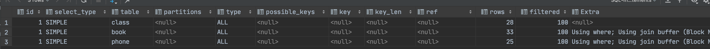
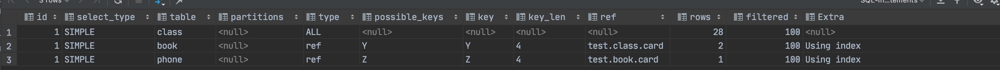

# 索引三表优化

## 需求

在上一节两表优化的基础上在添加一张`phone`表。

```sql
drop table if exists `phone`;
create table if not exists `phone`(
    `phoneid` int(10) unsigned not null auto_increment,
    `card` int(10) unsigned not null ,
    primary key (phoneid)
);
insert into phone(card) values (floor(1+rand()*20));
insert into phone(card) values (floor(1+rand()*20));
insert into phone(card) values (floor(1+rand()*20));
insert into phone(card) values (floor(1+rand()*20));
insert into phone(card) values (floor(1+rand()*20));
insert into phone(card) values (floor(1+rand()*20));
insert into phone(card) values (floor(1+rand()*20));
insert into phone(card) values (floor(1+rand()*20));
insert into phone(card) values (floor(1+rand()*20));
insert into phone(card) values (floor(1+rand()*20));
insert into phone(card) values (floor(1+rand()*20));
insert into phone(card) values (floor(1+rand()*20));
insert into phone(card) values (floor(1+rand()*20));
insert into phone(card) values (floor(1+rand()*20));
insert into phone(card) values (floor(1+rand()*20));
insert into phone(card) values (floor(1+rand()*20));
insert into phone(card) values (floor(1+rand()*20));
insert into phone(card) values (floor(1+rand()*20));
insert into phone(card) values (floor(1+rand()*20));
insert into phone(card) values (floor(1+rand()*20));
insert into phone(card) values (floor(1+rand()*20));
insert into phone(card) values (floor(1+rand()*20));
insert into phone(card) values (floor(1+rand()*20));
insert into phone(card) values (floor(1+rand()*20));
insert into phone(card) values (floor(1+rand()*20));
```

## 分析

执行分析语句：`explain select * from class left join book  on class.card = book.card left join phone on book.card = phone.card;`

1. `class`,`book`,`phone`三张表不建立任何索引的结果
   
   可以看到`type`全部是`All`全表扫描，效率低。
2. 根据上一节的结果，左表连接需要再右表建立索引，那么当三张表连接时，需分别在`phone`，`book`表建立索引

   ```sql
    alter table `book` add index Y(`card`);
    alter table `phone` add index Z(`card`);
   ```

   再次执行分析语句，结果如下：
   
   后2行的`type`都是`ref`，且总`rows`优化很好，效果不错。因此索引最好设置在经常查询的字段中。

## 结论

对于左连接查询，需在右表建立索引，且多次左连接查询需在每个右表的查询字段进行建立索引；
对于右连接查询，需在左表建立索引，且多次右连接查询需在每个左表的查询字段进行建立索引。

尽可能减少Join语句中的`NestedLoop`的循环总次数：**永远用小结果集驱动大结果集**；
