# 索引优化综合

## 建表语句

```sql
create table staffs(
    id int primary key auto_increment,
    name varchar(24) not null default '' comment '姓名',
    age int not null default 0 comment '年龄',
    pos varchar(20) not null default '' comment '职位',
    add_time timestamp not null default current_timestamp comment '入职时间'
) char set utf8 comment '员工记录表';

insert into staffs(name, age, pos, add_time) values ('z3',22,'manager',now());
insert into staffs(name, age, pos, add_time) values ('July',23,'dev',now());
insert into staffs(name, age, pos, add_time) values ('2000',23,'dev',now());

select * from staffs;

alter table staffs add index idx_staffs_nameAgePos(name,age,pos);
```

## 防止索引失效

1. 全值匹配最优；
   即条件和索引列数和顺序一致，最优；
   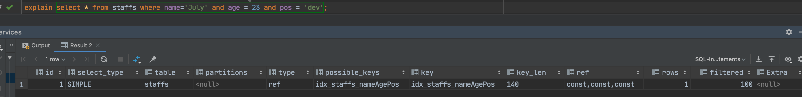
2. 最佳左前缀法则；
   如果索引了多列，要遵守最左前缀法则，指的是查询从索引的最左前列开始并且 **不跳过索引中的列**；
   **口诀：带头大哥不能死，中间兄弟不能断;**
   反例如下：
   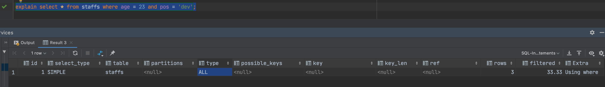
   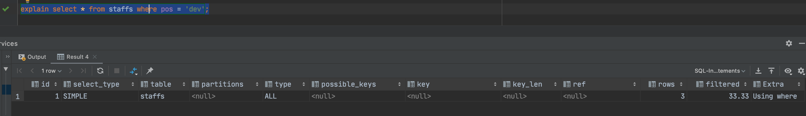
   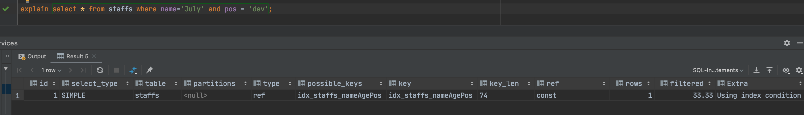
   `explain select * from staffs where name='July' and pos = 'dev';`的索引只用到了一部分，即`name`的索引，其他索引未使用
3. 不在索引列上做任何操作(计算、函数、（自动or手动）类型装换)，会导致索引失效而转向全表扫描；
   反例如下：
   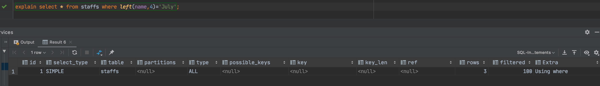
4. 存储引擎不能使用索引中范围条件右边的列；
   反例如下：**范围之后全失效**
   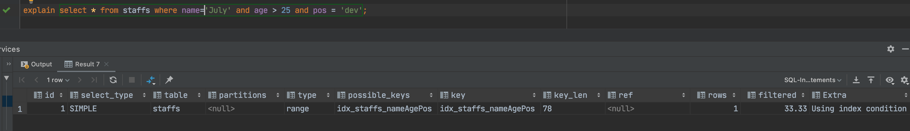
5. 尽量使用覆盖索引（只访问索引的查询（索引列和查询列一致）），减少`select *`；
   以下显示`select *`与使用查询索引列的区别
   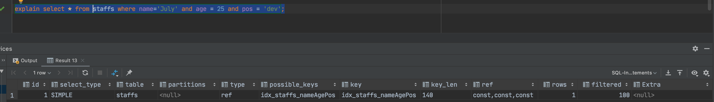
   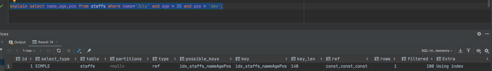
   可以看到`Extra`列的区别，查询索引列后会使用索引；
6. mysql在使用不等于(`!=`或者`<>`)的时候无法使用索引会导致全表扫描；
   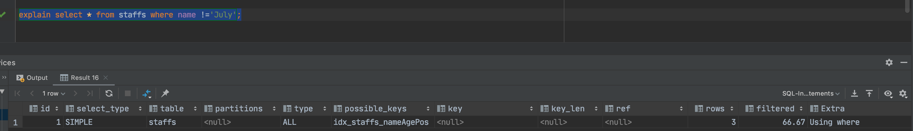
7. `is null`，`is not null`也无法使用索引；
   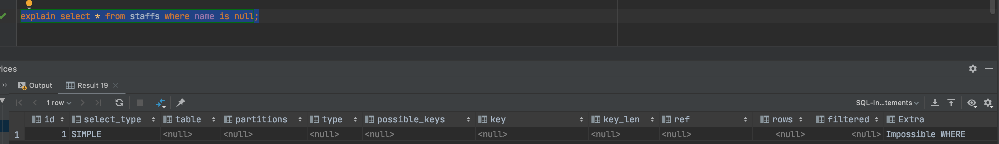
   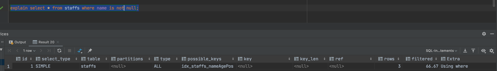
8. `like`以通配符开头(`%abc`)mysql索引失效会变成全表扫描的操作；
   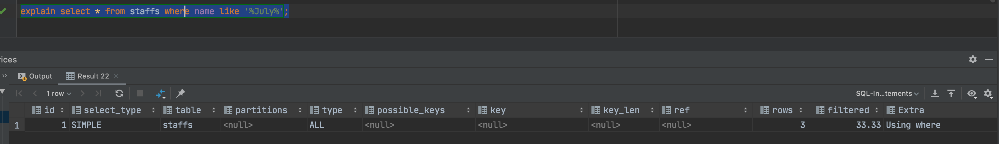
   
   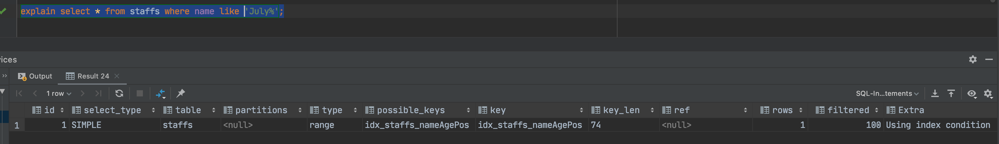
   以上可以看出：**只有`%`在最右边才会使用索引；**
   问题：如何解决like '%字符串%'时索引不被使用？？？
   答：建立覆盖索引，查询覆盖索引列，而不是`select *`
9. 字符串不加单引号索引失效；
    `name`是`varchar`类型，但是名称数据中有个`2000`值。
    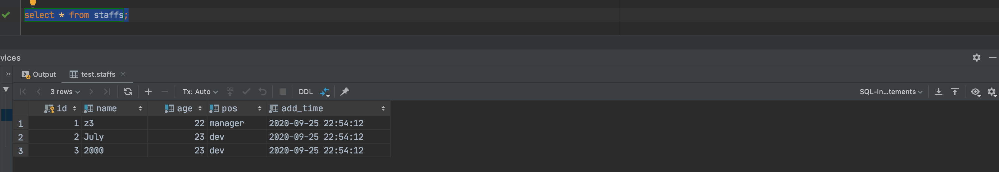
    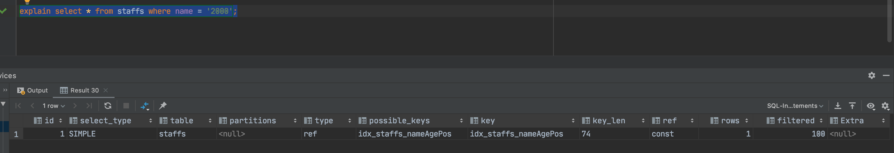
    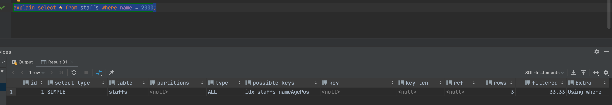
    可以看出当为整型时，查询并未走索引。这是由于产生了自动类型装换。
10. 少用or，用它来连接时会索引失效；
    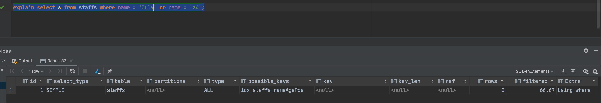

## 总结

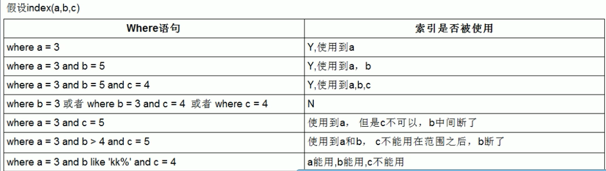
