# 索引面试题分析

## 建表语句

```sql
create table test03(
    id int primary key not null auto_increment,
    c1 char(10),
    c2 char(10),
    c3 char(10),
    c4 char(10),
    c5 char(10)
);

insert into test03(c1, c2, c3, c4, c5) value ('a1','a2','a3','a4','a5');
insert into test03(c1, c2, c3, c4, c5) value ('b1','b2','b3','b4','b5');
insert into test03(c1, c2, c3, c4, c5) value ('c1','c2','c3','c4','c5');
insert into test03(c1, c2, c3, c4, c5) value ('d1','d2','d3','d4','d5');
insert into test03(c1, c2, c3, c4, c5) value ('e1','e2','e3','e4','e5');

select * from test03;
```

## 建索引

```sql
create index idx_test03_c1234 on test03(c1, c2, c3, c4);

show index from test03;
```

## 问题

我们创建了复合索引`idx_test03_c1234`根据以下SQL分析下索引使用情况？
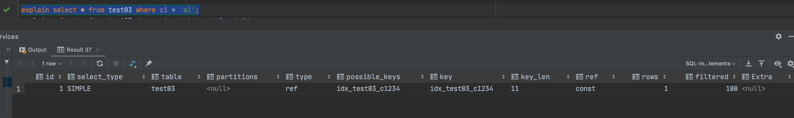
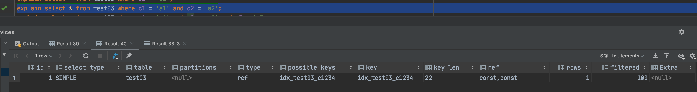
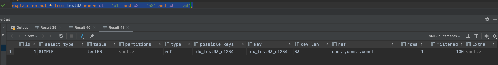
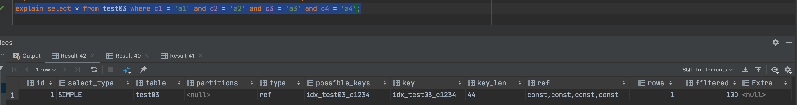
可以看到查询都使用了索引。
再看如下情况：
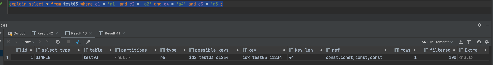
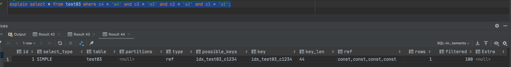
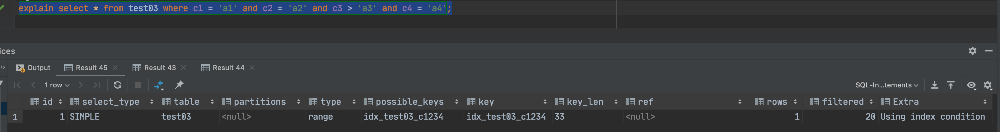
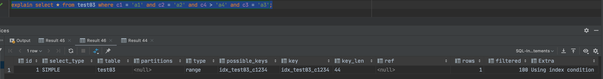
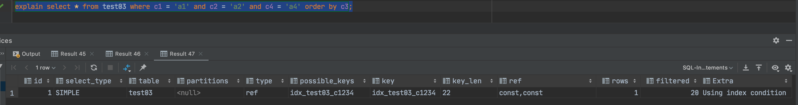
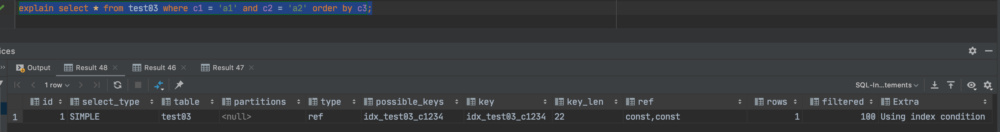
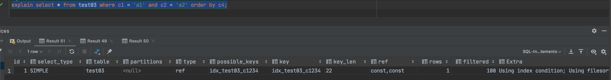
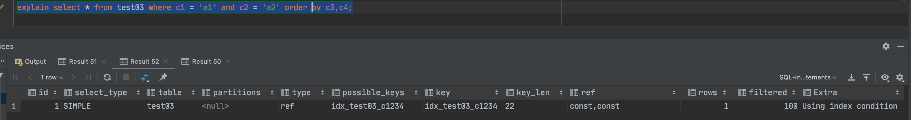
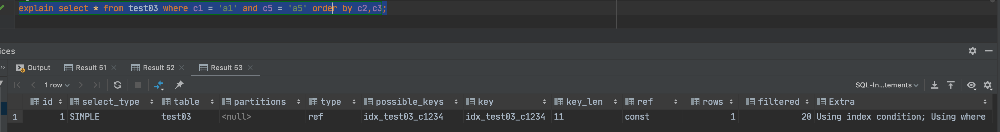
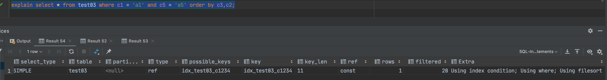

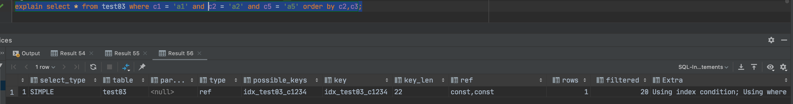
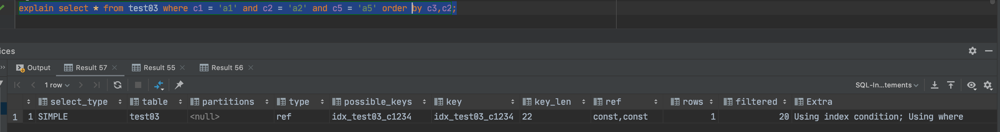
注意：上图中没有使用`filesort`的原因是由于`order by c3,c2`中的`c2`是常量，不需要进行排序

## 调优总结

1. 观察，至少跑1天，看看生产的慢SQL情况；
2. 开启慢查询日志，设置阙值，比如超过5秒钟的就是慢SQL，并将它抓取出来；
3. explain+慢SQL分析；
4. show profile 查询SQL在MySQL服务器里面的执行细节和生命周期情况;
5. 运维经理 OR  DBA，进行SQL数据库服务器的参数调优；
