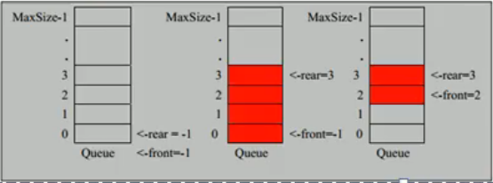

# 队列

- ## 基本介绍

  1. 队列是一个有序列表,可以用数组或者链表来实现
  2. 遵循先入先出的原则,即先存入队列的数据,要先取出.后存入的要后取出

- ## 数组模拟队列

  队列本身是有序列表,若使用数组的结构来存储队列的数据,则队列数组的声明如下图,其中maxSize是该队列的最大容量.

  因为队列的输入\输出是分别从前后端来处理,因此需要两个变量front及rear分别记录队列前后端的下标,front会随着数据输出而改变,而rear则是随着数据输入而改变.
  
  
  
- ## 代码实现

  ```java
  package com.structures.queue;
  
  import java.util.Scanner;
  
  public class ArrayQueueDemo {
      public static void main(String[] args) {
          ArrayQueue arrayQueue = new ArrayQueue(3);
          char key = ' ';//接受用户输入
          Scanner scanner = new Scanner(System.in);
          boolean loop = true;
          //输出一个菜单
          while (loop) {
              System.out.println("s(show):显示队列");
              System.out.println("e(exit):退出程序");
              System.out.println("a(add):添加数据到队列");
              System.out.println("g(get):从队列取出数据");
              System.out.println("h(head):查看队列头的数据");
              key = scanner.next().charAt(0);
              switch (key) {
                  case 's':
                      arrayQueue.showQueue();
                      break;
                  case 'a':
                      System.out.println("输入一个整数");
                      int value = scanner.nextInt();
                      arrayQueue.addQueue(value);
                      break;
                  case 'g':
                      try {
                          int queue = arrayQueue.getQueue();
                          System.out.printf("取出的数据是%d", queue);
                      }catch (Exception e){
                          System.out.println(e.getMessage());
                      }
                      break;
                  case 'e':
                      scanner.close();
                      loop = false;
                      break;
                  case 'h':
                      try {
                          int head = arrayQueue.headQueue();
                          System.out.printf("取出队列头的数据是%d", head);
                      }catch (Exception e){
                          System.out.println(e.getMessage());
                      }
                  default:
                      break;
              }
          }
          System.out.println("程序退出");
      }
  }
  
  //使用数组模拟队列-编写一个ArrayQueue类
  class ArrayQueue {
      //表示数组最大容量
      private int maxSize;
      //队列头
      private int front;
      //队列尾
      private int rear;
      //用于存放数据,模拟队列
      private int[] arr;
  
      //创建队列构造器
      public ArrayQueue(int arrMaxSize) {
          maxSize = arrMaxSize;
          arr = new int[maxSize];
          front = -1;//指向队列头的前一个位置
          rear = -1;//指向队列尾的数据,即就是队列最后一个数据
      }
  
      //判断队列是否满
      public boolean isFull() {
          return rear == maxSize - 1;
      }
  
      //判断队列是否为空
      public boolean isEmpty() {
          return rear == front;
      }
  
      //添加数据到队列
      public void addQueue(int n) {
          if (isFull()) {
              System.out.println("队列不能加入数据");
              return;
          }
          rear++;//让rear 后移
          arr[rear] = n;
      }
  
      //获取队列数据,出队列
      public int getQueue() {
          if (isEmpty()) {
              throw new RuntimeException("队列为空,不能取数据");
          }
          front++;
          return arr[front];
      }
  
      //显示队列所有数据
      public void showQueue() {
          if (isEmpty()) {
              System.out.println("队列为空,没有数据");
          }
          for (int i = 0; i < this.arr.length; i++) {
              System.out.printf("arr[%d]=%d\n", i, arr[i]);
          }
      }
  
      //显示队列的头数据,注意不是取数据
      public int headQueue() {
          if (isEmpty()) {
              throw new RuntimeException("队列为空,没有数据");
          }
          return arr[front + 1];
      }
  
  }
  ```

- ## 问题分析

  1. 目前这个数组使用一次就不能用,没有达到复用的效果.
  2. 将这个数组使用算法,改进成一个环形的队列:取模%
  
- ## 改进成环形队列的思路分析

  1. front变量的含义做一个调整:front 就指向队列的第一个元素,也就是arr[front]就是队列的第一个元素,front的初始值=0
  2. rear变量的含义做一个调整:rear 指向队列的最后一个元素的后一个位置,因为希望空出一个空间作为约定.rear初始值=0
  3. 当队列满时,条件是(rear+1)%maxSize = front.
  4. 当队列为空时条件,rear == front 空.
  5. 当我们这样分析,队列中有效的数据的个数=(rear+maxSize-front)%maxSize.

- ## 环形队列代码案例

  ```java
  package com.structures.queue;
  
  import java.util.Scanner;
  
  public class CircleArrayQueue {
      public static void main(String[] args) {
          CircleArray arrayQueue = new CircleArray(4);//这里设置4,其队列的有效数据最大是3
          char key = ' ';//接受用户输入
          Scanner scanner = new Scanner(System.in);
          boolean loop = true;
          //输出一个菜单
          while (loop) {
              System.out.println("s(show):显示队列");
              System.out.println("e(exit):退出程序");
              System.out.println("a(add):添加数据到队列");
              System.out.println("g(get):从队列取出数据");
              System.out.println("h(head):查看队列头的数据");
              key = scanner.next().charAt(0);
              switch (key) {
                  case 's':
                      arrayQueue.showQueue();
                      break;
                  case 'a':
                      System.out.println("输入一个整数");
                      int value = scanner.nextInt();
                      arrayQueue.addQueue(value);
                      break;
                  case 'g':
                      try {
                          int queue = arrayQueue.getQueue();
                          System.out.printf("取出的数据是%d", queue);
                      }catch (Exception e){
                          System.out.println(e.getMessage());
                      }
                      break;
                  case 'e':
                      scanner.close();
                      loop = false;
                      break;
                  case 'h':
                      try {
                          int head = arrayQueue.headQueue();
                          System.out.printf("取出队列头的数据是%d", head);
                      }catch (Exception e){
                          System.out.println(e.getMessage());
                      }
                  default:
                      break;
              }
          }
          System.out.println("程序退出");
      }
  
  }
  
  class CircleArray {
      //表示数组最大容量
      private int maxSize;
      //front变量的含义做一个调整:front 就指向队列的第一个元素,也就是arr[front]就是队列的第一个元素,front的初始值=0
      private int front;
      //rear变量的含义做一个调整:rear 指向队列的最后一个元素的后一个位置,因为希望空出一个空间作为约定.rear初始值=0
      private int rear;
      //用于存放数据,模拟队列
      private int[] arr;
  
      public CircleArray(int arrMaxSize) {
          maxSize = arrMaxSize;
          arr = new int[maxSize];
      }
  
      //判断队列是否满
      public boolean isFull() {
          return (rear + 1) % maxSize == front;
      }
  
      //判断队列是否为空
      public boolean isEmpty() {
          return rear == front;
      }
  
      //添加数据到队列
      public void addQueue(int n) {
          if (isFull()) {
              System.out.println("队列满,队列不能加入数据");
              return;
          }
          //直接将数据加入
          arr[rear] = n;
          //将rear后移,这里必须考虑取模
          rear = (rear + 1) % maxSize;
      }
  
      //获取队列数据,出队列
      public int getQueue() {
          if (isEmpty()) {
              throw new RuntimeException("队列为空,不能取数据");
          }
          //这里需要分析front是指向队列的第一个元素,
          //1.先把front对应的值保存到一个临时变量,
          //2.将front后移,考虑取模
          //3.将临时保存的变量返回
          int value = arr[front];
          front = (front + 1) % maxSize;
          return value;
      }
  
      //显示队列所有数据
      public void showQueue() {
          if (isEmpty()) {
              System.out.println("队列为空,没有数据");
          }
          //从front开始遍历
          for (int i = front; i < front + size(); i++) {
              System.out.printf("arr[%d]=%d\n", i % maxSize, arr[i % maxSize]);
          }
      }
  
      //求出当前队列有效数据的个数
      public int size() {
          return (rear + maxSize - front) % maxSize;
      }
  
      //显示队列的头数据,注意不是取数据
      public int headQueue() {
          if (isEmpty()) {
              throw new RuntimeException("队列为空,没有数据");
          }
          return arr[front];
      }
  }
  ```
