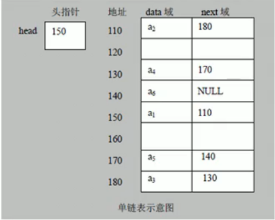
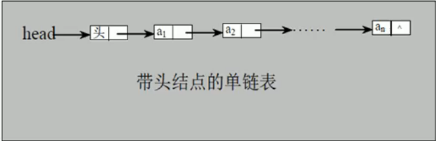

# 单链表

- ## 基本介绍

  链表是有序的列表,但是它在内存中存储如下

  
  1. 链表是以节点的方式来存储.
  2. 每个节点包含data域,next域:指向下一个节点.
  3. 如图:发现每个链表的各个节点不一定是连续存储
  4. 链表分带头节点的链表和没有头节点的链表,根据实际的需求来确定.

- ## 单链表介绍

  单链表(带头节点)**逻辑结构**示意图如下

  
  
- ## 单链表的应用实例

  使用带head头的单向链表实现-水浒英雄排行榜管理

  ```java
  package com.structures.linkedlist;
  
  public class SingleLinkedListDemo {
      public static void main(String[] args) {
          HeroNode heroNode1 = new HeroNode(1, "宋江", "及时雨");
          HeroNode heroNode2 = new HeroNode(2, "卢俊义", "玉麒麟");
          HeroNode heroNode3 = new HeroNode(3, "吴用", "智多星");
          HeroNode heroNode4 = new HeroNode(4, "林冲", "豹子头");
          SingleLinkedList singleLinkedList = new SingleLinkedList();
          singleLinkedList.add(heroNode3);
          singleLinkedList.add(heroNode2);
          singleLinkedList.add(heroNode4);
          singleLinkedList.add(heroNode1);
          singleLinkedList.list();
      }
  }
  
  //定义SingleLinkedList管理我们的英雄
  class SingleLinkedList {
      //先初始化一个头节点,头节点不能动,将来遍历用
      private HeroNode head = new HeroNode(0, "", "");
  
      //添加节点到单向链表
      //思路:当不考虑编号的顺序时
      //1. 找到当前链表的最后节点
      //2. 将最后这个节点的next域指向新的节点
      public void add(HeroNode node) {
          //因为head节点不能动,因此我们需要一个辅助遍历temp
          HeroNode temp = head;
          //遍历链表,找到最后
          while (temp.next != null) {
              //找到链表的最后
              //如果没有找到temp就后移
              temp = temp.next;
          }
          temp.next = node;
      }
  
      //显示链表[遍历]
      public void list() {
          //判断链表是否为空
          if (head.next == null) {
              System.out.println("链表为空");
          }
          //因为头节点不能动,因此我们需要一个辅助变量来遍历
          HeroNode temp = head.next;
          while (temp != null) {
              //判断是否到最后
              //输出节点的信息
              System.out.println(temp);
              //将temp后移
              temp = temp.next;
          }
      }
  }
  
  //定义一个HeroNode,每个HeroNode对象就是一个节点
  class HeroNode {
      public int no;
      public String name;
      public String nickName;
      public HeroNode next;//指向下一个节点
  
      //构造器
      public HeroNode(int no, String name, String nickName) {
          this.no = no;
          this.name = name;
          this.nickName = nickName;
      }
  
      public HeroNode getNext() {
          return next;
      }
  
      public void setNext(HeroNode next) {
          this.next = next;
      }
  
      @Override
      public String toString() {
          return "HeroNode{" +
                  "no=" + no +
                  ", name='" + name + '\'' +
                  ", nickName='" + nickName + '\'' +
                  '}';
      }
  }
  /*
  HeroNode{no=3, name='吴用', nickName='智多星'}
  HeroNode{no=2, name='卢俊义', nickName='玉麒麟'}
  HeroNode{no=4, name='林冲', nickName='豹子头'}
  HeroNode{no=1, name='宋江', nickName='及时雨'}
  */
  ```

  可以看到以上链表的实现方式,在添加英雄时,并未按照英雄的编号进行**排序**.
  下面重新写一个添加方法,实现插入英雄时按编号排序

  ```java
  package com.structures.linkedlist;
  
  public class SingleLinkedListDemo {
      public static void main(String[] args) {
          HeroNode heroNode1 = new HeroNode(1, "宋江", "及时雨");
          HeroNode heroNode2 = new HeroNode(2, "卢俊义", "玉麒麟");
          HeroNode heroNode3 = new HeroNode(3, "吴用", "智多星");
          HeroNode heroNode4 = new HeroNode(4, "林冲", "豹子头");
          SingleLinkedList singleLinkedList = new SingleLinkedList();
          singleLinkedList.addByNo(heroNode3);
          singleLinkedList.addByNo(heroNode2);
          singleLinkedList.addByNo(heroNode4);
          singleLinkedList.addByNo(heroNode1);
          singleLinkedList.list();
      }
  }
  
  //定义SingleLinkedList管理我们的英雄
  class SingleLinkedList {
      //先初始化一个头节点,头节点不能动,将来遍历用
      private HeroNode head = new HeroNode(0, "", "");
  
      //添加节点到单向链表
      //思路:当不考虑编号的顺序时
      //1. 找到当前链表的最后节点
      //2. 将最后这个节点的next域指向新的节点
      public void add(HeroNode node) {
          //因为head节点不能动,因此我们需要一个辅助遍历temp
          HeroNode temp = head;
          //遍历链表,找到最后
          while (temp.next != null) {
              //找到链表的最后
              //如果没有找到temp就后移
              temp = temp.next;
          }
          temp.next = node;
      }
  
      //第二种添加英雄的方式,在添加英雄时,根据排名将英雄插入到指定位置
      //如果有这个排名,则添加失败,并给出提示
      public void addByNo(HeroNode heroNode) {
          //因为head节点不能动,因此我们需要一个辅助遍历temp
          //因为单链表,因此找的temp是位于添加位置的前一个节点,否则加入不了
          HeroNode temp = head;
          boolean flag = false;//标识添加的编号是否存在,默认false
          while (true) {
              if (temp.next == null) {
                  break;
              }
              if (temp.next.no > heroNode.no) {//位置找到,就在temp的后面插入
                  break;
              } else if (temp.next.no == heroNode.no) {
                  //编号已存在
                  flag = true;
                  break;
              }
              temp = temp.next;
          }
          if (flag) {
              System.out.printf("准备插入的英雄的编号 %d 已存在,不能加入\n", heroNode.no);
          } else {
              //插入链表temp的后面
              heroNode.next = temp.next;
              temp.next = heroNode;
          }
      }
  
      //显示链表[遍历]
      public void list() {
          //判断链表是否为空
          if (head.next == null) {
              System.out.println("链表为空");
          }
          //因为头节点不能动,因此我们需要一个辅助变量来遍历
          HeroNode temp = head.next;
          while (temp != null) {
              //判断是否到最后
              //输出节点的信息
              System.out.println(temp);
              //将temp后移
              temp = temp.next;
          }
      }
  }
  
  //定义一个HeroNode,每个HeroNode对象就是一个节点
  class HeroNode {
      public int no;
      public String name;
      public String nickName;
      public HeroNode next;//指向下一个节点
  
      //构造器
      public HeroNode(int no, String name, String nickName) {
          this.no = no;
          this.name = name;
          this.nickName = nickName;
      }
  
      public HeroNode getNext() {
          return next;
      }
  
      public void setNext(HeroNode next) {
          this.next = next;
      }
  
      @Override
      public String toString() {
          return "HeroNode{" +
                  "no=" + no +
                  ", name='" + name + '\'' +
                  ", nickName='" + nickName + '\'' +
                  '}';
      }
  }
  /*
  HeroNode{no=1, name='宋江', nickName='及时雨'}
  HeroNode{no=2, name='卢俊义', nickName='玉麒麟'}
  HeroNode{no=3, name='吴用', nickName='智多星'}
  HeroNode{no=4, name='林冲', nickName='豹子头'}
  */
  ```

  再次进行完善功能,添加**修改节点**功能

  ```java
  //修改节点的信息,根据no编号来修改,即编号no不能修改.
      public void update(HeroNode heroNode) {
          //判断是否为空
          if (head.next == null) {
              System.out.println("链表为空");
          }
          //找到需要修改的节点,根据no编号
          HeroNode temp = head.next;
          boolean flag = false;//表示节点是否找到
          while (true) {
              if (temp == null) {
                  break;
              }
              if (temp.no == heroNode.no) {
                  flag = true;
                  break;
              }
              temp = temp.next;
          }
          if (flag) {
              temp.name = heroNode.name;
              temp.nickName = heroNode.nickName;
          } else {
              System.out.printf("没有找到 编号%d 的节点,不能修改\n", heroNode.no);
          }
      }
  ```

  再次进行完善功能,添加**删除节点**功能

  ```java
  //删除节点
      public void remove(HeroNode heroNode) {
          //判断是否为空
          if (head.next == null) {
              System.out.println("链表为空");
          }
          HeroNode temp = head.next;
          boolean flag = false;//标识是否找到待删除的点
          while (true) {
              if (temp == null) {
                  break;
              }
              if (temp.next.no == heroNode.no) {
                  flag = true;
                  break;
              }
              temp = temp.next;
          }
          if (flag) {
              temp.next = temp.next.next;
          } else {
              System.out.printf("无法删除 编号%d 的节点,\n", heroNode.no);
          }
      }
  ```

  再次进行完善功能,添加**统计单链表的有效节点数**功能

  ```java
  /**
       * 获取单链表的有效节点数,不统计头节点
       * @param head 链表的头结点
       * @return 有效节点数
       */
      public static int getLength(HeroNode head) {
          if (head.next == null) {
              return 0;
          }
          int count = 0;
          HeroNode temp = head.next;
          while (temp.next != null) {
              count++;
              temp = temp.next;
          }
          return count;
      }
  ```

  再次进行完善功能,添加**查找单链表中的倒数第K个节点**功能

  ```java
  /**
       * 查找单链表的倒数第K个节点[新浪面试题]
       * 思路:
       * 1.先把链表从头到尾遍历,得到链表的总长度
       * 2.得到size后,从链表的第一个开始遍历到(size-index)个,就可以得到
       *
       * @param head
       * @param index 表示倒数第index个节点
       * @return
       */
      public static HeroNode findLastIndexNode(HeroNode head, int index) {
          if (head.next == null) {
              return null;
          }
          int size = getLength(head);
          if (index <= 0 || index > size) {
              return null;
          }
          HeroNode temp = head.next;
          for (int i = 0; i < (size - index); i++) {
              temp = temp.next;
          }
          return temp;
      }
  ```

  再次进行完善功能,添加**单链表反转**功能

  ```java
      /**
       * 反转链表[腾讯面试题]
       * 思路:
       * 1.先定义一个reverseHead = new HeroHead();
       * 2.从头到尾遍历原来的链表,每遍历一个节点,就将其取出,并放在新的链表的最前端;
       * 3.原来的链表的head.next = reverseHead.next;
       */
      public static void reverseList(HeroNode head) {
          if (head.next == null || head.next.next == null) {
              return;
          }
          HeroNode curr = head.next;
          HeroNode next = null;//指向当前节点[curr]的下一个节点
          HeroNode reverseHead = new HeroNode(0, "", "");
  
          while (curr != null) {
              next = curr.next;//先暂时保存curr节点的下一个节点
              curr.next = reverseHead.next;//将curr的下一个节点指向新的链表的最前端
              reverseHead.next = curr;//将curr连接到新的链表上
              curr = next;//让curr后移
          }
          head.next = reverseHead.next;
      }
  ```

  再次进行完善功能,添加**从尾到头打印单链表**功能

  ```java
   /**
       * 使用栈的方式逆序打印[百度面试题]
       */
      public static void reversePrint(HeroNode head) {
          if (head.next == null) {
              return;
          }
          Stack<HeroNode> heroNodes = new Stack<HeroNode>();
          HeroNode temp = head.next;
          while (temp != null) {
              heroNodes.add(temp);
              temp = temp.next;
          }
          while (heroNodes.size() > 0) {
              System.out.println(heroNodes.pop());
          }
      }
  ```
