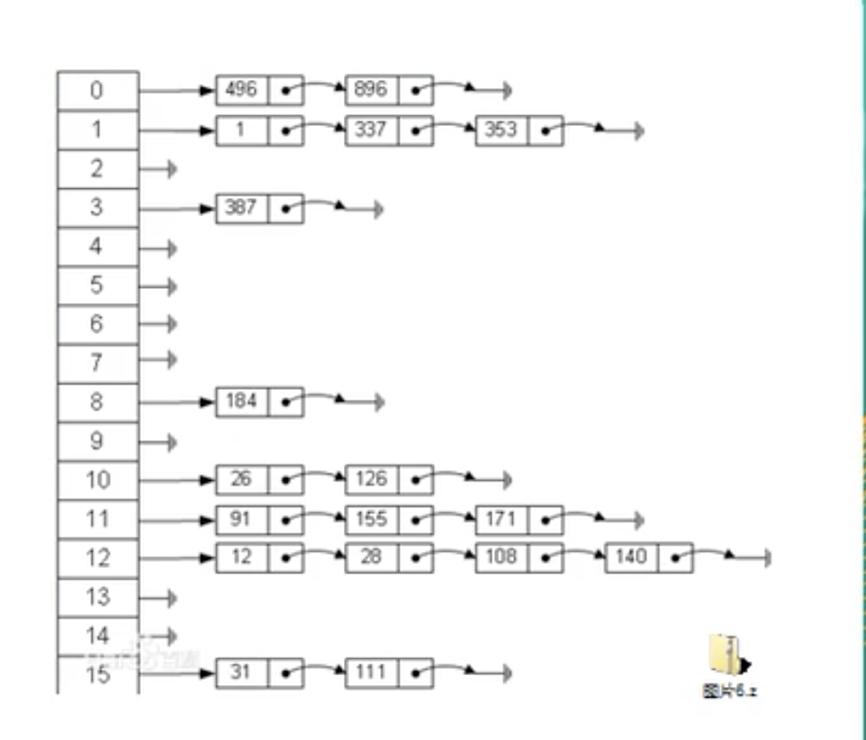

# 哈希表

- ## 基本介绍

  散列表(Hash Table，也叫哈希表),是根据关键码值(Key Value)而直接进行访问的**数据结构**。也就是说，它通过把关键码值映射到表中的一个位置来访问记录，以加快查找的速度。这个映射函数叫做**散列函数**，存**放记录的数组**叫做**散列表**

  

- ## Google上机题

  有一个公司，当有新员工来报到时，要求将该员工的信息加入(id,性别，年龄，地址….)，当输入该员工的id时，要求查找该员工的所有信息。

  要求：不使用数据库，尽量节省内存，速度越快越好。

- ## 代码案例

  ```java
  package com.xie.hashtable;
  
  import java.util.Scanner;
  
  public class HashTableDemo {
      public static void main(String[] args) {
          //创建一个HashTab
          HashTab hashTab = new HashTab(7);
  
          String key = "";
          Scanner scanner = new Scanner(System.in);
          while (true) {
              System.out.println("add:添加雇员");
              System.out.println("list:显示雇员");
              System.out.println("find:查找雇员");
              System.out.println("delete:删除雇员");
              System.out.println("exit:退出程序");
              key = scanner.next();
              switch (key) {
                  case "add":
                      System.out.println("输入id");
                      int id = scanner.nextInt();
                      System.out.println("输入name");
                      String name = scanner.next();
                      Emp emp = new Emp(id, name);
                      hashTab.add(emp);
                      break;
                  case "list":
                      hashTab.list();
                      break;
                  case "find":
                      System.out.println("请输入编号");
                      int no = scanner.nextInt();
                      hashTab.findEmpById(no);
                      break;
                  case "delete":
                      System.out.println("请输入编号");
                      int deleteNo = scanner.nextInt();
                      hashTab.deleteEmpById(deleteNo);
                      break;
                  case "exit":
                      scanner.close();
                      System.exit(0);
                      break;
                  default:
                      break;
              }
          }
      }
  }
  
  //创建哈希表，管理多条链表
  class HashTab {
      private int size;
      private EmpLinkedList[] empLinkedListArray;
  
      public HashTab(int size) {
          this.size = size;
          empLinkedListArray = new EmpLinkedList[size];
          for (int i = 0; i < size; i++) {
              empLinkedListArray[i] = new EmpLinkedList();
          }
  
      }
  
      //添加雇员
      public void add(Emp emp) {
          //根据员工的id，得到该员工应当添加到哪条链表
          int empLinkedListNo = hashFun(emp.id);
          //将emp添加到对应的链表
          empLinkedListArray[empLinkedListNo].add(emp);
      }
  
      //查找员工
      public Emp findEmpById(int id) {
          int no = hashFun(id);
          Emp empById = empLinkedListArray[no].findEmpById(id);
          if (empById == null) {
              System.out.println("不存在id=" + id + "元素");
              return null;
          } else {
              System.out.println("存在id=" + id + ",name=" + empById.name);
              return empById;
          }
      }
  
      //删除雇员
      public void deleteEmpById(int id) {
          int no = hashFun(id);
          empLinkedListArray[no].deleteEmp(id);
      }
  
      //遍历哈希表
      public void list() {
          for (int i = 0; i < size; i++) {
              empLinkedListArray[i].list(i);
          }
      }
  
      //编写散列函数,使用简单的取模法
      private int hashFun(int id) {
          return id % size;
      }
  
  }
  
  //表示雇员
  class Emp {
      public int id;
      public String name;
      public Emp next;
  
      public Emp(int id, String name) {
          this.id = id;
          this.name = name;
      }
  
      @Override
      public String toString() {
          return "Emp{" +
                  "id=" + id +
                  ", name='" + name + '\'' +
                  '}';
      }
  }
  
  //表示链表
  class EmpLinkedList {
      //头指针
      private Emp head;
  
      //添加雇员到链表
      //说明:
      //1.当添加雇员时，id时自增的，即id分配总是从小到大,因此我们将该雇员直接加到本链表的最后即可
      public void add(Emp emp) {
          //如果是添加第一个雇员
          if (head == null) {
              head = emp;
          } else {
              Emp curr = head;
              while (true) {
                  if (curr.next == null) {
                      break;
                  }
                  curr = curr.next;
              }
              curr.next = emp;
          }
      }
  
      //遍历
      public void list(int no) {
          if (head == null) {
              System.out.println("第" + (no + 1) + "链表为空");
              return;
          }
          System.out.print("第" + (no + 1) + "链表信息为:");
          Emp curr = head;
          while (true) {
              if (curr != null) {
                  System.out.printf("=> id=%d,name=%s\t", curr.id, curr.name);
                  curr = curr.next;
              } else {
                  break;
              }
          }
          System.out.println();
      }
  
      //根据id查找雇员
      public Emp findEmpById(int id) {
          if (head == null) {
              System.out.println("链表为空");
              return null;
          }
          Emp temp = head;
          while (temp != null) {
              if (temp.id == id) {
                  return temp;
              }
              temp = temp.next;
          }
          return null;
      }
  
      //根据id删除雇员
      public void deleteEmp(int id) {
          if (head == null) {
              System.out.println("没有id=" + id + "的雇员");
              return;
          }
          Emp curr = head;
          boolean flag = false;
          while (true) {
              if (curr == null) {
                  break;
              }
              if (curr.next.id == id) {
                  flag = true;
                  break;
              }
              curr = curr.next;
          }
          if (flag) {
              curr.next = curr.next.next;
          } else {
              System.out.println("没有id=" + id + "的雇员");
          }
      }
  
  }
  
  ```
