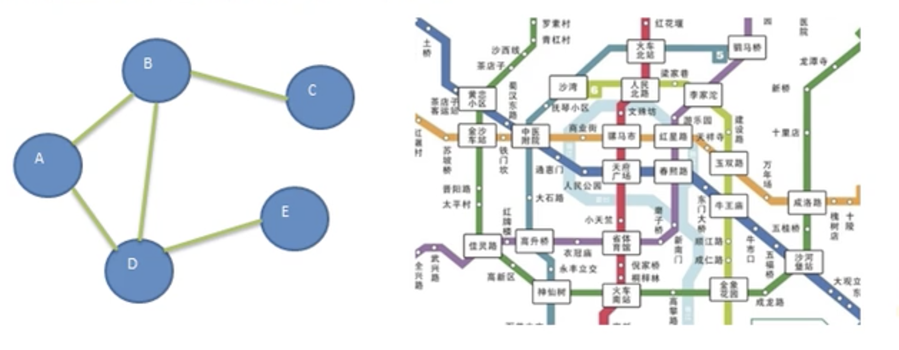
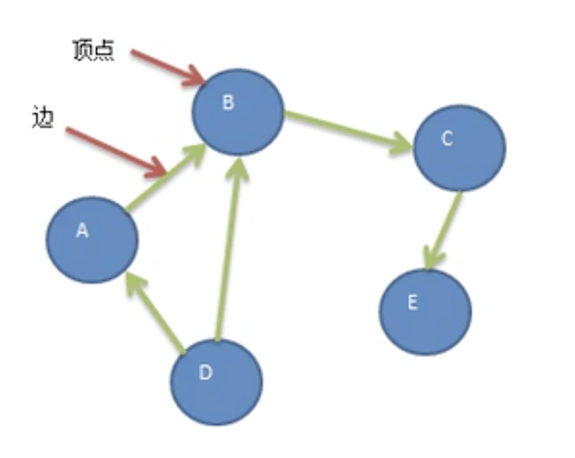
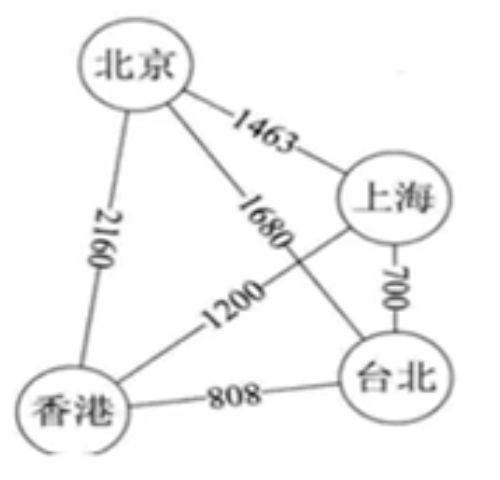
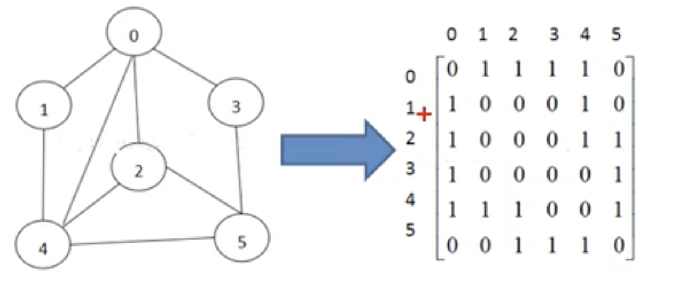
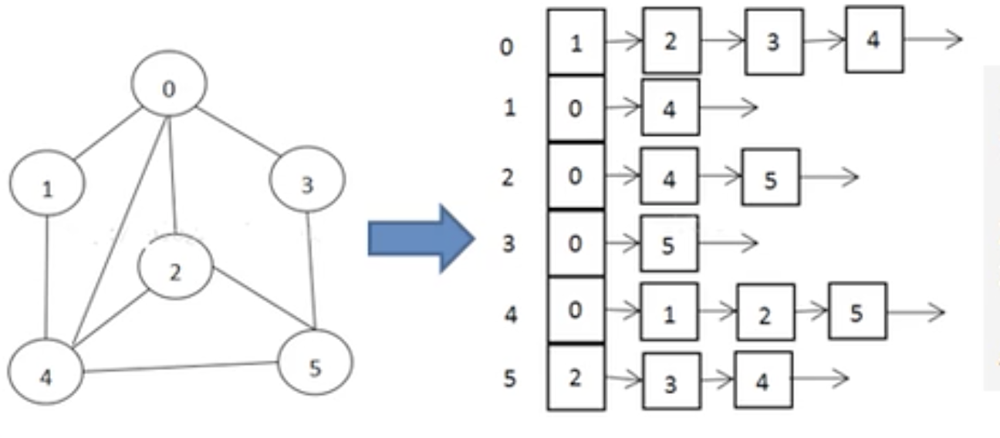

# 图

- ## 为什么要有图

  线性表局限于一个直接前驱和一个直接后继的关系，树也只能右一个直接前驱就是父节点，当我们需要表示多对多关系时，就用到了图。

- ## 图的举例说明

  图是一种数据结构，其中节点可以具有零个或多个相邻元素，两个节点之间的连接称为边，节点也可以称为顶点。如下图：

  

  **无向图：**顶点之间的连接没有方向，比如A-B,既可以是A->B，也可以是B->A。

  **路径：**比如从D->C的路径有，D->B->C、D->A->B->C

  **有向图：**顶点之间的连接有方向，比如A-B，只能是A->B，不能是B->A，如下图,

  

  **带权图：**边带有权值的图，如下图，这种边带权值的图也叫做网。

  

- ## 图的表示方式

  图的表示方式有两种：二维数组表示（邻接矩阵），链表表示（邻接表）

  1. **邻接矩阵**

     邻接矩阵是表示图形中顶点之间的相邻关系的矩阵，对于n各顶点的图而言，矩阵的row和col表示是1…n各点，

     
  
     说明：
  
     - 右边的二维数组中1表示相连，0表示不相连。
     - 如 0和0不相连(0-0=>0)，0和1相连(0-1=>1)、0和2相连(0-2=>1)…以此类推。
  
  2. **邻接表**

    邻接矩阵需要为每个顶点都分配n个边的空间，其实有很多边都是不存在的，会造成空间的一定损失。邻接表的实现只关心存在的边，不关心不存在的边。因此没有空间的浪费，邻接表由数组+链表组成。

    
  
    说明：

    1. 标号为0节点的相关联节点为 1，2，3，4
    2. 标号为1节点的相关联节点为0，4
    3. 标号为2节点的相关联节点为0，4，5
    4. ...
