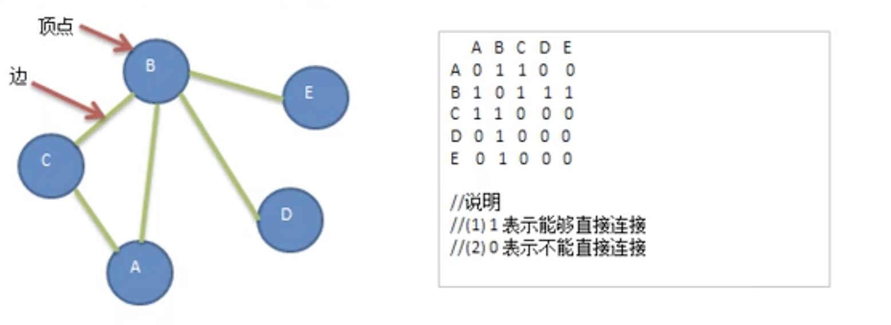

# 图的入门案例

- ## 需求

  代码实现如下结构

  

- ## 代码实现

  ```java
  package com.xie.graph;
  import java.util.ArrayList;
  import java.util.Arrays;
  import java.util.List;
  
  public class Graph {
      //存储顶点集合
      private List<String> vertexList;
      //存储图对应的邻接矩阵
      private int[][] edges;
      //表示边的个数
      private int numOfEdges;
  
      public static void main(String[] args) {
          int n = 5;
          String vertextValue[] = {"A","B","C","D"};
          //创建图对象
          Graph graph = new Graph(n);
          //循环添加顶点
          for (String val : vertextValue) {
              graph.insertVertex(val);
          }
          //添加边
          //A-B,A-C,B-C,B-D,B-E
          graph.insertEdge(0,1,1);//A-B
          graph.insertEdge(0,2,1);//A-C
          graph.insertEdge(1,2,1);//B-C
          graph.insertEdge(1,3,1);//B-D
          graph.insertEdge(1,4,1);//B-E
          //显示图
          graph.showGraph();
  
          /**
           * [0, 1, 1, 0, 0]
           * [1, 0, 1, 1, 1]
           * [1, 1, 0, 0, 0]
           * [0, 1, 0, 0, 0]
           * [0, 1, 0, 0, 0]
           */
  
      }
  
      /**
       * 构造器
       *
       * @param n 表示顶点个数
       */
      public Graph(int n) {
          edges = new int[n][n];
          vertexList = new ArrayList<>(n);
          numOfEdges = 0;
      }
  
      /**
       * 返回节点的个数
       *
       * @return
       */
      public int getNumOfVertex() {
          return vertexList.size();
      }
  
      /**
       * 返回边的个数
       *
       * @return
       */
      public int getNumOfEdges() {
          return numOfEdges;
      }
  
      /**
       * 返回节点i下标对应的数据，0->"A",1->"B"
       *
       * @param i 下标
       * @return
       */
      public String getValueByIndex(int i) {
          return vertexList.get(i);
      }
  
      /**
       * 返回V1和V2 的权值
       *
       * @param v1
       * @param v2
       * @return
       */
      public int getWeight(int v1, int v2) {
          return edges[v1][v2];
      }
  
      public void showGraph() {
          for (int i = 0; i < edges.length; i++) {
              System.out.println(Arrays.toString(edges[i]));
          }
      }
  
      /**
       * 插入节点
       *
       * @param vertex 节点名
       */
      public void insertVertex(String vertex) {
          vertexList.add(vertex);
      }
  
      /**
       * 添加边
       *
       * @param v1     顶点1的下标，即是第几个顶点，比如要添加"A"-"B",那么"A"->0,"B"->1
       * @param v2     顶点2的下标，
       * @param weight 顶点之间的权值，1表示相连，0表示不相连
       */
      public void insertEdge(int v1, int v2, int weight) {
          edges[v1][v2] = weight;
          edges[v2][v1] = weight;
          numOfEdges++;
      }
  }
  ```
  
- ## 图的深度优先遍历介绍

  所谓图的遍历，即是对节点的访问。一个图有那么多节点，如何遍历这些节点，需要特定的策略，一般有两种访问策略：深度优先遍历、广度优先遍历。

  图的深度优先搜索(Depth First Search)：

  1. 深度优先遍历，从初始节点出发，初始访问节点可能有多个邻接节点，深度优先遍历的策略就是首先访问第一个邻接节点，然后再以这个被访问的邻接节点作为初始节点，访问它的第一个邻接节点，可以这样理解：每次都在访问完**当前节点**后首先访问当**前节点的第一个邻接节点**。
  2. 我们可以看到，这样的访问策略是优先往纵向挖掘深入，而不是对一个节点的所有邻接节点进行横向访问。
  3. 显然，深度优先搜索是一个递归过程。

  **深度优先遍历算法步骤：**

  1. 访问初始节点v，并标记节点v已访问。
  2. 查找节点v的第一个邻接节点w。
  3. 若w存在，则继续执行4，如果不存在，则回到第1步，将从v的下一个节点继续。
  4. 若w未被访问，对w进行深度优先遍历递归(即把w 当做另一个v ,然后进行步骤123)。
  5. 查找节点v的w邻接节点的下一个邻接节点，转到步骤3。

- ## 图的广度优先遍历

  图的广度优先遍历(Broad First Search)，类似于一个分层搜索的过程，广度优先遍历需要使用一个队列以保持访问过的节点的顺序，以便按照这个顺序来访问这些节点的邻接节点。

  广度优先遍历算法步骤：

  1. 访问初始节点v 并标记节点 v已访问。
  2. 节点v 入队列。
  3. 当队列非空时，继续执行，否则算法结束。
  4. 出队列，取得头结点u。
  5. 查找节点u的第一个邻接节点w。
  6. 若节点u的邻接节点w不存在，则转到步骤3；否则循环执行以下三个步骤：
     - 若节点w 尚未被访问，则访问节点w并标记为已访问。
     - 节点w如队列。
     - 查找节点u的继w邻接节点后的下一个邻接节点w,转到步骤6。

- ## 代码案例

  图的深度优先与广度优先比较，下图：

  深度优先遍历顺序为：1->2->4->8->5->3->6->7

  广度优先遍历顺序为：1->2->3->4->5->6->7->8

  

  ```java
  package com.xie.graph;
  
  import java.util.ArrayList;
  import java.util.Arrays;
  import java.util.LinkedList;
  import java.util.List;
  
  public class Graph {
      //存储顶点集合
      private List<String> vertexList;
      //存储图对应的邻接矩阵
      private int[][] edges;
      //表示边的个数
      private int numOfEdges;
  
      //定义个数组boolean[] ,记录某个节点是否被访问过
      private boolean[] isVisited;
  
      public static void main(String[] args) {
          int n = 8;
          String vertextValue[] = {"1", "2", "3", "4", "5", "6", "7", "8"};
          //创建图对象
          Graph graph = new Graph(n);
          //循环添加顶点
          for (String val : vertextValue) {
              graph.insertVertex(val);
          }
          //添加边
          graph.insertEdge(0, 1, 1);
          graph.insertEdge(0, 2, 1);
          graph.insertEdge(1, 3, 1);
          graph.insertEdge(1, 4, 1);
          graph.insertEdge(3, 7, 1);
          graph.insertEdge(4, 7, 1);
          graph.insertEdge(2, 5, 1);
          graph.insertEdge(2, 6, 1);
          graph.insertEdge(5, 6, 1);
          //显示图
          System.out.println("显示图");
          graph.showGraph();
  
          //测试深度遍历
          System.out.println("测试深度遍历");
          graph.dfs();
          System.out.println();
          graph.isVisited = new boolean[graph.vertexList.size()];
          System.out.println("测试广度遍历");
  
          graph.bfs();
  
          /**
           显示图
           [0, 1, 1, 0, 0, 0, 0, 0]
           [1, 0, 0, 1, 1, 0, 0, 0]
           [1, 0, 0, 0, 0, 1, 1, 0]
           [0, 1, 0, 0, 0, 0, 0, 1]
           [0, 1, 0, 0, 0, 0, 0, 1]
           [0, 0, 1, 0, 0, 0, 1, 0]
           [0, 0, 1, 0, 0, 1, 0, 0]
           [0, 0, 0, 1, 1, 0, 0, 0]
           测试深度遍历
           1-> 2-> 4-> 8-> 5-> 3-> 6-> 7->
           测试广度遍历
           1-> 2->3->4->5->6->7->8->
           */
  
      }
  
      /**
       * 构造器
       *
       * @param n 表示顶点个数
       */
      public Graph(int n) {
          edges = new int[n][n];
          vertexList = new ArrayList<>(n);
          numOfEdges = 0;
          isVisited = new boolean[n];
      }
  
      /**
       * 得到第一个邻接节点的下标 w
       *
       * @param index
       * @return 如果存在就返回对应的下标，否则返回-1
       */
      public int getFirstNeighbor(int index) {
          for (int i = 0; i < vertexList.size(); i++) {
              if (edges[index][i] > 0) {
                  return i;
              }
          }
          return -1;
      }
  
      /**
       * 根据当前邻接节点的下标来获取下一个邻接节点
       *
       * @param v1
       * @param v2
       * @return
       */
      public int getNextNeighbor(int v1, int v2) {
          for (int i = v2 + 1; i < vertexList.size(); i++) {
              if (edges[v1][i] > 0) {
                  return i;
              }
          }
          return -1;
      }
  
      /**
       * 深度优先遍历算法
       */
      public void dfs(boolean[] isVisited, int i) {
          //首先我们访问该节点
          System.out.print(getValueByIndex(i) + "-> ");
          //将该节点设置为已访问
          isVisited[i] = true;
          //查找i节点的第一个邻接节点w
          int w = getFirstNeighbor(i);
          while (w != -1) {
              if (!isVisited[w]) {
                  dfs(isVisited, w);
              }
              //如果w节点已经被访问过
              w = getNextNeighbor(i, w);
          }
      }
  
      /**
       * 对dfs进行一个重载，遍历我们所有的节点，并进行dfs
       */
      public void dfs() {
          //遍历所有的节点，进行dfs【回溯】
          for (int i = 0; i < getNumOfVertex(); i++) {
              if (!isVisited[i]) {
                  dfs(isVisited, i);
              }
          }
      }
  
      /**
       * 广度优遍历算法
       *
       * @param isVisited
       * @param i
       */
      private void bfs(boolean[] isVisited, int i) {
          int u;//表示队列的头节点对应的下标
          int w;//邻接节点对应的下标
  
          //队列，节点访问的顺序
          LinkedList<Integer> queue = new LinkedList<>();
  
          //访问节点
          System.out.print(getValueByIndex(i) + "-> ");
          //标记为已访问
          isVisited[i] = true;
          //将节点加入队列
          queue.addLast(i);
          while (!queue.isEmpty()) {
              //取出队列头结点下标
              u = queue.removeFirst();
              //得到第一个邻接节点的下标
              w = getFirstNeighbor(u);
              while (w != -1) {
                  //是否访问过
                  if (!isVisited[w]) {
                      System.out.print(getValueByIndex(w) + "->");
                      isVisited[w] = true;
                      //入队列
                      queue.addLast(w);
                  }
                  //以u为前驱点，找w后面的下一个邻接节点
                  w = getNextNeighbor(u, w);//体现广度优先
              }
          }
      }
  
      /**
       * 遍历所有的节点，都进行广度优先搜索
       */
      private void bfs() {
          //遍历所有的节点，进行dfs【回溯】
          for (int i = 0; i < getNumOfVertex(); i++) {
              if (!isVisited[i]) {
                  bfs(isVisited, i);
              }
          }
      }
  
      /**
       * 返回节点的个数
       *
       * @return
       */
      public int getNumOfVertex() {
          return vertexList.size();
      }
  
      /**
       * 返回边的个数
       *
       * @return
       */
      public int getNumOfEdges() {
          return numOfEdges;
      }
  
      /**
       * 返回节点i下标对应的数据，0->"A",1->"B"
       *
       * @param i 下标
       * @return
       */
      public String getValueByIndex(int i) {
          return vertexList.get(i);
      }
  
      /**
       * 返回V1和V2 的权值
       *
       * @param v1
       * @param v2
       * @return
       */
      public int getWeight(int v1, int v2) {
          return edges[v1][v2];
      }
  
      public void showGraph() {
          for (int i = 0; i < edges.length; i++) {
              System.out.println(Arrays.toString(edges[i]));
          }
      }
  
      /**
       * 插入节点
       *
       * @param vertex 节点名
       */
      public void insertVertex(String vertex) {
          vertexList.add(vertex);
      }
  
      /**
       * 添加边
       *
       * @param v1     顶点1的下标，即是第几个顶点，比如要添加"A"-"B",那么"A"->0,"B"->1
       * @param v2     顶点2的下标，
       * @param weight 顶点之间的权值，1表示相连，0表示不相连
       */
      public void insertEdge(int v1, int v2, int weight) {
          edges[v1][v2] = weight;
          edges[v2][v1] = weight;
          numOfEdges++;
      }
  }
  
  ```
