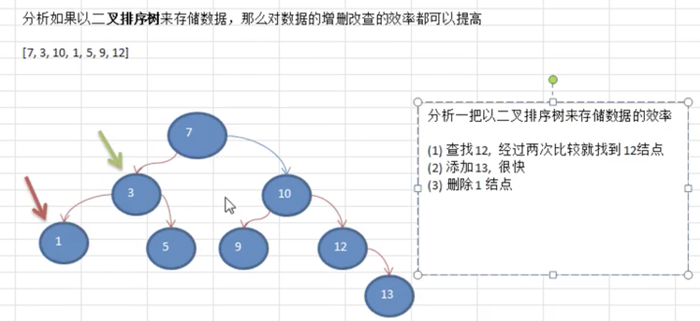
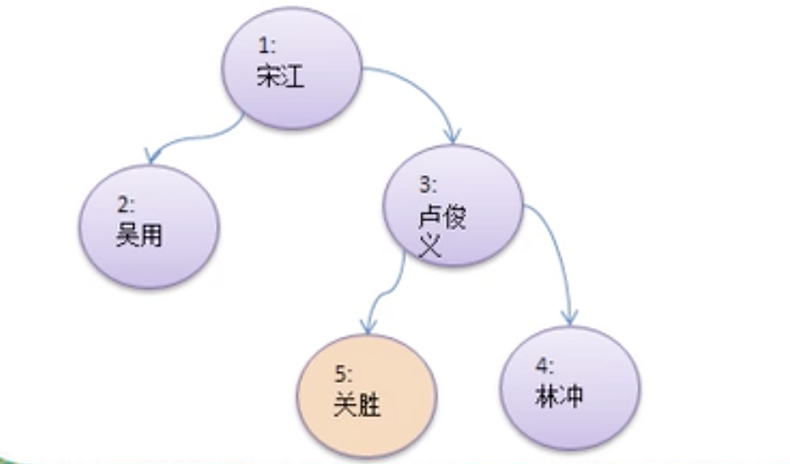

# 数据结构-树

- ## 为什么需要树这种结构

  1. 数组存储方式分析：

     - 优点：通过下标方式访问元素，速度快。对于有序数组，还可以使用二分查找提高检索速度。
     - 缺点：如果检索某个具体的值，或者插入值（按一定的顺序）会整体移动，效率较低。

  2. 链式存储方式分析：

     - 优点：在一定程度上对数组存储方式优化（比如：插入一个数值节点，只需要将插入节点，链接到链表中即可，删除效率很高）。
     - 缺点：在进行检索时，效率仍然很低，需要从头结点开始遍历。

  3. 树存储方式分析：

     能提高数据**存储，读取**的效率，比如利用**二叉排序树**(Binary sort tree)，即可以保证数据的检索速度，同时也可以保证数据的插入、删除、修改的速度。

     假设一组[7,3,10,1,5,9,12]以树的方式存储，分析如下图：

     

- ## 二叉树的前序遍历、中序遍历、后序遍历

  **前序遍历**：**输出父节点**、输出左边节点、输出右边节点；

  **中序遍历**：输出左边节点、**输出父节点**、输出右边节点；

  **后序遍历**：输出左边节点、输出右边节点、**输出父节点**；

- ## 需求案例

  完成一个如下二叉树节点存储、前序遍历搜索、中序遍历搜索、后序遍历搜索和删除节点功能。

  对于删除节点要求如下：

  1. 如果删除的节点是叶子节点，则删除该节点。
  2. 如果删除的节点是非叶子节点，则删除该树。
  3. 测试，删除5号叶子节点和3号子树。

  

- ## 代码案例

  ```java
  package com.xie.tree;
  
  public class BinaryTreeDemo {
  
      public static void main(String[] args) {
          BinaryTree binaryTree = new BinaryTree();
  
          HeroNode root = new HeroNode(1, "宋江");
          HeroNode node2 = new HeroNode(2, "吴用");
          HeroNode node3 = new HeroNode(3, "卢俊义");
          HeroNode node4 = new HeroNode(4, "林冲");
          HeroNode node5 = new HeroNode(5, "关胜");
  
          //先手动创建该二叉树，后面用递归方式
          root.setLeft(node2);
          root.setRight(node3);
          node3.setRight(node4);
          node3.setLeft(node5);
  
          binaryTree.setRoot(root);
  
          //前序遍历
          System.out.println("前序遍历");
          binaryTree.preOrder();
  
          //中序遍历
          System.out.println("中序遍历");
          binaryTree.infixOrder();
  
          //后续遍历
          System.out.println("后续遍历");
          binaryTree.postOrder();
  
          //前序遍历查找
          System.out.println("前序遍历查找~~");
          HeroNode resultNode = binaryTree.preOrderSearch(5);
          if (resultNode != null) {
              System.out.printf("找到了，信息为no=%d,name=%s\n", resultNode.getNo(), resultNode.getName());
              System.out.println("遍历次数：" + HeroNode.preCount);
          } else {
              System.out.println("没有找到");
          }
  
          //中序遍历查找
          System.out.println("中序遍历查找~~");
          HeroNode resultNode1 = binaryTree.infixOrderSearch(5);
          if (resultNode1 != null) {
              System.out.printf("找到了，信息为no=%d,name=%s\n", resultNode1.getNo(), resultNode1.getName());
              System.out.println("遍历次数：" + HeroNode.infoxCount);
          } else {
              System.out.println("没有找到");
          }
  
          //后序遍历查找
          System.out.println("后序遍历查找~~");
          HeroNode resultNode2 = binaryTree.postOrderSearch(5);
          if (resultNode2 != null) {
              System.out.printf("找到了，信息为no=%d,name=%s\n", resultNode2.getNo(), resultNode2.getName());
              System.out.println("遍历次数：" + HeroNode.postCount);
          } else {
              System.out.println("没有找到");
          }
  
          System.out.println("删除3号节点");
          binaryTree.delNo(3);
          System.out.println("删除后的节点");
          binaryTree.preOrder();
          /**
           * 前序遍历
           * HeroNode{no=1, name=宋江}
           * HeroNode{no=2, name=吴用}
           * HeroNode{no=3, name=卢俊义}
           * HeroNode{no=5, name=关胜}
           * HeroNode{no=4, name=林冲}
           * 中序遍历
           * HeroNode{no=2, name=吴用}
           * HeroNode{no=1, name=宋江}
           * HeroNode{no=5, name=关胜}
           * HeroNode{no=3, name=卢俊义}
           * HeroNode{no=4, name=林冲}
           * 后续遍历
           * HeroNode{no=2, name=吴用}
           * HeroNode{no=5, name=关胜}
           * HeroNode{no=4, name=林冲}
           * HeroNode{no=3, name=卢俊义}
           * HeroNode{no=1, name=宋江}
           * 前序遍历查找~~
           * 找到了，信息为no=5,name=关胜
           * 遍历次数：4
           * 中序遍历查找~~
           * 找到了，信息为no=5,name=关胜
           * 遍历次数：3
           * 后序遍历查找~~
           * 找到了，信息为no=5,name=关胜
           * 遍历次数：2
           * 删除3号节点
           * 删除后的节点
           * HeroNode{no=1, name=宋江}
           * HeroNode{no=2, name=吴用}
           */
      }
  }
  
  class BinaryTree {
      private HeroNode root;
  
      public void setRoot(HeroNode root) {
          this.root = root;
      }
  
      //前序遍历
      public void preOrder() {
          if (this.root != null) {
              this.root.preOrder();
          }
      }
  
      //中序遍历
      public void infixOrder() {
          if (this.root != null) {
              this.root.infixOrder();
          }
      }
  
      //删除节点
      public void delNo(int no) {
          if (this.root != null) {
              if (this.root.getNo() == no) {
                  this.root = null;
              } else {
                  this.root.delNo(no);
              }
          }
          return;
      }
  
      //后序遍历
      public void postOrder() {
          if (this.root != null) {
              this.root.postOrder();
          }
      }
  
      //前序遍历查找
      public HeroNode preOrderSearch(int no) {
          if (root != null) {
              return root.preOrderSearch(no);
          } else {
              return null;
          }
      }
  
      //中序遍历查找
      public HeroNode infixOrderSearch(int no) {
          if (root != null) {
              return root.infixOrderSearch(no);
          } else {
              return null;
          }
      }
  
      //后序遍历查找
      public HeroNode postOrderSearch(int no) {
          if (root != null) {
              return root.postOrderSearch(no);
          } else {
              return null;
          }
      }
  }
  
  class HeroNode {
      static int preCount = 0;
      static int infoxCount = 0;
      static int postCount = 0;
  
      private int no;
      private String name;
      private HeroNode left;
      private HeroNode right;
  
      public HeroNode(int no, String name) {
          this.no = no;
          this.name = name;
      }
  
      public int getNo() {
          return no;
      }
  
      public void setNo(int no) {
          this.no = no;
      }
  
      public String getName() {
          return name;
      }
  
      public void setName(String name) {
          this.name = name;
      }
  
      public HeroNode getLeft() {
          return left;
      }
  
      public void setLeft(HeroNode left) {
          this.left = left;
      }
  
      public HeroNode getRight() {
          return right;
      }
  
      public void setRight(HeroNode right) {
          this.right = right;
      }
  
      @Override
      public String toString() {
          return "HeroNode{" +
                  "no=" + no +
                  ", name=" + name +
                  '}';
      }
  
      //前序遍历
      public void preOrder() {
          System.out.println(this);
          //递归向左子树前序遍历
          if (this.left != null) {
              this.left.preOrder();
          }
  
          //递归向右子树前序遍历
          if (this.right != null) {
              this.right.preOrder();
          }
      }
  
      //中序遍历
      public void infixOrder() {
          //递归向左子树中序遍历
          if (this.left != null) {
              this.left.infixOrder();
          }
          System.out.println(this);
          //递归向右子树中序遍历
          if (this.right != null) {
              this.right.infixOrder();
          }
      }
  
      //后序遍历
      public void postOrder() {
          //递归向左子树后序遍历
          if (this.left != null) {
              this.left.postOrder();
          }
          //递归向右子树后序遍历
          if (this.right != null) {
              this.right.postOrder();
          }
          System.out.println(this);
      }
  
      //递归删除节点
      //1.如果删除的节点是叶子节点，则删除该节点。
      //2.如果删除的节点是非叶子节点，则删除该树。
      public void delNo(int no) {
          /**
           * 1.因为我们的二叉树是单向的，所以我们是判断当前节点的子节点是否是需要删除的节点，而不能去判断当前节点是否是需要删除的节点。
           * 2.如果当前节点的左子节点不为空，并且左子节点就是需要删除的节点，就将this.left = null；并且返回（结束递归）。
           * 3.如果当前节点的右子节点不为空，并且右子节点就是需要删除的节点，将将this.right = null;并且返回（结束递归）。
           * 4.如果第2步和第3步没有删除节点，那么就要向左子树进行递归删除。
           * 5.如果第4步也没有删除节点，则应当向右子树进行递归删除。
           */
          if (this.left != null && this.left.no == no) {
              this.left = null;
              return;
          }
  
          if (this.right != null && this.right.no == no) {
              this.right = null;
              return;
          }
  
          if (this.left != null) {
              this.left.delNo(no);
          }
  
          if (this.right != null) {
              this.right.delNo(no);
          }
  
      }
  
      //前序遍历查找
      public HeroNode preOrderSearch(int no) {
  
          HeroNode res = null;
  
          preCount++;//这里必须放在this.no == no 判断之前，才进行实际的比较
          //若果找到，就返回
          if (this.no == no) {
              return this;
          }
          //没有找到，向左子树递归进行前序查找
          if (this.left != null) {
              res = this.left.preOrderSearch(no);
          }
          //如果res ！= null 就直接返回
          if (res != null) {
              return res;
          }
          //如果左子树没有找打，向右子树进行前序查找
          if (this.right != null) {
              res = this.right.preOrderSearch(no);
          }
          //如果找到就返回
          if (res != null) {
              return res;
          }
          return res;
      }
  
      //中序遍历查找
      public HeroNode infixOrderSearch(int no) {
  
          HeroNode res = null;
          if (this.left != null) {
              res = this.left.infixOrderSearch(no);
          }
          if (res != null) {
              return res;
          }
          infoxCount++;//这里必须放在this.no == no 判断之前，才进行实际的比较
          if (this.no == no) {
              return this;
          }
          if (this.right != null) {
              res = this.right.infixOrderSearch(no);
          }
          if (res != null) {
              return res;
          }
          return res;
      }
  
      //后序遍历查找
      public HeroNode postOrderSearch(int no) {
  
          HeroNode res = null;
          if (this.left != null) {
              res = this.left.postOrderSearch(no);
          }
          if (res != null) {
              return res;
          }
  
          if (this.right != null) {
              res = this.right.postOrderSearch(no);
          }
          if (res != null) {
              return res;
          }
          postCount++;//这里必须放在this.no == no 判断之前，才进行实际的比较
          if (this.no == no) {
              return this;
          }
          return res;
      }
  }
  
  ```
