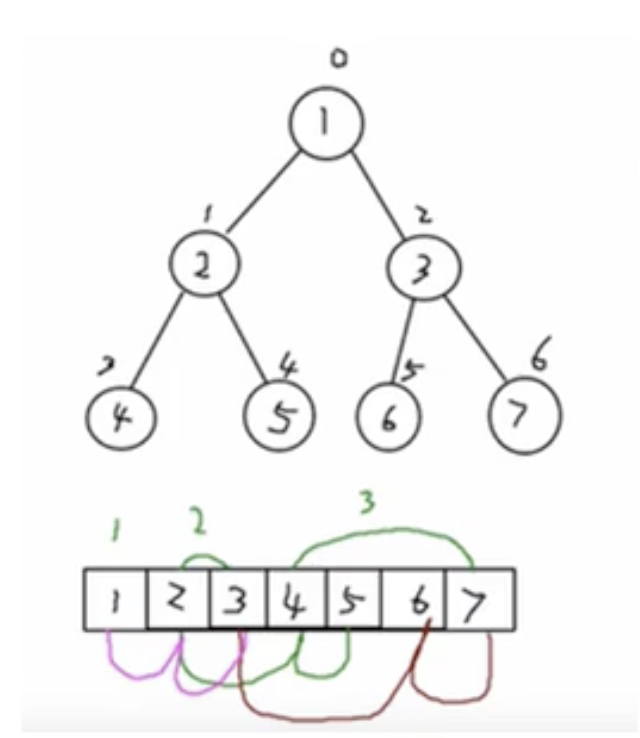

# 顺序存储二叉树

- ## 基本概念

  从数据存储来看，数组存储方式和树的存储方式可以相互转换，即数组可以转换成树，树可以转换成数组。如下图所示：

  

  顺序存储二叉树的**特点：**

   1. 顺序存储通常只考虑完全二叉树；

   2. 第n个元素的左子节点为 2 * n+1;

   3. 第n个元素的右子节点为 2 * n+2;

   4. 第n个元素的父节点为 (n-1)/2；

   5. n 表示二叉树中的第几个元素（按0开始编号如上图所示）；
  
- ## 需求

  要求给定一个数组{1,2,3,4,5,6,7}，要求以二叉树前序遍历的方式进行遍历，前序遍历的结果应当为1,2,4,5,3,6,7,

  附加完成中序遍历和后序遍历。

- ## 代码案例

- ```java
  package com.xie.tree;
  
  /**
   * @author: xiexiaofei
   * @date: 2020-02-09 20:04
   * @description:
   */
  public class ArrBinaryTreeDemo {
      public static void main(String[] args) {
          int[] arr = {1, 2, 3, 4, 5, 6, 7};
          ArrBinaryTree arrBinaryTree = new ArrBinaryTree(arr);
          System.out.println("顺序存储二叉树的前序遍历数组");
          arrBinaryTree.preOrder(0);
          System.out.println();
          System.out.println("顺序存储二叉树的中序遍历数组");
          arrBinaryTree.infixOrder(0);
          System.out.println();
          System.out.println("顺序存储二叉树的后序遍历数组");
          arrBinaryTree.postOrder(0);
          System.out.println();
  
          /**
           * 顺序存储二叉树的前序遍历数组
           * 1 2 4 5 3 6 7
           * 顺序存储二叉树的中序遍历数组
           * 2 4 5 1 3 6 7
           * 顺序存储二叉树的后序遍历数组
           * 2 4 5 3 6 7 1
           */
  
      }
  }
  
  //实现顺序存储二叉树遍历
  class ArrBinaryTree {
      private int[] arr;//存储数据节点的数组
  
      public ArrBinaryTree(int[] arr) {
          this.arr = arr;
      }
  
      /**
       * 编写一个方法，完成顺序存储二叉树的前序遍历。
       *
       * @param index 数组的下标
       */
      public void preOrder(int index) {
          if (arr == null || arr.length == 0) {
              System.out.println("数组为空，不能按照二叉树的前序遍历");
          }
          //输出当前的元素
          System.out.print(arr[index] + " ");
          //向左递归遍历
          if ((2 * index + 1) < arr.length) {
              preOrder(2 * index + 1);
          }
          //向右递归
          if ((2 * index + 2) < arr.length) {
              preOrder(2 * index + 2);
          }
      }
  
      /**
       * 编写一个方法，完成顺序存储二叉树的中序遍历。
       *
       * @param index
       */
      public void infixOrder(int index) {
          if (arr == null || arr.length == 0) {
              System.out.println("数组为空，不能按照二叉树的前序遍历");
          }
  
          //向左递归遍历
          if ((2 * index + 1) < arr.length) {
              preOrder(2 * index + 1);
          }
  
          //输出当前的元素
          System.out.print(arr[index] + " ");
  
          //向右递归
          if ((2 * index + 2) < arr.length) {
              preOrder(2 * index + 2);
          }
  
      }
  
      /**
       * 编写一个方法，完成顺序存储二叉树的后序遍历。
       *
       * @param index
       */
      public void postOrder(int index) {
          if (arr == null || arr.length == 0) {
              System.out.println("数组为空，不能按照二叉树的前序遍历");
          }
  
          //向左递归遍历
          if ((2 * index + 1) < arr.length) {
              preOrder(2 * index + 1);
          }
  
          //向右递归
          if ((2 * index + 2) < arr.length) {
              preOrder(2 * index + 2);
          }
  
          //输出当前的元素
          System.out.print(arr[index] + " ");
  
      }
  
  }
  
  ```
