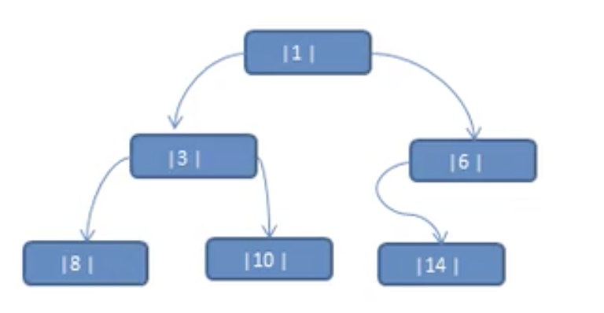
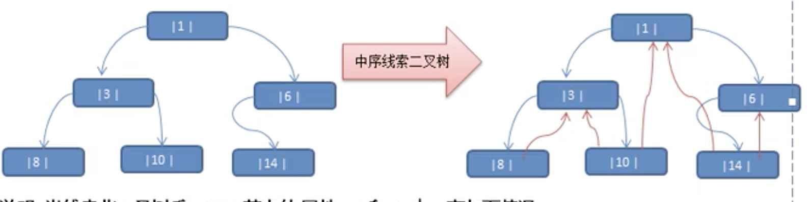

# 线索化二叉树

- ## 先看一个问题

  将数列{1,3,6,8,10,14}构建成一颗二叉树.n+1=7,如下图所示

  

  问题分析：

  1. 当我们对上面的二叉树进行中序遍历时，数列为{8,3,10,1,14,6}
  2. 但是6，8，10，14这几个节点的左右指针，并没有完全的利用上。
  3. 如果我们希望充分的利用各个节点的左右指针，让各个节点指向自己的前后节点怎么办？
  4. 解决方案-线索二叉树
  
- ## 线索二叉树基本介绍

  1. n 个节点的二叉链表中含有n+1【公式 2n-(n-1)=n+1】个空指针域。利用二叉链表中的空指针域，存放**该节点**在**某种遍历次序**下的前驱和后继点的指针（这种附加的指针称为线索）。
  2. 这种加了线索的二叉链表称为**线索链表**，相应的二叉树称为**线索二叉树**(Threaded BinaryTree)。根据线索的性质不同，线索二叉树可分为前序线索二叉树、中序线索二叉树、后序线索二叉树三种。
  3. 一个节点的前一个节点，称为前驱节点。
  4. 一个节点的后一个节点，称为后继节点。

- ## 中序线索二叉树图解

  

  中序遍历的结果{8,3,10,1,14,6}

  说明：当线索化二叉树后，Node节点的属性left和right,有如下情况：

  1. left指向的值左子树，也可能是指向的前驱节点，比如①节点left指向的左子树，而⑩节点的left指向的就是前驱节点。
  2. right指向的右子树，也可能是指向后继节点，比如①节点right指向的是右子树，而⑩节点的right指向的是后继节点。

- ## 代码案例

  ```java
  package com.xie.tree.threadedbinarytree;
  
  public class ThreadedBinaryTreeDemo {
      public static void main(String[] args) {
          //测试中序线索二叉树
          HeroNode root = new HeroNode(1, "tom");
          HeroNode node2 = new HeroNode(3, "jack");
          HeroNode node3 = new HeroNode(6, "smith");
          HeroNode node4 = new HeroNode(8, "mary");
          HeroNode node5 = new HeroNode(10, "king");
          HeroNode node6 = new HeroNode(14, "dim");
  
          root.setLeft(node2);
          root.setRight(node3);
  
          node2.setLeft(node4);
          node2.setRight(node5);
  
          node3.setLeft(node6);
  
          ThreadedBinaryTree threadedBinaryTree = new ThreadedBinaryTree();
          threadedBinaryTree.setRoot(root);
          threadedBinaryTree.threadedNodes();
  
          //测试：以10号节点测试
          HeroNode left = node5.getLeft();
          System.out.println("10号节点的前驱节点是：" + left);
          HeroNode right = node5.getRight();
          System.out.println("10号节点的后继节点是：" + right);
  
          System.out.println("使用线索化的方式遍历 线索二叉树");
          threadedBinaryTree.threadedBinaryTreeList();
  
          /**
           * 10号节点的前驱节点是：HeroNode{no=3, name=jack}
           * 10号节点的后继节点是：HeroNode{no=1, name=tom}
           * 使用线索化的方式遍历 线索二叉树
           * HeroNode{no=8, name=mary}
           * HeroNode{no=3, name=jack}
           * HeroNode{no=10, name=king}
           * HeroNode{no=1, name=tom}
           * HeroNode{no=14, name=dim}
           * HeroNode{no=6, name=smith}
           */
  
      }
  }
  
  //实现了线索化功能的二叉树
  class ThreadedBinaryTree {
      private HeroNode root;
      //为了实现线索化，需要创建一个指向当前节点的前驱节点的指针
      //在递归进行线索化时，pre总是保留前一个节点
      private HeroNode pre;
  
      public void setRoot(HeroNode root) {
          this.root = root;
      }
  
      /**
       * 遍历线索化二叉树的方法。
       */
      public void threadedBinaryTreeList() {
          //定义一个变量，存储当前遍历的节点，从root开始
          HeroNode node = root;
          while (node != null) {
              //循环找到leftType==1的节点,第一个找到就是8节点
              //后面随着遍历而变化，因为当leftType==1时，说明该节点是按照线索化处理后的有效节点
              while (node.getLeftType() == 0) {
                  node = node.getLeft();
              }
              //打印当前节点
              System.out.println(node);
              //如果当前节点的右指针指向的是后继节点，就一直输出
              while (node.getRightType() == 1) {
                  //获取到当前节点的后继节点
                  node = node.getRight();
                  System.out.println(node);
              }
              //替换这个遍历的节点
              node = node.getRight();
          }
      }
  
      /**
       * 重载threadedNodes方法
       */
      public void threadedNodes() {
          threadedNodes(root);
      }
  
      /**
       * 编写对二叉树进行线索化的方法
       *
       * @param node 当前需要线索化的节点
       */
      public void threadedNodes(HeroNode node) {
          if (node == null) {
              return;
          }
  
          //先线索化左子树
          threadedNodes(node.getLeft());
          //线索化当前节点【有难度】
  
          //处理当前节点的前驱节点
          //以8节点来理解，8节点.left=null
          if (node.getLeft() == null) {
              //让当前节点的左指针指向前驱节点
              node.setLeft(pre);
              //修改当前节点的左指针类型
              node.setLeftType(1);
          }
  
          //处理后继节点
          if (pre != null && pre.getRight() == null) {
              //让前驱节点的右指针指向当前节点
              pre.setRight(node);
              //修改前驱节点的右指针类型
              pre.setRightType(1);
          }
          //每处理一个节点后，让当前节点是下一个节点的前驱节点
          pre = node;
  
          //再线索化右子树
          threadedNodes(node.getRight());
      }
  
  }
  
  //创建HeroNode节点
  class HeroNode {
      static int preCount = 0;
      static int infoxCount = 0;
      static int postCount = 0;
  
      private int no;
      private String name;
      private HeroNode left;
      private HeroNode right;
  
      //0 表示指向的是左子树，1 表示指向的是前驱节点
      private int leftType;
      //0 表示指向右子树，1 表示指向的是后继节点
      private int rightType;
  
      public HeroNode(int no, String name) {
          this.no = no;
          this.name = name;
      }
  
      public int getNo() {
          return no;
      }
  
      public void setNo(int no) {
          this.no = no;
      }
  
      public String getName() {
          return name;
      }
  
      public void setName(String name) {
          this.name = name;
      }
  
      public HeroNode getLeft() {
          return left;
      }
  
      public void setLeft(HeroNode left) {
          this.left = left;
      }
  
      public HeroNode getRight() {
          return right;
      }
  
      public void setRight(HeroNode right) {
          this.right = right;
      }
  
      public int getLeftType() {
          return leftType;
      }
  
      public void setLeftType(int leftType) {
          this.leftType = leftType;
      }
  
      public int getRightType() {
          return rightType;
      }
  
      public void setRightType(int rightType) {
          this.rightType = rightType;
      }
  
      @Override
      public String toString() {
          return "HeroNode{" +
                  "no=" + no +
                  ", name=" + name +
                  '}';
      }
  
      //前序遍历
      public void preOrder() {
          System.out.println(this);
          //递归向左子树前序遍历
          if (this.left != null) {
              this.left.preOrder();
          }
  
          //递归向右子树前序遍历
          if (this.right != null) {
              this.right.preOrder();
          }
      }
  
      //中序遍历
      public void infixOrder() {
          //递归向左子树中序遍历
          if (this.left != null) {
              this.left.infixOrder();
          }
          System.out.println(this);
          //递归向右子树中序遍历
          if (this.right != null) {
              this.right.infixOrder();
          }
      }
  
      //后序遍历
      public void postOrder() {
          //递归向左子树后序遍历
          if (this.left != null) {
              this.left.postOrder();
          }
          //递归向右子树后序遍历
          if (this.right != null) {
              this.right.postOrder();
          }
          System.out.println(this);
      }
  
      //递归删除节点
      //1.如果删除的节点是叶子节点，则删除该节点。
      //2.如果删除的节点是非叶子节点，则删除该树。
      public void delNo(int no) {
          /**
           * 1.因为我们的二叉树是单向的，所以我们是判断当前节点的子节点是否是需要删除的节点，而不能去判断当前节点是否是需要删除的节点。
           * 2.如果当前节点的左子节点不为空，并且左子节点就是需要删除的节点，就将this.left = null；并且返回（结束递归）。
           * 3.如果当前节点的右子节点不为空，并且右子节点就是需要删除的节点，将将this.right = null;并且返回（结束递归）。
           * 4.如果第2步和第3步没有删除节点，那么就要向左子树进行递归删除。
           * 5.如果第4步也没有删除节点，则应当向右子树进行递归删除。
           */
          if (this.left != null && this.left.no == no) {
              this.left = null;
              return;
          }
  
          if (this.right != null && this.right.no == no) {
              this.right = null;
              return;
          }
  
          if (this.left != null) {
              this.left.delNo(no);
          }
  
          if (this.right != null) {
              this.right.delNo(no);
          }
  
      }
  
      //前序遍历查找
      public HeroNode preOrderSearch(int no) {
  
          HeroNode res = null;
  
          preCount++;//这里必须放在this.no == no 判断之前，才进行实际的比较
          //若果找到，就返回
          if (this.no == no) {
              return this;
          }
          //没有找到，向左子树递归进行前序查找
          if (this.left != null) {
              res = this.left.preOrderSearch(no);
          }
          //如果res ！= null 就直接返回
          if (res != null) {
              return res;
          }
          //如果左子树没有找打，向右子树进行前序查找
          if (this.right != null) {
              res = this.right.preOrderSearch(no);
          }
          //如果找到就返回
          if (res != null) {
              return res;
          }
          return res;
      }
  
      //中序遍历查找
      public HeroNode infixOrderSearch(int no) {
  
          HeroNode res = null;
          if (this.left != null) {
              res = this.left.infixOrderSearch(no);
          }
          if (res != null) {
              return res;
          }
          infoxCount++;//这里必须放在this.no == no 判断之前，才进行实际的比较
          if (this.no == no) {
              return this;
          }
          if (this.right != null) {
              res = this.right.infixOrderSearch(no);
          }
          if (res != null) {
              return res;
          }
          return res;
      }
  
      //后序遍历查找
      public HeroNode postOrderSearch(int no) {
  
          HeroNode res = null;
          if (this.left != null) {
              res = this.left.postOrderSearch(no);
          }
          if (res != null) {
              return res;
          }
  
          if (this.right != null) {
              res = this.right.postOrderSearch(no);
          }
          if (res != null) {
              return res;
          }
          postCount++;//这里必须放在this.no == no 判断之前，才进行实际的比较
          if (this.no == no) {
              return this;
          }
          return res;
      }
  }
  
  ```
