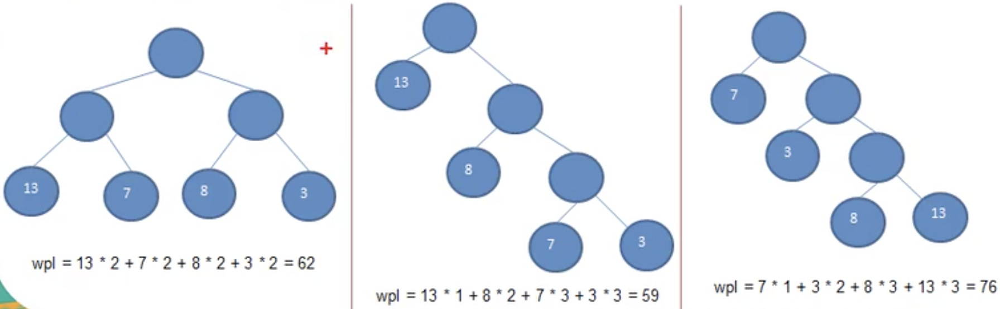
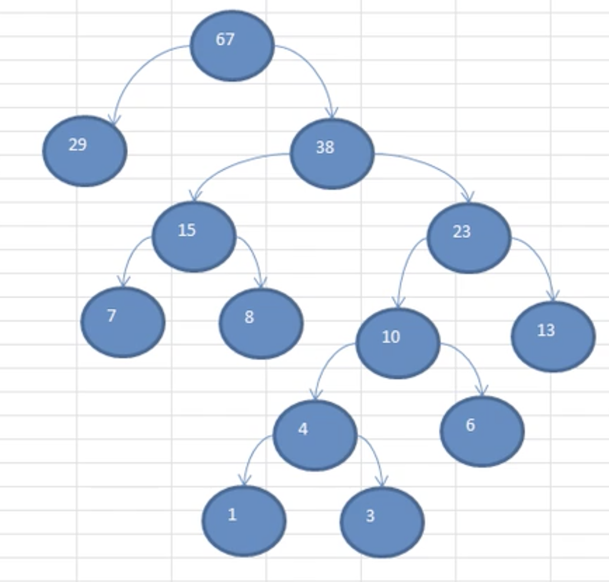

# 赫夫曼树

- ## 基本介绍

  1. 给定 n 个权值作为 n 个叶子节点，构造一颗二叉树，若该数的**带权路劲长度**(wpl)达到最小，称这样的二叉树为最优二叉树，也成为哈夫曼树(Huffman Tree)，还有的书翻译成霍夫曼树。
  2. 赫夫曼树是带权路径长度最短的树，权值较大的节点离根很近。

- ## 几个重要概念

  1. **路径和路径长度：**在一颗树种，从一个节点往下可以达到的孩子或孙子节点之间的通路，称为路径。通路中分支的数目称为路径长度。若规定根节点的层数为1，则从根节点到L层节点的路径长度为：L-1.

  2. **节点的权和带权路径长度：**若将树种的节点赋给一个有某种含义的数值，则这个数值称为该节点的权。节点的带权路径长度为：从根节点到该节点之间的路径长度与该节点的权的乘积。

  3. **树的带权路径长度：**树的带权路径长度规定为所有**叶子节点**的带权路径长度之和，记为WPL(weighted path length)，权值越大的节点离根节点越近的二叉树才是最优二叉树。

  4. WPL最小的就是赫夫曼树

     

     wpl=59的是赫夫曼树。

- ## 赫夫曼树创建思路

  给定一个数列{13,7,8,3,29,6,1}，要求转成一个赫夫曼树

  1. 从小到大进行排序，将每一个数据都看成一个节点，每个节点可以看成是一颗最简单的二叉树。

  2. 取出根节点权值最小的两颗二叉树。

  3. 组成一颗新的二叉树，该新的二叉树的根节点的权值就是前面两个二叉树根节点权值的和。

  4. 再将这个新的二叉树，以根节点的权值大小排次排序，不断重复1-2-3-4的步骤，直到数列中，所有的数据都被处理，就得到一颗赫夫曼树。如下图所示：

    
  
- ## 代码案例

  ```java
  package com.xie.huffmantree;
  
  import java.util.ArrayList;
  import java.util.Collections;
  import java.util.List;
  
  public class HuffmanTree {
      public static void main(String[] args) {
          int[] arr = {13, 7, 8, 3, 29, 6, 1};
          Node huffmanTree = createHuffmanTree(arr);
          //前序遍历
          preOrder(huffmanTree);
          /**
           * Node{value=67}
           * Node{value=29}
           * Node{value=38}
           * Node{value=15}
           * Node{value=7}
           * Node{value=8}
           * Node{value=23}
           * Node{value=10}
           * Node{value=4}
           * Node{value=1}
           * Node{value=3}
           * Node{value=6}
           * Node{value=13}
           */
      }
  
      //创建赫夫曼树
      public static Node createHuffmanTree(int[] arr) {
          //第一步为了操作方便
          //1.遍历 arr 数组
          //2.将 arr 的每个元素构成一个Node
          //3.将 Node 放入 ArrayList中
          List<Node> nodes = new ArrayList<>();
          for (int value : arr) {
              nodes.add(new Node(value));
          }
  
          while (nodes.size() > 1) {
              //排序 从小到大
              Collections.sort(nodes);
              System.out.println("nodes = " + nodes);
  
              //取出根节点权值最小的两颗二叉树
              //(1)取出权值最小的节点(二叉树)
              Node leftNode = nodes.get(0);
              //(2) 取出权值第二小的节点(二叉树)
              Node rightNode = nodes.get(1);
  
              //(3) 构建一颗新的二叉树
              Node parent = new Node(leftNode.value + rightNode.value);
              parent.left = leftNode;
              parent.roght = rightNode;
  
              //(4) 从ArrayList中删除处理过的二叉树
              nodes.remove(leftNode);
              nodes.remove(rightNode);
  
              //(5) 将parent加入nodes
              nodes.add(parent);
          }
  
          //返回赫夫曼树的root节点
          return nodes.get(0);
  
      }
  
      public static void preOrder(Node node) {
          if (node != null) {
              node.preOrder();
          } else {
              System.out.println("是空树，不能遍历~~");
          }
  
      }
  }
  
  //创建节点类,为了让Node对象支持排序，实现了Comparble接口
  class Node implements Comparable<Node> {
      //权值
      int value;
      //指向左子节点
      Node left;
      //指向右子节点
      Node roght;
  
      //写一个前序遍历
      public void preOrder() {
          System.out.println(this);
          if (this.left != null) {
              this.left.preOrder();
          }
  
          if (this.roght != null) {
              this.roght.preOrder();
          }
      }
  
      public Node(int value) {
          this.value = value;
      }
  
      @Override
      public String toString() {
          return "Node{" +
                  "value=" + value +
                  '}';
      }
  
      @Override
      public int compareTo(Node o) {
          //从小到大进行排序
          return this.value - o.value;
      }
  }
  ```
