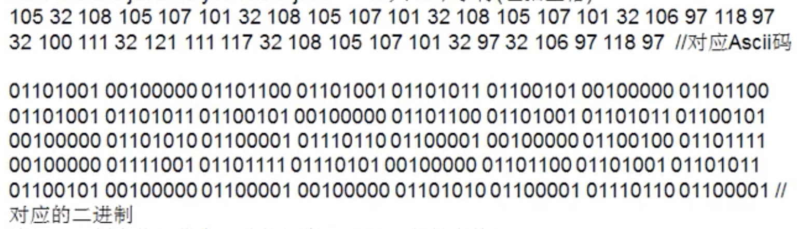
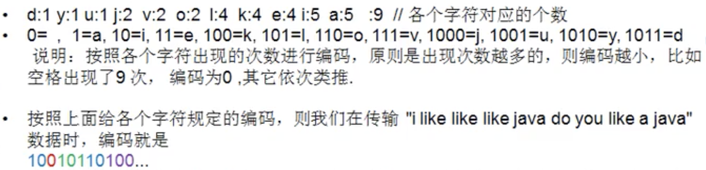
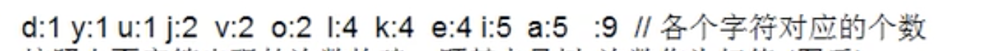
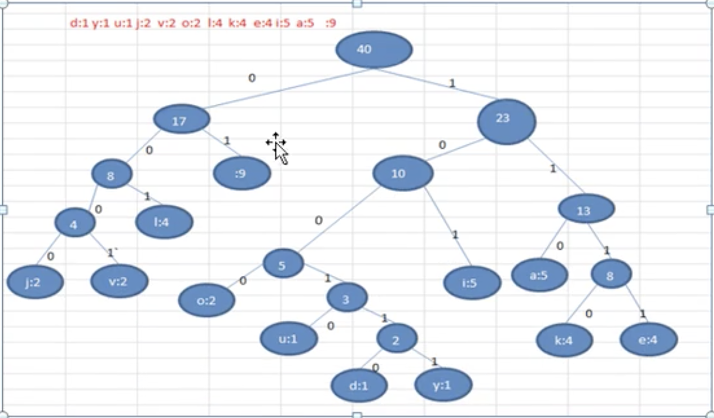
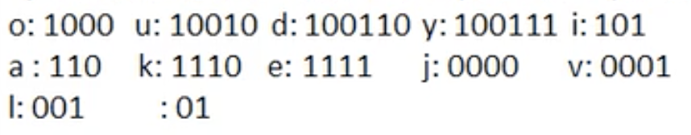
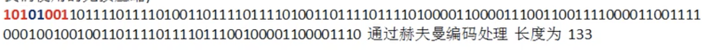
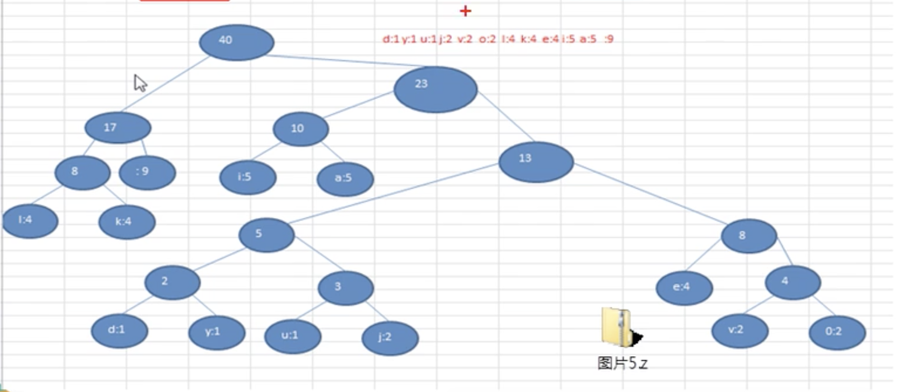

# 赫夫曼编码

- ## 基本介绍

  1. 赫夫曼编码也翻译为（哈夫曼编码）Huffman Coding，又称为霍夫曼编码，是一种编码方式，属于一种程序算法。
  2. 赫夫曼编码是赫夫曼树在电讯通讯中的经典的应用场景之一。
  3. 赫夫曼编码广泛的用于数据文件压缩。其压缩率通常在20%~90%之间。
  4. 赫夫曼码是可变**字长**编码(VLC)的一种.Hufuuman于1952年提出一种编码方法，称之为最佳编码。

- ## 原理剖析

  - **在通信领域中信息的处理方式1：定长编码**

    如: i like like like java do you like a java 共40个字符，包括空格，其对应的ASCII码,与二进制编码如下图

    

    按照二进制来传递信息，总的长度是359（包含空格）

  - **在通信领域中信息的处理方式2：变长编码**

    i like like like java do you like a java 共40个字符，包括空格。变长编码处理如下图

    

    字符的编码都不能是其他字符编码的前缀，符合此要求的编码叫做前缀编码，即不能匹配到重复的编码。

  - **在通信领域中信息的处理方式3：赫夫曼编码**
  
    i like like like java do you like a java 共40个字符，包括空格。变长编码处理如下图
  
    
  
    按照上面字符出现的次数构建一颗赫夫曼树，次数作为权值。
  
    
  
    根据赫夫曼树，给各个字符，规定编码(前缀编码),向左的路径为0 向右的路径为1：编码如下：
  
    
  
    按照上面的赫夫曼编码，我们的"i like like like java do you like a java" 字符串对应的编码(注意这里我们使用的无损压缩)如下图。
  
    
  
    **说明：**
  
    原来的长度是359，压缩了(359-133)/359=62.9%
  
    此编码满足前缀编码，即字符的编码都不能是其他字符编码的前缀。不会造成匹配的多义性。
  
    赫夫曼编码是无损压缩！！
  
    **注意：**
  
    这个赫夫曼树根据排序方法不同，也可能不一样，这样对应的赫夫曼编码也不完全一样，但是wpl是一样的，都是最小的，比如我们让每次生成的新的二叉树总是排在权值相同的二叉树的最后一个，则生成的二叉树为：
  
    
  
- ## 创建对应的赫夫曼树

    根据赫夫曼编码压缩数据的原理，需要创建"i like like like java do you like a java" 对应的赫夫曼树
  
    **思路：**
  
    1. 先创建Node节点，Node {data{存放数据}，weight(权值),left,right}；
    2. 得到"i like like like java do you like a java" 对应的byte[] 数组；
    3. 编写一个方法，将准备构建赫夫曼树的node节点放到`List<Node>`集合;
    4. 可以通过集合`List<Node>`创建对应的赫夫曼树;
  
- ## 赫夫曼树应用案例
  
    将一串字符串进行压缩与解压缩
  
    ```java
    package com.xie.huffmancode;

    import java.util.*;

    public class HuffmanCode {
        public static void main(String[] args) {
            String str = "i like like like java do you like a java";
            byte[] contentBytes = str.getBytes();
            System.out.println("contentBytes=" + Arrays.toString(contentBytes));
            List<Node> nodes = getNodes(contentBytes);

            //生成赫夫曼树
            Node hufffmanTreeRoot = createHufffmanTree(nodes);

            //生成的赫夫曼编码表
            getCodes(hufffmanTreeRoot, "", stringBuilder);

            byte[] huffmanCodeBytes = zip(contentBytes, huffmanCodes);
            System.out.println("huffmanCodeBytes = " + Arrays.toString(huffmanCodeBytes));

            byte[] decode = decode(huffmanCodes, huffmanCodeBytes);
            System.out.println("赫夫曼解码后对应的数组" + new String(decode));

            /**
             * contentBytes=[105, 32, 108, 105, 107, 101, 32, 108, 105, 107, 101, 32, 108, 105, 107, 101, 32, 106, 97, 118, 97, 32, 100, 111, 32, 121, 111, 117, 32, 108, 105, 107, 101, 32, 97, 32, 106, 97, 118, 97]
             * huffmanCodeBytes = [-88, -65, -56, -65, -56, -65, -55, 77, -57, 6, -24, -14, -117, -4, -60, -90, 28]
             * 赫夫曼解码后对应的数组i like like like java do you like a java
             */

        }

        //完成数据的解压思路
        //1.将huffmanCodeBytes[-88, -65, -56, -65, -56, -65, -55, 77, -57, 6, -24, -14, -117, -4, -60, -90, 28]
        //  重新转成 赫夫曼编码对应的二进制字符串"101010001011111111001000101111...."
        //2.赫夫曼编码对应的二进制字符串"101010001011111111001000101111...." => 对照赫夫曼编码表 => "i like like like java do you like a java"

        /**
         * 完成对压缩数据的解码
         *
         * @param huffmanCodes 赫夫曼编码表
         * @param huffmanBytes 赫夫曼编码得到的字节数组
         * @return 原来的字符串对应的数组
         */
        public static byte[] decode(Map<Byte, String> huffmanCodes, byte[] huffmanBytes) {
            StringBuilder stringBuilder = new StringBuilder();
            for (int i = 0; i < huffmanBytes.length; i++) {
                //判断是不是最后一个字节
                boolean flag = (i == huffmanBytes.length - 1);
                stringBuilder.append(byteToBitString(!flag, huffmanBytes[i]));
            }

            Map<String, Byte> map = new HashMap<>();
            for (Map.Entry<Byte, String> entry : huffmanCodes.entrySet()) {
                Byte k = entry.getKey();
                String v = entry.getValue();
                map.put(v, k);
            }

            List<Byte> list = new ArrayList<>();
            for (int i = 0; i < stringBuilder.length();) {
                int count = 1;
                boolean flag = true;
                Byte b = null;
                while (flag) {
                    String key = stringBuilder.substring(i, i + count);//i 不动，count移动，直到匹配一个字符
                    b = map.get(key);
                    if (b == null) {
                        count++;
                    } else {
                        flag = false;
                    }
                }
                list.add(b);
                i += count;
            }
            byte[] bytes = new byte[list.size()];
            for (int i = 0; i < list.size(); i++) {
                bytes[i] = list.get(i);
            }
            return bytes;
        }

        /**
         * 将一个byte 转成一个二进制的字符串
         *
         * @param flag 标识是否需要补高位，true标识需要补高位,如果是false表示不补，如果是最后一个字节，无需补高位
         * @param b    传入的byte
         * @return 该byte对应的二进制字符串，（注意是按补码返回)
         */
        public static String byteToBitString(boolean flag, byte b) {
            //将b 转成 int
            int temp = b;

            //如果temp是正数还需要补高位
            if (flag) {
                // 按位或 如 256|1=> 1 0000 0000|0000 0001 => 1 0000 0001
                temp |= 256;
            }

            //返回的是temp二进制的补码
            String bitStr = Integer.toBinaryString(temp);
            if (flag) {
                //取后8位
                return bitStr.substring(bitStr.length() - 8);
            } else {
                return bitStr;
            }
        }

        /**
         * 封装原始字节数组转赫夫曼字节数组
         *
         * @param bytes
         * @return
         */
        public static byte[] huffmanZip(byte[] bytes) {
            List<Node> nodes = getNodes(bytes);

            //创建赫夫曼树
            Node hufffmanTreeRoot = createHufffmanTree(nodes);
            //生成赫夫曼编码
            getCodes(hufffmanTreeRoot, "", stringBuilder);
            //返回压缩后的赫夫曼编码字节数组
            return zip(bytes, huffmanCodes);

        }

        /**
         * 将字符串对应的byte[] 数组，通过赫夫曼编码表，返回一个赫夫曼编码压缩后的byte[]
         *
         * @param bytes        原始字符串对应的byte[]
         * @param huffmanCodes 生成的赫夫曼编码
         * @return 返回赫夫曼编码处理后的byte[]
         */
        public static byte[] zip(byte[] bytes, Map<Byte, String> huffmanCodes) {
            //利用huffmanCodes 将 bytes 转成赫夫曼编码对应的字符串
            StringBuilder stringBuilder = new StringBuilder();
            for (byte b : bytes) {
                stringBuilder.append(huffmanCodes.get(b));
            }

            // 将"101010001011111111001000101111...." 转成byte[]
            // 统计返回byte[] huffmanCodeBytes 长度
            int len;
            if (stringBuilder.length() % 8 == 0) {
                len = stringBuilder.length() / 8;
            } else {
                len = stringBuilder.length() / 8 + 1;
            }
            //创建 存储压缩后的byte[]数组
            byte[] huffmanCodeBytes = new byte[len];
            int index = 0;
            for (int i = 0; i < stringBuilder.length(); i += 8) {
                String strByte;
                if (i + 8 > stringBuilder.length()) {
                    strByte = stringBuilder.substring(i);
                } else {
                    strByte = stringBuilder.substring(i, i + 8);
                }
                //将strByte 转成一个byte ,放入到huffmanCodeBytes
                huffmanCodeBytes[index] = (byte) Integer.parseInt(strByte, 2);
                index++;
            }
            return huffmanCodeBytes;
        }

        //生成赫夫曼树对应的赫夫曼编码表
        //思路：
        //1. 将赫夫曼编码表存放在Map<Byte,String>,形式如32->01,97->100...
        static Map<Byte, String> huffmanCodes = new HashMap<>();
        //2. 在生成赫夫曼编码表时，需要拼接路径，定义一个StringBuilder  存储某个叶子节点的路径
        static StringBuilder stringBuilder = new StringBuilder();

        /**
         * 将传入的node 节点的所有叶子的赫夫曼编码得到，并放入huffmanCodes集合
         *
         * @param node          传入节点
         * @param code          路径：左子节点是0，右子节点是1
         * @param stringBuilder 用于拼接路径
         */
        public static void getCodes(Node node, String code, StringBuilder stringBuilder) {
            StringBuilder stringBuilder2 = new StringBuilder(stringBuilder);
            stringBuilder2.append(code);
            if (node != null) {
                //判断当前node 是叶子节点还是非叶子节点
                if (node.data == null) {//非叶子节点

                    //向左递归处理
                    getCodes(node.left, "0", stringBuilder2);
                    //向右递归处理
                    getCodes(node.right, "1", stringBuilder2);
                } else {//叶子节点
                    huffmanCodes.put(node.data, stringBuilder2.toString());
                }
            }
        }

        //前序遍历
        public static void preOrder(Node root) {
            if (root != null) {
                root.preOrder();
            } else {
                System.out.println("赫夫曼树不能为空~~");
            }
        }

        /**
         * 将字节数组转成node集合
         *
         * @param bytes 字节数组
         * @return
         */
        public static List<Node> getNodes(byte[] bytes) {
            ArrayList<Node> nodes = new ArrayList<>();

            //存储每个byte出现的次数
            Map<Byte, Integer> counts = new HashMap<>();
            for (byte b : bytes) {
                counts.merge(b, 1, (a, b1) -> a + b1);
            }

            //把每个键值对转成一个node对象，并加入到nodes 集合
            counts.forEach((k, v) -> nodes.add(new Node(k, v)));
            return nodes;
        }

        /**
         * 生成赫夫曼树
         * @param nodes 传入的节点
         * @return
         */
        public static Node createHufffmanTree(List<Node> nodes) {
            while (nodes.size() > 1) {
                //排序，从小到大
                Collections.sort(nodes);

                //(1)取出权值最小的节点(二叉树)
                Node leftNode = nodes.get(0);

                //(2) 取出权值第二小的节点(二叉树)
                Node rightNode = nodes.get(1);
                //(3) 构建一颗新的二叉树
                Node parent = new Node(null, leftNode.weight + rightNode.weight);
                parent.left = leftNode;
                parent.right = rightNode;

                //(4) 从ArrayList中删除处理过的二叉树
                nodes.remove(leftNode);
                nodes.remove(rightNode);
                //(5) 将parent加入nodes
                nodes.add(parent);
            }
            //nodes 的最后一个就是赫夫曼树的root节点
            return nodes.get(0);
        }
    }

    //创建Node，带数据和权值
    class Node implements Comparable<Node> {
        //存放数据本身,比如'a'=>'97'，' ' =>'32'
        Byte data;
        //权值，表示字符出现的次数
        int weight;

        Node left;
        Node right;

        public Node(Byte data, int weight) {
            this.data = data;
            this.weight = weight;
        }

        public void preOrder() {
            System.out.println(this);
            if (this.left != null) {
                this.left.preOrder();
            }
            if (this.right != null) {
                this.right.preOrder();
            }
        }

        @Override
        public int compareTo(Node o) {
            //从小到大排序
            return this.weight - o.weight;
        }

        @Override
        public String toString() {
            return "Node{" +
                    "data=" + data +
                    ", weight=" + weight +
                    '}';
        }
    }
    ```
  
- ## 赫夫曼压缩文件注意事项
  
    1. 如果文件本身就经过压缩处理的，那么使用赫夫曼编码再压缩效率不会有明显的变化，比如视频，ppt等文件。
    2. 赫夫曼编码是按字节来处理的，因此可以处理所有的文件（二进制文件，文本文件）
    3. 如果一个文件中的内容，重复的数据不多，压缩效果也不会明显。
