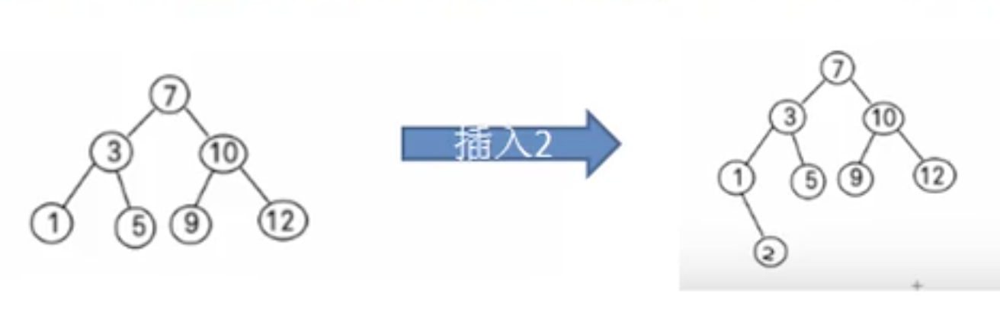
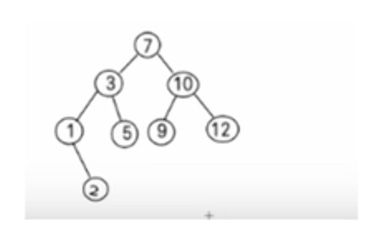

# 二叉排序树

- ## 基本介绍

  二叉排序树：BST(Binary Sort(Search) Tree)，对于二叉排序树的任何一个非叶子节点，要求左节点的值，比当前节点的值小，右节点的值比当前节点的值大。

  **特别说明：**如果有相同的值，可以将该节点放在左子节点或者右子节点

  比如针对数据{7,3,10,12,5,1,9}，对应的二叉排序树为：

  

- ## 二叉排序树删除节点

  二叉排序树的删除情况比较复杂，如下图，有下面三种情况需要考虑，

  

  1. 删除叶子节点(比如：2，5，9，12)

     **思路：**

     - 需要先找到要删除的节点 targetNode
     - 找到 targetNode 的父节点 parentNode(考虑是否存在父节点)
     - 确定 targetNode 是 parentNode 的左子节点还是右子节点
     - 根据前面的来对应删除，左子节点=>parent.left = null，右子节点=>parent.right = null;

  2. 删除只有一颗子树的节点（比如：1）

     **思路：**

     - 需要先找到要删除的节点 targetNode
     - 找到 targetNode 的父节点 parentNode(考虑是否存在父节点)
     - 确定 targetNode 的子节点是左子节点还是右子节点
     - 确定 targetNode 是 parentNode 的左子节点还是右子节点
     - 如果 targetNode 是parentNode 的左子节点 :
       1. targetNode 的子节点是左子节点 ,那么  parentNode.left = targetNode.left
       2. targetNode 的子节点是右子节点，那么， parentNode.left = targetNode.right;
     - 如果 targetNode 是 parentNode 的右子节点：
       1. targetNode 的子节点是左子节点 ,那么  parentNode.right = targetNode.left
       2. targetNode 的子节点是右子节点，那么， parentNode.right = targetNode.right

  3. 删除有两颗子树的节点（比如：7，3，10）

     **思路：**

     - 需要先找到要删除的节点 targetNode
     - 找到 targetNode 的父节点 parentNode(考虑是否存在父节点)
     - 从 targetNode 的右子树找到最小的节点，用一个临时变量，将右子树最小节点的值保存到temp ,删除该右子树最小节点，然后，targetNode.value = temp;如果从左子树找的话，只要替换左子树最大的值就行。

- ## 代码案例

  ```java
  package com.xie.bst;
  
  public class BinarySortTreeDemo {
      public static void main(String[] args) {
          int[] arr = {7, 3, 10, 12, 5, 1, 9, 2};
          BinarySortTree binarySortTree = new BinarySortTree();
          for (int i : arr) {
              binarySortTree.add(new Node(i));
          }
          System.out.println("中序遍历二叉排序树~");
          binarySortTree.infixOrder();
  
          System.out.println("测试删除叶子节点");
          binarySortTree.delNode(10);
          System.out.println("删除节点后");
          binarySortTree.infixOrder();
      }
  }
  
  class BinarySortTree {
      private Node root;
  
      //查找要删除的节点的父节点
      public Node searchParent(Node node) {
          if (root != null) {
              return root.searchParent(node);
          } else {
              return null;
          }
      }
  
      //查找要删除的节点
      public Node search(int value) {
          if (root == null) {
              return null;
          } else {
              return root.search(value);
          }
      }
  
      /**
       * 找到以node 根的二叉排序树的最小值，并删除以node 为根节点的二叉排序树的最小节点
       *
       * @param node 传入节点（当做二叉排序树的根节点)
       * @return 返回以node为根节点的二叉排序树的最小节点值
       */
      public int delRightTreeMin(Node node) {
          Node target = node;
          //循环查找左节点
          while (target.left != null) {
              target = target.left;
          }
          //删除最小节点
          delNode(target.value);
          return target.value;
      }
  
      /**
       * 找到以node 根的二叉排序树的最大值，并删除以node 为根节点的二叉排序树的最大节点
       *
       * @param node 传入节点（当做二叉排序树的根节点)
       * @return 返回以node为根节点的二叉排序树的最大节点值
       */
      public int delLeftTreeMax(Node node) {
          Node target = node;
          while (target.right != null) {
              target = target.right;
          }
  
          //删除最大节点
          delNode(target.value);
          return target.value;
      }
  
      //删除节点
      public void delNode(int value) {
          if (root == null) {
              return;
          } else {
              Node targetNode = search(value);
              if (targetNode == null) {
                  return;
              }
              if (targetNode == root) {
                  root = null;
                  return;
              }
              Node parentNode = searchParent(targetNode);
  
              if (targetNode.left == null && targetNode.right == null) {
                  //如果要删除的节点是叶子节点
                  if (parentNode.left != null && parentNode.left.value == targetNode.value) {
                      parentNode.left = null;
                  }
                  if (parentNode.right != null && parentNode.right.value == targetNode.value) {
                      parentNode.right = null;
                  }
              } else if (targetNode.left != null && targetNode.right != null) {
                  //如果要删除的节点是有两个子树的节点
                  int minValue = delRightTreeMin(targetNode.right);
                  targetNode.value = minValue;
                  //上下代码删除效果一样
                  //int maxValue = delLeftTreeMax(targetNode.left);
                  //targetNode.value = maxValue;
              } else {
                  //要删除的节点是只有左子节点
                  if (targetNode.left != null) {
                      if (parentNode != null) {
                          if (parentNode.left == targetNode) {
                              parentNode.left = targetNode.left;
                          } else {
                              parentNode.right = targetNode.left;
                          }
                      } else {
                          //如果父节点是空，让root换位
                          root = targetNode.left;
                      }
                  } else {//要删除的节点是只有右子节点
                      if (parentNode != null) {
                          if (parentNode.left == targetNode) {
                              parentNode.left = targetNode.right;
                          } else {
                              parentNode.right = targetNode.right;
                          }
                      } else {
                          //如果父节点是空，让root换位
                          root = targetNode.right;
                      }
  
                  }
              }
          }
      }
  
      //添加节点
      public void add(Node node) {
          if (root == null) {
              root = node;
          } else {
              root.add(node);
          }
      }
  
      //中序遍历
      public void infixOrder() {
          if (root != null) {
              root.infixOrder();
          } else {
              System.out.println("二叉排序为空，不能遍历");
          }
      }
  
  }
  
  class Node {
      int value;
      Node left;
      Node right;
  
      public Node(int value) {
          this.value = value;
      }
  
      /**
       * 查找要删除节点的父节点
       *
       * @param node 要删除的节点
       * @return 要删除节点的父节点
       */
      public Node searchParent(Node node) {
          //如果当前节点就是要删除节点的父节点就返回
          if ((this.left != null && this.left.value == node.value) ||
                  (this.right != null && this.right.value == node.value)) {
              return this;
          } else {
              if (this.left != null && node.value < this.value) {
                  //如果查找的节点的值小于当前节点的值，向左子树递归查找
                  return this.left.searchParent(node);
              } else if (this.right != null && value >= this.value) {
                  //如果查找的节点的值小于当前节点的值，向左子树递归查找
                  return this.right.searchParent(node);
              } else {
                  return null;
              }
          }
      }
  
      /**
       * 查找要删除的节点
       *
       * @param value 要删除的节点的值
       * @return 删除的节点
       */
      public Node search(int value) {
          if (value == this.value) {
              return this;
          } else if (value < this.value) {
              if (this.left != null) {
                  return this.left.search(value);
              } else {
                  return null;
              }
          } else {
              if (this.right != null) {
                  return this.right.search(value);
              } else {
                  return null;
              }
          }
      }
  
      //递归的形式添加节点，满足二叉排序树的要求
      public void add(Node node) {
          if (node == null) {
              return;
          }
          if (node.value < this.value) {
              if (this.left == null) {
                  this.left = node;
              } else {
                  //递归向左子树添加
                  this.left.add(node);
              }
          } else {
              if (this.right == null) {
                  this.right = node;
              } else {
                  //递归向右子节点添加
                  this.right.add(node);
              }
          }
      }
  
      //中序遍历
      public void infixOrder() {
          if (this.left != null) {
              this.left.infixOrder();
          }
          System.out.println(this);
          if (this.right != null) {
              this.right.infixOrder();
          }
      }
  
      @Override
      public String toString() {
          return "Node{" +
                  "value=" + value +
                  '}';
      }
  }
  ```
