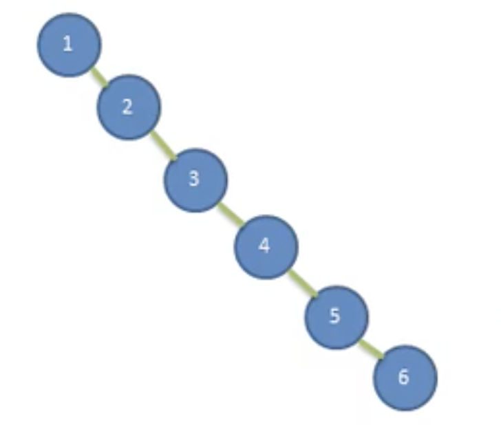
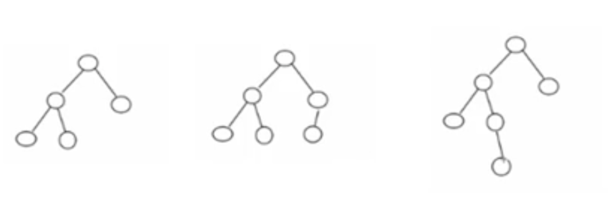

# 平衡二叉树

- ## 二叉排序树可能的问题

  给定一个数列{1,2,3,4,5,6}，要求创建一个二叉排序树(BST)，分析问题所在

  

  **问题分析：**

  1. 左子树全部为空，从形式上看，更像一个单链表；
  2. 插入速度没有影响；
  3. 查询速度明显降低（因为需要一次比较），不能发挥BST的优势。因为每次还要比较左子树，其查询速度，比单链表还慢。
  4. 解决方案-平衡二叉树(ALV)

- ## 基本介绍

  1. 平衡二叉树也叫平衡二叉搜索树(Self-balancing binary search tree)，又称为AVL树，可以**保证查询效率较高**。

  2. 具有以下特点：它是一颗空树或它的左右两个子树的高度差的绝对值不超过1，并且左右两个子树都是一颗平衡二叉树。平衡二叉树的常用实现方法有  红黑树、AVL、替罪羊树、Treap、伸展树等；

  3. 举例说明，下图前两个都是平衡二叉树，第一个左右子树的高度差绝对值是1，第二个左右子树高度差的绝对值是0，而第三个的左右子树高度差的绝对值是2，这样第三个就不是平衡二叉树；

    

- ## 平衡二叉树之左旋转

  **步骤：**

  1. 创建一个新的节点newNode，值等于当前根节点的值。
  2. 把新节点的左子树设置成当前节点的左子树。
  3. 把新节点的右子树设置成当前节点的右子树的左子树。
  4. 把当前节点的值换为当前右子节点的值。
  5. 把当前节点的右子树设置成右子树的右子树。
  6. 把当前节点的左子树设置为新的节点。

- ## 平衡二叉树之右旋转

  **步骤：**

  1. 创建一个新的节点，值等于当前根的节点的值。
  2. 把新节点的右子树设置成当前节点的右子树。
  3. 把新节点的左子树设置成当前节点的左子树的右子树。
  4. 把当前节点的值换位左子节点的值。
  5. 把当前节点的左子树设置成左子树的左子树。
  6. 把当前节点的右子树设置为新的节点。

- ## 平衡二叉树之双旋转

  在某些情况下，单旋转不能完成完成平衡二叉树的转换，需要进行两次旋转。

  1. 如果它的右子树的左子树的高度大于它的右子树的右子树的高度，需要先对右子树进行右旋转，再对当前节点进行左旋转。
  2. 如果它的左子树的右子树高度大于它的左子树的左子树高度，
  3. 需要对左子树先进行左旋转,再对当前节点进行右旋转。

- ## 代码案例

  ```java
  package com.xie.avl;
  
  public class AVLTreeDemo {
      public static void main(String[] args) {
          int[] arr = {4, 3, 6, 5, 7, 8};
          AVLTree avlTree = new AVLTree();
          for (int i = 0; i < arr.length; i++) {
              avlTree.add(new Node(arr[i]));
          }
          System.out.println("中序遍历");
          avlTree.infixOrder();
          System.out.println("在没有平衡处理前~~");
          System.out.println("树的高度=" + avlTree.getRoot().height());
          System.out.println("树的左子树的高度=" + avlTree.getRoot().leftHeight());
          System.out.println("树的右子树的高度=" + avlTree.getRoot().rightHeight());
      }
  }
  
  class AVLTree {
      private Node root;
  
      public Node getRoot() {
          return root;
      }
  
      public void setRoot(Node root) {
          this.root = root;
      }
  
      //查找要删除的节点的父节点
      public Node searchParent(Node node) {
          if (root != null) {
              return root.searchParent(node);
          } else {
              return null;
          }
      }
  
      //查找要删除的节点
      public Node search(int value) {
          if (root == null) {
              return null;
          } else {
              return root.search(value);
          }
      }
  
      /**
       * 找到以node 根的二叉排序树的最小值，并删除以node 为根节点的二叉排序树的最小节点
       *
       * @param node 传入节点（当做二叉排序树的根节点)
       * @return 返回以node为根节点的二叉排序树的最小节点值
       */
      public int delRightTreeMin(Node node) {
          Node target = node;
          //循环查找左节点
          while (target.left != null) {
              target = target.left;
          }
          //删除最小节点
          delNode(target.value);
          return target.value;
      }
  
      /**
       * 找到以node 根的二叉排序树的最大值，并删除以node 为根节点的二叉排序树的最大节点
       *
       * @param node 传入节点（当做二叉排序树的根节点)
       * @return 返回以node为根节点的二叉排序树的最大节点值
       */
      public int delLeftTreeMax(Node node) {
          Node target = node;
          while (target.right != null) {
              target = target.right;
          }
  
          //删除最大节点
          delNode(target.value);
          return target.value;
      }
  
      //删除节点
      public void delNode(int value) {
          if (root == null) {
              return;
          } else {
              Node targetNode = search(value);
              if (targetNode == null) {
                  return;
              }
              if (targetNode == root) {
                  root = null;
                  return;
              }
              Node parentNode = searchParent(targetNode);
  
              if (targetNode.left == null && targetNode.right == null) {
                  //如果要删除的节点是叶子节点
                  if (parentNode.left != null && parentNode.left.value == targetNode.value) {
                      parentNode.left = null;
                  }
                  if (parentNode.right != null && parentNode.right.value == targetNode.value) {
                      parentNode.right = null;
                  }
              } else if (targetNode.left != null && targetNode.right != null) {
                  //如果要删除的节点是有两个子树的节点
                  int minValue = delRightTreeMin(targetNode.right);
                  targetNode.value = minValue;
                  //上下代码删除效果一样
                  //int maxValue = delLeftTreeMax(targetNode.left);
                  //targetNode.value = maxValue;
              } else {
                  //要删除的节点是只有左子节点
                  if (targetNode.left != null) {
                      if (parentNode != null) {
                          if (parentNode.left == targetNode) {
                              parentNode.left = targetNode.left;
                          } else {
                              parentNode.right = targetNode.left;
                          }
                      } else {
                          //如果父节点是空，让root换位
                          root = targetNode.left;
                      }
                  } else {//要删除的节点是只有右子节点
                      if (parentNode != null) {
                          if (parentNode.left == targetNode) {
                              parentNode.left = targetNode.right;
                          } else {
                              parentNode.right = targetNode.right;
                          }
                      } else {
                          //如果父节点是空，让root换位
                          root = targetNode.right;
                      }
  
                  }
              }
          }
      }
  
      //添加节点
      public void add(Node node) {
          if (root == null) {
              root = node;
          } else {
              root.add(node);
          }
      }
  
      //中序遍历
      public void infixOrder() {
          if (root != null) {
              root.infixOrder();
          } else {
              System.out.println("二叉排序为空，不能遍历");
          }
      }
  }
  
  class Node {
      int value;
      Node left;
      Node right;
  
      public Node(int value) {
          this.value = value;
      }
  
      /**
       * 返回左子树的高度
       *
       * @return
       */
      public int leftHeight() {
          if (left == null) {
              return 0;
          }
          return left.height();
      }
  
      /**
       * 返回右子树的高度
       *
       * @return
       */
      public int rightHeight() {
          if (this.right == null) {
              return 0;
          }
          return right.height();
      }
  
      /**
       * 返回以该节点为根节点的树的高度
       *
       * @return
       */
      public int height() {
          return Math.max(this.left == null ? 0 : this.left.height(), this.right == null ? 0 : this.right.height()) + 1;
      }
  
      /**
       * 左旋转
       */
      public void leftRotate() {
          //创建新的节点，以当前根节点的值
          Node newNode = new Node(value);
          //把新的节点的左子树设置为当前节点的左子树
          newNode.left = left;
          //把新的右子树设置为当前节点的右子树的左子树
          newNode.right = right.left;
          //把当前节点的值替换成右子节点的值
          value = right.value;
          //把当前节点的右子树设置成当前节点的右子节点的右子树
          right = right.right;
          //把当前的节点的左子节点(左子树),设置成新的节点
          left = newNode;
      }
  
      /**
       * 右旋转
       */
      public void rightRotate() {
          //创建新的节点，以当前根节点的值
          Node newNode = new Node(value);
          //把新的节点的右子树设置成当前节点的右子树
          newNode.right = right;
          //把新的节点的左子树设置为当前节点左子树的右子树
          newNode.left = left.right;
          //把当前节点的值换为左子节点的值
          value = left.value;
          //把当前节点左子树设置成左子树的左子树
          left = left.left;
          //把当前节点的右子树设置新节点
          right = newNode;
      }
  
      /**
       * 查找要删除节点的父节点
       *
       * @param node 要删除的节点
       * @return 要删除节点的父节点
       */
      public Node searchParent(Node node) {
          //如果当前节点就是要删除节点的父节点就返回
          if ((this.left != null && this.left.value == node.value) ||
                  (this.right != null && this.right.value == node.value)) {
              return this;
          } else {
              if (this.left != null && node.value < this.value) {
                  //如果查找的节点的值小于当前节点的值，向左子树递归查找
                  return this.left.searchParent(node);
              } else if (this.right != null && value >= this.value) {
                  //如果查找的节点的值小于当前节点的值，向左子树递归查找
                  return this.right.searchParent(node);
              } else {
                  return null;
              }
          }
      }
  
      /**
       * 查找要删除的节点
       *
       * @param value 要删除的节点的值
       * @return 删除的节点
       */
      public Node search(int value) {
          if (value == this.value) {
              return this;
          } else if (value < this.value) {
              if (this.left != null) {
                  return this.left.search(value);
              } else {
                  return null;
              }
          } else {
              if (this.right != null) {
                  return this.right.search(value);
              } else {
                  return null;
              }
          }
      }
  
      //递归的形式添加节点，满足二叉排序树的要求
      public void add(Node node) {
          if (node == null) {
              return;
          }
          if (node.value < this.value) {
              if (this.left == null) {
                  this.left = node;
              } else {
                  //递归向左子树添加
                  this.left.add(node);
              }
          } else {
              if (this.right == null) {
                  this.right = node;
              } else {
                  //递归向右子节点添加
                  this.right.add(node);
              }
          }
  
          //当添加完一个节点后，如果（右子树高度-左子树高度）> 1 ，进行左旋转
          if (rightHeight() - leftHeight() > 1) {
              //如果它的右子树的左子树的高度大于它的右子树的右子树的高度，需要先对右子树进行右旋转，再对当前节点进行左旋转
              if(right != null && right.leftHeight()>right.rightHeight()){
                  right.rightRotate();
                  leftRotate();
              }else{
                  //直接进行左旋转即可
                  leftRotate();
              }
              return;
          }
  
          //当添加完一个节点后，如果（左子树高度-右子树高度）> 1 ，进行右旋转
          if (leftHeight() - rightHeight() > 1) {
              //如果它的左子树的右子树高度大于它的左子树的左子树高度，需要对左子树先进行左旋转,再对当前节点进行右旋转
              if(left != null && left.rightHeight() > left.leftHeight()){
                  left.leftRotate();
                  rightRotate();
              }else{
                  //直接进行右旋转即可
                  rightRotate();
              }
  
          }
      }
  
      //中序遍历
      public void infixOrder() {
          if (this.left != null) {
              this.left.infixOrder();
          }
          System.out.println(this);
          if (this.right != null) {
              this.right.infixOrder();
          }
      }
  
      @Override
      public String toString() {
          return "Node{" +
                  "value=" + value +
                  '}';
      }
  }
  
  ```
