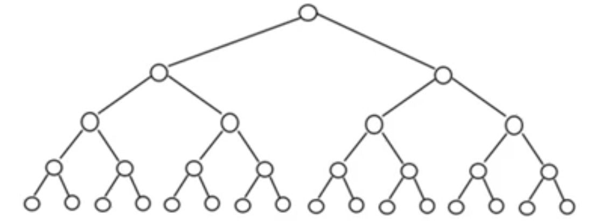
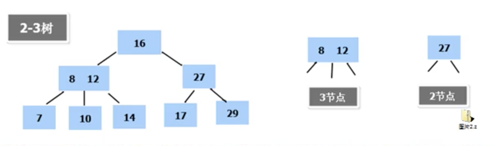
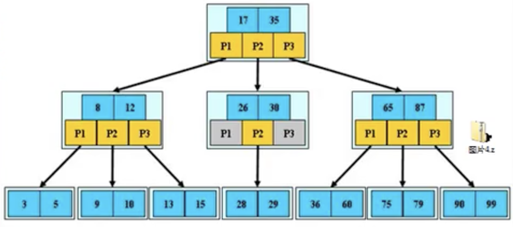
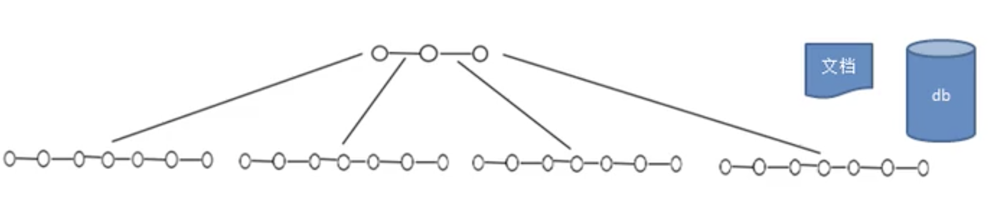
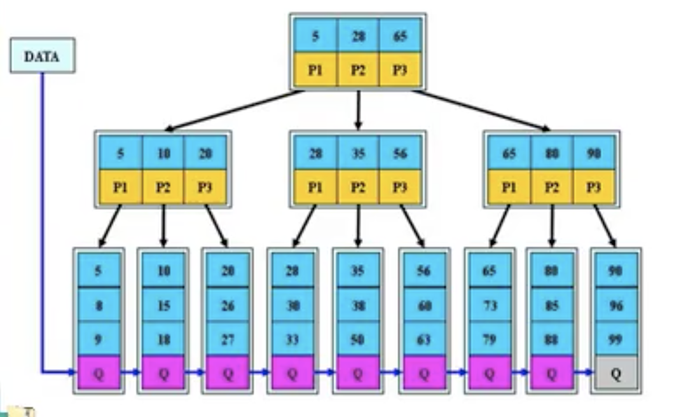
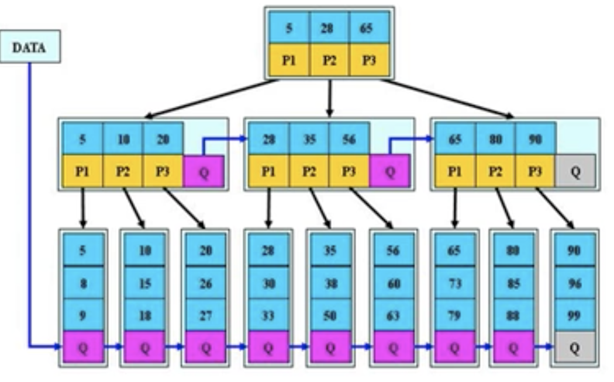

# 多路查找树

- ## 二叉树的问题分析

  二叉树的操作效率高，但是也存在问题，请看下面的二叉树

  

  二叉树需要加载到内存，如果二叉树的节点少，没有什么问题，但是如果二叉树的节点很多（比如1亿），就存在如下问题：

  1. 在构建二叉树时，需要多次进行I/O操作（海量数据存在数据库或文件中），节点海量，构建树时，速度有影响。
  2. 节点海量，也会造成二叉树的高度很大，会降低操作速度。

- ## 多叉树

  1. 在二叉树中，每个节点有数据项，最多有两个子节点。如果允许每个节点可以有更多的数据项和更多的节点，就是多叉树(multiway tree).

  2. 如2-3树，2-3-4树就是多叉树，多叉树通过重新组织节点，减少数的高度，能对二叉树进行优化。

  3. 举例说明（下面的2-3树）就是一颗多叉树

    

- ## B树的基本介绍

  B-Tree 树即B树，B即Balanced，平衡的意思。在mysql中说某种类型的索引是基于B树或者B+树，如下图：

  

  **B树说明：**

  1. B树的阶：节点的做多子节点个数，比如2-3树的阶是3，2-3-4树的阶是4.
  2. B树的搜索：从根节点开始，对节点内的关键字（有序）序列进行二分查找，如果命中则结束，否则进入查询关键字所属范围的子节点；重复，直到所对应的子指针为空，或已经是叶子节点。
  3. 关键字集合分布在整颗树中，即叶子节点和非叶子节点都存放数据。
  4. 搜索可能在非叶子节点结束
  5. 其搜索性能等价于在关键字内全集做一次二分查找。

  B树通过重新组织节点，降低树的高度，并减少I/O读写次数来提升效率。

  

  1. 如图B树通过重新组织节点，降低了树的高度。
  2. 文件系统及数据库系统的设计者利用了磁盘预读原理，将一个节点的大小设为等于一个页（页的大小通常为4k)，这样每个节点只需一次I/O就可以完全载入。
  3. 将树的度M（树中某个父节点含有最多子节点的个数）设置为1024，在600亿个元素中，最多只需4次I/O操作就可以读取到想要的元素，B树广泛用于文件存储系统及数据库系统中。

- ## B+树基本介绍

  B+树是B树的变体，也是一种多路查找树

    

  **B+树说明：**

  1. B+树的搜索与B树也基本相同，区别是B+树只有达到叶子节点才能命中（B树可以在非叶子节点命中），其性能也等价于在关键字全集做一次二分查找。
  2. 所有**关键字出现在叶子节点的链表中**（即数据只能在叶子节点【也叫稠密索引】），且链表中的关键字（数据）恰好是有序的。
  3. 不可能在非叶子节点命中。
  4. 非叶子节点相当于叶子节点的索引（稀疏索引），叶子节点相当于是存储（关键字）数据的数据层。
  5. 更适合文件索引系统。
  6. B树和B+树各有自己的场景，不能说B+树**完全比**B树好，反之亦然。

- ## B*树基本介绍

  B* 树是 B+ 树的变体，在B+树的非根和非叶子节点再增加指向兄弟的指针。

  

  **B* 树说明：**

  1. B*树定义了非叶子节点关键字个数至少为(2/3)*M，即块的最低使用率为2/3，而B+树的块的最低使用率1/2。
  2. 从第一个特点可以看出，B*树分配新节点的概率要比B+树要低，空间使用率更高。

- ## 2-3树基本介绍（最简单的B树）

  **2-3树是最简单的B-树结构，具有如下特点：**

  1. 2-3树的所有叶子节点都在同一层。（只要是B树都满足这个条件）
  2. 有两个子节点的节点叫做二节点，二节点要么没有子节点，要么有两个子节点。
  3. 有三个子节点的节点叫做三节点，三节点要么没有子节点，要么有三个子节点。
  4. 2-3是由二节点和三节点构成的树。

  2-3树的插入规则：

  1. 2-3树的所有叶子节点都在同一层。（只要是B树都满足这个条件）。
  2. 有两个子节点的节点叫做二节点，二节点要么没有子节点，要么有两个子节点。
  3. 有三个子节点的节点叫做三节点，三节点要么没有子节点，要么有三个子节点。
  4. 当按照规则插入一个数到某个节点时，不能满足上面三个要求，就需要拆，先向上拆，如果上层满，则拆本层，拆后仍然需要满足上面三个条件。
  5. 对于三节点的子树的值大小仍然满足（BST二叉排序树）的规则。
