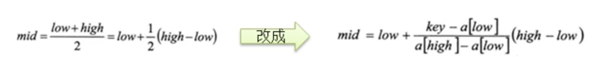

# 插值查找

- ## 基本介绍

  1. 插值查找算法类似于二分查找，不同的是插值查找每次从**自适应**的mid处开始查找。

  2. 二分查找中求mid索引的公式转成插值查找mid索引公式，low表示左边的索引，high表示右边的索引，key表示要查找的值

    
  
- ## 代码案例

  ```java
  package com.xie.search;
  
  import java.util.ArrayList;
  import java.util.List;
  
  public class InsertValueSearch {
      static int count = 0;
  
      public static void main(String[] args) {
          int[] arr = new int[102];
          arr[0] = 1;
          arr[1] = 1;
          for (int i = 2; i < 102; i++) {
              arr[i] = i;
          }
          List<Integer> indexList = insertValueSearch(arr, 0, arr.length - 1, 1);
          System.out.println("indexList = " + indexList);
          System.out.println("查找次数：" + count);
  
          /*
          indexList = [1, 0]
          查找次数：1
           */
      }
  
      /**
       * 插值查找，返回索引集合
       *
       * @param arr       数组
       * @param left      左边索引
       * @param right     右边索引
       * @param findValue 要查找的值
       * @return 找到就返回所有索引的集合，没有就返回空
       */
      public static List<Integer> insertValueSearch(int[] arr, int left, int right, int findValue) {
          count++;
          List<Integer> indexList = new ArrayList<Integer>();
          //注意：findValue < arr[0] || findValue > arr[arr.length - 1] 这个必须要，否则mid可能越界
          if (left > right || findValue < arr[0] || findValue > arr[arr.length - 1]) {
              return new ArrayList<Integer>();
          }
          int mid = left + (right - left) * (findValue - arr[left]) / (arr[right] - arr[left]);
          int midValue = arr[mid];
  
          if (findValue > midValue) {
              return insertValueSearch(arr, mid + 1, right, findValue);
          } else if (findValue < midValue) {
              return insertValueSearch(arr, left, mid - 1, findValue);
          } else {
              //如果找到了，再向左扫描，将满足条件的加入indexList
              int temp = mid - 1;
              while (true) {
                  if (temp < 0 || arr[temp] != findValue) {
                      break;
                  }
                  indexList.add(temp);
                  temp--;
              }
  
              //再向右扫描,将满足条件的加入indexList
              temp = mid + 1;
              while (true) {
                  if (temp > right || arr[temp] != findValue) {
                      break;
                  }
                  indexList.add(temp);
                  temp++;
              }
              indexList.add(mid);
              return indexList;
          }
      }
  }
  
  ```

- ## 注意事项

  1. 对于数据量大，**关键字分布比较均匀**的查找表来说，采用插值查找，速度较快。
  2. 关键字分布不均匀的情况下，该方法不一定比二分法要好。
