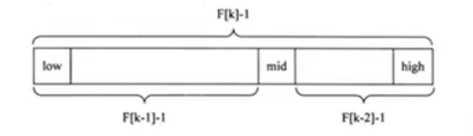

# 斐波那契（黄金分割法）查找

- ## 基本介绍

  1. 黄金分割点是指把一条线段分割成两部分，使其中一部分与全长之比等于另一部分与这部分之比。取其前三位数字的近似值是0.618。由于按此比例设计的造型十分美丽，因此也称为**黄金分割**，也称**中外比**。
  2. 斐波那契数列{1,1,2,3,5,8,13,21,34,55}发现斐波那契数列的两个相邻数的比例，无限接近黄金分割值0.618.

- ## 斐波那契查找原理

  斐波那契查找原理与二分查找和插值查找相似，仅仅改变了中间点(mid)的位置，mid不再是中间或插值得到的，而是位于黄金分割点附近，即**mid = low+F(k-1)-1**,F代表斐波那契数列，如下图

  

  对**F(k-1)-1**的理解：

  1. 由于斐波那契数列F[k] = F[k-1]+F[k-2]的性质，可以得到**(F[k]-1) = (F[k-1]-1)+(F[k-2]-1)+1**。该公式说明：主要顺序表的长度为**F[k]-1**,则可以将该表分成长度为**F[k-1]**和**F[k-2]**的两段，即如上图所示。从而中间位置为：**mid = low+F(k-1)-1**。

  2. 类似的，每个字段也可以才用相似的方式分割。

  3. 但顺序表长度n不一定刚好等于F[k]-1，所以需要将原来的顺序表长度n增加至F[k]-1。这里的k值只要能使得F[k]-1恰好大于等于n即可，由以下代码得到，顺序表长度增加后，新增的位置(从n+1到F[k]-1),都赋为n位置的值即可.

     ```java
     while(n>fib(k)-1){
        k++;
     }
     ```

- ## 代码案例

  ```java
  package com.xie.search;
  
  public class Fibonacci {
  
      public static void main(String[] args) {
          int arr[] = {1, 8, 10, 89, 1000, 1234};
          int n = 6;
          int x = 1;
  
  //        int[] arr = new int[100];
  //        for (int i = 0; i < 100; i++) {
  //            arr[i] = i;
  //        }
  //        int n = 100;
  //        int x = 1;
  
          System.out.println("Found at index: " +
                  fibMonaccianSearch(arr, x, n));
      }
  
      /**
       * 返回x和y最小的数
       *
       * @param x
       * @param y
       * @return
       */
      public static int min(int x, int y) {
          return (x <= y) ? x : y;
      }
  
      /**
       * 斐波那契搜索x的索引，找到就返回索引位置，否则返回-1
       * <p>
       * 算法说明：
       * 令arr[0..n-1]为输入数组，要搜索的元素为x。
       * 1.找到大于或等于n的最小斐波那契数。将此数字设为fibM [第m个斐波纳契数],
       * 设其前面的两个斐波那契数为fibMm1 [第（m-1）个斐波那契数]和fibMm2 [第（m-2）个斐波那契数]。
       * 2.当数组中有要检查的元素时：
       *  a.将x与fibMm2覆盖范围的最后一个元素进行比较,如果x匹配，则返回索引;
       *  b.如果x小于元素，则将三个Fibonacci变量向前移动两个Fibonacci，表示消除了剩余数组的大约后三分之二；
       *  c.如果x大于元素，则将三个斐波那契变量向后移动一个斐波那契。将偏移量重置为索引。这些加在一起表明消除了其余阵列的大约三分之一；
       * 3.由于可能还有一个元素需要比较，因此请检查fibMm1是否为1。如果是，则将x与该剩余元素进行比较。如果匹配，则返回索引。
       *
       * @param arr 数组
       * @param x   查找的值
       * @param n   数组的长度
       * @return x索引位置或者-1
       */
      public static int fibMonaccianSearch(int arr[], int x, int n) {
          // 初始化斐波那契数
          //第（m-2）个斐波那契编号
          int fibMMm2 = 0;
          //第（m-1）个斐波那契编号
          int fibMMm1 = 1;
          //第 m个斐波那契数
          int fibM = fibMMm2 + fibMMm1;
  
          /* fibM将存储最小的斐波那契数大于或等于n*/
          while (fibM < n) {
              fibMMm2 = fibMMm1;
              fibMMm1 = fibM;
              fibM = fibMMm2 + fibMMm1;
          }
  
          // 从前面标记消除的范围
          int offset = -1;
  
          /* 循环检查元素,注意，我们将arr[fibMm2]与x进行了比较,当fibM变为1时，fibMm2变为0 */
          while (fibM > 1) {
              // 检查fibMm2是否为有效位置
              int i = min(offset + fibMMm2, n - 1);
  
              /* 如果x大于索引fibMm2处的值，则将从offset到i切割为子数组 */
              if (arr[i] < x) {
                  fibM = fibMMm1;
                  fibMMm1 = fibMMm2;
                  fibMMm2 = fibM - fibMMm1;
                  offset = i;
              } else if (arr[i] > x) {
                  /*如果小于索引fibMm2处的值，则将从i+1到arr.length-1进行切割数组*/
                  fibM = fibMMm2;
                  fibMMm1 = fibMMm1 - fibMMm2;
                  fibMMm2 = fibM - fibMMm1;
              } else {
                  /*找到了，就返回索引*/
                  return i;
              }
          }
  
          /* 将最后一个元素与x比较 */
          if (fibMMm1 == 1 && arr[offset + 1] == x) {
              return offset + 1;
          }
  
          /*没有找打，返回-1 */
          return -1;
      }
  }
  ```
