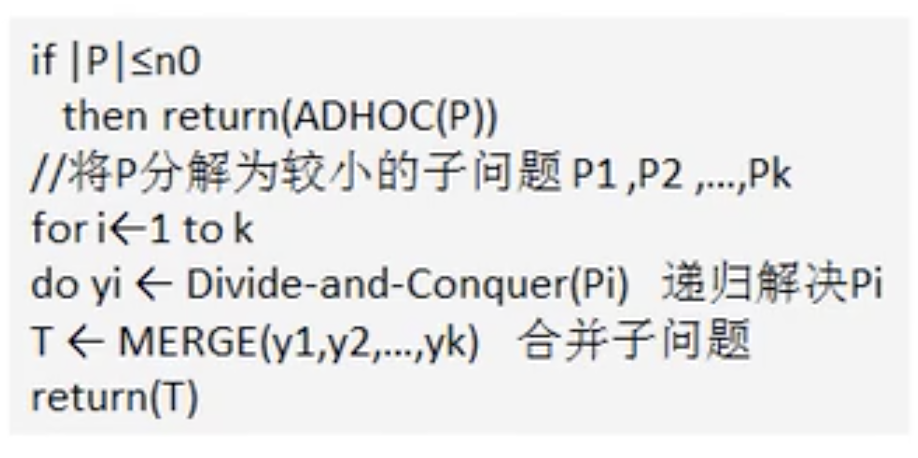
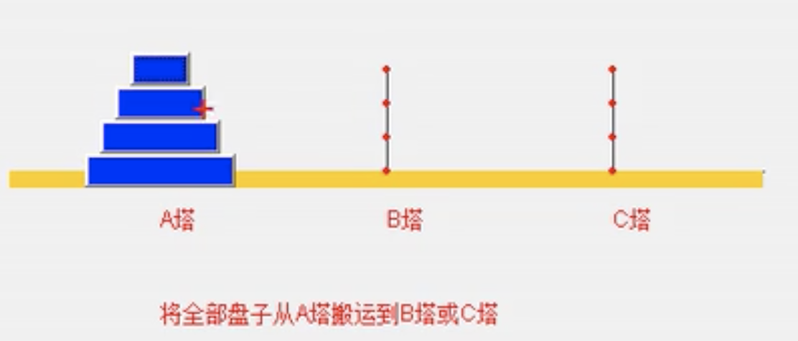

# 分治算法

- ## 算法介绍

  1. 分治法是一种很重要的算法。字面上的解释是“分而治之”，就是把一个复杂的问题分成两个或更多相同或相似的子问题，再把子问题分成更小的子问题…直到最后子问题可以简单的直接求解，原问题解即是子问题的解的合并。这个技巧是很多高效算法的基础，如排序算法(快速排序、归并排序)，傅里叶变换(快速傅里叶变换)...
  2. 分支算法可以求解的一些经典文图
     - 二分搜索
     - 大整数乘法
     - 棋盘覆盖
     - 合并排序
     - 快速排序
     - 线性时间选择
     - 最接近点对问题
     - 循环赛日程表
     - 汉诺塔

- ## 分治算法的基本步骤

  分治法在每一层递归上都有三个步骤：

  1. 分解：将原有问题分解为若干个规模较小，相互独立，与原问题形式相同的子问题
  2. 解决：若干子问题规模较小而容易被解决则直接解决，否则递归地解决各个子问题
  3. 合并：将各个子问题的解合并为原问题的解

- ## 分治算法设计模式

  分治(Divide-and-Conquer(P))算法模式如下图，

  

  其中|P| 表示问题P的规模，n0为一阀值，表示当问题p的规模不超过n0时，问题已容易直接解出，不必再继续分解。ADHOC(P)是该分治算法中的基本子算法，用于直接解小规模的问题P。因此，当P的规模不超过n0时直接用ADHOC(P)求解。算法MERGE(y1,y2,…yk)是该分治法中的合并子算法，用于将P的子问题P1,P2,…Pk的相应解y1,y2…yk合并为P的解。

- ## 分治算法实践-汉诺塔

  在一根柱子上从下往上按照大小顺序放着64片黄金圆盘，把圆盘从下面开始按大小顺序重新摆放在另一根柱子上，并且规定，在小圆盘上不能放大圆盘，在三根柱子之间一次只能移动一个盘。

  

  **思路分析：**

  1. 如果是有一个盘，A->C
  2. 如果是 n>=2 盘情况，我们总是可以看成两个盘，一个是最下边的一个盘，一个是上面的所有盘
     - 先把最上面的所有盘从A移动到B
     - 把最下面的一个盘从A移动到C
     - 把B塔的所有盘从B移动到C

  ```java
  package com.xie.algorithm;
  
  public class Hanoitower {
      public static void main(String[] args) {
          hanoiTower(3, 'A', 'B', 'C');
          /**
           * 第1个盘从A->C
           * 第2个盘从A->B
           * 第1个盘从C->B
           * 第3个盘从A->C
           * 第1个盘从B->A
           * 第2个盘从B->C
           * 第1个盘从A->C
           */
      }
  
      public static void hanoiTower(int num, char a, char b, char c) {
          //如果只有一个盘
          if (num == 1) {
              System.out.println("第1个盘从" + a + "->" + c);
          } else {
              //如果是 n>=2 盘情况，我们总是可以看成两个盘，一个是最下边的一个盘，一个是上面的所有盘
              //1.先把最上面的盘从A移动到B，移动过程会使用到C
              hanoiTower(num - 1, a, c, b);
              //2.把最下面的一个盘从A移动到C
              System.out.println("第" + num + "个盘从" + a + "->" + c);
              //3.把B塔的所有盘从B移动到C，移动过程使用到A塔
              hanoiTower(num - 1, b, a, c);
          }
      }
  }
  
  ```
