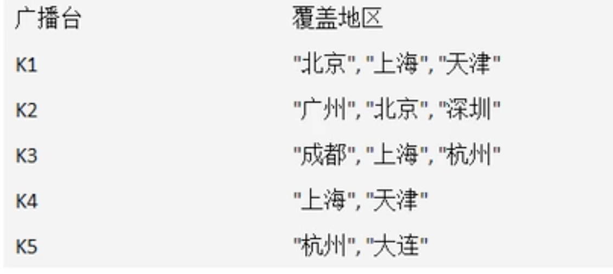
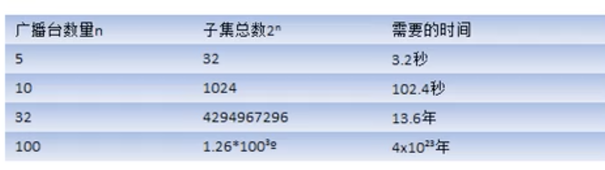

# 贪心算法

- ## 应用场景-集合覆盖

  假设存在下面需要付费的广播台，以及广播台信号可以覆盖的地区。**如何选择最少的广播台**，让所有地区都可以接受到信号。

  

- ## 贪心算法介绍

  1. 贪婪算法（贪心算法）是指在对问题进行求解时，在每一步选择中都采取最好或者最优（即最有利）的选择，从而能够导致结果是最好或者最优的算法。
  2. 贪心算法所得到的结果**不一定是最优的结果（有时候会是最优解）**，但是都是相对近似（接近）最优解的结果。

- ### 思路分析

  如何找出覆盖所有地区的广播台的集合呢，使用穷举发现，列出每个可能的广播台的集合，这被称为幂集。假设总的有n个广播台，则广播台的组合总共有2^n-1个，假设每秒可以计算10个子集，如图：

  

  使用贪心算法，则可以得到非常接近的解，并且效率高。在选择策略上，因为需要覆盖全部地区的最小集合：

  1. 遍历所有的广播电台，找到一个覆盖了**最多未覆盖的地区**的电台（此电台可能包含一些已覆盖的地区，但没有关系）。
  2. 将这个电台加入到一个集合中（比如ArrayList），想办法把该电台覆盖的地区在下次比较时去掉。
  3. 重复第1步直到覆盖了全部的地区。

- ## 代码案例

  ```java
  package com.xie.algorithm;
  
  import java.util.*;
  
  public class GreedyAlgorithm {
      public static void main(String[] args) {
          //创建广播电台
          Map<String, HashSet<String>> broadcasts = new HashMap<>();
          //将各个电台放入到broadcasts
          HashSet<String> set1 = new HashSet<>();
          set1.add("北京");
          set1.add("上海");
          set1.add("天津");
  
          HashSet<String> set2 = new HashSet<>();
          set2.add("广州");
          set2.add("北京");
          set2.add("深圳");
  
          HashSet<String> set3 = new HashSet<>();
          set3.add("成都");
          set3.add("上海");
          set3.add("杭州");
  
          HashSet<String> set4 = new HashSet<>();
          set4.add("上海");
          set4.add("天津");
  
          HashSet<String> set5 = new HashSet<>();
          set5.add("杭州");
          set5.add("大连");
  
          broadcasts.put("k1", set1);
          broadcasts.put("k2", set2);
          broadcasts.put("k3", set3);
          broadcasts.put("k4", set4);
          broadcasts.put("k5", set5);
  
          //存放所有地区
          HashSet<String> allAreas = new HashSet<>();
          allAreas.addAll(set1);
          allAreas.addAll(set2);
          allAreas.addAll(set3);
          allAreas.addAll(set4);
          allAreas.addAll(set5);
  
          //存放选择的电台集合
          List<String> selects = new ArrayList<>();
  
          //定义一个临时的集合，存放遍历过程中的电台覆盖的地区和当前还没有覆盖地区的交集
          HashSet<String> tempSet = new HashSet<>();
  
          //定义一个maxKey，保存在一次遍历过程中，能够覆盖最大未覆盖的地区对应的电台的key
          //如果maxKey 不为null，则会加入到selects
          String maxKey = null;
          while (allAreas.size() != 0) {
              //每进行一次while，需要将maxKey置空
              maxKey = null;
              for (String key : broadcasts.keySet()) {
                  //每进行一次循环，需要清空tmepSet
                  tempSet.clear();
  
                  HashSet<String> areas = broadcasts.get(key);
                  tempSet.addAll(areas);
  
                  //tempSet和allAreas集合的交集，交集会赋给tempSet
                  tempSet.retainAll(allAreas);
  
                  //如果当前这个集合包含的未覆盖地区的数量，比maxKey指向的集合地区还多，就需要重置maxKey
                  //tempSet.size() > broadcasts.get(maxKey).size()  体现贪心算法的特点
                  if (tempSet.size() > 0 && (maxKey == null || tempSet.size() > broadcasts.get(maxKey).size())) {
                      maxKey = key;
                  }
              }
  
              if (maxKey != null) {
                  selects.add(maxKey);
                  //将maxKe指向的广播电台覆盖的地区从allAreas去掉
                  allAreas.removeAll(broadcasts.get(maxKey));
              }
          }
  
          System.out.println("得到的选择结果：" + selects);
  
          /**
           * 得到的选择结果：[k1, k2, k3, k5]
           */
      }
  }
  ```
