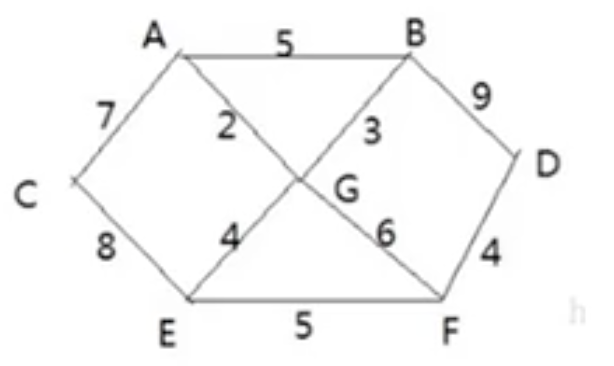
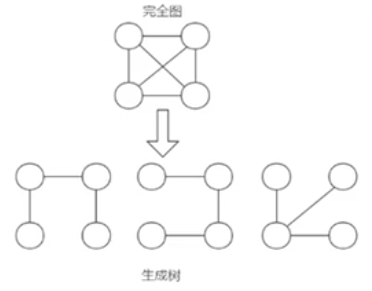

# 普里姆算法

- ## 应用场景-修路问题

  

  1. 胜利乡有7个村庄(A,B,C,D,E,F,G)，现在需要修路把7个村庄连通；
  2. 各个村庄的距离用边线表示（权），比如A-B距离5公里；
  3. 问：如何修路保证各个村庄都能连通，并且总的修建公路里程最短？

- ## 最小生成树

  修路问题的本质就是最小生成树问题，先介绍下最小生成树(Minimum Cost Spanning Tree)，简称MST。

  1. 给定一个带权的无向连通图，如何选取一颗生成树，使树上所有**边上权的总和为最小**，这就叫最小生成树；

  2. N个顶点，一定有N-1边；

  3. 包含所有顶点；

  4. N-1条边都在图中；

  5. 求最小生成树的算法主要是**普里姆算法和克鲁斯卡尔算法**；

    

- ## 普里姆算法介绍

  1. 普里姆（Prim）算法求最小生成树，也就是在包含N个顶点的连通图中，找出只有（N-1）条边包含所有N个顶点的连通子图，也就是所谓的极小连通子图；
  2. 普里姆算法如下：
     1. 设`G=(V,E)`是连通网，`T=(U,D)`是最小生成树，`V,U`是顶点集合，`E,D`是边的集合。
     2. 若从顶点 u 开始构造最小生成树，则从集合 v 中取出顶点 u 放入集合 U 中，标记顶点 v 的 visited[u] = 1；
     3. 若集合 U 中顶点 ui 与集合 V-U 中的顶点 vj 之间存在边，则寻找这些边中权值最小的边，但不能构成回路，将顶点 vj 加入集合 U 中，将边`(ui,vj)`加入集合D中，标记 visited[vj] = 1；
     4. 重复步骤2，直到U与V相等，即所有顶点都被标记为访问过，此时D中有n-1条边；

- ## 修路问题的普里姆算法分析

  1. 假设从顶点A开始处理，边有A-C[7]、**A-G[2]**、A-B[5]，那么最小的边是**A-G**;

  2. 从**<A,G>**开始，将A和G顶点和他们相邻的还没有被访问顶点进行处理，推导如下：

     A-C[7]、A-B[5]、**G-B[3]**、G-E[4]、G-F[6]===>**<A,G,B>**；

  3. 从**<A,G,B>**开始，将A,G,B顶点和他们相邻的还没有被访问过的顶点进行处理，推导如下：

     A-C[7]、**G-E[4]**、G-F[6]、B-D[9]===>**<A,G,B,E>**；

  4. ….

  5. <A,G,B,E>  ====>   <A,G,B,E,F>，对应边<E,F>，权值为5；

  6. <A,G,B,E,F>   ====>   <A,G,B,E,F,D>，对应边<F,D>，权值为4；

  7. <A,G,B,E,F,D>   ====>   <A,G,B,E,F,D,C> ,对应边<D,C>，权值为7；

  最后求出的最小路径为：<A,G,B,E,F,D,C>

- ## 代码案例

  ```java
  package com.xie.algorithm;
  
  import java.util.Arrays;
  
  public class PrimAlgorithm {
      public static void main(String[] args) {
          char[] data = {'A', 'B', 'C', 'D', 'E', 'F', 'G'};
          int verxs = data.length;
  
          //邻接矩阵的关系使用二维数组，10000这个大树，表示两个点不连通
          int[][] weight = new int[][]{
                  {10000, 5, 7, 10000, 10000, 10000, 2},
                  {5, 10000, 10000, 9, 10000, 10000, 3},
                  {7, 10000, 10000, 10000, 8, 10000, 10000},
                  {10000, 9, 10000, 10000, 10000, 4, 10000},
                  {10000, 10000, 8, 10000, 10000, 5, 4},
                  {10000, 10000, 10000, 4, 5, 10000, 6},
                  {2, 3, 10000, 10000, 4, 6, 10000}
          };
  
          MGraph mGraph = new MGraph(verxs);
          MinTree minTree = new MinTree();
          minTree.createGraph(mGraph, verxs, data, weight);
          minTree.showGraph(mGraph);
          System.out.println("测试从A点开始最小生成树");
          minTree.prim(mGraph, 0);
          System.out.println();
          System.out.println("测试从B点开始最小生成树");
          minTree.prim(mGraph, 1);
  
          /**
           * [10000, 5, 7, 10000, 10000, 10000, 2]
           * [5, 10000, 10000, 9, 10000, 10000, 3]
           * [7, 10000, 10000, 10000, 8, 10000, 10000]
           * [10000, 9, 10000, 10000, 10000, 4, 10000]
           * [10000, 10000, 8, 10000, 10000, 5, 4]
           * [10000, 10000, 10000, 4, 5, 10000, 6]
           * [2, 3, 10000, 10000, 4, 6, 10000]
           * 测试从A点开始最小生成树
           * 边<A,G> 权值：2 边<G,B> 权值：3 边<G,E> 权值：4 边<E,F> 权值：5 边<F,D> 权值：4 边<A,C> 权值：7
           * 测试从B点开始最小生成树
           * 边<B,G> 权值：3 边<G,A> 权值：2 边<G,E> 权值：4 边<E,F> 权值：5 边<F,D> 权值：4 边<A,C> 权值：7
           */
      }
  }
  
  //创建最小生成树->村庄的图
  class MinTree {
      /**
       * 创建图的邻接矩阵
       *
       * @param graph  图对象
       * @param verxs  图对应的顶点个数
       * @param data   图的各个顶点的值
       * @param weight 图的邻接矩阵
       */
      public void createGraph(MGraph graph, int verxs, char[] data, int[][] weight) {
          int i, j;
          for (i = 0; i < verxs; i++) {
              graph.data[i] = data[i];
              for (j = 0; j < verxs; j++) {
                  graph.weight[i][j] = weight[i][j];
              }
          }
      }
  
      /**
       * 显示图
       *
       * @param graph
       */
      public void showGraph(MGraph graph) {
          for (int[] link : graph.weight) {
              System.out.println(Arrays.toString(link));
          }
      }
  
      /**
       * 编写Prim算法，得到最小生成树
       *
       * @param graph 图
       * @param v     表示从图的第几个顶点开始生成'A'->0,'B'->1,...
       */
      public void prim(MGraph graph, int v) {
          //标记顶点是否被访问过,默认值都是0，表示都未访问过
          int[] visited = new int[graph.verxs];
  
          //标记当前顶点已被访问
          visited[v] = 1;
  
          //h1,h2记录两个顶点的下标
          int h1 = -1, h2 = -1;
  
          //将minWeight初始化一个大数，后面在遍历过程中，会被替换
          int minWeight = 10000;
  
          //因为右verxs个顶点，普里姆算法结束后，右verxs-1条边
          for (int k = 1; k < graph.verxs; k++) {
              //这个是确定每一次生成的子图，和哪个节点的距离最近
              //i 节点表示被访问过的节点
              for (int i = 0; i < graph.verxs; i++) {
                  // j节点表示未被访问过的节点
                  for (int j = 0; j < graph.verxs; j++) {
                      if (visited[i] == 1 && visited[j] == 0 && graph.weight[i][j] < minWeight) {
                          //替换minWeight(寻找已访问过的节点和未访问过的节点的权值最小的边)
                          minWeight = graph.weight[i][j];
                          h1 = i;
                          h2 = j;
                      }
                  }
              }
  
              //找到一条边最小
              System.out.print("边<" + graph.data[h1] + "," + graph.data[h2] + "> 权值：" + minWeight + "\t");
  
              //将当前这个节点标记已访问
              visited[h2] = 1;
  
              //minWeight 重新设置为10000
              minWeight = 10000;
          }
  
      }
  
  }
  
  class MGraph {
      //表示图的节点个数
      int verxs;
      //存放节点数据
      char[] data;
      //存放边，就是邻接矩阵
      int[][] weight;
  
      public MGraph(int verxs) {
          this.verxs = verxs;
          data = new char[verxs];
          weight = new int[verxs][verxs];
      }
  }
  ```
