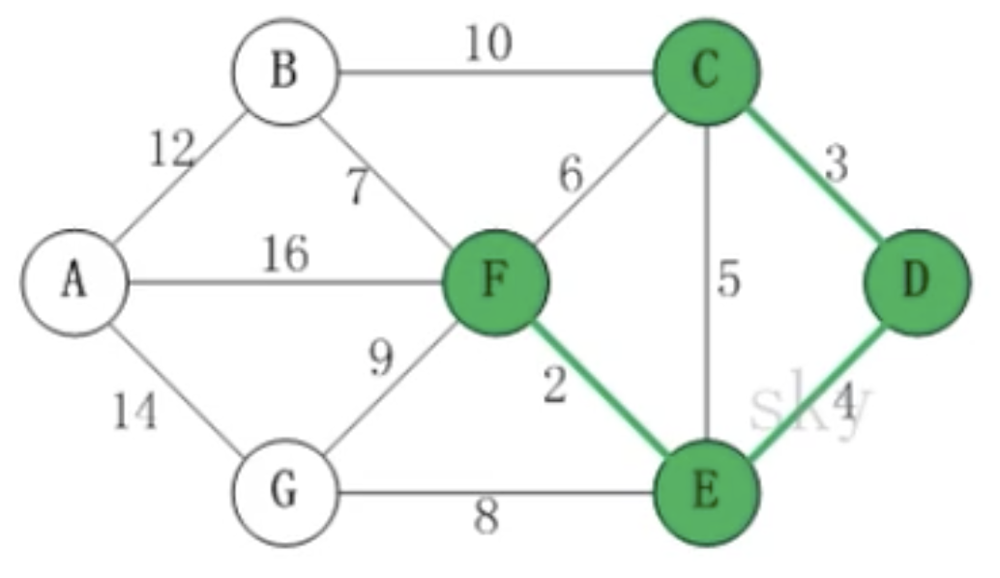

# 克鲁斯卡尔算法

- ## 应用问题-公交车站问题

  某城市新增7个站点（A，B，C，D，E，F，G)，现在需要修路把7个站点连通，各个站点点距离用边线表示（权），比如A-B的距离12公里，如何修路保证各个站点都能连通，并且总的修建公路总里程最短。

  

- ## 克鲁斯卡尔算法基本介绍

  1. 克鲁斯卡尔(kruskal)算法，是用来求加权连通图的最小生成树的算法。

  2. **基本思想：**按照权值从小到大的顺序选择n-1条边，并保证这n-1条边不构成回路。

  3. **具体做法：**首先构造一个只含n个顶点的森林，然后依权值从小到大从连通网中选择边加入森林中，并使森林中不产生回路，直至森林变成一棵树为止。

  4. 对于判断是否形成了回路的处理方式：记录顶点在“最小生成树”中终点，顶点的终点是“在最小生成树中与它连通的最大顶点”。然后每次需要将一条边添加到最小生成树时，判断该边的两个顶点的终点是否重合，重合的话就构成回路。

     

     在将<E,F>，<C,D>，<D,E>，加入到最小生成树R中之后，这几条边的顶点就都有了终点：

     - C的终点是F;
     - D的终点是F；
     - E的终点是F;
     - F的终点是F；

     关于终点的说明：

     1. 就是将所有顶点按照从小到大的顺序排列好之后，某个顶点的终点就是“与它连通的最大顶点”。
     2. 因此，接下来，虽然<C,E>是权值最小的边，但是C和E的终点都是F,即它们的终点相同，因此，将<C,E>加入最小生成树的话，会形成回路。这就是判断回路的方式，也就是说，**我们加入的边的两个顶点不能都指向同一个终点，否则将构成回路**。

- ## 代码案例

  ```java
  package com.xie.algorithm;
  
  public class KruskalCase {
      //边的个数
      private int edegeNum;
  
      //顶点数组
      private char[] vertexs;
  
      //邻接矩阵
      private int[][] matrix;
  
      //使用INF 表示顶点之间不连通
      private static final int INF = Integer.MAX_VALUE;
  
      public static void main(String[] args) {
          char[] vertexs = {'A', 'B', 'C', 'D', 'E', 'F', 'G'};
          int[][] matrix = {
                      /*A*/   /*B*/   /*C*/   /*D*/   /*E*/   /*F*/   /*G*/
             /*A*/{   0,      12,     INF,    INF,    INF,    16,     14},
             /*B*/{   12,     0,      10,     INF,    INF,    7,      INF},
             /*C*/{   INF,    10,     0,      3,      5,      6,      INF},
             /*D*/{   INF,    INF,    3,      0,      4,      INF,    INF},
             /*E*/{   INF,    INF,    5,      4,      0,      2,      8},
             /*F*/{   16,     7,      6,      INF,    2,      0,      9},
             /*G*/{   14,     INF,    INF,    INF,    8,      9,      0}
          };
  
          KruskalCase kruskalCase = new KruskalCase(vertexs, matrix);
          kruskalCase.print();
          kruskalCase.kruskal();
      }
  
      public KruskalCase(char[] vertexs, int[][] matrix) {
          this.vertexs = vertexs;
          this.matrix = matrix;
  
          //统计边
          for (int i = 0; i < matrix.length; i++) {
              for (int j = i + 1; j < matrix[0].length; j++) {
                  if (matrix[i][j] != INF) {
                      edegeNum++;
                  }
              }
          }
      }
  
      public void print() {
          System.out.println("邻接矩阵为");
          for (int i = 0; i < matrix.length; i++) {
              for (int j = 0; j < matrix[0].length; j++) {
                  System.out.printf("%20d", matrix[i][j]);
              }
              System.out.println();
          }
      }
  
      public void kruskal() {
          //表示最后结果数组的索引
          int index = 0;
          //用于保存"已有最小生成树"中的每个顶点在最小生成树的终点
          int[] ends = new int[edegeNum];
  
          //创建结果数组，保存最后的最小生成树
          EData[] res = new EData[edegeNum];
  
          //获取图中所有的边的集合，一共有12天边
          EData[] edges = getEdges();
  
          //按照边的权值从小到大排序
          sortEdges(edges);
  
          //遍历edges
          for (int i = 0; i < edegeNum; i++) {
              //获取第i条边的第一个顶点
              int p1 = getPosition(edges[i].start);
              //获取第i条边的第二个顶点
              int p2 = getPosition(edges[i].end);
  
              //获取p1这个顶点在已有最小生成树中的终点
              int m = getEnd(ends, p1);
              //获取p2这个顶点在已有最小生成树中的终点
              int n = getEnd(ends, p2);
  
              //是否构成回路
              if (m != n) {
                  //设置m 在"已有最小生成树"中的终点
                  ends[m] = n;
                  //有一条边加入res数组
                  res[index++] = edges[i];
              }
          }
          System.out.println("最小生成树为：");
          for (int i = 0; i < index; i++) {
              System.out.println(res[i]);
          }
      }
  
      /**
       * 边排序，冒泡排序
       *
       * @param edges 边的集合
       */
      private void sortEdges(EData[] edges) {
          for (int i = 0; i < edges.length - 1; i++) {
              for (int j = 0; j < edges.length - 1 - i; j++) {
                  if (edges[j].weight > edges[j + 1].weight) {
                      EData temp = edges[j];
                      edges[j] = edges[j + 1];
                      edges[j + 1] = temp;
                  }
              }
          }
      }
  
      /**
       * 返回顶点的下标
       *
       * @param ch 顶点的值
       * @return
       */
      private int getPosition(char ch) {
          for (int i = 0; i < vertexs.length; i++) {
              if (vertexs[i] == ch) {
                  return i;
              }
          }
          return -1;
      }
  
      /**
       * 获取图中的边，放到EData[] 数组中，
       *
       * @return
       */
      private EData[] getEdges() {
          int index = 0;
          EData[] edges = new EData[edegeNum];
          for (int i = 0; i < vertexs.length; i++) {
              for (int j = i + 1; j < vertexs.length; j++) {
                  if (matrix[i][j] != INF) {
                      edges[index++] = new EData(vertexs[i], vertexs[j], matrix[i][j]);
                  }
              }
          }
          return edges;
      }
  
      /**
       * 获取下标为i 的顶点的终点，用于判断后面两个顶点的终点是否相同
       *
       * @param ends 记录了各个顶点的终点是哪个
       * @param i    传入的顶点对应的下标
       * @return 返回下标为i的顶点对应的终点的下标
       */
      private int getEnd(int[] ends, int i) {
          while (ends[i] != 0) {
              i = ends[i];
          }
          return i;
      }
  }
  
  //创建一个边类
  class EData {
      //边的一个点
      char start;
      //边的另外一个点
      char end;
      //边的权值
      int weight;
  
      public EData(char start, char end, int weight) {
          this.start = start;
          this.end = end;
          this.weight = weight;
      }
  
      @Override
      public String toString() {
          return "EData{" +
                  "start=" + start +
                  ", end=" + end +
                  ", weight=" + weight +
                  '}';
      }
  }
  ```
