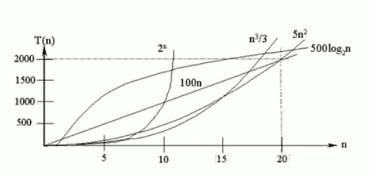

# 排序算法介绍和分类

- ## 介绍

  排序是将一组数据,依指定的顺序进行排列的过程.

- ## 排序分类

  1. 内部排序:

     指将需要处理的所有数据都加载到内部存储器中进行排序.

     常见的内部排序有:

     - 直接插入排序
     - 希尔排序
     - 简单选择排序
     - 堆排序
     - 冒泡排序
     - 快速排序
     - 归并排序
     - 基数排序

  2. 外部排序:

     数据量过大,无法全部加载到内存中,需要借助外部存储进行排序.

- ## 算法的时间复杂度

  度量一个程序(算法)执行时间的两种方法:

  1. 事后统计方法

     这种方法可行,但是有两个问题:一是要想对设计的算法的运行性能进行评测,需要实际运行该程序;二是所得时间的统计量依赖于计算机的硬件\软件等环境因素,**这种方式,要在同一台计算机的相同状态下运行,才能比较哪个算法速度更快**.

  2. 事前估计方法

     通过分析算法的时间复杂度来判断哪个算法更优.

- ### 时间频度

    一个算法花费的时间与算法中语句的执行次数成正比例,哪个算法中语句执行的次数多,它花费时间就多.一个算法中语句执行次数称为语句频度或时间频度.记为T(n).

    比如计算1-100所有数字之和,有两种算法

    ```java
    int total=0;
    int end=100;
    //for循环计算
    for(int i=1;i<=end;i++){
        total+=i;
    }
    ```

    执行次数取决于end长度.它的T(n)=n+1.

    ```java
    //直接计算
    total = (1+end)*end/2;
    ```

    直接计算只需执行一次即可,它的T(n) = 1.

    **估算时间频度时注意事项:**

  - 忽略常数项:如**T(n)=2n+20**和**T(n)=2n**,随着n的变大,20可忽略.
  - 忽略低次项:如**T(n)=2n^2+3n+10**和**T(n)=2n^2**,随着n的变大,3n+10可以忽略.
  - 忽略系数:如**T(n)=5n^2+7n**和**T(n)=3n^2+2n**,随着n的变大,5和3可以忽略.

- ### 时间复杂度

    1. 一般情况下,算法中的基本操作语句的重复执行次数是问题规模n的某个函数,用T(n)表示,若有某个辅助函数f(n),使得当n趋近于无穷大时,T(n)/f(n)的极限值为不等于零的常数,则称f(n)是T(n)的同量级函数.记作T(n)=O(f(n)),称O(f(n))为算法的渐进时间复杂度,简称时间复杂度.
    2. T(n)不同,但是时间复杂度可能相同.如:T(n)=n^2+7n+6与T(n)=3n^2+2n+2,他们的T(n)不同,但是时间复杂度都是O(n^2)
    3. 计算时间复杂度方法
       - 用常数1代替运行时间中的所有加法常数.
       - 修改后的运行次数函数中,只保留最高阶项.
       - 去除最高阶项的系数.

- ### 常见的时间复杂度

  - 常数阶O(1)

      无论代码执行了多少行,只要是没有循环等复杂结构,那这个代码的复杂度就是O(1)

      ```java
      int i = 1;
      int j = 2;
      ++i;
      j++;
      int m = i+j;
      ```

      上述代码在执行的时候,它消耗的时间并不是随着某个变量的增长而增长,那么无论这类代码有多长,即使有几万几十万行,都可以用O(1)来表示它的时间复杂度.

  - 对数阶O(log2n)

      ```java
      int i = 1;
      while(i<n){
        i = i*2;
      }
      ```

      在while循环里面,每次都将i乘以2,乘完之后,i距离n就越来越近了.假设循环x次之后,i就大于n了,此时循环就结束了,也就是说2的x次方等于n,那么x= log2n也就是说当循环log2n次以后,这个代码就结束了.因此这个时间复杂度为O(log2n).

  - 线性阶O(n)

      ```java
      for(i=1;i<=n;i++){
        j = i;
        j++;
      }
      ```

      for循环里面的代码会执行n遍,因此它消耗的时间是随着n的变化而变化的,因此这类代码都可以使用O(n)来表示它的时间复杂度.

  - 线性对数阶O(nlog2n)

      ```java
      for(int m=1;m<n;m++){
        i = 1;
        while(i<n){
        i = i*2;
        }
      }
      ```

      这个线性对数阶O(log2n)就是将时间复杂度为O(logn)的代码循环N遍.

    - 平方阶O(n^2)

      即双层for循环,n*m

    - 立方阶O(n^3)

      3层循环

    - K次方阶O(n^k)

      k次循环

    - 指数阶O(2^n)

    常见的算法时间复杂度由小到大依次为:O(1)<O(log2n)<O(n)<O(nlog2n)<O(n^2)<O(n^3)<O(n^k)<O(2^n)

    

- ### 平均时间复杂度和最坏时间复杂度

    1. 平均时间复杂度是指所有可能的输入实例均以等概率出现的情况下,该算法的运行时间.
    2. 最坏情况下的复杂度称最坏时间复杂度.一般讨论的时间复杂度是最坏情况下的时间复杂度.这样做的原因是:最坏情况下的时间复杂度是算法在任何输入实例上运行时间的界限,这就保证了算法的运行时间不会比最坏情况更长.
    3. 平均时间复杂度和最坏时间复杂度是否一致,和算法有关(如下表).

    | 排序法 | 平均时间 | 最差情况        | 稳定度 | 额外空间 | 备注                         |
    | ------ | -------- | --------------- | ------ | -------- | ---------------------------- |
    | 冒泡   | O(n^2)   | O(n^2)          | 稳定   | O(1)     | n小时较好                    |
    | 交换   | O(n^2)   | O(n^2)          | 不稳定 | O(1)     | n小时较好                    |
    | 选择   | O(n^2)   | O(n^2)          | 不稳定 | O(1)     | n小时较好                    |
    | 插入   | O(n^2)   | O(n^2)          | 稳定   | O(1)     | 大部分已排序时较好           |
    | 基数   | O(logRB) | O(logRB)        | 稳定   | O(n)     | B是真数(0-9),R是基数(个十百) |
    | 希尔   | O(nlogn) | O(n^s)  [1<s<2] | 不稳定 | O(1)     | s是所选分组                  |
    | 快速   | O(nlogn) | O(n^2)          | 不稳定 | O(nlogn) | n大时较好                    |
    | 归并   | O(nlogn) | O(nlogn)        | 稳定   | O(1)     | n大时较好                    |
    | 堆     | O(nlogn) | O(nlogn)        | 不稳定 | O(1)     | n大时较好                    |

- ## 算法的空间复杂度

   1. 类似于时间复杂度的讨论,一个算法的空间复杂度(Space complexity)定义为该算法所耗费的存储空间,它也是问题规模n的函数.
   2. 空间复杂度是对一个算法在运行过程中临时占用存储空间大小的度量.有的算法需要占用的临时工作单元数与解决问题的规模n有关,它随着n的增大而增大,当n较大时,将占用较多的存储单元,例如快速排序和归并排序就属于这种情况.
   3. 在做算法分析时,**主要讨论的时间复杂度**.从用户体验上看,更看重程序执行的速度.一些缓存产品(Redis,Memcache)和算法(基数排序)本质就是用空间换时间.
