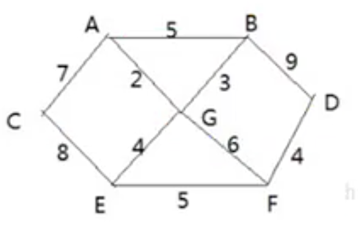

# 迪杰斯特拉算法

- ## 应用场景-最短路径问题

  

  战争时期，胜利乡有7个村庄(A,B,C,D,E,F,G)，现在有6个邮差，从G点出发，需要分别把邮件送到A，B，C，D，E，F六个村庄。各个村庄的距离用边线表示（权），比如A-B距离5公里，如何计算出G村庄到其他各个村庄的最短距离？如果从其他点出发到各个点的最短距离又是多少。

- ## 迪杰斯塔拉(Dijkstra)算法介绍

  迪杰斯塔拉算法是**典型的最短路径算法**，用于计算一个节点到其他节点的最短路径。它的主要特点是以起始点为中心向外层层扩展（广度优先搜索思想），直到扩展到终点为止。

- ## 迪杰斯特拉算法过程

  设置出发顶点为`v`，顶点集合`v{v1,v2,v3…}`，`v`到`V`中各顶点的距离构成集合`Dis`,`Dis{d1,d2,d3…}`，`Dis`集合记录着`v`到图中各顶点的距离（到自身可以看做0，`v`到`vi`的距离对应为`di`)。

  1. 从`Dis`中选择值最小的`di`并移出`Dis`集合，同时移出`V`集合中对应的顶点`vi`，此时`v`到`vi`即为最短路径；
  2. 更新`Dis`集合，更新规则为：比较`v`到`V`集合中顶点的距离值，与`v`通过`vi`到`V`集合中顶点的距离值，保留值较小得一个（同时也应该更新顶点的前驱节点为`vi`，表示是通过`vi`到达的）；
  3. 重复执行两步骤，直到最短路径顶点为目标顶点即可结束。

- ## 代码案例

  ```java
  package com.xie.algorithm;
  
  import java.util.Arrays;
  
  public class DijkstraAlgorithm {
      public static void main(String[] args) {
          char[] vertex = {'A', 'B', 'C', 'D', 'E', 'F', 'G'};
          int[][] matrix = new int[vertex.length][vertex.length];
          //表示不可连接
          final int N = 65535;
          matrix[0] = new int[]{N, 5, 7, N, N, N, 2};
          matrix[1] = new int[]{5, N, N, 9, N, N, 3};
          matrix[2] = new int[]{7, N, N, N, 8, N, N};
          matrix[3] = new int[]{N, 9, N, N, N, 4, N};
          matrix[4] = new int[]{N, N, 8, N, N, 5, 4};
          matrix[5] = new int[]{N, N, N, 4, 5, N, 6};
          matrix[6] = new int[]{2, 3, N, N, 4, 6, N};
  
          Graph graph = new Graph(vertex, matrix);
          graph.showGraph();
          graph.dijkstra(6);
          graph.showDijkstra();
  
          /**
           *    65535       5       7   65535   65535   65535       2
           *        5   65535   65535       9   65535   65535       3
           *        7   65535   65535   65535       8   65535   65535
           *    65535       9   65535   65535   65535       4   65535
           *    65535   65535       8   65535   65535       5       4
           *    65535   65535   65535       4       5   65535       6
           *        2       3   65535   65535       4       6   65535
           * ================================
           * A(2)B(3)C(9)D(10)E(4)F(6)G(0)
           */
  
      }
  }
  
  class Graph {
      //顶点数组
      private char[] vertex;
      //邻接矩阵
      private int[][] matrix;
      //已经访问顶点的集合
      private VisitedVertex vv;
  
      public Graph(char[] vertex, int[][] matrix) {
          this.vertex = vertex;
          this.matrix = matrix;
      }
  
      public void showDijkstra() {
          vv.show();
      }
  
      public void showGraph() {
          for (int i = 0; i < matrix.length; i++) {
              for (int j = 0; j < matrix.length; j++) {
                  System.out.printf("%8d", matrix[i][j]);
              }
              System.out.println();
          }
      }
  
      public void dijkstra(int index) {
          vv = new VisitedVertex(vertex.length, index);
          //更新index顶点到周围顶点的距离和前驱顶点
          update(index);
  
          for (int j = 1; j < vertex.length; j++) {
              //选择并返回新的访问顶点
              index = vv.updateArr();
              //更新index顶点到周围顶点的距离和前驱顶点
              update(index);
          }
      }
  
      /**
       * 更新index下标顶点到周围顶点的距离和周围顶点的前驱顶点
       *
       * @param index
       */
      private void update(int index) {
          int len = 0;
          for (int j = 0; j < matrix[index].length; j++) {
              //len 含义是：出发顶点到index顶点的距离 + 从index顶点到j顶点的距离的和
              len = vv.getDis(index) + matrix[index][j];
  
              //如果j顶点没有被访问过，并且len 小于出发顶点到j顶点的距离，就需要更新
              if (!vv.in(j) && len < vv.getDis(j)) {
                  //更新j顶点的前驱为index顶点
                  vv.updatePre(j, index);
                  //更新出发顶点到j顶点的距离
                  vv.updateDis(j, len);
              }
          }
      }
  }
  
  //已访问顶点集合
  class VisitedVertex {
      //记录各个顶点是否访问过，1表示已访问，0未访问，会动态更新
      public int[] already_arr;
      //每个下标对应的值为前一个顶点的下标，会动态更新
      public int[] pre_visited;
      //记录出发顶点到其他所有顶点的距离，比如G为出发顶点，就会记录G到其他顶点的距离，会动态更新，求的最短距离就会存放到dis
      public int[] dis;
  
      /**
       * 构造器
       *
       * @param length 表示顶点的个数
       * @param index  表示出发顶点对应的下标，比如G顶点，下标就是6
       */
      public VisitedVertex(int length, int index) {
          this.already_arr = new int[length];
          this.pre_visited = new int[length];
          this.dis = new int[length];
  
          //初始化dis
          Arrays.fill(dis, 65535);
          //设置出发顶点已访问
          this.already_arr[index] = 1;
          //设置出发顶点的访问距离为0
          this.dis[index] = 0;
      }
  
      /**
       * 判断index 顶点是否被访问过
       *
       * @param index
       * @return
       */
      public boolean in(int index) {
          return already_arr[index] == 1;
      }
  
      /**
       * 更新出发顶点到index顶点的距离
       *
       * @param index
       * @param len
       */
      public void updateDis(int index, int len) {
          dis[index] = len;
      }
  
      /**
       * 更新pre顶点的前驱顶点为index顶点
       *
       * @param pre
       * @param index
       */
      public void updatePre(int pre, int index) {
          pre_visited[pre] = index;
      }
  
      /**
       * 返回出发顶点到index顶点的距离
       *
       * @param index
       */
      public int getDis(int index) {
          return dis[index];
      }
  
      /**
       * 继续选择并返回新的访问顶点，比如这里的G完成后，就是A点作为新的访问顶点（注意不是出发顶点）
       *
       * @return
       */
      public int updateArr() {
          int min = 65535, index = 0;
          for (int i = 0; i < already_arr.length; i++) {
              if (already_arr[i] == 0 && dis[i] < min) {
                  min = dis[i];
                  index = i;
              }
          }
          //更新index顶点被访问过
          already_arr[index] = 1;
  
          return index;
      }
  
      //显示结果
      public void show() {
          System.out.println("================================");
          char[] vertex = {'A', 'B', 'C', 'D', 'E', 'F', 'G'};
          int count = 0;
          for (int i : dis) {
              if (i != 65535) {
                  System.out.print(vertex[count] + "(" + i + ")");
              }else{
                  System.out.println("N");
              }
              count++;
          }
      }
  }
  ```
