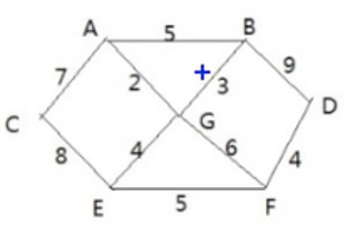

# 弗洛伊德算法

- ## 基本介绍

  1. 和Dijkstra算法一样，弗洛伊德(Floyd)算法也是一种用于寻找给定的加权图中顶点间最短路径的算法。该算法名称以创始人之一、1978年图灵奖获得者、斯坦福大学计算机科学系教授**罗伯特·弗洛伊德**命名。
  2. 弗洛伊德算法(Floyd)计算图中各个顶点之间的最短路径。
  3. 迪杰斯特拉算法用于计算图中某一个顶点到其他顶点的最短路径。
  4. 迪杰斯特拉算法通过选定的被访问顶点，求出从出发访问顶点到其他顶点的最短路径。弗洛伊德算法中每个顶点都是出发访问顶点，所以需要将每个顶点看做被访问顶点，求出从每一个顶点到其他顶点的最短路径。

- ## 弗洛伊德算法过程

  1. 设置顶点`vi`到顶点`vk`的最短路径已知为`Lik`，顶点`vk`到`vj`的最短路径已知为`Lkj`，顶点`vi`到`vj`的路径为`Lij`，则`vi`到`vj`的最短路径为：`min((Lik+Lkj),Lij)`，`vk`的取值为图中所有顶点，则可获得到`vi`到`vj`的最短路径
  2. 至于`vi`到`vk`的最短路径`Lik`或者`vk`到`vj`的最短路径`Lkj`，是以同样方式获得。

- ## 代码案例

  

  求各个顶点之间的最短距离

  ```java
  package com.xie.algorithm;
  
  import java.util.Arrays;
  
  public class FloydAlgorithm {
      public static void main(String[] args) {
          char[] vertexs = {'A', 'B', 'C', 'D', 'E', 'F', 'G'};
          final int N = 65535;
          int[][] matrix = {
                  {0, 5, 7, N, N, N, 2},
                  {5, 0, N, 9, N, N, 3},
                  {7, N, 0, N, 8, N, N},
                  {N, 9, N, 0, N, 4, N},
                  {N, N, 8, N, 0, 5, 4},
                  {N, N, N, 4, 5, 0, 6},
                  {2, 3, N, N, 4, 6, 0}
          };
  
          FGraph fGraph = new FGraph(vertexs.length, matrix, vertexs);
          fGraph.floyd();
          fGraph.show();
          /**
           *                    A                   A                   A                   F                   G                   G                   A
           *      (A到A的最短路径是0)     (A到B的最短路径是5)     (A到C的最短路径是7)    (A到D的最短路径是12)     (A到E的最短路径是6)     (A到F的最短路径是8)     (A到G的最短路径是2)
           *
           *                    B                   B                   A                   B                   G                   G                   B
           *      (B到A的最短路径是5)     (B到B的最短路径是0)    (B到C的最短路径是12)     (B到D的最短路径是9)     (B到E的最短路径是7)     (B到F的最短路径是9)     (B到G的最短路径是3)
           *
           *                    C                   A                   C                   F                   C                   E                   A
           *      (C到A的最短路径是7)    (C到B的最短路径是12)     (C到C的最短路径是0)    (C到D的最短路径是17)     (C到E的最短路径是8)    (C到F的最短路径是13)     (C到G的最短路径是9)
           *
           *                    G                   D                   E                   D                   F                   D                   F
           *     (D到A的最短路径是12)     (D到B的最短路径是9)    (D到C的最短路径是17)     (D到D的最短路径是0)     (D到E的最短路径是9)     (D到F的最短路径是4)    (D到G的最短路径是10)
           *
           *                    G                   G                   E                   F                   E                   E                   E
           *      (E到A的最短路径是6)     (E到B的最短路径是7)     (E到C的最短路径是8)     (E到D的最短路径是9)     (E到E的最短路径是0)     (E到F的最短路径是5)     (E到G的最短路径是4)
           *
           *                    G                   G                   E                   F                   F                   F                   F
           *      (F到A的最短路径是8)     (F到B的最短路径是9)    (F到C的最短路径是13)     (F到D的最短路径是4)     (F到E的最短路径是5)     (F到F的最短路径是0)     (F到G的最短路径是6)
           *
           *                    G                   G                   A                   F                   G                   G                   G
           *      (G到A的最短路径是2)     (G到B的最短路径是3)     (G到C的最短路径是9)    (G到D的最短路径是10)     (G到E的最短路径是4)     (G到F的最短路径是6)     (G到G的最短路径是0)
           */
  
      }
  }
  
  class FGraph {
      //存放顶点的数组
      private char[] vertexs;
      //保存从各个顶点出发到其他顶点的距离，最后的结果，也是保留在该数据
      private int[][] dis;
      //保存到大目标顶点的前驱顶点
      private int[][] pre;
  
      /**
       * 构造器
       *
       * @param length  顶点的个数
       * @param matrix  邻接矩阵
       * @param vertexs 顶点
       */
      public FGraph(int length, int[][] matrix, char[] vertexs) {
          this.vertexs = vertexs;
          this.dis = matrix;
          this.pre = new int[length][length];
  
          //对pre数组初始化，注意存放的是前驱节点的下标
          for (int i = 0; i < length; i++) {
              Arrays.fill(pre[i], i);
          }
      }
  
      public void show() {
          char[] vertex = {'A', 'B', 'C', 'D', 'E', 'F', 'G'};
          for (int i = 0; i < dis.length; i++) {
              for (int j = 0; j < dis.length; j++) {
                  System.out.printf("%20s", vertex[pre[i][j]]);
              }
              System.out.println();
              for (int k = 0; k < dis.length; k++) {
                  System.out.printf("%17s", "(" + vertex[i] + "到" + vertex[k] + "的最短路径是" + dis[i][k] + ")");
              }
              System.out.println();
              System.out.println();
          }
      }
  
      public void floyd() {
          //保存距离
          int len = 0;
  
          //对中间顶点遍历，k就是中间顶点下标 ['A', 'B', 'C', 'D', 'E', 'F', 'G']
          for (int k = 0; k < dis.length; k++) {
              //从i顶点开始出发['A', 'B', 'C', 'D', 'E', 'F', 'G']
              for (int i = 0; i < dis.length; i++) {
                  //到达j顶点['A', 'B', 'C', 'D', 'E', 'F', 'G']
                  for (int j = 0; j < dis.length; j++) {
                      //求出从i顶点出发，经过k中间顶点，到达j顶点距离
                      len = dis[i][k] + dis[k][j];
                      if (len < dis[i][j]) {
                          //更新距离
                          dis[i][j] = len;
                          //更新前驱顶点
                          pre[i][j] = pre[k][j];
                      }
                  }
              }
          }
      }
  }
  ```
